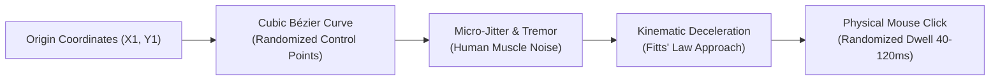

# Humanized Input & Shadow DOM Traversal Engine

> [!NOTE]
> The **Humanized Input & Shadow DOM Traversal Engine** (`ShadowDomSelectorEngine`, `DragDropPolyfillScript`) combines deep, seamless Shadow DOM traversal with natural, bot-resilient physical mouse execution (Bézier physics curves, micro-jitter) and native Win32 keyboard emulation.

---

## 1. Problem Statement: Bot Detection & Shadow DOM Boundaries

Autonomous AI agents face two major obstacles when interacting with modern web applications:
1. **Impassable Shadow Roots:** Modern web components (Polymer, Lit, Shoelace, micro-frontends) encapsulate their HTML within closed Shadow DOM trees (`shadowRoot`). Standard DOM selectors like `document.querySelector("#submit")` return `null`, even though the button is visibly rendered on the screen.
2. **Artificial Input Signatures:** Naive automation instantaneously teleports the cursor from (100, 200) to (800, 600) and clicks with a 0ms hold duration. Advanced anti-bot defense systems (Cloudflare, Akamai, PerimeterX) instantly flag these perfectly linear vectors as automated scrapers.
3. **Complex Gestures (HTML5 Drag & Drop):** Synthetic mouse events fail to interact with modern HTML5 Kanban boards (Trello, Jira) or dynamic range sliders.

**Nova AI Workspace** overcomes these challenges using the **Shadow-Piercing Combinator (` >>> `)** and an empirically calibrated **Humanized Input Engine**.

---

## 2. Shadow DOM Piercing (` >>> `)

Nova's selector engine (`ShadowDomSelectorEngine`) extends the standard CSS selector syntax with the shadow-piercing operator:
```css
/* Finds the button within the nested shadow root of the custom element */
my-custom-dialog >>> user-avatar >>> button.save-btn
```

* **Effective Opacity Computation (`novaEffectiveOpacity`):** Computes the true rendered visibility of an element across all ancestor nodes—including shadow host boundaries (`parentNode.host`).
* **Visibility Gating:** Accurately detects transparent overlay targets (e.g. hidden `<input type="file">` elements positioned over styled UI buttons) for clean file uploads.

---

## 3. Humanized Input & Natural Kinematics

For sensitive websites, Nova simulates physical mouse movements that are indistinguishable from real human hand motion:



* **Fitts' Law Modeling:** Cursor velocity automatically adjusts based on distance and target area size (rapid movement over open stretches, smooth deceleration upon approaching target bounds).
* **Hardware Keyboard Emulation:** Keystrokes (`nova.input_text`, `nova.input_key`) fire in strict physical order: `keydown` $\rightarrow$ `keypress` $\rightarrow$ `input` $\rightarrow$ `keyup`, complete with randomized inter-keystroke intervals and hardware scan-codes (`KeyMappingResolver`).

---

## 4. Under the Hood

| Component | Responsibility |
| :--- | :--- |
| **`ShadowDomSelectorEngine`** | Generates optimized JS probes for Shadow DOM piercing (` >>> `) and tree pruning. |
| **`DragDropPolyfillScript`** | Polyfill synthesizing authentic HTML5 DragEvents (`dragstart`, `dragover`, `drop`, `dragend`). |
| **`KeyMappingResolver`** | Maps characters and control keys to Windows Virtual Key codes and CDP KeyEvents. |

---

## 5. MCP Tooling for Input & Interaction

* **Semantic Selector Actions:**
  * `nova.click_selector`: Clicks elements directly via CSS/Shadow selectors (supports ` >>> `).
  * `nova.type_selector`: Types text into a focused input with realistic inter-keystroke intervals.
  * `nova.select_option` / `choose_option`: Selects items in native `<select>` menus or custom ARIA comboboxes.
* **Virtual & Humanized Mouse Gestures:**
  * `nova.input_drag_humanized`: Drags elements along natural Bézier physics curves with micro-jitter (ideal for slider captchas and Kanban cards).
  * `nova.input_click`: Dispatches physical clicks at precise viewport coordinates.
  * `nova.input_move`: Moves the virtual cursor across smooth paths to trigger hover states.
  * `nova.input_wheel`: Dispatches physical mouse wheel scroll events with inertia.
* **Low-Level Keyboard Input:**
  * `nova.input_text`: Injects character streams directly into the active element.
  * `nova.input_key`: Dispatches individual hardware keys (`Enter`, `Tab`, `ArrowDown`).
  * `nova.input_shortcut`: Fires multi-key combinations (`Control+Shift+R`, `Control+A`).

---

## Related Documentation

* **[Anti-Fingerprint Protection & Stealth Identity](fingerprint-and-identity.md)** — Canvas/Audio noise and Client Hints.
* **[Agent Awareness Gates (AAG)](aag.md)** — Pre-execution safety and lease locking.
* **[Native Dialogs & UI Prompts](native-dialogs-and-prompts.md)** — Managing OS-level prompts and file dialogs.
