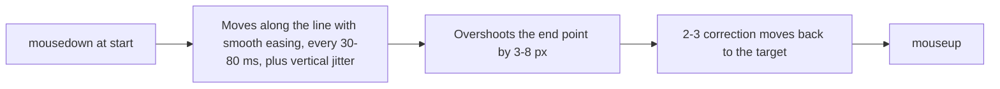

# Input Dispatch & Shadow DOM Traversal

> [!NOTE]
> Nova's input tools reach elements inside open Shadow DOM trees through the ` >>> ` selector combinator, deliver mouse and keyboard input through the browser's input pipeline (Chrome DevTools Protocol), and offer one humanized drag gesture for sliders and similar controls. This page describes what each tool actually sends, so you can choose the right one.

---

## 1. A Concrete Example: Save Inside a Web Component

An agent sees a Save button inside a custom dialog, but an ordinary CSS query cannot find it. If the components expose open shadow roots, a selector such as `my-custom-dialog >>> user-avatar >>> button.save-btn` follows those boundaries. Nova resolves the element and dispatches a browser-input click.

The click result establishes that input was dispatched. It does not establish that the application saved the record. A [CLS transition contract](../closed-loop-system-cls/README.md) can check the expected confirmation or state change; a [visual capture](../research/evidence-verification-mode-evm/README.md) can show what the user sees afterward.

## 2. Choose the Interaction Path

| Need | Path | Important boundary |
| :--- | :--- | :--- |
| Act on a known element | Selector-based click or type | Resolve the current element, including supported open shadow roots. |
| Act at a visible position | Coordinate input | Coordinates refer to the page viewport; layout changes can move the target. |
| Send browser mouse or keyboard input | DevTools input tools | Browser-dispatched input does not by itself verify the application outcome. |
| Use the humanized drag profile | `input_drag_humanized` | Page-script mouse events are synthetic, even though the movement is eased. |

“Humanized” describes this drag's movement profile. It does not guarantee acceptance by a website or change synthetic events into trusted ones.

## 3. Why Input Delivery Matters

1. **Shadow roots:** Web components keep their markup inside a shadow root. `document.querySelector("#submit")` returns `null` for a button that is clearly visible on screen.
2. **Synthetic events:** Events created in page JavaScript carry `isTrusted: false`, and some pages ignore them.
3. **HTML5 drag and drop:** Mouse movement alone does not ensure that a page receives the HTML5 drag-event sequence its sortable list expects. Nova provides a polyfill for supported draggable elements.

---

## 4. Shadow DOM Piercing (` >>> `)

Selector-based tools (`nova.click_selector`, `nova.type_selector`, `nova.select_option`, `nova.guarded_*` and others) accept the ` >>> ` combinator. Each segment is a normal CSS selector; ` >>> ` steps into the shadow root of the element matched so far:

```css
/* The save button inside the shadow root of user-avatar, inside my-custom-dialog */
my-custom-dialog >>> user-avatar >>> button.save-btn
```

* **Open shadow roots only:** Nova follows `element.shadowRoot`, which pages can read for open shadow roots. Closed shadow roots are not reachable this way.
* **Effective opacity:** Nova computes an element's opacity multiplied by that of all its ancestors, across shadow hosts. A fully transparent element stays a valid click and upload target — the classic `<input type="file">` laid over a styled button — but element screenshots of it are refused, because the picture would show whatever lies behind it.

---

## 5. How Input Is Delivered

| Tool | What Nova sends |
| :--- | :--- |
| `nova.input_click`, `nova.click_selector` | Through the DevTools input pipeline: a mouse move, a press, about 16 ms later the release. Events arrive as real browser input (`isTrusted: true`). |
| `nova.input_move` | One mouse-move event to the target position. |
| `nova.input_wheel` | One wheel event with `deltaX`/`deltaY`; Nova then checks whether something actually scrolled. |
| `nova.input_drag` | Press, a number of evenly spaced moves (`steps`, default 10), release — through the DevTools input pipeline. |
| `nova.input_text` | Inserts the text into the focused element in one step (`Input.insertText`), not key by key. |
| `nova.type_selector` | Focuses the element (optionally clears it with select-all and delete), then inserts the text in chunks and waits for the page to render between chunks, so rich-text editors do not drop characters. Optional read-back verification. |
| `nova.input_key` | Key down and key up for one named key (Enter, Tab, Escape, arrows, F1–F12, ...). |
| `nova.input_shortcut` | A key combination such as `Ctrl+Shift+K` (modifiers Ctrl, Shift, Alt, Meta plus exactly one key). |

If the Nova window is minimized, Nova restores it before dispatching input, because a minimized window throttles input delivery.

---

## 6. The Humanized Drag (`nova.input_drag_humanized`)

This tool runs as a script inside the page and dispatches **synthetic** mouse events (`isTrusted: false`; the result reports `mode: "humanized_js"`). Use `nova.input_drag` when a page only accepts real input.



* **Duration:** `durationMs` (500–10,000); default a random value between 1,800 and 2,400 ms.
* **Jitter:** `jitterPx` (0–10, default 2) sets the random vertical deviation per step.
* **Start point:** `startX`/`startY`, or the center of `selector`, on which the `mousedown` is dispatched.
* The result includes a movement profile (step intervals and distances).

---

## 7. HTML5 Drag and Drop

Nova injects a drag polyfill into pages that turns a held mouse gesture over a supported `draggable` element into HTML5 drag events (`dragstart`, `dragover`, `drop`, `dragend`). Gestures from both `nova.input_drag` and `nova.input_drag_humanized` can reach this polyfill. Its HTML5 events are synthesized in page script; a control that requires trusted drag events or a different interaction model may still need another approach. Check the resulting order or value after the gesture.

---

## 8. MCP Tooling for Input & Interaction

* **Selector-based actions:**
  * `nova.click_selector`: Clicks the element matched by a CSS selector (with ` >>> ` support) or a CTA handle from `nova.perceive`; optional verification and blocker dismissal.
  * `nova.type_selector`: Types into the matched field (see above).
  * `nova.select_option`: Selects an option of a native `<select>` by value.
  * `nova.choose_option`: Selects an option of a custom or native dropdown by visible text or index.
* **Coordinate-based mouse input:** `nova.input_click`, `nova.input_move`, `nova.input_wheel`, `nova.input_drag`, `nova.input_drag_humanized`.
* **Keyboard input:** `nova.input_text`, `nova.input_key`, `nova.input_shortcut`.

---

## Related Documentation

* **[Fingerprint Protection & Browser Identity](../fingerprint-and-identity/README.md)** — What websites learn about the browser.
* **[Agent Awareness Gates (AAG)](../agent-awareness-gates-aag/README.md)** — Pre-execution safety and lease locking.
* **[Native Dialogs & UI Prompts](../native-dialogs-and-prompts/README.md)** — Dialogs outside the page and file dialogs.

[All core features](../README.md)
