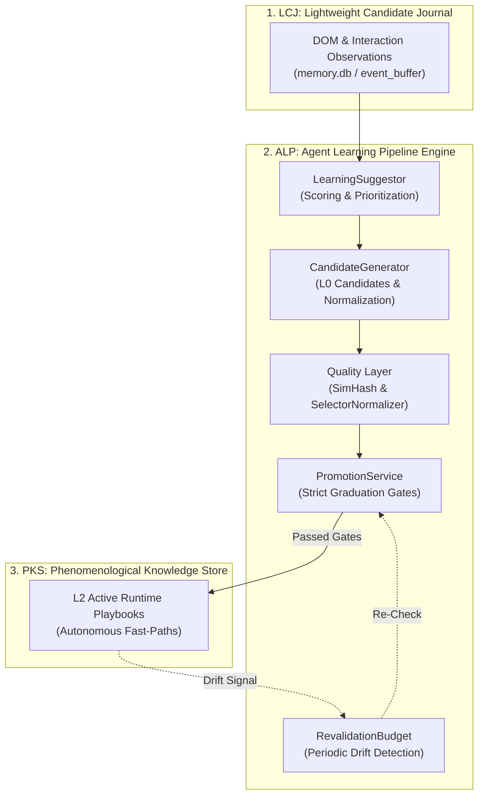

# Agent Learning Pipeline (ALP) & Lightweight Candidate Journal (LCJ)

> [!NOTE]
> The **Agent Learning Pipeline (ALP)** (`NovaBrowser.Core.Learning`) serves as the intelligent bridge between the runtime observation journal (**LCJ**, Lightweight Candidate Journal) and durable long-term memory (**PKS**). It filters transient DOM telemetry, calculates mathematical relevance scores, and promotes validated interaction patterns into permanent fast-paths with quality guarantees.

---

## 1. Problem Statement: The Knowledge Gap

Traditional browser automation frameworks suffer from two extremes:
1. **Zero Learning:** The agent gathers observations, but forgets them as soon as the tab closes. On every visit, it must guess anew.
2. **Uncontrolled Pollution:** Every arbitrary action is blindly saved as a permanent rule. If a site changes its layout or an action was a lucky accident, corrupted rules pollute the database and cause persistent failures.

**The interplay between LCJ, ALP, and PKS resolves this gap:**
```
LCJ (Log Raw Observations) ──→ ALP (Evaluate, Filter, SimHash) ──→ PKS (Execute Proven Fast-Paths)
```

* Without ALP, LCJ accumulates endless logs while PKS remains empty.
* With ALP, proven patterns are statistically validated while fragile or noisy selectors are automatically discarded.

---

## 2. The ALP Pipeline Architecture



---

## 3. The 8 Core Modules of ALP

| Module | Core Responsibility |
| :--- | :--- |
| **`LearningSuggestor`** | Evaluates observations via a multi-factor formula (support, recency, success rate, drift) and generates suggestions. |
| **`CandidateGenerator`** | Converts raw clicks and keystrokes into clean, typed L0 candidate playbooks. |
| **`Quality / SimHash`** | Detects structurally identical DOM subtrees and prevents redundant duplicates in knowledge storage. |
| **`PromotionService`** | Enforces empirical threshold criteria (e.g. at least 3 successful verifications) before promoting candidates to L1/L2. |
| **`SilentVerifyEngine`** | Generates non-invasive background DOM probes to continuously evaluate candidate health. |
| **`RevalidationBudget`** | Bounds background verification traffic to prevent impact on WebView2 user experience. |
| **`PlatformMatcher`** | Correlates observed patterns with canonical platform templates (e.g. Shopify, WordPress, Cloudflare). |
| **`ExplainabilityEngine`** | Produces human-readable explanations detailing why a specific fast-path was selected or rejected. |

---

## 4. Mathematical Scoring Model (`LearningSuggestor`)

The relevance score of a learning suggestion is calculated deterministically:
$$\text{Score} = \text{SupportScore} + \text{SessionBonus} + \text{SuccessRateFactor} + \text{DriftSignal} + \text{RecencyBonus}$$

* **SupportScore:** How many times this pattern has been verified across distinct browsing sessions.
* **SuccessRateFactor:** Ratio of successful state transitions relative to unexpected failures.
* **DriftSignal:** Degree to which the current live DOM fingerprint diverges from historical baselines.
* **RecencyBonus:** Freshly verified patterns receive a temporary priority boost.

---

## 5. Production Code References

| Component | Source File | Responsibility |
| :--- | :--- | :--- |
| **`LearningSuggestor`** | `NovaBrowser/Core/Learning/LearningSuggestor.cs` | Identifies and prioritizes high-value learning opportunities from raw observations. |
| **`CandidateGenerator`** | `NovaBrowser/Core/Learning/CandidateGenerator.cs` | Synthesizes robust selectors and constructs typed L0 candidates. |
| **`PromotionService`** | `NovaBrowser/Core/Learning/PromotionService.cs` | Enforces graduation gates for lifecycle transitions (`L0 -> L1 -> L2`). |
| **`RevalidationBudget`** | `NovaBrowser/Core/Learning/RevalidationBudget.cs` | Throttles background verification traffic. |
| **`SilentVerifyEngine`** | `NovaBrowser/Core/Learning/SilentVerifyEngine.cs` | Executes non-intrusive background verification checks. |

---

## 6. MCP Tooling for the Learning Pipeline

* **Learning Opportunities & Discovery:**
  * `nova.learn_suggest`: Surfaces the most promising candidates for durable fast-path promotion.
  * `nova.learn_generate`: Synthesizes on-demand L0 candidates for the current DOM state.
  * `nova.learn_resolve_opportunity`: Marks a learning suggestion as converted, dismissed, or resolved.
* **Promotion & Quality Assurance:**
  * `nova.learn_promote`: Promotes a qualified candidate to L1 or L2 (requires verified evidence checks).
  * `nova.learn_feedback`: Submits runtime reinforcement feedback from real agent executions into the pipeline.
* **Explainability & Self-Healing:**
  * `nova.explain`: Provides full breakdown of why a rule is active and how its confidence score was derived.
  * `nova.revalidate`: Triggers targeted re-verification of fast-paths when website layout drift is suspected.

---

## Related Documentation

* **[Phenomenological Knowledge Store (PKS)](pks.md)** — Long-term procedural UI memory and playbooks.
* **[Tool Observation Bus (TOB)](tob.md)** — Server-side evidence ledger and selector proof emitter.
* **[Closed-Loop System (CLS)](closed-loop-system.md)** — Closed feedback loop for automated state verification.
