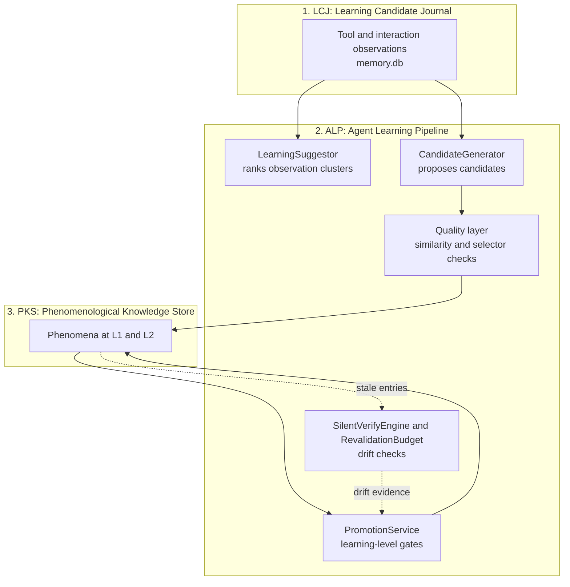

# Agent Learning Pipeline (ALP) & Learning Candidate Journal (LCJ)

> [!NOTE]
> The **Agent Learning Pipeline (ALP)** connects the observation journal (**LCJ**, Learning Candidate Journal) with long-term memory (**PKS**). It ranks recurring observations, turns them into candidate phenomena, and promotes them only when evidence gates are met.

---

## 1. Problem Statement: The Knowledge Gap

Browser automation tends toward two extremes:
1. **Zero Learning:** The agent gathers observations but forgets them when the session ends. On every visit, it must guess anew.
2. **Uncontrolled Pollution:** Every action is saved as a permanent rule. If a site changes its layout or an action succeeded by accident, wrong rules keep causing failures.

**The interplay between LCJ, ALP, and PKS addresses this gap:**
```
LCJ (record observations) ──→ ALP (rank, generate, promote) ──→ PKS (active playbooks)
```

* Without ALP, LCJ only accumulates observations while PKS stays empty.
* With ALP, patterns reach active memory only after repeated success, and drifting knowledge is demoted again.

---

## 2. The ALP Pipeline Architecture



The LCJ lives in its own database (`memory.db` in the `Memory` folder of Nova's profile), separate from `pks.db`.

---

## 3. The Core Modules of ALP

| Module | Core Responsibility |
| :--- | :--- |
| **`LearningSuggestor`** | Ranks observation clusters by support, sessions, success rate, drift and recency, and reports drift on existing phenomena. Backs `nova.learn_suggest`. |
| **`CandidateGenerator`** | Runs heuristic rules over observation clusters to propose new candidates. Generated playbooks must pass the same strict parser as manual ones; changes to an active phenomenon are written as a new Shadow revision that must earn L2 again. Backs `nova.learn_generate`. |
| **Quality layer** | Compares fingerprints (including a 64-bit SimHash over text tokens) so near-duplicate candidates are dropped or turned into a patch, and normalizes selectors. |
| **`PromotionService`** | Enforces the learning-level gates (for example at least 3 successes from 2 distinct sessions for L1 → L2). |
| **`SilentVerifyEngine`** | Checks DOM-only, without running playbooks, whether a phenomenon's fingerprint selectors still exist. |
| **`RevalidationBudget`** | Limits those background checks (per site, per tab and navigation, and globally per hour). |
| **`PlatformMatcher`** | Scores how well observed signals fit a platform template (the preinstalled templates are consent vendors such as OneTrust and Cookiebot). |
| **`ExplainabilityEngine`** | Produces the per-gate explanations returned by `nova.explain` and `nova.learn_promote`. |

---

## 4. Scoring Model (`LearningSuggestor`)

The score of a learning suggestion is calculated deterministically:
$$\text{Score} = \text{SupportScore} + \text{SessionBonus} + \text{SuccessRateFactor} + \text{DriftSignal} + \text{RecencyBonus}$$

* **SupportScore:** log2 of the number of supporting observations.
* **SessionBonus:** +2 when the pattern was seen in at least 2 distinct sessions.
* **SuccessRateFactor:** success rate × 2 (0.5 × 2 when there are no outcomes yet).
* **DriftSignal:** +3 for selector drift on an existing phenomenon; a small penalty when failures outweigh successes.
* **RecencyBonus:** +1 if seen in the last 24 hours, +0.5 in the last 7 days.

---

## 5. Automatic Lifecycle

While an agent works on a site, Nova runs two background passes for that site:
* **Promotion pass** (at most every 30 minutes): the same evaluation as `nova.learn_promote`, covering promotion, demotion, deprecation and revive.
* **Revalidation pass** (at most every 6 hours): the same silent checks as `nova.revalidate` for stale phenomena; missing selectors count as drift and push the phenomenon toward demotion.

When all learned selectors of a phenomenon are gone, revalidation may suggest a replacement selector based on the phenomenon's text signals. Nova never applies such a suggestion automatically; the agent has to verify it and update the phenomenon via `nova.pks_patch`.

---

## 6. Under the Hood

| Component | Responsibility |
| :--- | :--- |
| **`LearningSuggestor`** | Ranks learning opportunities from journal observations. |
| **`CandidateGenerator`** | Builds candidate phenomena from observation clusters. |
| **`PromotionService`** | Enforces the gates for transitions between learning levels. |
| **`RevalidationBudget`** | Throttles background verification. |
| **`SilentVerifyEngine`** | Runs DOM-only background checks. |

---

## 7. MCP Tooling for the Learning Pipeline

* **Learning Opportunities & Discovery:**
  * `nova.learn_suggest`: Returns the top learning opportunities from accumulated observations.
  * `nova.learn_generate`: Generates candidate phenomena and hints from accumulated observations (the site must be open in a tab).
  * `nova.learn_resolve_opportunity`: Resolves a semantic learning opportunity with a verdict (`upsert`, `not_applicable`, `unsafe`, `already_known`, `defer`).
* **Promotion & Review:**
  * `nova.learn_promote`: Evaluates and applies learning-level transitions; `dryRun` only evaluates.
  * `nova.learn_feedback`: Returns recent promotion, demotion and deprecation events with their reasons.
* **Explainability & Revalidation:**
  * `nova.explain`: Explains why a phenomenon is at its current learning level, gate by gate.
  * `nova.revalidate`: Checks DOM-only whether fingerprint selectors still exist, within a per-session budget.

---

## Related Documentation

* **[Phenomenological Knowledge Store (PKS)](pks.md)** — Long-term procedural UI memory and playbooks.
* **[Tool Observation Bus (TOB)](tob.md)** — Server-side evidence ledger and selector proofs.
* **[Closed-Loop System (CLS)](closed-loop-system.md)** — Verified state transitions.
