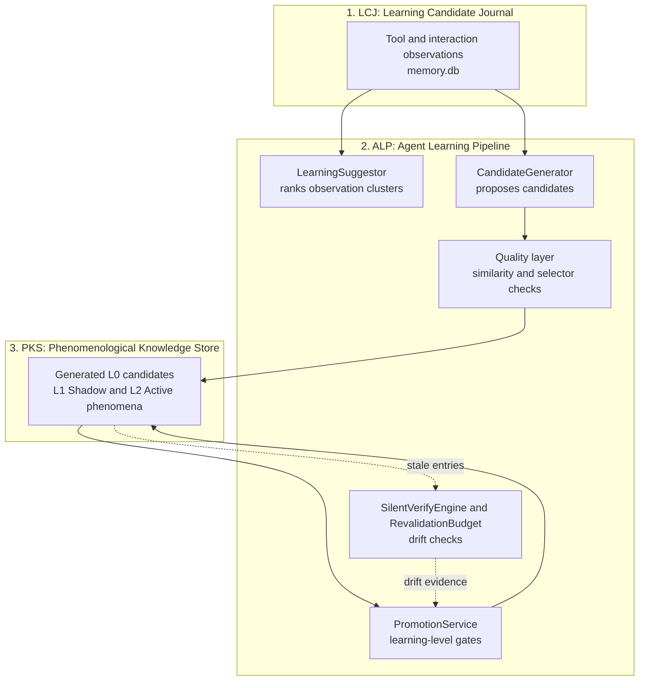

# Agent Learning Pipeline (ALP) & Learning Candidate Journal (LCJ)

> [!NOTE]
> The **Agent Learning Pipeline (ALP)** connects the observation journal (**LCJ**, Learning Candidate Journal) with long-term memory (**PKS**). It ranks recurring observations, turns them into candidate phenomena, and promotes them only when evidence gates are met.

---

## 1. Problem Statement: The Knowledge Gap

Imagine an agent closes the same newsletter modal on several visits. One successful click is an observation, not yet a rule that should run on future visits. ALP looks for recurring evidence, proposes a description and playbook, and asks whether that knowledge has earned enough trust to become active.

If the modal changes later, the same learning lifecycle can lower trust rather than preserving the original recipe indefinitely. **ALP governs how experience becomes trusted knowledge, and how that trust can be lost.**

The learning pipeline avoids two failure modes:

1. **Zero Learning:** The agent gathers observations but forgets them when the session ends. On every visit, it must guess anew.
2. **Uncontrolled Pollution:** Every action is saved as a permanent rule. If a site changes its layout or an action succeeded by accident, wrong rules keep causing failures.

**The interplay between LCJ, ALP, and PKS addresses this gap:**

```
LCJ (record evidence) ──→ ALP (rank, generate, evaluate trust) ──→ PKS (candidates and learned playbooks)
```

* Journal observations alone do not become active playbooks. An agent may also write a manual PKS entry; it still starts as Shadow and must earn active status.
* With ALP, patterns reach active memory only after repeated success, and drifting knowledge is demoted again.

### Where ALP fits

**[TOB](tob.md)** supplies server-side execution evidence and selector proof; **LCJ** holds observations and promotion evidence. **ALP** ranks opportunities, generates candidates and evaluates trust. **[PKS](pks.md)** stores the procedural entries, and **[CLS](closed-loop-system.md)** applies actions with outcome checks that can inform further learning.

The process combines supported heuristic generation, explicit agent tools and background lifecycle checks. It does not guarantee that every observed interaction can be turned into a safe reusable playbook.

---

## 2. Automatic Lifecycle

While an agent works on a site, Nova runs two background passes for that site:
* **Promotion pass** (at most every 30 minutes): the same evaluation as `nova.learn_promote`, covering promotion, demotion, deprecation and revive.
* **Revalidation pass** (at most every 6 hours): the same silent checks as `nova.revalidate` for stale phenomena; missing selectors count as drift and push the phenomenon toward demotion.

When all learned selectors of a phenomenon are gone, revalidation may suggest a replacement selector based on the phenomenon's text signals. Nova never applies such a suggestion automatically; the agent has to verify it and update the phenomenon via `nova.pks_patch`.

---

## 3. The ALP Pipeline Architecture



The LCJ lives in its own database (`memory.db` in the `Memory` folder of Nova's profile), separate from `pks.db`.

The journal holds observations and candidate evidence. `nova.learn_generate` can already store a new phenomenon in PKS at L0, linked to that evidence by its candidate key. `nova.learn_promote` evaluates existing PKS entries against LCJ evidence; L0 therefore does not mean that an entry exists only in the journal. See [PKS learning levels](pks.md#5-why-knowledge-needs-trust-levels).

---

## 4. The Core Modules of ALP

| Module | Core Responsibility |
| :--- | :--- |
| **`LearningSuggestor`** | Ranks observation clusters by support, sessions, success rate, drift and recency, and reports drift on existing phenomena. Backs `nova.learn_suggest`. |
| **`CandidateGenerator`** | Runs heuristic rules over observation clusters to propose new candidates. New phenomena are persisted at L0; generated playbooks must pass the same strict parser as manual ones. Changes to an active phenomenon are written as a new Shadow revision that must earn L2 again. Backs `nova.learn_generate`. |
| **Quality layer** | Compares fingerprints (including text similarity) so near-duplicate candidates are dropped or turned into a patch, and normalizes selectors. |
| **`PromotionService`** | Evaluates whether repeated evidence has earned promotion, or whether failure and drift require lower trust. |
| **`SilentVerifyEngine`** | Checks DOM-only, without running playbooks, whether a phenomenon's fingerprint selectors still exist. |
| **`RevalidationBudget`** | Limits those background checks (per site, per tab and navigation, and globally per hour). |
| **`PlatformMatcher`** | Scores how well observed signals fit a platform template (the preinstalled templates are consent vendors such as OneTrust and Cookiebot). |
| **`ExplainabilityEngine`** | Produces the per-gate explanations returned by `nova.explain` and `nova.learn_promote`. |

---

## 5. How Learning Opportunities Are Prioritized

ALP considers recurring support, evidence across sessions, observed outcomes, drift and recency. A frequently repeated interaction and a deteriorating existing playbook can both deserve attention, for different reasons.

A suggestion's rank identifies a learning opportunity; it does not authorize execution or establish that a candidate is already trusted. Promotion is a separate evidence-based decision. Use the explanation and feedback tools to inspect the reasons for a particular entry's current state.

---

## 6. MCP Tooling for the Learning Pipeline

* **Learning Opportunities & Discovery:**
  * `nova.learn_suggest`: Returns the top learning opportunities from accumulated observations.
  * `nova.learn_generate`: Generates candidate phenomena and hints from accumulated observations (the site must be open in a tab).
  * `nova.learn_resolve_opportunity`: Resolves a semantic learning opportunity with a verdict (`upsert`, `not_applicable`, `unsafe`, `already_known`, `defer`).
* **Promotion & Review:**
  * `nova.learn_promote`: Evaluates and applies learning-level transitions; `dryRun` only evaluates.
  * `nova.learn_feedback`: Returns recent promotion, demotion and deprecation events with their reasons.
* **Explainability & Revalidation:**
  * `nova.explain`: Explains why a phenomenon is at its current learning level, gate by gate.
  * `nova.revalidate`: Checks DOM-only whether fingerprint selectors still exist, within a per-session budget.

---

## 7. Implementation notes

The module table above separates pure ranking and gate decisions from persistence and browser checks. Learning orchestration loads PKS entries and their LCJ evidence, writes generated candidates or approved transitions, and records the reasons for later inspection. Silent revalidation probes recognition selectors without executing the playbook; it cannot by itself prove that the interaction still works.

---

## Related Documentation

* **[Phenomenological Knowledge Store (PKS)](pks.md)** — Long-term procedural UI memory and playbooks.
* **[Tool Observation Bus (TOB)](tob.md)** — Server-side evidence ledger and selector proofs.
* **[Closed-Loop System (CLS)](closed-loop-system.md)** — Verified state transitions.
