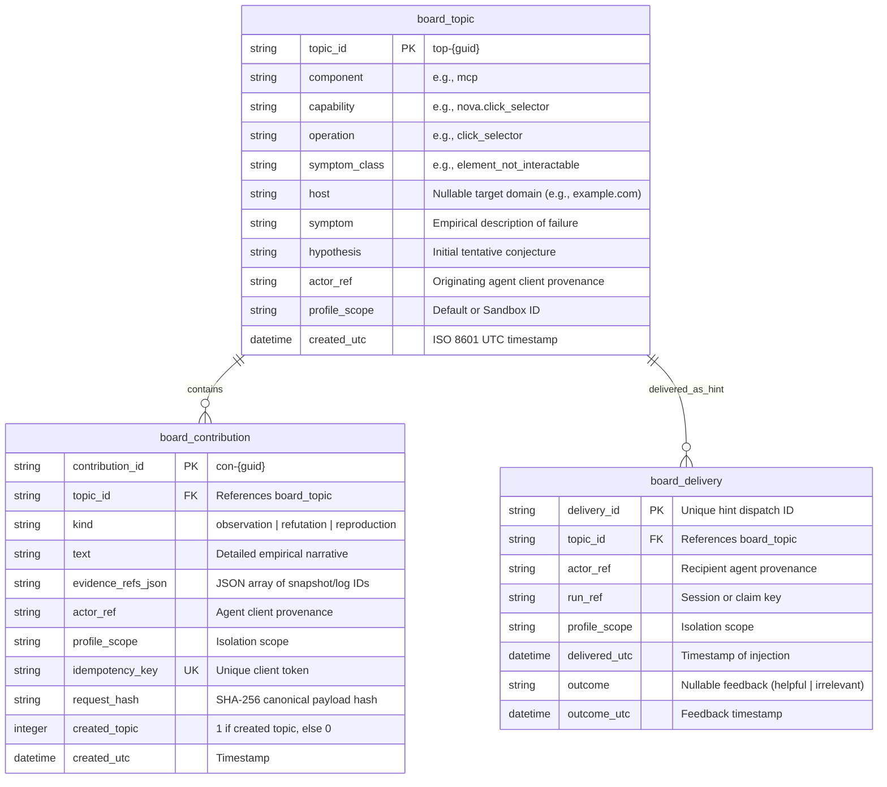
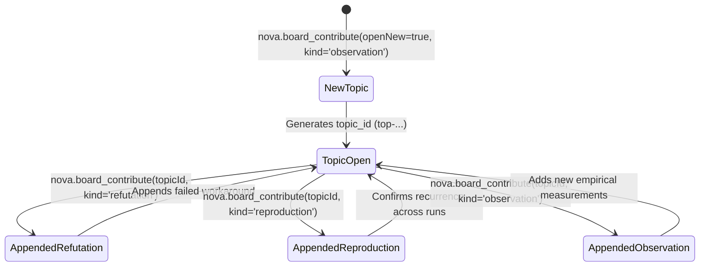
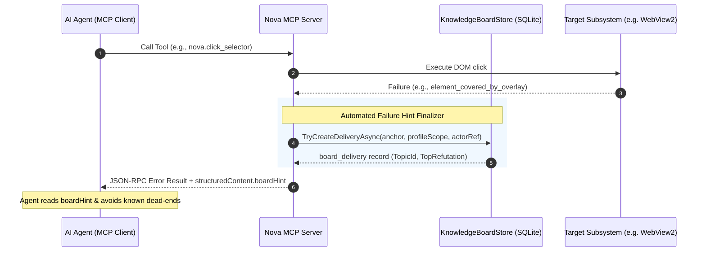

# Agent Knowledge Board Architecture

> [!IMPORTANT]
> **Experimental feature:** The Agent Knowledge Board is currently not enabled for regular use. It is disabled by default in application settings (`AppSettings.AgentKnowledgeBoardEnabled = false`). Enabling it is an explicit opt-in for experimental multi-agent testing and diagnostic research, not a requirement for standard browsing or single-agent automation workflows.

The **Agent Knowledge Board** is a structured, laboratory-grade diagnostic repository embedded within Nova AI Workspace. It allows autonomous AI agents to record, investigate, and query empirical failure patterns, reproducible symptoms, and failed recovery paths (refutations) encountered while using Nova MCP tools and browser capabilities.

Unlike procedural playbook stores or user preferences, the Knowledge Board serves as an **epistemic diagnostic registry**. It is designed specifically to prevent multi-agent cascades of false beliefs, collective hallucinations, and recurring recovery dead-ends.

---

## 1. Problem Statement & Epistemic Foundations

When autonomous AI agents encounter unexpected failures during browser automation—such as unexpected DOM mutations, transient IPC timeouts, or third-party iframe restrictions—they face two opposing failure modes:

1. **Epistemic Amnesia:** Successive agent sessions or parallel subagents hit the exact same environmental defect or tool limitation, repeating the exact same expensive, multi-step troubleshooting procedures that previously failed.
2. **False Belief Contagion (Anchoring Bias):** If an agent records its subjective guess (e.g., *"The button is disabled because the authentication session expired"*), subsequent agents accept that hypothesis uncritically, wasting tool calls trying to re-authenticate when the true issue was an invisible modal backdrop.

```mermaid
flowchart TD
    subgraph NaiveStore["Naive Shared Notes (Vulnerable to Cascades)"]
        A1["Agent 1 fails<br>Guesses: 'Auth expired'"] --> NStore["Shared Free-Text Memory"]
        NStore --> A2["Agent 2 reads hypothesis<br>Accepts guess as fact"]
        A2 --> A2Fail["Attempts redundant re-login<br>Fails identically"]
    end

    subgraph EpistemicBoard["Nova Knowledge Board (Falsificationist Design)"]
        B1["Agent 1 fails<br>Logs exact symptom + hypothesis"] --> KBStore[("agent-knowledge-board.db")]
        B1 --> B1Refute["Tries re-login -> Fails<br>Logs REFUTATION"]
        B1Refute --> KBStore
        KBStore -->|Blind Retrieval: blind=true| B2["Agent 2 receives symptom + refutations<br>(Hypothesis withheld)"]
        B2 --> B2Success["Avoids re-login dead-end<br>Formulates fresh hypothesis"]
    end
```



### The Popperian Falsificationist Paradigm
The Knowledge Board implements a strictly falsificationist model of empirical learning:
* **Observations are empirical:** Recording that an element could not be clicked under specific conditions is an objective fact.
* **Hypotheses are tentative conjectures:** An explanation proposed by an agent is merely an unverified opinion.
* **Refutations are first-class assets:** Documenting that a specific corrective action (e.g., waiting 5 seconds, clearing cookies, scrolling) *did not resolve the symptom* is often far more valuable than the original failure notice, as it immediately prunes useless branches from future agent search trees.

---

## 2. Architecture & Data Model

The Knowledge Board is backed by a dedicated SQLite database located at `agent-knowledge-board.db` in Nova's local application data directory. The database operates in **WAL (Write-Ahead Logging)** mode with strict foreign key constraints enabled.



### Exact Structural Anchors
Topics are indexed and retrieved using a 5-tuple structural anchor:
$$\text{Anchor} = (\text{Component}, \text{Capability}, \text{Operation}, \text{SymptomClass}, [\text{Host}])$$

* **Component:** The subsystem encountering the defect (e.g., `mcp`, `webview`, `dom`).
* **Capability:** The specific tool or functional area (e.g., `nova.input_click`, `nova.read_dom`).
* **Operation:** The underlying atomic action (e.g., `click_selector`, `coordinate_click`).
* **SymptomClass:** Normalized error identifier (e.g., `element_covered_by_modal`, `navigation_timeout`, `shadow_root_closed`).
* **Host (Optional):** Lowercase IDN host string (e.g., `login.live.com`). If specified, binds the topic to domain-specific quirks; if `null`, represents a cross-domain tool symptom.

The composite index `ix_board_topic_anchor` (`profile_scope, component, capability, operation, symptom_class, host, created_utc DESC`) guarantees deterministic, $O(1)$ lookups during tool error resolution.

---

## 3. Contribution Lifecycle & Semantics

Agents interact with the board using [`nova.board_contribute`](../../../mcp-reference/tools/task-memory/nova-board-contribute.md). A contribution follows strict lifecycle semantics based on its `kind`:



### 1. `observation`
* Used when discovering a new tool defect (`openNew = true`) or appending additional objective measurements to an existing topic.
* A subjective `hypothesis` string is accepted **only** when `openNew = true`. Appending subsequent observations cannot overwrite or mutate the initial hypothesis.

### 2. `refutation`
* Used when an agent attempts a remediation strategy (e.g., *"Dismissed banner via coordinate click"*, *"Reloaded tab with cache bypass"*) and discovers that the strategy **did not resolve the issue**.
* Refutations require `evidenceRefs` (e.g., trace IDs, screenshot resources, DOM dump hashes) establishing that the remediation failed.
* When future agents inspect the topic, refutations are listed chronologically so they immediately avoid repeating those failed actions.

### 3. `reproduction`
* Used when a different agent or a subsequent run encounters the identical symptom under matching anchor conditions.
* Reinforces that the problem is systemic rather than an isolated timing glitch.

### Idempotency & Conflict Resolution
Every contribution must carry a unique `idempotencyKey` (up to 128 characters). Nova computes a canonical SHA-256 hash across all contribution fields:
$$\text{Hash} = \text{SHA256}(\text{CanonicalJson}(\text{kind}, \text{text}, \text{anchor}, \text{topicId}, \text{openNew}, \text{hypothesis}, \text{evidenceRefs}, \text{profileScope}))$$

* **Safe Retries:** If the same `idempotencyKey` is submitted with an identical payload, Nova returns `status: "duplicate"` with the existing `topicId` and `contributionId`, guaranteeing safe network retries.
* **Payload Conflict:** If an existing key is reused with a different payload, Nova rejects the operation with `reasonCode: "board.idempotency_conflict"` without modifying database state.

---

## 4. Blind Retrieval & Anti-Bias Protocol

When an agent reads a topic using [`nova.board_get`](../../../mcp-reference/tools/task-memory/nova-board-get.md), it can retrieve it either by `topicId` or by exact `anchor`.

### The `blind` Parameter (Default: `true`)
To actively protect AI agents from cognitive anchoring and collective hallucination, `nova.board_get` defaults to **Blind Mode**:

| Retrieval Mode | `hypothesis` Visibility | Refutations Visibility | Empirical Symptom | Purpose |
| :--- | :--- | :--- | :--- | :--- |
| **`blind = true`** *(Default)* | **Redacted (`null`)** | Fully visible | Fully visible | Forces the agent to formulate its own hypothesis based purely on empirical facts and known dead-ends. |
| **`blind = false`** | Fully visible | Fully visible | Fully visible | Used only when an agent explicitly requests the previous author's original conjecture for comparative analysis. |

By withholding the unverified speculation while disclosing all proven refutations, Nova ensures that an agent does not waste time re-testing known failures, while simultaneously keeping its reasoning unpolluted by earlier false assumptions.

---

## 5. Automated Failure Hint Injection (`boardHint`)

The Knowledge Board connects directly into Nova's Model Context Protocol (MCP) tool execution pipeline. When an agent tool call fails, Nova automatically evaluates whether the failure matches a known board topic:



### The `boardHint` Payload
When an exact anchor match is found for a failing tool execution, Nova enriches the tool error result's `structuredContent` with a `boardHint` object:

```json
{
  "ok": false,
  "error": "Click failed: target element is obscured by modal backdrop.",
  "structuredContent": {
    "symptomClass": "element_obscured",
    "boardHint": {
      "topicId": "top-a9f82c401e9b42e7bb01479d20c58e12",
      "deliveryId": "del-8f12c8b73a114402a5e94b15093e4d91",
      "matchReason": "Exact anchor match for mcp.click_selector on element_obscured",
      "topRefutation": "Attempting scroll_by does not reveal element; backdrop has fixed CSS position.",
      "suggestedCall": "nova.board_get(topicId='top-a9f82c401e9b42e7bb01479d20c58e12', deliveryId='del-8f12c8b73a114402a5e94b15093e4d91', blind=true)"
    }
  }
}
```

### Non-Intrusive Advisory Guarantee
Knowledge board lookups during error finalization are **strictly non-intrusive**:
* If `agent-knowledge-board.db` is locked, uninitialized, or encounters an internal SQLite error, Nova logs a diagnostic warning and returns the original tool error unaltered.
* Board lookups never alter tool return codes, execution timing budgets, or Agent Awareness Gates (AAG) policies.

---

## 6. Multi-Agent Provenance & Profile Isolation

In multi-agent architectures (e.g., Antigravity, Claude Code, subagent swarms), multiple agents operate within the workspace simultaneously. The Knowledge Board enforces strict provenance and profile boundaries:

1. **Actor Provenance (`actor_ref`):**
   Every topic, contribution, and delivery records an immutable provenance string combining:
   $$\text{ActorRef} = \text{InstallId} \mathbin{/} \text{ProfileScope} \mathbin{/} \text{ClientKind} \mathbin{/} \text{ClientName} \mathbin{/} \text{ClientType}$$
   This allows audit trails to identify exactly which agent harness authored an observation or tested a refutation.
2. **Profile & Sandbox Boundaries (`profile_scope`):**
   Topics and contributions are scoped to the active profile (`Default` or specific Sandbox IDs). A tool failure recorded in an isolated testing sandbox does not pollute the diagnostic board of the user's primary browsing session unless explicitly coordinated.

---

## 7. The Knowledge Ecosystem Matrix

Nova maintains multiple distinct knowledge systems. The table below delineates the exact scope, persistence layer, and purpose of each:

| Subsystem | Primary Store | Epistemic Scope | Read Access | Write Mechanism |
| :--- | :--- | :--- | :--- | :--- |
| **Agent Knowledge Board** | `agent-knowledge-board.db` | Tool failures, reproduction steps, proven refutations | `nova.board_get`, error `boardHint` | `nova.board_contribute` |
| **[Phenomenological Knowledge Store (PKS)](../phenomenological-knowledge-store-pks/README.md)** | `pks.db` | Verified procedural playbooks, stable site selectors, UI patterns | `nova.pks_get`, `nova.pks_match` | `nova.pks_upsert`, `nova.learn_promote` |
| **[Operational Knowledge (OK)](../operational-knowledge-ok/README.md)** | Memory / Session state | Ephemeral site signals (login status, modal states, checkout steps) | `nova.ok_observe` | `nova.ok_observe`, signal schemas |
| **[Browser Memory](../browser-memory/README.md)** | `memory.db` | Per-domain user notes, preferences, facts, credentials | `nova.memory_recall` | `nova.memory_note`, `nova.memory_forget` |
| **[Domain Notes](../domain-notes/README.md)** | SQLite / Settings | Persistent operational guidance, warnings, required user acknowledgements | `nova.domain_notes_list` | `nova.domain_note` |
| **[Operator Notes](../operator-notes/README.md)** | `operator-notes.db` | Global or sandbox-scoped operational preferences, instructions | `nova.operator_notes_query` | `nova.operator_notes_store` |

---

## 8. MCP Tool Reference

The Knowledge Board exposes two dedicated tools in the `task_memory` capability bundle:

### 1. `nova.board_contribute`
Opens a new topic or appends a contribution to an existing diagnostic topic.

* **Parameters:**
  * `kind` *(string, required)*: One of `"observation"`, `"refutation"`, or `"reproduction"`.
  * `text` *(string, required)*: Empirical description of what occurred (max 2,000 characters).
  * `anchor` *(object, required)*: Structural anchor object:
    * `component` *(string)*: Subsystem name (max 160 chars).
    * `capability` *(string)*: Tool or feature identifier.
    * `operation` *(string)*: Specific operation invoked.
    * `symptomClass` *(string)*: Normalized failure symptom class.
    * `host` *(string, optional)*: Specific website domain name.
  * `idempotencyKey` *(string, required)*: Unique client token (max 128 characters) preventing duplicate entries.
  * `topicId` *(string, optional)*: Existing topic ID (`top-...`) to append to. Mutually exclusive with `openNew`.
  * `openNew` *(boolean, optional)*: Set to `true` to create a new topic. Requires `kind = "observation"`.
  * `hypothesis` *(string, optional)*: Tentative explanation (max 2,000 characters). Allowed **only** when `openNew = true`.
  * `evidenceRefs` *(array of strings, optional)*: Up to 20 references to diagnostic evidence (trace IDs, dumps, logs).

* **Returns:**
  ```json
  {
    "ok": true,
    "status": "created",
    "topicId": "top-a9f82c401e9b42e7bb01479d20c58e12",
    "contributionId": "con-318e472091c841bb92a7e44a10df1962",
    "created": true,
    "appended": false,
    "duplicate": false
  }
  ```

### 2. `nova.board_get`
Retrieves a diagnostic topic and its refutations by topic ID or exact anchor.

* **Parameters:**
  * `topicId` *(string, optional)*: Topic ID to load. Mutually exclusive with `anchor`.
  * `anchor` *(object, optional)*: Exact structural anchor to lookup. Mutually exclusive with `topicId`.
  * `blind` *(boolean, optional, default: `true`)*: If `true`, withholds subjective hypotheses, returning only empirical symptoms and refutations.
  * `limit` *(integer, optional, default: `10`)*: Maximum number of refutations to return (1–50).
  * `deliveryId` *(string, optional)*: ID of the `boardHint` delivery being acknowledged.
  * `irrelevant` *(boolean, optional)*: Set to `true` if the hint received was irrelevant to the failure (telemetry tracking).

* **Returns:**
  ```json
  {
    "ok": true,
    "status": "found",
    "topicId": "top-a9f82c401e9b42e7bb01479d20c58e12",
    "anchor": {
      "component": "mcp",
      "capability": "nova.click_selector",
      "operation": "click_selector",
      "symptomClass": "element_obscured",
      "host": "example.com"
    },
    "symptom": "Click intercepted by transparent overlay wrapper.",
    "hypothesis": null,
    "blind": true,
    "refutations": [
      {
        "contributionId": "con-72a1...",
        "text": "Waiting 3 seconds does not clear overlay; overlay requires explicit dismiss click.",
        "evidenceRefs": ["trace-9841"],
        "actorRef": "inst-1/Default/agent/claude/cli",
        "createdUtc": "2026-10-10T22:15:00Z"
      }
    ],
    "hasMoreRefutations": false,
    "profileScope": "Default",
    "createdUtc": "2026-10-10T22:10:00Z"
  }
  ```

---

## 9. User Controls & Diagnostics

The Knowledge Board provides complete administrative oversight in the Nova desktop interface:

1. **Activation Toggle:** Located in **Menu → Settings → AI & agents → Knowledge board**. When toggled off, all MCP board tools immediately return error `-32005` and no failure hints are dispatched.
2. **Topic Inspection & Deletion:** Users can review all stored topics, filter by component or domain, and selectively delete obsolete entries.
3. **Emergency Reset:** A double-confirmed reset action completely wipes `agent-knowledge-board.db` and releases all active SQLite locks.

---

## Related Documentation

* **[Learning Overview](../README.md)** — Master architecture for Nova's learning capabilities.
* **[Phenomenological Knowledge Store (PKS)](../phenomenological-knowledge-store-pks/README.md)** — Verified procedural playbooks and learned site behaviors.
* **[Operational Knowledge (OK)](../operational-knowledge-ok/README.md)** — Real-time site state signals and active domain models.
* **[Browser Memory](../browser-memory/README.md)** — Persistent user notes and preferences per website.
* **[Agent Awareness Gates (AAG)](../../agent-awareness-gates-aag/README.md)** — Pre-execution awareness contracts.
* **[Tool Reference: `nova.board_contribute`](../../../mcp-reference/tools/task-memory/nova-board-contribute.md)**
* **[Tool Reference: `nova.board_get`](../../../mcp-reference/tools/task-memory/nova-board-get.md)**
