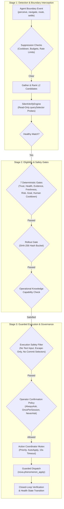
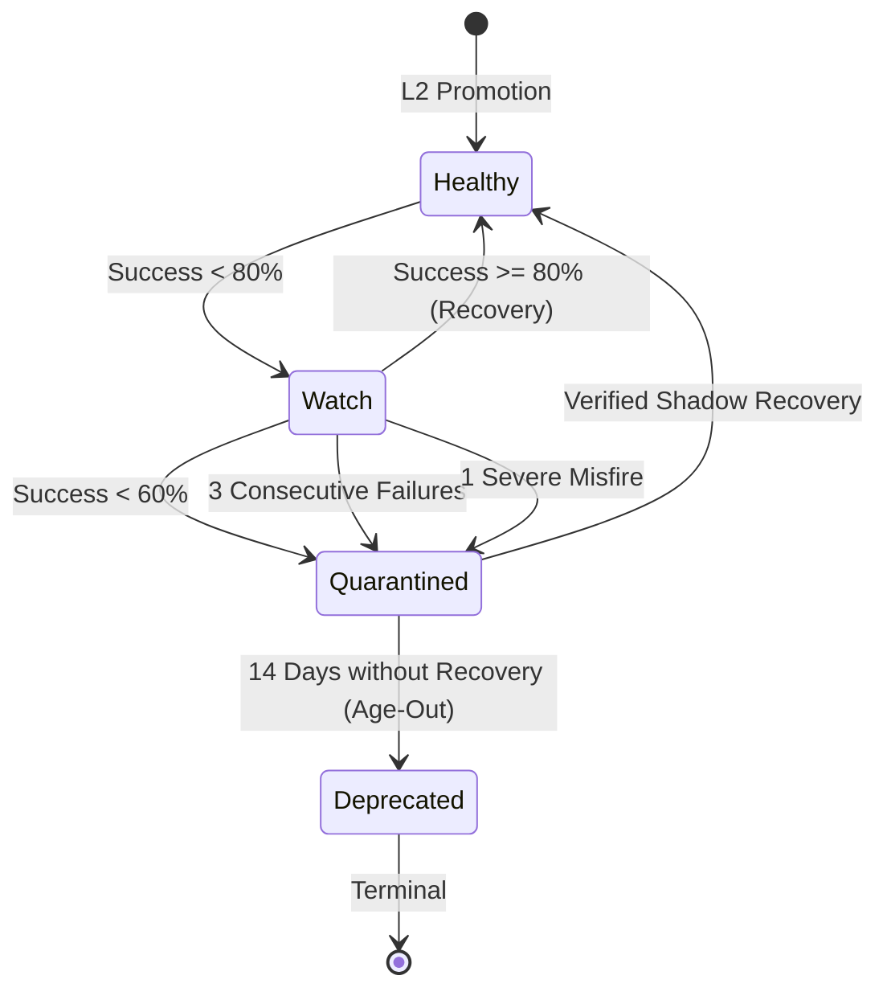

# Ambient Auto-Apply

Ambient Auto-Apply enables Nova to automatically remediate routine, well-understood blockers (such as cookie consent banners, dismissal overlays, and modal popups) in the background during agent work. By leveraging learned playbooks from the [Phenomenological Knowledge Store (PKS)](../phenomenological-knowledge-store-pks/README.md) and outcome verification from the [Closed-Loop System (CLS)](../../closed-loop-system-cls/README.md), Nova frees AI agents from spending reasoning cycles and planning steps on repetitive web obstacles.

---

## 1. Core Architectural Principles

1. **Trusted Knowledge vs. Automatic Application:**
   Promoting a phenomenon to L2 Active in the PKS establishes that Nova understands the structure and remediation of an obstacle. However, **permission to apply that knowledge automatically in the background is a separate, higher-threshold decision**. Active PKS knowledge is never applied ambiently without meeting independent freshness, evidence, and safety invariants.

2. **Zero Ambient Mutation of Sensitive Workflows:**
   Ambient Auto-Apply is restricted strictly to dismissive remediations. It is architecturally prevented from performing authentication, form completion, text input synthesis, or financial transactions.

3. **Human Non-Interference (Zero Clashing):**
   Ambient evaluation operates exclusively during active agent workflows. Human user interaction initiates an immediate 5-second suppression cooldown across the tab, guaranteeing that Nova never clicks or mutates the page while an operator is actively navigating or typing.

---

## 2. The Three-Stage Remediation Pipeline

Ambient Auto-Apply executes as a strict sequential pipeline:

| Pipeline Stage | Component | Core Responsibility |
|---|---|---|
| **Stage 1: Detection & Boundary Interception** | Silent Verify Engine & Host Correlation | Listens for agent boundary events (`perceive`, `navigate`, `route`, `settle`), enforces rate limits and detection budgets, and runs read-only DOM queries to identify matching overlays without side effects. |
| **Stage 2: Eligibility & Safety Gates** | Ambient Auto-Apply Controller | Validates that candidate phenomena satisfy seven deterministic gates: L2 Active trust, Healthy status, verified runtime evidence, 60-day freshness window, dismissive risk classification, goal compatibility, and progressive canary rollout buckets. |
| **Stage 3: Guarded Execution & Governance** | Action Coordinator & Operator Policy Engine | Enforces execution safety (rejecting synthetic text, text inputs, non-Escape keys, and commit buttons), requests operator confirmation or verifies cryptographic session grants, reserves priority mutexes, dispatches playbooks, and records closed-loop telemetry. |

---

## 3. The Health State Machine & Self-Protection

To safeguard workflows against website redesigns or broken selectors, every phenomenon is governed by an automated health lifecycle:

- **Healthy:** Operating reliably ($\ge 80\%$ success rate over historical attempts). Fully eligible for ambient execution.
- **Watch:** Reliability degraded below 80%. Ambient execution is suspended; the playbook remains available only for explicit agent invocation.
- **Quarantined:** Severe failure detected (success $< 60\%$, 3 consecutive failures, or a severe misfire). Completely isolated.
- **Deprecated:** A quarantined phenomenon that fails to achieve verified recovery within 14 days is permanently archived.

---

## 4. Documentation Suite Index

Explore the comprehensive guides for deep architectural details, algorithmic specifications, and configuration contracts:

| Document | Focus & Key Topics Covered |
|---|---|
| [**Pipeline Stages & Detection**](pipeline-stages-and-detection.md) | Boundary event triggers (`perceive`, `navigate`, `SpaRouteChange`, `MutationSettle`), host event anti-spoofing, 700 ms rate limits, 5s human cooldowns, sliding detection budgets, multi-signal candidate ranking vector, silent DOM verification, and the 7 Stage 2 eligibility gates. |
| [**Safety Boundaries & Execution Guardrails**](safety-boundaries-and-execution-guardrails.md) | Semantic risk classes (`Dismissive`, `ReadOnly`, `Auth`, `Transactional`), the 5 invariant rejection rules (no placeholders, zero text input, ReadOnly mutation protection, Escape-only keypress, commit button rejection), Action Coordinator mutex locking, and internal execution bounds. |
| [**Governance, Confirmation & Quarantine Lifecycle**](governance-confirmation-and-quarantine-lifecycle.md) | Operator confirmation modes (`AlwaysAsk`, `OncePerSession`, `NeverAsk`), SHA-256 cryptographic session grant binding, confirmation prompt inspection redaction, complete health state machine transition formulas, severe misfire handling, and autonomy audit logging. |

---

## 5. Related Documentation

- [Closed-Loop System (CLS)](../../closed-loop-system-cls/README.md) — Real-time outcome assertions and post-action verification.
- [Phenomenological Knowledge Store (PKS)](../phenomenological-knowledge-store-pks/README.md) — Multi-tier repository for web phenomena and playbooks.
- [Domain Notes (Site Notes)](../domain-notes/README.md) — Persistent domain-level operational instructions.
- [Browser Memory](../browser-memory/README.md) — Cross-session episodic memory and retention lifecycle.

[Learning overview](../README.md) · [All core features](../../README.md)
