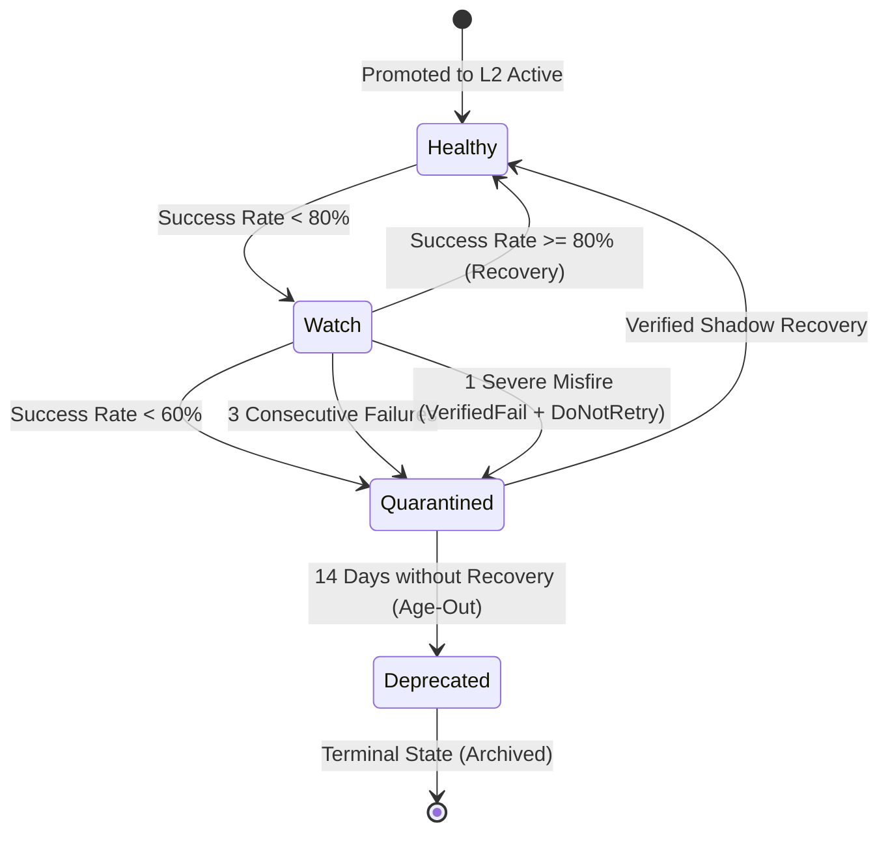

# Ambient Auto-Apply Governance, Confirmation & Quarantine Lifecycle

Ambient Auto-Apply operates under a dual-governance model: human operators retain supervisory control through configurable confirmation policies, while an automated health state machine isolates degraded or drifted playbooks before they can compromise agent tasks.



---

## 1. Operator Confirmation Policies & Modes

The browser's operator settings govern whether Nova executes eligible ambient remedies autonomously or prompts the operator for approval.

### Configuration Knobs

The behavior is configured in Nova settings and persistent configuration:

- **`AmbientAutoApplyEnabled` (boolean, default: `true`):** Master switch for ambient background remediation. When disabled, all background triggers skip with `ambient_policy_disabled`.
- **`AmbientAutoApplyConfirmMode` (`McpConfirmMode`, default: `AlwaysAsk`):** Confirmation mode governing operator prompts.

### Confirmation Modes

| Mode | Behavior | Use Case |
|---|---|---|
| `AlwaysAsk` | Every eligible ambient auto-apply displays an operator confirmation dialog before execution. | High-security environments and attended human-in-the-loop workflows. |
| `OncePerSession` | The first execution prompts the operator. If granted for the session (`AllowForSession`), subsequent matching remediations execute silently within the same tab claim session. | Balanced productivity: prompts once per task session while preserving strict session boundaries. |
| `NeverAsk` | Remediation runs autonomously without prompt if all Stage 1, Stage 2, and Stage 3 gates pass. | Fully autonomous agent workers and unattended background automations. |

---

## 2. Cryptographic Session Grant Binding

To prevent cross-tab or cross-agent privilege leakage, session grants in `OncePerSession` mode are bound to a multi-variable cryptographic identity.

```
       ambient:{scope}:{stableId}:r{contentRev}:{risk}:{actionClass}
          :sig:{actionSig}:target:{targetHash}:owner:{ownerHash}:session:{sessionHash}
```

### Subject Key Composition

A session grant is valid **only** if the runtime request matches the exact cryptographic subject key:

1. **Normalized Scope & Stable ID:** Restricts the grant to the specific origin domain and phenomenon.
2. **Content Revision (`r{contentRev}`):** If the playbook is updated or re-learned, the revision increments, immediately invalidating all previous grants.
3. **Risk Class & Action Class:** Prevents a dismissive grant from being reused for other action categories.
4. **Action Signature Hash (`sig:{actionSig}`):** A 24-character SHA-256 hash computed across the playbook's action types, selectors, keys, timeouts, thresholds, and redacted text hashes:

   $$\text{ActionSig} = \text{SHA-256}(\text{Type}_1 \parallel \text{Sel}_1 \parallel \text{Key}_1 \parallel \dots)[0..23]$$

5. **Target Hash (`target:{targetHash}`):** 24-character hash of the target WebView identifier.
6. **Claim Owner & Session Hash (`owner:{ownerHash}:session:{sessionHash}`):** 24-character hashes of the active agent claim owner ID and session key.

> [!IMPORTANT]
> A session grant cannot be shared across different tabs, different agents, or different user tasks. Releasing a tab claim or starting a new agent session immediately invalidates the grant.

### Confirmation Prompt Redaction & Summary

When prompting the operator under `AlwaysAsk` or `OncePerSession`, Nova formats a structured inspection summary:

- **Redacted Text:** User text or input values are replaced with `<redacted:N>` where $N$ is the character length.
- **Bounded Action List:** Displays up to 5 individual actions (`AmbientAutoApplyMaxPromptActions = 5`) with selectors, keys, timeouts, and mutating flags. Any excess actions are summarized as `actionsRemaining=M`.
- **Risk Signals:** Surfaces semantic tags such as `ambient_auto_apply`, `risk:Dismissive`, and `action:modal_dismiss`.

---

## 3. The Auto-Apply Health State Machine

Every phenomenon maintains real-time execution statistics in the Phenomenological Knowledge Store (`pks.db`). The health state machine evaluates these metrics continuously.

### Health States

| State | Ambient Eligibility | Description |
|---|---|---|
| `Healthy` | **Eligible** | Playbook exhibits consistent reliability (success rate $\ge 80\%$). |
| `Watch` | **Ineligible** | Success rate dipped below 80%. Retained for explicit advice, but suppressed from background execution. |
| `Quarantined` | **Ineligible** | Severely degraded playbook (success rate $< 60\%$, 3 consecutive failures, or severe misfire). |
| `Deprecated` | **Terminal** | Playbook aged out after 14 days in quarantine without recovery. Excluded from all lookups. |

### Transition Rules

The transition function evaluates six metrics:

$$\text{State}_{\text{next}} = f(\text{State}_{\text{curr}}, \text{SuccessRatePct}, \text{ConsecutiveFailures}, \text{SevereMisfire}, \text{VerifiedRecovery}, \text{DaysSinceQuarantine})$$

1. **`Healthy -> Watch`:**
   $$\text{SuccessRatePct} < 80\% \implies \text{Watch}$$
2. **`Watch -> Quarantined`:**
   $$\text{SevereMisfire} \lor \text{ConsecutiveFailures} \ge 3 \lor \text{SuccessRatePct} < 60\% \implies \text{Quarantined}$$
3. **`Watch -> Healthy` (Recovery):**
   $$\text{SuccessRatePct} \ge 80\% \land \text{ConsecutiveFailures} == 0 \implies \text{Healthy}$$
4. **`Quarantined -> Healthy` (Shadow Recovery):**
   $$\text{VerifiedRecovery} == \text{true} \implies \text{Healthy}$$
5. **`Quarantined -> Deprecated` (Age-Out):**
   $$\text{DaysSinceQuarantine} \ge 14\text{ days} \land \neg \text{VerifiedRecovery} \implies \text{Deprecated}$$
6. **`Deprecated` (Terminal):**
   A deprecated phenomenon can never exit this state. It remains permanently disabled.

### Severe Misfire Definition

A failure is classified as a **severe misfire** if the Closed-Loop verification returns:

$$\text{VerificationStatus} == \text{VerifiedFail} \quad \land \quad \text{RetryAdvice} == \text{DoNotRetry}$$

This indicates that executing the playbook actively broke the page or caused an unrecoverable failure state. A single severe misfire transitions a playbook directly from `Watch` into `Quarantined`.

### Read-Back Re-Derivation & Content Revision Resets

- **Read-Back Re-Derivation:** To prevent phenomena from remaining in quarantine indefinitely if the browser restarts, Nova re-evaluates `IsQuarantineAgedOut` during database load. Any quarantined phenomenon whose last failure anchor exceeds 14 days is automatically re-derived as `Deprecated`.
- **Content Revision Resets:** When an operator or agent publishes a revised playbook (`ContentRev` increments), historical failure counters reset to zero. This allows an updated selector or timing fix to start with a clean health record.

---

## 4. Telemetry & Autonomy Audit Logs

All Ambient Auto-Apply decisions are recorded in Nova's autonomy audit log (`logs/mcp/autonomy-*.log`) with structured key-value events:

```
[INF] auto_apply.boundary Boundary=Perceive Source=AgentTool Target=tab-0 Scope=example.com Candidates=2 VerifyResults=2 Matches=1
[INF] auto_apply.prompted Boundary=Perceive Source=AgentTool Target=tab-0 Scope=example.com StableId=cmp-dismiss SubjectKey=ambient:example.com... Mode=AlwaysAsk
[INF] auto_apply.prompt_resolved Boundary=Perceive Source=AgentTool Target=tab-0 Scope=example.com StableId=cmp-dismiss Mode=AlwaysAsk Decision=Allowed
[INF] auto_apply.executed Boundary=Perceive Source=AgentTool Target=tab-0 Scope=example.com StableId=cmp-dismiss PhenomenonType=consent_cmp Risk=Dismissive Mode=AlwaysAsk Ok=True Status=resolved ReasonCode=n/a
```

### Event Catalog

| Event Name | Level | Emitted When |
|---|---|---|
| `auto_apply.boundary` | Information | A boundary event evaluates candidates and identifies healthy DOM matches. |
| `auto_apply.skipped` | Information / Warning | Execution skipped due to emergency stop, disabled policy, or unmatched host event. |
| `auto_apply.budget_denied` | Information | Boundary match dropped because session or scope detection budget was exhausted. |
| `auto_apply.blocked` | Information | Remediator blocked by risk classification, missing capabilities, or execution safety rules. |
| `auto_apply.policy_blocked`| Information | Remediation denied by operator prompt denial or timeout. |
| `auto_apply.prompted` | Information | An operator confirmation dialog was dispatched. |
| `auto_apply.prompt_resolved`| Information | Operator made a decision (`Allowed`, `Denied`, `AllowForSession`, or `TimedOut`). |
| `auto_apply.grant_created` | Information | A reusable session grant was stored in memory. |
| `auto_apply.grant_used` | Information | An existing valid session grant bypassed the operator prompt. |
| `auto_apply.executed` | Information | A playbook completed execution and recorded closed-loop outcome metrics. |
