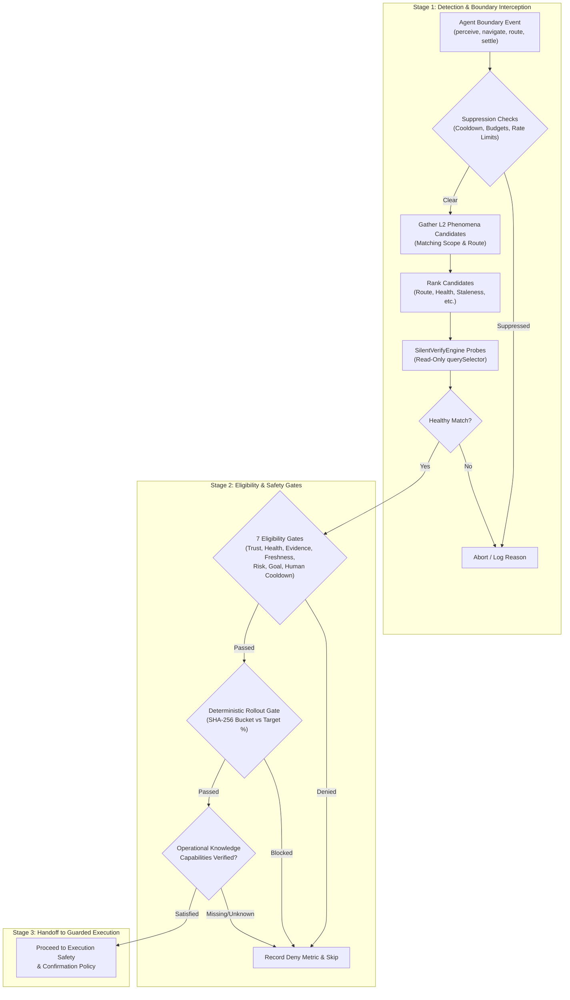
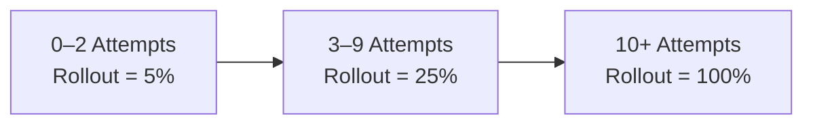

# Ambient Auto-Apply Pipeline & Detection

Ambient Auto-Apply operates as a multi-stage background remediation pipeline within Nova. Rather than executing reactive interventions indiscriminately, the system monitors agent-driven interactions, filters candidates against strict frequency budgets and human interaction cooldowns, performs non-invasive DOM verification, and evaluates seven deterministic eligibility gates.

---

## 1. Trigger Boundaries & Host Correlation

Ambient Auto-Apply triggers exclusively during active agent workflows. Ordinary human navigation through the browser chrome never initiates background auto-apply.

### Supported Boundary Kinds

The runtime categorizes boundary events into five distinct kinds:

| Boundary Kind | Trigger Source | Description | Timing / Delay |
|---|---|---|---|
| `Perceive` | `nova.perceive` | Agent inspects the current viewport before planning next actions. | Immediate (0 ms) |
| `Navigate` | `nova.navigate`, `nova.back`, `nova.forward`, `nova.reload`, `nova.history_go` | Explicit page transition commanded by an agent. | Immediate upon navigation dispatch |
| `SpaRouteChange` | WebView2 History / Hash Event | Single-Page Application client-side route update. | Intercepted with route nonce validation |
| `PreAction` | Pre-interaction hook | Reserved boundary for inspecting blocking overlays prior to element interaction. | Evaluated prior to action dispatch |
| `MutationSettle` | Post-mutation tools (`click`, `scroll`, `type`, `drag`, `upload`) | DOM mutation that may have caused dynamic dialogs or cookie banners to render. | Delayed by 350 ms settle window; waits up to 1,200 ms for DOM stability |

### Host Event Authorization & Anti-Spoofing

When navigation or route changes occur via browser host events (e.g., WebView2 frame navigations), the runtime enforces strict request correlation before scheduling an ambient evaluation:

1. **Active Pending Request Match:** The host event must correlate with an in-flight agent request started within the authorization window ($T_{\text{window}} = 30\,000\text{ ms}$).
2. **Target & Claim Verification:** The target WebView identifier must match the active tab claim owner (`claim.OwnerId`) and active session key (`claim.OwnerSessionKey`).
3. **Route Nonce Matching:** For SPA route transitions, the host event must match the ephemeral route nonce generated by the agent routing call.
4. **Skip Reasons:** If no active agent request correlates with the host event, the boundary is dropped with reason code `ambient_no_active_agent`. If an agent request is active but the target or nonce fails validation, it drops with `ambient_unmatched_host_event`.

---

## 2. Rate Limiting, Interaction Cooldown & Detection Budgets

To prevent thrashing, resource exhaustion, and interference with human operators, three layers of throttling govern Stage 1:

### Minimum Trigger Interval

Between consecutive auto-apply evaluations on a single tab target, a minimum interval is enforced:

$$\Delta t_{\text{trigger}} \ge 700\text{ ms}$$

Rapid successive boundary events within 700 ms of an active trigger are dropped silently.

### Human Interaction Cooldown

If a human user interacts with the target tab (keyboard typing, mouse clicking, or touch gestures), ambient auto-apply enters a strict suppression cooldown:

$$t_{\text{now}} - t_{\text{human\_interaction}} < 5\,000\text{ ms} \implies \text{Suppressed (\texttt{recent\_interaction})}$$

This guarantees that Nova never clicks or dismisses elements while an operator is actively focusing, typing, or scrolling within the viewport.

### Sliding Detection Budgets

Background DOM evaluation consumes browser CPU. Nova enforces detection budgets reset over a 60-second sliding window ($T_{\text{budget}} = 60\,000\text{ ms}$):

| Budget Level | Limit | Window | Purpose |
|---|---|---|---|
| **Session Budget** | Max 5 evaluations | 60 seconds | Limits aggregate background DOM queries across all open tabs. |
| **Scope Budget** | Max 2 evaluations | 60 seconds | Limits background DOM queries targeting any single domain origin. |

When a budget limit is reached, candidates are skipped with `ambient_detection_budget_exhausted`.

---

## 3. Candidate Gathering & Multi-Signal Ranking

When a boundary clears rate limits, the Phenomenological Knowledge Store (PKS) loads all non-deprecated phenomena for the current normalized scope.

### Candidate Filtering

A phenomenon qualifies for Stage 1 evaluation only if:
- It is not marked `deprecated`.
- Its learning level is at least Active (`LearningLevel >= L2`).
- Its URL context matches the current route segment (e.g., `_root`, `/account`, `/checkout`).
- It contains DOM fingerprint signals (action target selectors are strictly excluded from detection queries).

### Multi-Signal Ranking Vector

If multiple phenomena match the active route, Nova ranks candidates before truncating to the hard cap of **8 candidates** (`AutoApplyDetectionMaxCandidates = 8`). Ranking evaluates an eight-tuple priority vector:

$$\mathbf{r} = \langle r_{\text{route}}, r_{\text{health}}, r_{\text{risk}}, r_{\text{fingerprint}}, s_{\text{stale}}, c_{\text{failures}}, t_{\text{evidence}}, o_{\text{source}} \rangle$$

1. **Route Rank ($r_{\text{route}}$):** Exact sub-path match ($2$) > Path prefix match ($1$) > Wildcard / root match ($0$).
2. **Health Rank ($r_{\text{health}}$):** `Healthy` ($3$) > `Watch` ($2$) > `Quarantined` ($1$) > `Deprecated` ($0$).
3. **Risk Rank ($r_{\text{risk}}$):** `Dismissive` preferred over `ReadOnly`.
4. **Fingerprint Rank ($r_{\text{fingerprint}}$):** Higher historical selector specificity and match score.
5. **Staleness Score ($s_{\text{stale}}$):** Elapsed time since last verification (lower score = fresher evidence).
6. **Consecutive Failures ($c_{\text{failures}}$):** Fewer consecutive failures prioritized.
7. **Last Evidence Ticks ($t_{\text{evidence}}$):** Most recent successful execution preferred.
8. **Source Order ($o_{\text{source}}$):** Deterministic tie-breaker based on catalog storage order.

Only the top 8 ranked candidates are submitted to the silent verification engine.

---

## 4. Non-Invasive Silent Verification

Candidate evaluation must not alter page state. Nova executes a combined verification script via the Silent Verify Engine:

- **Read-Only Invariant:** Uses non-invasive `document.querySelector` and layout rect evaluations.
- **No Event Dispatching:** Does not hover, focus, click, or dispatch artificial synthetic DOM events.
- **Healthy Match Required:** A candidate matches only if the target DOM element exists, is visible in the layout tree, and passes structural fingerprint assertions (`result.Verdict == "healthy"`).
- **Drift Handling:** If structural drift is detected, the candidate verdict is classified as drifted. Drifted phenomena are never auto-applied in the background; they remain signal-only for revalidation.

---

## 5. Stage 2 Eligibility Gates

Once a phenomenon produces a healthy detection match, it must pass all Stage 2 eligibility checks in `AutoApplyController.CheckEligibility`:

| Gate | Requirement | Deny Reason Code | Description |
|---|---|---|---|
| **1. Trust Level** | $\text{Level} \ge \text{L2 (Active)}$ | `trust_below_l2` | Candidate (L0) and Shadow (L1) playbooks cannot run in background. |
| **2. Health State** | $\text{State} == \text{Healthy}$ | `health_watch`, `health_quarantined` | Playbooks under Watch or Quarantine are denied ambient application. |
| **3. Evidence Required** | $\text{TotalAttempts} > 0 \land \text{LastAttempt} \ne \text{null}$ | `missing_evidence` | Active knowledge must have verified runtime attempts; trust alone is insufficient. |
| **4. Freshness Window** | $\Delta t_{\text{last\_attempt}} \le 60\text{ days}$ | `stale_phenomenon` | Knowledge unconfirmed for over 60 days must be revalidated explicitly. |
| **5. Risk Class** | $\text{Risk} \notin \{\text{Auth}, \text{Transactional}\}$ | `risk_class_auth`, `risk_class_transactional` | Login walls, paywalls, and financial forms are strictly excluded. |
| **6. Goal Compatibility** | Compatible with active agent goal | `goal_incompatible` | Conditioned playbooks require an active, matching goal context. |
| **7. Human Cooldown** | $\Delta t_{\text{human}} \ge 5\,000\text{ ms}$ | `recent_interaction` | No user mouse or keyboard interaction within the last 5 seconds. |

---

## 6. Deterministic Progressive Rollout Gate

To protect production workflows from latent defects in freshly learned or updated playbooks, Nova applies deterministic canary rollout gates based on historical execution volume:

### Deterministic Hash Bucket

Rollout evaluation avoids random number generators to eliminate flapping across navigation hops. The hash bucket is computed via SHA-256 over candidate identity:

$$\text{Seed} = \text{stableId} \parallel \text{"|"} \parallel \text{scope} \parallel \text{"|"} \parallel \text{contentRev}$$

$$\text{Bucket} = (\text{byte}_0 \mid (\text{byte}_1 \ll 8)) \pmod{100}$$

$$\text{Allowed} \iff \text{Bucket} < \text{RolloutPercentage}$$

> [!NOTE]
> Because `contentRev` is part of the hash seed, publishing a revised playbook version deterministically re-samples the rollout bucket, automatically putting the revised remediation back into canary distribution.

---

## 7. Operational Knowledge (OK) Capability Pre-Conditions

When a playbook specifies `RequiredCapabilities` (e.g., specific cookie preferences or consent banner states), Stage 2 cross-references the live Operational Knowledge (OK) candidate snapshot for the target origin:

1. **State Freshness:** Every required capability key must report a status of `fresh`.
2. **Boolean Assertion:** The capability's evaluated JSON value must strictly equal `"true"`.
3. **Missing or Violated:** If any capability evaluates to `violated`, the evaluation fails with `pks.required_capability_missing`. If unobserved or stale, it fails with `pks.required_capability_unknown`.

Only candidates satisfying all Stage 1 detection rules, Stage 2 eligibility gates, rollout buckets, and capability requirements advance to Stage 3 execution.
