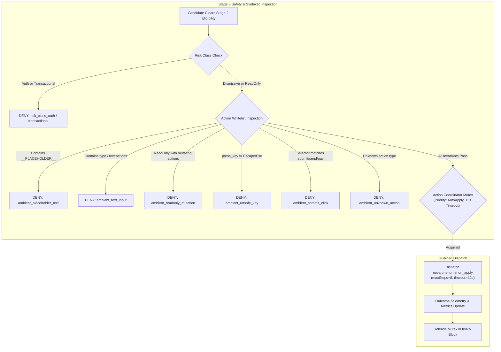
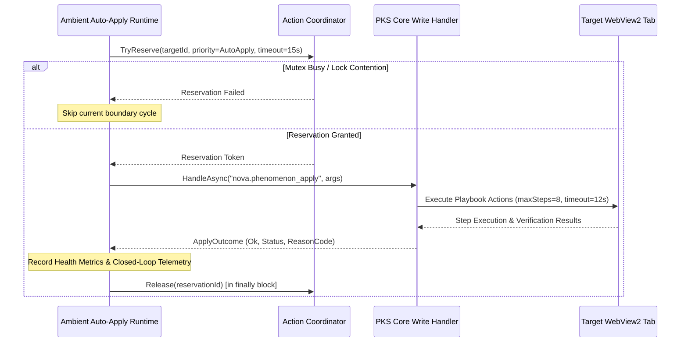

# Ambient Auto-Apply Safety Boundaries & Execution Guardrails

Ambient Auto-Apply operates under a zero-trust model regarding background mutations. While explicit agent tool calls (`nova.phenomenon_apply`) allow interactive problem-solving with full agent context, background ambient execution is strictly constrained to dismissive remediation of known blockers.



---

## 1. Risk Classification System

Every phenomenon cataloged in the Phenomenological Knowledge Store (PKS) is assigned a semantic risk class based on its phenomenon type:

| Risk Class | Phenomenon Types | Ambient Eligibility | Permitted Actions |
|---|---|---|---|
| `Dismissive` | `consent_cmp`, `modal`, `popover_open` | **Eligible** | Safe dismissals (`click` on close buttons, `press_key` with `Escape`, `wait`). |
| `ReadOnly` | `custom`, `layout_shift`, read-only notices | **Eligible (Non-Mutating Only)** | Passive observations, delays (`wait`). Any mutating action is denied. |
| `Auth` | `login_wall`, `paywall` | **Strictly Ineligible** | Excluded from background execution. Always requires explicit agent or user action. |
| `Transactional` | Forms, checkout flows, payment gates | **Strictly Ineligible** | Excluded from background execution. Rejection code `risk_class_transactional`. |

> [!IMPORTANT]
> A phenomenon classified as `Auth` or `Transactional` can never be auto-applied in the background, even if promoted to L2 Active and reporting 100% historical success. Authentication and monetary transactions require explicit operator or agent authorization.

---

## 2. Playbook Action Whitelisting & Syntactic Inspection

Prior to execution, the Ambient Auto-Apply Controller inspects every individual action within the candidate's playbook. If any action violates ambient safety rules, the entire playbook is rejected.

### Allowed Ambient Action Types

Only the following low-level action verbs are recognized in ambient mode:
- `click`
- `dismiss`
- `press_key`
- `wait`

Any unrecognized or unvalidated action type is rejected with `ambient_unknown_action`.

### The Five Invariant Rejection Rules

```
                  ┌──────────────────────────────────────────────┐
                  │          Stage 3 Invariant Filters           │
                  └──────────────────────┬───────────────────────┘
                                         │
         ┌───────────────────────────────┼───────────────────────────────┐
         ▼                               ▼                               ▼
1. No Synthetic Text            2. Zero Text Input              3. ReadOnly Protection
 Rejects:                        Rejects:                        Rejects:
  - __PLACEHOLDER__               - action.Type == "type"         - Risk == ReadOnly AND
  - __MESSAGE__                   - action.Type == "text"           Action is mutating
  - __IMAGE_PROMPT__              (ambient_text_input)            (ambient_readonly_mutation)
 (ambient_placeholder_text)
                                         │
         ┌───────────────────────────────┴───────────────────────────────┐
         ▼                                                               ▼
4. Escape-Only Keypress                                         5. Commit Selector Rejection
 Rejects:                                                        Rejects selectors matching:
  - action.Key != "Escape"                                        - submit, send, checkout
  - action.Key != "Esc"                                           - confirm, order, pay
 (ambient_unsafe_key)                                             - type=submit, form button
                                                                 (ambient_commit_click)
```

#### Rule 1: Rejection of Synthetic Placeholder Text (`ambient_placeholder_text`)

Background remediation must never emit templated prompt injection artifacts. Any action string containing placeholder patterns such as `__...__`, `__MESSAGE__`, or `__IMAGE_PROMPT__` is immediately blocked.

#### Rule 2: Complete Prohibition of Text Input (`ambient_text_input`)

Background auto-apply must never synthesize keyboard character streams into form controls or chat inputs. Any playbook containing `type` or `text` actions is rejected:

$$\text{ActionType} \in \{\text{"type"}, \text{"text"}\} \implies \text{Deny (\texttt{ambient\_text\_input})}$$

#### Rule 3: ReadOnly Mutation Prohibition (`ambient_readonly_mutation`)

If a phenomenon is categorized under `ClRiskClass.ReadOnly`, it is strictly forbidden from triggering mutating DOM actions (`click`, `dismiss`, `press_key`, `text`, `type`). Only non-mutating synchronization actions (e.g., `wait`) are permitted.

#### Rule 4: Escape-Only Keypress Restriction (`ambient_unsafe_key`)

When closing modals or popovers via keyboard shortcuts, `press_key` actions are restricted strictly to the Escape key:

$$\text{Key} \in \{\text{"Escape"}, \text{"Esc"}\} \implies \text{Allowed}, \quad \text{otherwise} \implies \text{Deny (\texttt{ambient\_unsafe\_key})}$$

Keys such as `Enter`, `Space`, `Tab`, or alphanumeric characters are rejected to prevent unintended form submissions or focus manipulation.

#### Rule 5: Commit Selector Rejection (`ambient_commit_click`)

Click actions must never target commit, submit, or payment triggers. Nova inspects target CSS selectors against an extensive semantic blacklist:

- **Form Submission Attributes:** `[type=submit]`, `[type="submit"]`, `[type='submit']`
- **Button Tokens:** Selectors matching `form` and `button` simultaneously
- **Semantic Commit Keywords:** `composer-submit`, `send-button`, `submit`, `send`, `confirm`, `publish`, `create`, `checkout`, `place-order`, `pay-button`

If a click selector matches any of these tokens, execution is denied with `ambient_commit_click`.

---

## 3. Execution Coordination & Priority Locking

When a remediation clears all syntactic safety checks and operator confirmation, execution is synchronized through the **Action Coordinator**:



### Locking Parameters

- **Priority:** `ClCoordinatorPriority.AutoApply`. Ambient auto-apply yields immediately to active user input and direct agent commands.
- **Reservation Timeout:** 15,000 ms (`AutoApplyCoordinatorTimeoutMs = 15_000`). If execution does not conclude within 15 seconds, the lock expires automatically.
- **Guaranteed Cleanup:** Mutex release is enclosed in a `finally` block to ensure no orphaned locks remain in case of transient exceptions or navigation aborts.

---

## 4. Guarded Internal Dispatch & Execution Bounds

Ambient execution invokes the internal PKS write handler using the standard `nova.phenomenon_apply` interface with fortified runtime bounds:

- **Maximum Step Limit:** Capped at 8 steps (`maxSteps = 8`). Playbooks exceeding 8 discrete actions are aborted.
- **Dispatch Timeout:** Capped at 12,000 ms (`timeoutMs = 12_000`).
- **Emergency Stop Integration:** Before acquiring the reservation lock and immediately before dispatch, the runtime checks `EmergencyStopState.IsActive`. If active, auto-apply halts instantly with reason code `emergency_stop_active`.

### Internal Dispatch Arguments

The ambient runtime packages the remediation request as a serialized JSON element:

```json
{
  "scope": "example.com",
  "phenomenonId": "phenom-a1b2c3d4",
  "targetId": "tab-3",
  "maxSteps": 8,
  "timeoutMs": 12000
}
```

### Result Parsing Contract

When the handler completes, Nova extracts outcome parameters from the returned `structuredContent` payload:

```json
{
  "structuredContent": {
    "ok": true,
    "status": "resolved",
    "reasonCode": null,
    "stepsExecuted": 2,
    "durationMs": 340
  }
}
```

- **`ok` (boolean):** Indicates whether all playbook steps and post-action assertions passed successfully.
- **`status` (string):** Semantic resolution state (`resolved`, `blocked`, `failed`).
- **`reasonCode` (string):** Specific diagnostic reason code if execution was prevented or failed.
- **Fault Tolerance:** If JSON parsing fails or `structuredContent` is missing, the execution fails gracefully with `auto_apply.no_structured_content` or `auto_apply.parse_failed` without throwing unhandled runtime exceptions.

---

## 5. Denial Reason Code Taxonomy

When an ambient candidate is rejected at Stage 2 or Stage 3, Nova records structured denial reasons in the autonomy audit log:

| Category | Reason Code | Meaning |
|---|---|---|
| **Boundary / Budget** | `ambient_no_active_agent` | Host event did not correlate with an active agent request. |
| | `ambient_unmatched_host_event` | Host event target or route nonce mismatched. |
| | `ambient_detection_budget_exhausted` | Session or domain scope detection budget exceeded. |
| | `recent_interaction` | Human mouse or keyboard activity detected within the 5s cooldown. |
| **Stage 2 Eligibility** | `trust_below_l2` | Candidate learning level is below L2 (Active). |
| | `health_watch` / `health_quarantined` | Phenomenon is currently degraded under Watch or Quarantine. |
| | `missing_evidence` | Phenomenon has zero recorded attempts; trust alone is insufficient. |
| | `stale_phenomenon` | Last attempt was more than 60 days ago. |
| | `risk_class_auth` / `transactional` | Phenomenon involves authentication or transactions. |
| | `goal_incompatible` | Goal-conditioned phenomenon lacks a compatible active goal. |
| | `rollout_gate` | Phenomenon SHA-256 hash bucket exceeded current rollout percentage. |
| **Stage 3 Safety** | `ambient_placeholder_text` | Playbook contains synthetic placeholder strings (`__...__`). |
| | `ambient_text_input` | Playbook contains disallowed typing or text input actions. |
| | `ambient_readonly_mutation` | Playbook attempts mutating actions for a ReadOnly risk class. |
| | `ambient_unsafe_key` | Keyboard keypress action specifies a key other than Escape. |
| | `ambient_commit_click` | Click target matches submit, send, checkout, or payment selectors. |
| | `ambient_unknown_action` | Playbook contains an unrecognized action verb. |
