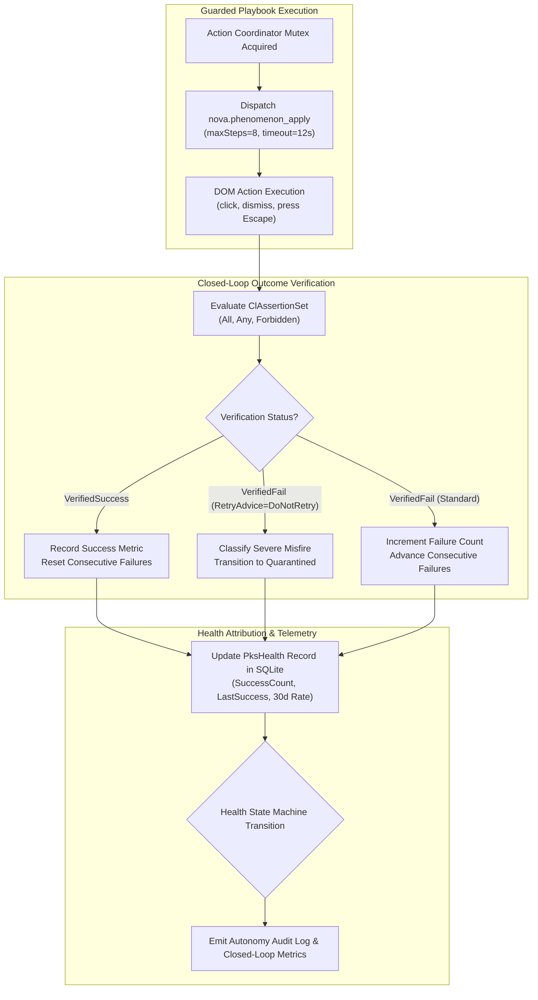
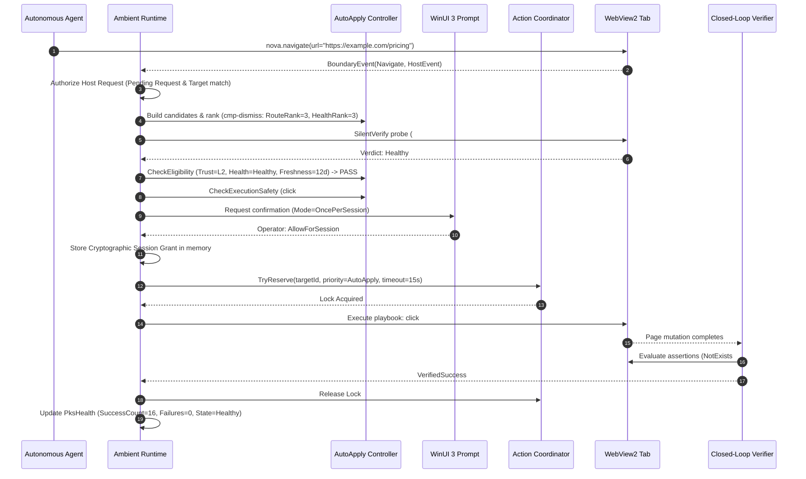

# Ambient Auto-Apply Verification Traces, Attribution & Recovery

Ambient Auto-Apply does not operate as an open-loop script runner. Every background remediation must pass post-action assertions through Nova's [Closed-Loop System (CLS)](../../closed-loop-system-cls/README.md), update persistent health metrics in the [Phenomenological Knowledge Store (PKS)](../phenomenological-knowledge-store-pks/README.md), and follow rigorous shadow recovery protocols when degraded.



---

## 1. Closed-Loop System (CLS) Outcome Verification

Once a playbook's actions finish executing, Nova evaluates the post-transition page state to verify whether the target obstacle was genuinely remediated.

### Assertion Sets & Semantic Operators

Remediation verification evaluates a structured `ClAssertionSet` containing three assertion groups:

- **`All` (Mandatory):** Every assertion in this group must evaluate to `Satisfied`.
- **`Any` (Alternative):** At least one assertion in this group must evaluate to `Satisfied`.
- **`Forbidden` (Invariants):** None of the assertions in this group may evaluate to `Satisfied`. If any forbidden assertion passes, the entire outcome is deemed failed.

Assertions extract live facts from the DOM, page metadata, or the runtime environment using strict operators:

| Operator | Comparison Logic | Example Use in Remediation |
|---|---|---|
| `Exists` | Target element is present in layout tree | Verifying fallback UI elements. |
| `NotExists` | Target element is detached from DOM or `display: none` | Confirming modal backdrop or cookie banner is gone. |
| `Eq` / `NotEq` | Strict semantic equality against expected value | Checking `aria-hidden == "true"` or `body.style.overflow != "hidden"`. |
| `Contains` | Substring inclusion check | Confirming URL or container text changes. |
| `Gt` / `Lt` / `Gte` / `Lte` | Numeric scalar comparisons | Verifying viewport layout metrics and scroll bounds. |

### Verification Status & Retry Advice

The Closed-Loop Outcome Evaluator returns a structured result record:

```json
{
  "verificationStatus": "VerifiedSuccess",
  "retryAdvice": "DoNotRetry",
  "evaluatedAssertions": 3,
  "traces": [
    {
      "factKey": "dom.element.#cookie-banner.exists",
      "operator": "NotExists",
      "expected": false,
      "actual": false,
      "verdict": "Satisfied"
    },
    {
      "factKey": "dom.body.style.overflow",
      "operator": "NotEq",
      "expected": "hidden",
      "actual": "auto",
      "verdict": "Satisfied"
    }
  ]
}
```

- **`VerifiedSuccess`:** All assertions satisfied. Remediation cleared the obstacle.
- **`VerifiedFail` with `CanRetry`:** Obstacle persisted, but the page was not broken. Increments standard failure counters.
- **`VerifiedFail` with `DoNotRetry` (Severe Misfire):** Obstacle persisted and page navigation or layout was broken. Triggers immediate transition to `Quarantined`.

---

## 2. Health Attribution & Anti-Ambiguity Safeguards

When human agents or ambient routines interact with the page, closed-loop hooks resolve which phenomenon was affected and update its health record.

### Selector Disambiguation Gate

To prevent corrupted telemetry when multiple phenomena match similar elements, Nova resolves attribution through strict route and selector matching:

1. **Route Specificity:** Candidates matching the exact sub-route take precedence over wildcard root matches (`_root`).
2. **Ambiguity Abort:** If two or more active phenomena on the same route reference identical selectors, attribution is dropped immediately with:
   $$\text{ReasonCode} = \text{"telemetry\_ambiguous\_selector"}$$
   This ensures that health counters are never penalized due to overlapping or ambiguous selector definitions across playbooks.

### Runtime Failures vs. Silent Verify Probes

The `PksHealth` record distinguishes between active execution failures and passive background verification failures:

```
               ┌────────────────────────────────────────────────────────┐
               │                   PksHealth Metrics                    │
               └───────────────────────────┬────────────────────────────┘
                                           │
         ┌─────────────────────────────────┴─────────────────────────────────┐
         ▼                                                                   ▼
Active Runtime Executions                                           Passive Silent-Verify Probes
 - TotalAttempts (increments)                                        - TotalAttempts (UNCHANGED)
 - SuccessCount / FailureCount                                       - SuccessRate30d (UNCHANGED)
 - SuccessRate30d (recalculated)                                     - SilentVerifyFailCount (increments)
 - ConsecutiveFailures (updated)                                     - ConsecutiveFailures (increments drift pressure)
```

> [!NOTE]
> Passive background probes do not penalize `SuccessRate30d` or increment `FailureCount`, because no user-visible action took place. However, repeated silent-verify misses increment `ConsecutiveFailures`, providing deliberate drift pressure that can place degraded selectors under `Watch` before they cause active execution failures.

---

## 3. Shadow Recovery Protocol (`Quarantined -> Healthy`)

Once a phenomenon enters `Quarantined`, it is completely blocked from active background execution. However, it is not immediately discarded:

```mermaid
sequenceDiagram
    participant Web as WebView2 Target
    participant SE as Silent Verify Engine
    participant PKS as PKS Store
    participant State as Health State Machine

    Note over PKS: Phenomenon in Quarantined State
    loop During Routine Agent Browsing
        SE->>Web: Passive Shadow Probe (Read-Only querySelector)
        Web-->>SE: Probe Results
        alt Element Missing or Mismatched
            SE->>PKS: No recovery; Quarantine clock advances
        else Element Matches & Closed-Loop Invariants Hold (x3)
            SE->>State: VerifiedShadowRecovery = true
            State->>PKS: Transition Quarantined -> Healthy
            Note over PKS: Health State Restored to Healthy
        end
    end
    Note over State: If 14 days elapse without recovery: Quarantined -> Deprecated (Terminal)
```

### Shadow Recovery Conditions

A quarantined phenomenon recovers to `Healthy` **only** if:
1. **Passive Verification:** During normal agent tasks on that origin, background silent verification probes detect that the target DOM element is structurally stable and matches its fingerprint.
2. **Three Consecutive Confirmations:** The phenomenon achieves three consecutive successful passive verifications without any detected drift.
3. **Verified Shadow Flag:** The engine sets `verifiedRecovery = true`, which restores the health state machine to `Healthy`.

### Content Revision Reset (`ContentRev`)

If an operator or agent explicitly re-learns or updates a broken playbook:
- The phenomenon's `ContentRev` increments (e.g., from `1` to `2`).
- The PKS engine purges historical failure counters, severe misfire flags, and quarantine timestamps.
- The new revision starts with a clean `Healthy` state and re-enters the progressive rollout canary gate at 5%.

---

## 4. Concrete End-to-End Walkthroughs

### Walkthrough 1: Happy-Path Ambient CMP Dismissal

**Scenario:** An agent navigates to `https://example.com/pricing`. A known cookie banner appears. Confirmation mode is set to `OncePerSession`.



### Walkthrough 2: Redesigned Modal Triggering Watch & Quarantine

**Scenario:** A website deploys a frontend update that renames `#modal-close-btn` to `#btn-dismiss-dialog`.

1. **Attempt 1:** The agent navigates to the page. Silent verify probes match a partial fingerprint, but the click fails to dismiss the overlay. Closed-Loop verification returns `VerifiedFail`.
   - `SuccessRate30d` drops to 78%.
   - Health state transitions: `Healthy -> Watch` (`successRate < 80%`).
2. **Attempt 2:** A subsequent navigation triggers a second ambient attempt under Watch. Click fails again.
   - `ConsecutiveFailures` increments to 2.
3. **Attempt 3:** Third failed attempt.
   - `ConsecutiveFailures` reaches 3 (`ConsecutiveFailures >= 3`).
   - Health state transitions: `Watch -> Quarantined`.
   - Ambient execution is immediately suspended for this phenomenon across all future sessions.
4. **Day 14 Age-Out:** Over the next 14 days, passive shadow probes detect no recovery. On day 14, read-back re-derivation updates the state: `Quarantined -> Deprecated`. The phenomenon is archived.

### Walkthrough 3: Malicious or Mutating Playbook Rejection

**Scenario:** A candidate playbook learned on a custom web app contains a text input step:
- Action 1: `click #search-field`
- Action 2: `type "search query"`
- Action 3: `click #search-submit`

1. **Stage 1 Detection:** Produces a match on the selector `#search-field`.
2. **Stage 2 Eligibility:** Trust is L2, health is Healthy. Passes Stage 2.
3. **Stage 3 Safety Inspection:** The Controller iterates over the actions:
   - Action 2 contains `action.Type == "type"`.
   - Stage 3 halts immediately with rejection code:
     $$\text{DenyReason} = \text{"ambient\_text\_input"}$$
4. **Action Blocked:** The execution coordinator is never reserved, no operator prompt is presented, and the browser DOM remains completely untouched.

---

## 5. Edge Cases & Resilience Safeguards

| Edge Case | Failure Mode Prevented | Nova Protection Mechanism |
|---|---|---|
| **Page Navigation During Execution** | Crash or clicking stale DOM nodes during frame reload. | WebView2 lock guards and cancellation token links (`serverToken`). If `NavigationStarting` fires, in-flight execution is aborted immediately. |
| **Server Shutdown / Disposal** | Leaked background tasks operating on disposed tabs. | Tasks are linked via `CancellationTokenSource.CreateLinkedTokenSource(serverToken)` with a 20-second watchdog limit. Server shutdown cancels all tasks cleanly. |
| **Tab Claim Expiration** | Cross-agent privilege hijacking when a tab claim expires mid-flight. | Mutex acquisition verifies active claim ownership (`Environment.TickCount64 <= claim.ExpiresAtTickMs`). If expired, execution halts with `ambient_no_active_agent`. |
| **Operator Mouse/Keyboard Activity** | AI clicking or dismissing overlays while user is reading or typing. | `InteractionCooldownMs = 5000`. Any native mouse move, click, or keypress resets the 5-second suppression cooldown. |
| **Emergency Stop Button** | Uncontrolled background mutations during system debugging. | Pre-check on `EmergencyStopState.IsActive` at Stage 1, Stage 2, and Stage 3 immediately halts ambient auto-apply with zero delay. |
