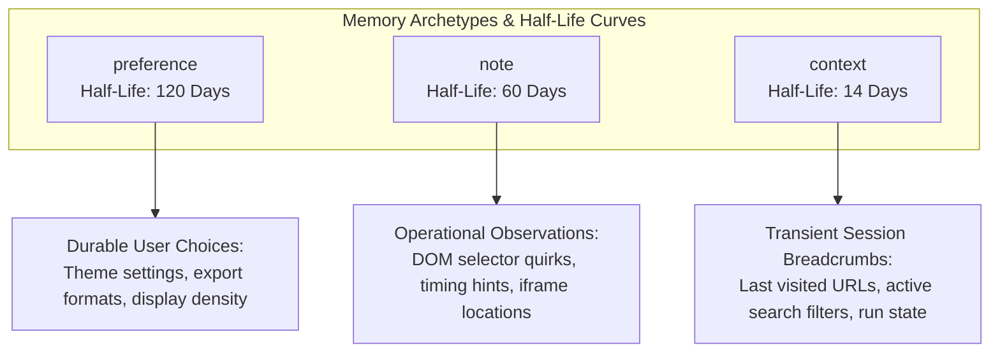
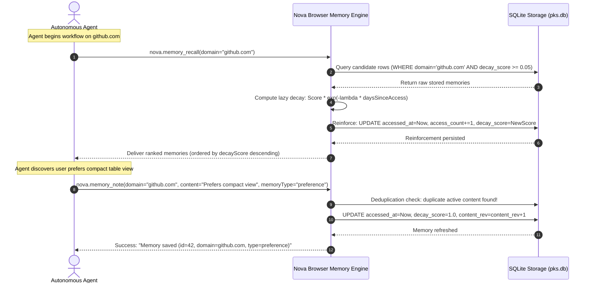

# Browser Memory

> [!NOTE]
> **Browser Memory** provides persistent, domain-bound contextual memory for autonomous agents in Nova AI Workspace. By combining three functional memory archetypes (**`preference`**, **`note`**, and **`context`**), a continuous mathematical exponential decay model, automatic deduplication merges, and hardcoded privacy exclusions, Browser Memory enables agents to remember user preferences and past session observations without cluttering prompt token budgets.

---

## 1. Executive Summary: Context Worth Keeping

In autonomous browser automation, agents repeatedly interact with complex websites where users have established habits, layout preferences, and workflow conventions:
* A user always prefers the compact table layout on GitHub and wants to review pull request comments before looking at code diffs.
* A corporate CRM dashboard requires waiting 500 ms after selecting a filter dropdown for an AJAX call to complete.
* An agent previously reached page 4 of an inventory search before a network disconnect interrupted the session.

Without persistent browser memory, the user must repeatedly explain these preferences in every single session, or the agent must repeatedly re-learn site quirks through trial and error.

**Browser Memory bridges this gap.** It acts as an episodic memory store scoped to specific web domains. Unlike static prompt instructions, Browser Memory features an **exponential decay model**: memories that are actively recalled remain fresh and prominent, while unused session details gracefully fade over time until pruned.

---

## 2. Knowledge Taxonomy in Nova

Browser Memory is a dedicated pillar of Nova's multi-layered knowledge architecture:

| Knowledge System | Scope | Core Question Answered | Primary MCP Tools |
| :--- | :--- | :--- | :--- |
| **Browser Memory** | Web Domain / Path | *What user preferences, behavioral habits, and past session context apply here?* | `nova.memory_note`, `nova.memory_recall`, `nova.memory_forget` |
| **[Domain Notes (Site Notes)](../domain-notes/README.md)** | Web Domain | *What human rules, warnings, or operational MUST-read constraints govern this site?* | `nova.domain_note`, `nova.domain_notes_list`, `nova.domain_note_ack`, `nova.domain_note_delete` |
| **[Operator Notes](../operator-notes/README.md)** | Workspace / Sandbox | *What global preferences, secrets, or environment guidelines apply machine-wide?* | `nova.operator_notes_store`, `nova.operator_notes_query` |
| **[Operational Knowledge (OK)](../operational-knowledge-ok/README.md)** | Live Tab / Target | *What is the active operational state of this target (login state, plan tier, model)?* | `nova.ok_observe`, `nova.ok_signal_schema` |
| **[PKS (Procedural Memory)](../phenomenological-knowledge-store-pks/README.md)** | Site / Platform | *How does this website function, what selectors work, and how are dialogs dismissed?* | `nova.pks_get`, `nova.pks_upsert`, `nova.phenomenon_apply` |
| **[Episodic Task Memory (ETM)](../episodic-task-memory-etm/README.md)** | Task & Run | *What multi-step task is currently underway, and what work units remain?* | `nova.task_match`, `nova.task_instance_create`, `nova.task_instance_progress` |

---

## 3. The Three Memory Archetypes

Browser Memory organizes stored knowledge into three functional archetypes, each assigned an optimized mathematical half-life:



| Memory Type | Half-Life ($T_{1/2}$) | Decay Constant ($\lambda$) | Operational Purpose |
| :--- | :---: | :---: | :--- |
| **`preference`** | **120 days** | $\approx 0.005776$ | **User Preferences:** Behavioral habits and interface choices (e.g. *„Prefers dark mode and compact table layout“*). Decays very slowly to preserve human habits across seasons. |
| **`note`** | **60 days** | $\approx 0.011552$ | **Operational Notes:** Explicit empirical observations recorded by agents or users (e.g. *„The save button is disabled until all inputs are blurred“*). |
| **`context`** | **14 days** | $\approx 0.049511$ | **Session Context:** Short-lived breadcrumbs and state snapshots (e.g. *„Last visited: github.com/pulls/42“*). Fades rapidly unless reinforced. |

---

## 4. End-to-End Recall & Reinforcement Flow



---

## 5. Complete MCP Tool Reference Suite

Browser Memory is managed via three dedicated tools in Nova's MCP tool bundle:

### 1. `nova.memory_note`
Saves a memory bound to a web domain and optional URL path pattern. Duplicate content on the same domain is automatically detected and merged.

| Parameter | Type | Required | Default | Description |
| :--- | :--- | :---: | :---: | :--- |
| `content` | `string` | **Yes** | — | What to remember (max 2,000 characters). Concise, actionable text. |
| `memoryType` | `string` | No | `"note"` | Memory archetype: `'note'`, `'preference'`, or `'context'`. |
| `domain` | `string` | No | Active Tab | Target domain (e.g. `"github.com"`). Defaults to active tab domain. |
| `urlPattern` | `string` | No | `null` | Optional URL path scope (e.g. `"/pulls/*"` or `"/billing"`). |

---

### 2. `nova.memory_recall`
Retrieves stored memories, sorted by decay-weighted relevance. Each recall hit reinforces the memory, updating its access timestamp and slowing future decay.

| Parameter | Type | Required | Default | Description |
| :--- | :--- | :---: | :---: | :--- |
| `domain` | `string` | No | `null` | Domain filter. If omitted, searches across all domains. |
| `query` | `string` | No | `null` | Substring search against memory content (wildcard-escaped). |
| `memoryType` | `string` | No | `null` | Filter by archetype: `'note'`, `'preference'`, or `'context'`. |
| `limit` | `integer` | No | `10` | Maximum results to return (range: $1$ to $50$). |
| `includeExpired` | `boolean` | No | `false` | If `true`, returns memories whose decay score has fallen below $0.05$. |

---

### 3. `nova.memory_forget`
Permanently deletes memories to honor user privacy requests. Requires at least one filter parameter. Deletions are irreversible.

| Parameter | Type | Required | Default | Description |
| :--- | :--- | :---: | :---: | :--- |
| `domain` | `string` | No | `null` | Delete all memories for this domain. |
| `memoryId` | `integer` | No | `null` | Delete a single memory by its unique database ID. |
| `memoryType` | `string` | No | `null` | Delete memories of this type (across all domains, or within domain). |
| `all` | `boolean` | No | `false` | Hard-wipe ALL browsing memories in the database. Use with care. |

---

## 6. Dynamic Task Guidance Surfacing

To eliminate redundant tool calls during task initiation, Nova's guidance engine automatically injects relevant domain memories into the agent's prompt during [`nova.get_instructions`](../../../mcp-reference/tools/app-shell-and-ui/nova-get-instructions.md):

```markdown
## Browser Memory
You have 3 stored memories for 'github.com':
- [preference] User prefers compact view and reviews PR comments first.
- [note] Search filter input #search requires waiting 300ms for debounce.
- [context] Last visited: github.com/joelaniol/nova/pulls

Use `nova.memory_recall(domain='github.com')` for more. Save new context with `nova.memory_note(content='...')`.
```

This zero-round-trip orientation ensures that models immediately adapt to user habits before dispatching their first navigation or interaction command.

---

## 7. Operational Invariants & Privacy Guardrails

1. **Sensitive Domain Auto-Exclusion:** Financial and healthcare domains containing patterns such as `bank`, `banking`, `pay`, `payment`, `health`, or `medical` are **permanently blocked** from memory storage.
2. **User-Configured Exclusions:** Operators can specify wildcard domain exclusion rules (e.g. `*.acme.corp`) in settings to prevent sensitive intranets from being stored.
3. **Hard-Delete Compliance:** All deletions via `nova.memory_forget` are permanent SQLite deletions without soft-delete flags, recovery logs, or staging buffers.
4. **Capacity Ceilings:**
   * Maximum content length: **2,000 characters** per memory.
   * Maximum memories per domain: **500 entries**, deterministically capped using window function ordering.
5. **Cadence-Gated Maintenance:** Database pruning is throttled behind a **24-hour cadence gate** (`bm_prune_last_ms`), ensuring zero CPU or disk saturation during continuous agent work.
6. **Thread-Safe Worker Isolation:** All database transactions execute on Nova's dedicated SQLite worker thread, guaranteeing that background pruning never interrupts UI or browser tab performance.

---

## 8. Deep-Dive Guides

For detailed mathematical derivations, query implementations, and privacy architectures, explore the sub-guides:

* **[Decay Scoring, Reinforcement & Retention Architecture](decay-scoring-and-retention.md)** — Mathematical decay formulas, half-life parameter analysis, lazy score evaluation, and atomic multi-phase pruning.
* **[Deduplication, Content Revisions & Query Pipeline](deduplication-and-query-pipeline.md)** — Content truncation, deduplication merges, revision counters, safe SQL wildcard searches, and dynamic instruction surfacing.
* **[Privacy, Exclusion Policies & Storage Architecture](privacy-exclusion-and-storage.md)** — Sensitive domain patterns, navigation auto-capture, hard-delete semantics, SQLite schema definition, and WinUI 3 settings.

---

[Learning Overview](../README.md) · [All Core Features](../../README.md)
