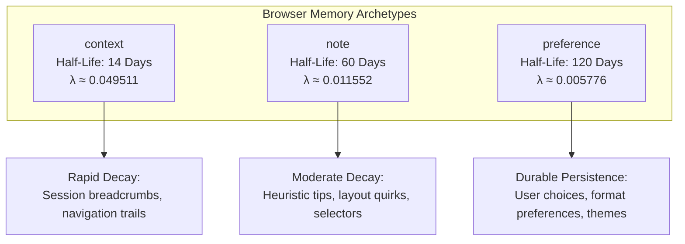
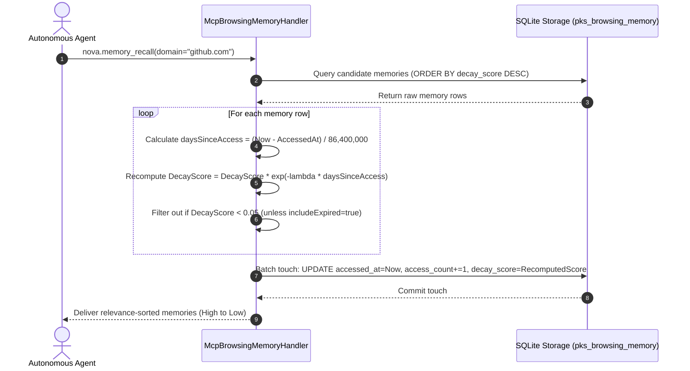
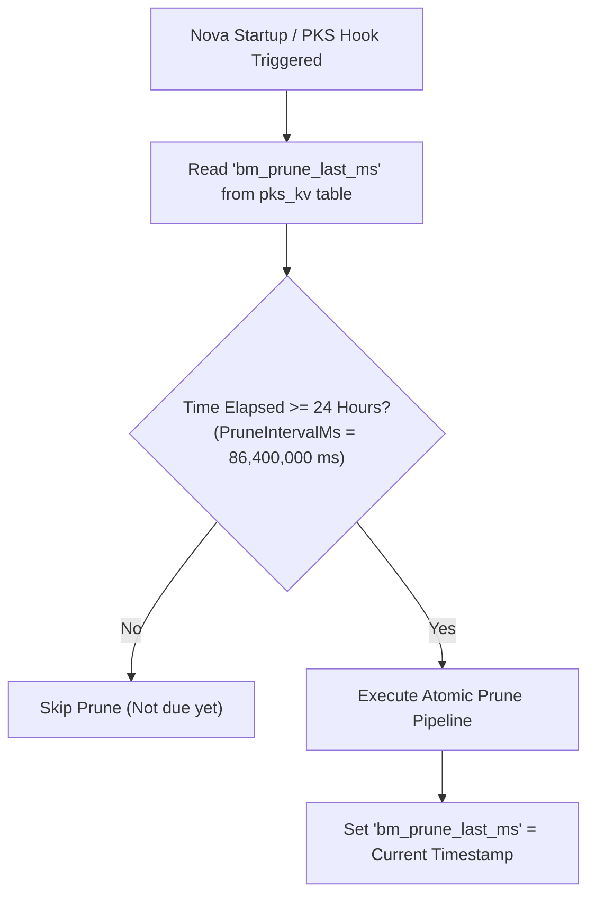
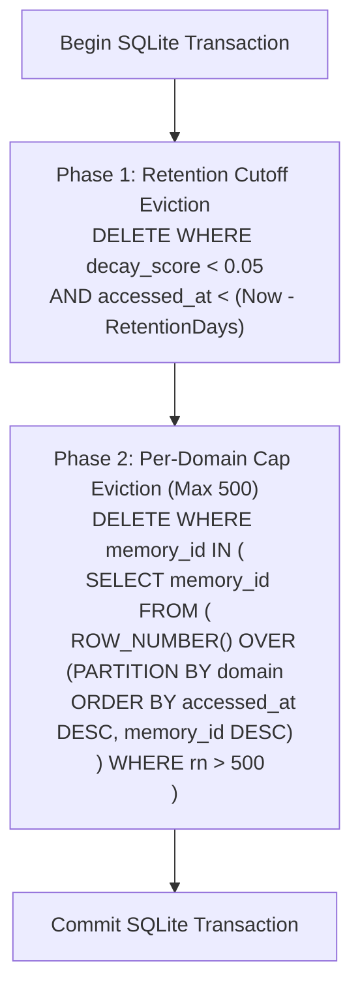

# Decay Scoring, Reinforcement & Retention Architecture

> [!NOTE]
> This guide details the mathematical decay and lifecycle retention engine of Browser Memory in Nova AI Workspace: exponential decay formulas, half-life parameters across memory types, lazy score evaluation, reinforcement via access recency, the 24-hour maintenance cadence gate, and atomic multi-phase pruning.

---

## 1. The Exponential Decay Model

In browser automation, not all accumulated knowledge remains relevant indefinitely:
* A session context snapshot (e.g. *„user was on page 4 of search results“*) becomes obsolete within days.
* An explicit site observation (e.g. *„table rows require double-click to edit“*) remains useful for months.
* A user behavioral preference (e.g. *„user prefers the compact table layout and dark mode“*) can stay relevant for a year or longer.

Rather than relying on arbitrary hard cutoffs that cause sudden knowledge drop-offs, Browser Memory models knowledge relevance as a continuous **exponential decay process**:

$$\text{Relevance}(t) = \text{Score}_0 \times e^{-\lambda \cdot \Delta t}$$

Where:
* $\text{Score}_0$: The initial decay score at creation or last reset (defaults to $1.0$).
* $\Delta t$: The elapsed time in fractional days since the memory was last accessed or reinforced:
  $$\Delta t = \frac{\text{NowMs} - \text{AccessedAtMs}}{86{,}400{,}000\text{ ms/day}}$$
* $\lambda$: The decay constant derived directly from the memory type's half-life ($T_{1/2}$):
  $$\lambda = \frac{\ln(2)}{T_{1/2}} \approx \frac{0.69314718056}{T_{1/2}}$$

---

## 2. Memory Types & Half-Life Parameters

Nova categorizes all stored browser memories into three distinct functional archetypes, each assigned a tailored half-life:

| Memory Type | Half-Life ($T_{1/2}$) | Decay Constant ($\lambda$) | Primary Purpose & Typical Examples |
| :--- | :---: | :---: | :--- |
| **`preference`** | **120 days** | $\approx 0.005776$ | **User Behavioral Preferences:** Stored choices such as *„Prefers CSV export over JSON“*, *„Uses dense layout on GitHub“*, or *„Always dismisses sidebar on billing dashboard“*. |
| **`note`** | **60 days** | $\approx 0.011552$ | **Explicit Operational Observations:** Notes recorded by agents or users such as *„Search input is dynamically injected into iframe #main“* or *„Requires 2FA code via SMS“*. |
| **`context`** | **14 days** | $\approx 0.049511$ | **Short-Lived Session State:** Ephemeral context entries such as *„Last visited: portal.acme.com/billing/invoices“* or *„Reviewing pull request #42“*. |

---

### Comparative Decay Trajectory Over Time

The table below illustrates how the relevance score degrades over time when a memory is **not** accessed or reinforced:

| Elapsed Time ($\Delta t$) | `preference` ($T_{1/2} = 120\text{d}$) | `note` ($T_{1/2} = 60\text{d}$) | `context` ($T_{1/2} = 14\text{d}$) | Operational Interpretation |
| :---: | :---: | :---: | :---: | :--- |
| **Day 0** | **1.000** | **1.000** | **1.000** | Freshly authored or recently accessed memory. |
| **Day 7** | 0.960 | 0.922 | 0.707 | Initial drift; all memories remain prominently active. |
| **Day 14** | 0.922 | 0.851 | **0.500** | Context memories reach exactly half-life. |
| **Day 30** | 0.841 | 0.707 | 0.228 | Context memories begin to sink below active recall rank. |
| **Day 60** | 0.707 | **0.500** | 0.052 | Notes reach half-life; unaccessed context entries approach expiration. |
| **Day 90** | 0.595 | 0.354 | < 0.020 *(Expired)* | Context memories are dropped from active recall ($< 0.05$). |
| **Day 120** | **0.500** | 0.250 | < 0.005 *(Expired)* | Preferences reach half-life; notes decay to 25%. |
| **Day 180** | 0.354 | 0.125 | < 0.001 *(Expired)* | Preferences maintain strong baseline visibility. |
| **Day 240** | 0.250 | 0.063 | *(Purged)* | Preferences decay to 25%; notes near expiration. |
| **Day 360** | 0.125 | < 0.016 *(Expired)* | *(Purged)* | Preferences remain retrievable if not purged by retention cutoff. |

---

## 3. Lazy Decay Evaluation & Access Reinforcement

Persisting recalculations for thousands of database rows on a real-time schedule would introduce severe CPU and disk I/O overhead. Nova solves this by combining **Lazy Score Recomputation** with **Eager Reinforcement on Recall**:

### The Reinforcement Effect
* **Access Timestamp Refresh:** Every time a memory is returned during a `nova.memory_recall` operation, its `accessed_at` timestamp is updated to the current millisecond (`NowMs()`).
* **Interaction Counter Increment:** The memory's `access_count` integer is incremented by 1.
* **Score Floor & Persistence:** The newly recomputed score is written back to the SQLite table. By updating `accessed_at` to the current timestamp, the decay timer effectively resets for the next time delta calculation.
* **Result:** Memories that are actively recalled by agents during work cycles maintain high relevance scores and resist decay, naturally distinguishing essential recurring instructions from one-off notes.

---

## 4. The 24-Hour Maintenance Cadence Gate

To prevent database bloat without stalling interactive browser navigation, Nova executes background pruning behind a strict cadence gate:

### Cadence Contract Invariants
1. **Shared Cadence Storage:** The last execution timestamp is tracked in the persistent key-value store (`pks_kv`) under the key `bm_prune_last_ms`.
2. **24-Hour Frequency:** Pruning executes at most once every 24 hours (`24 * 60 * 60 * 1000` ms), ensuring application launches or background hooks do not repeatedly scan the database.
3. **Thread-Safe Dispatch:** Background maintenance dispatches through Nova's dedicated asynchronous database worker thread, completely shielding the UI thread and active web tabs from database locks.

---

## 5. Multi-Phase Atomic Pruning Pipeline

When the 24-hour cadence gate opens, Nova's maintenance engine runs an atomic, two-phase cleanup within a **single SQLite transaction**:

### Phase 1: Expired Retention Eviction
* **Decay Threshold:** Memories whose decayed relevance score has dropped below the threshold of **`0.05`** are candidates for deletion.
* **Retention Window (`BrowsingMemoryRetentionDays`):** Configurable in **Settings → AI & agents → Access & rules → Browser memory** (default: **90 days**, configurable from 7 to 365 days).
* **Eviction Condition:** A memory is deleted only if its score is $< 0.05$ **AND** it has not been accessed within the retention cutoff window (`accessed_at < Now - RetentionDays`). This grace period allows recently expired memories to be revived if recalled with `includeExpired = true`.

### Phase 2: Per-Domain Cap Eviction (Max 500 Memories)
* **Storage Protection:** To prevent automated loops or high-frequency navigations from filling the database with unbounded entries on a single domain, Nova enforces a hard ceiling of **500 memories per domain** (`MaxPerDomain = 500`).
* **Deterministic Eviction:** If a domain exceeds 500 entries, Nova ranks memories using a SQL window function partitioned by domain:
  $$\text{ROW\_NUMBER}() \text{ OVER (PARTITION BY domain ORDER BY accessed\_at DESC, memory\_id DESC)}$$
* **Newest-First Retention:** The 500 most recently accessed entries are preserved; older rows exceeding rank 500 are deleted in bulk.

---

## Related Documentation

* **[Browser Memory Overview](README.md)** — Architecture hub, knowledge taxonomy, and MCP tools.
* **[Deduplication & Query Pipeline](deduplication-and-query-pipeline.md)** — Deduplication merges, full-text queries, and instruction hints.
* **[Privacy, Exclusion & Storage Architecture](privacy-exclusion-and-storage.md)** — Sensitive domain patterns, auto-capture, and SQLite schema.
* **[Domain Notes Architecture](../domain-notes/README.md)** — Deterministic site directives with dual-mode acknowledgment.
