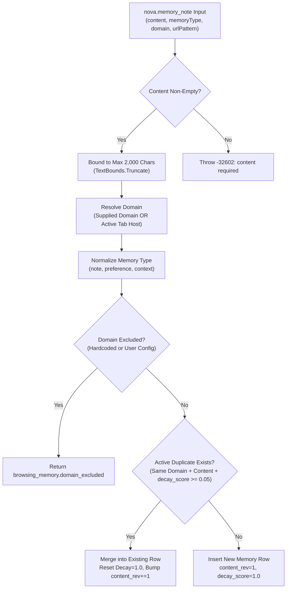
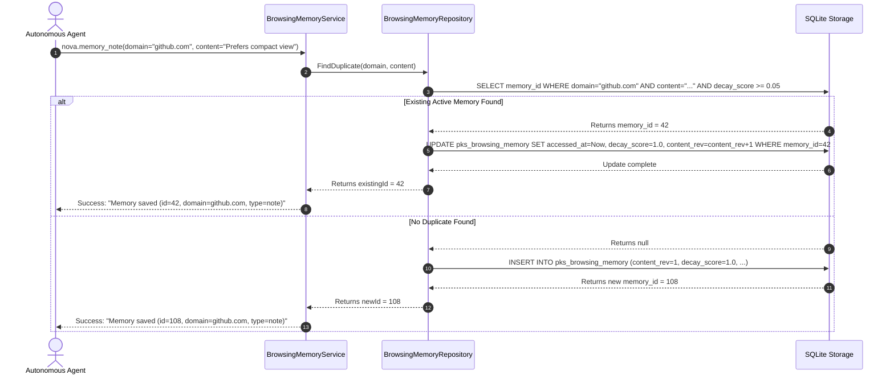
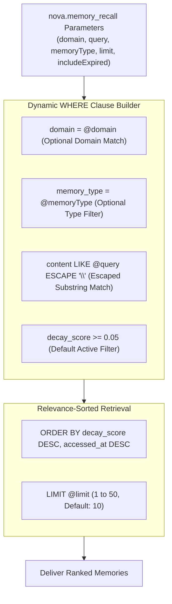
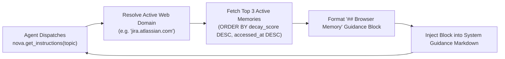

# Deduplication, Content Revisions & Query Pipeline

> [!NOTE]
> This guide details the data ingestion, duplicate prevention, and query mechanics of Browser Memory in Nova AI Workspace: content bounds, deduplication merges, revision counters, safe wildcard searches, and automatic guidance injection via dynamic task hints.

---

## 1. Content Ingestion & String Bounds

When an autonomous agent or user records a memory using the [`nova.memory_note`](../../../mcp-reference/tools/task-memory/nova-memory-note.md) MCP tool, Nova processes the input through strict validation and boundary guards:



### Ingestion Validation Guards

1. **Content Length Ceiling (2,000 Chars):** Input content is limited to **2,000 characters** (`MaxMemoryContentChars = 2000`). If an agent passes a large buffer, Nova cleanly truncates the text using `TextBounds.Truncate`, preserving essential context without bloating the SQLite database.
2. **Implicit Domain Resolution:** If `domain` is omitted, Nova automatically resolves the domain of the active browser tab. If no tab is active and no domain was supplied, the call is rejected with `-32602 invalid_params`.
3. **URL Pattern Scoping:** Authors can optionally supply `urlPattern` (e.g. `"/pulls/*"` or `"/settings/billing"`). This allows memories to be scoped to specific sections of a large enterprise web application.
4. **Memory Type Normalization:** Validates against the three canonical archetypes: `'note'`, `'preference'`, or `'context'`. Unrecognized types default to `'note'`.

---

## 2. Duplicate Detection & Revision Merging

In iterative browser tasks, agents frequently rediscover the same preference or observation across consecutive steps (e.g. repeatedly saving *„The export button is #btn-download“*). Creating a new database row for each occurrence would clutter search results and waste storage.

Nova enforces an **Automatic Deduplication and Revision Contract**:



### The Dedup Merge Invariant
* **Relevance Reset:** When an existing active memory is re-saved, its `decay_score` is immediately reset to **`1.0`**, and `accessed_at` is updated to the current timestamp.
* **Revision Tracking (`content_rev`):** Nova increments the integer column `content_rev` by 1. This revision counter allows auditing and inspection of how frequently a particular fact has been reinforced over time.
* **Idempotent Return:** The original `memory_id` is preserved and returned to the caller, preventing reference fragmentation.

---

## 3. The Multi-Dimensional Query Pipeline

When agents search for relevant context using [`nova.memory_recall`](../../../mcp-reference/tools/task-memory/nova-memory-recall.md), Nova evaluates queries across multiple orthogonal dimensions:



### Query Parameter Reference

| Parameter | Type | Required | Default | Functional Description |
| :--- | :--- | :---: | :---: | :--- |
| `domain` | `string` | No | `null` | Filters memories to a specific host (e.g. `"github.com"`). If omitted, searches across all domains. |
| `query` | `string` | No | `null` | Free-text substring search against memory content. |
| `memoryType` | `string` | No | `null` | Filters by functional archetype: `'note'`, `'preference'`, or `'context'`. |
| `limit` | `integer` | No | `10` | Maximum results to return (bounded between $1$ and $50$). |
| `includeExpired` | `boolean` | No | `false` | If `true`, returns memories whose decay score has fallen below $0.05$. |

---

### Safe Full-Text Substring Search

When the `query` parameter is provided, Nova executes a SQL `LIKE` search. In raw SQL, user-supplied queries containing characters like `%`, `_`, or `\` can cause unintended wildcard expansion or query broadening.

Nova guarantees search safety by escaping all special wildcard characters prior to query execution:

```csharp
// Internal SQL wildcard escaping pattern
var escaped = query.Replace(@"\", @"\\")
                   .Replace("%", @"\%")
                   .Replace("_", @"\_");
conditions.Add(@"content LIKE @query ESCAPE '\'");
parameters.Add(("@query", $"%{escaped}%"));
```

This guarantees that searching for `user_name%` matches the exact string literal `user_name%` rather than matching any single character for `_` and any string for `%`.

---

## 4. Structured Output Format

`nova.memory_recall` delivers results formatted for both human operators and LLM ingestion:

```json
{
  "content": [
    {
      "type": "text",
      "text": "{\"memories\":[{\"memoryId\":42,\"domain\":\"github.com\",\"urlPattern\":\"/pulls/*\",\"memoryType\":\"preference\",\"content\":\"Prefers compact table view and checks PR reviews first.\",\"source\":\"agent\",\"decayScore\":0.922,\"accessCount\":4}],\"count\":1}"
    }
  ],
  "structuredContent": {
    "memories": [
      {
        "memoryId": 42,
        "domain": "github.com",
        "urlPattern": "/pulls/*",
        "memoryType": "preference",
        "content": "Prefers compact table view and checks PR reviews first.",
        "source": "agent",
        "decayScore": 0.922,
        "accessCount": 4
      }
    ],
    "count": 1
  }
}
```

If no memories match the criteria, Nova returns a helpful discovery hint:
```text
No browsing memories found for 'github.com'. Use nova.memory_note to save context for next session.
```

---

## 5. Dynamic Guidance Surfacing (`nova.get_instructions`)

Autonomous agents frequently begin complex tasks without knowing that previous sessions have already recorded relevant domain preferences. Forcing the agent to proactively query `nova.memory_recall` on every single web navigation wastes round-trips and tool-call tokens.

Nova solves this through **Automatic Guidance Surfacing**:



### Injected Guidance Block Structure

When an agent calls `nova.get_instructions` while navigated to a domain with active memories, Nova automatically appends a formatted memory section:

```markdown
## Browser Memory
You have 3 stored memories for 'jira.atlassian.com':
- [preference] User prefers the Kanban board view over the backlog list.
- [note] The sprint selector dropdown requires waiting 500ms for network load.
- [context] Last visited: jira.atlassian.com/secure/RapidBoard.jspa?rapidView=108

Use `nova.memory_recall(domain='jira.atlassian.com')` for more. Save new context with `nova.memory_note(content='...')`.
```

### Architectural Benefits
1. **Zero-Round-Trip Discovery:** The model receives critical domain preferences in its very first orientation call before taking any actions on the page.
2. **Top-3 Bounded Selection:** Only the 3 highest-ranking memories (`limit: 3`) are surfaced, keeping the instruction prompt compact.
3. **Decay-Gated Filtering:** Only memories with `decay_score >= 0.05` are eligible for automatic surfacing; expired memories are completely filtered out.

---

## Related Documentation

* **[Browser Memory Overview](README.md)** — Architecture hub, knowledge taxonomy, and MCP tools.
* **[Decay Scoring & Retention Architecture](decay-scoring-and-retention.md)** — Mathematical decay formulas, half-life parameters, and pruning.
* **[Privacy, Exclusion & Storage Architecture](privacy-exclusion-and-storage.md)** — Sensitive domain patterns, auto-capture, and SQLite schema.
* **[Domain Notes Architecture](../domain-notes/README.md)** — Deterministic site directives with dual-mode acknowledgment.
