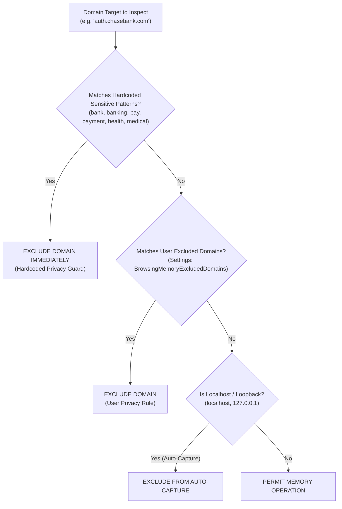
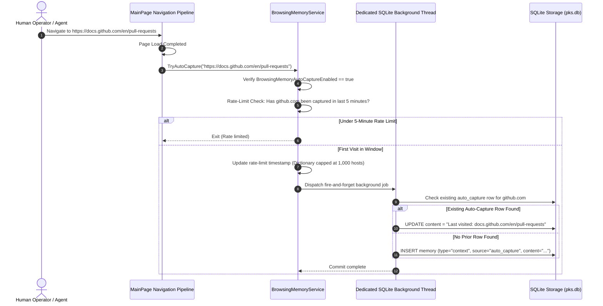
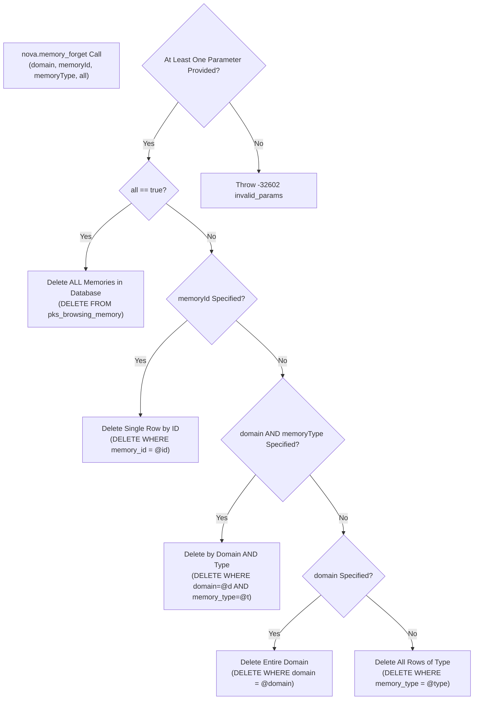
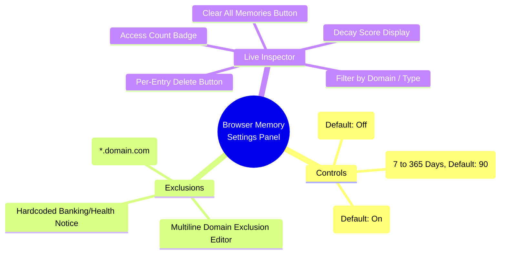

# Privacy, Exclusion Policies & Storage Architecture

> [!NOTE]
> This guide details the privacy safeguards, automated navigation capture, permanent deletion semantics, SQLite storage architecture, and settings configuration of Browser Memory in Nova AI Workspace.

---

## 1. Privacy Boundaries & Domain Exclusion

Browser Memory preserves contextual observations and user preferences across browsing sessions. However, capturing data on financial institutions, payment gateways, healthcare portals, or enterprise intranets poses serious privacy risks.

To guarantee user privacy, Nova implements a multi-layered **Domain Exclusion Engine**:



---

### Layer 1: Hardcoded Sensitive Patterns

Nova maintains an immutable set of sensitive domain keywords that are **always blocked automatically**, regardless of user settings or agent requests:

| Sensitive Keyword Pattern | Target Risk Class | Protected Examples Blocked Automatically |
| :--- | :--- | :--- |
| `bank`, `banking` | Financial & Banking Institutions | `onlinebanking.chase.com`, `deutsche-bank.de`, `bankofamerica.com` |
| `pay`, `payment` | Payment Processors & Checkout Portals | `paypal.com`, `pay.stripe.com`, `payment.adyen.com`, `applepay.com` |
| `health`, `medical` | Healthcare & Personal Medical Portals | `myhealth.portal.org`, `telehealth.com`, `medicalrecords.net` |

If an agent attempts to record a memory for an excluded host using `nova.memory_note`, Nova rejects the write cleanly without throwing an unhandled exception:

```json
{
  "content": [
    {
      "type": "text",
      "text": "Memory could not be saved for domain 'pay.stripe.com'. The domain may be excluded by privacy policy."
    }
  ],
  "structuredContent": {
    "ok": false,
    "saved": false,
    "domain": "pay.stripe.com",
    "memoryType": "preference",
    "reasonCode": "browsing_memory.domain_excluded"
  },
  "isError": true
}
```

---

### Layer 2: User-Configured Domain Exclusions

Operators can define custom domain exclusion lists in **Settings → AI & agents → Access & rules → Browser memory**:
* **Exact & Substring Matching:** Entering `internal-wiki.corp` blocks any host containing that substring.
* **Wildcard Subdomain Syntax (`*.example.com`):** Entering `*.acme.corp` matches both apex `acme.corp` and all subdomains (e.g. `jira.acme.corp`, `git.acme.corp`).
* **Zero Disk I/O Hot-Path Evaluation:** Exclusion checks on navigation paths use cached settings snapshots in memory, avoiding redundant disk reads during page loads.

---

## 2. Optional Navigation Auto-Capture

Nova includes an optional, passive background capture engine that records page navigation context without agent intervention:



### Auto-Capture Invariants & Safeguards
1. **Disabled by Default (`BrowsingMemoryAutoCaptureEnabled = false`):** Auto-capture is strictly opt-in and requires explicit activation by the user.
2. **Zero DOM Scraping:** Auto-capture records **only domain and URL path** (e.g. `"Last visited: docs.github.com/en/actions"`). It never extracts DOM text, page inputs, form data, cookies, or perceive snapshots.
3. **5-Minute Rate-Limiting:** Consecutive page transitions on the same domain within 5 minutes are ignored (`AutoCaptureIntervalMs = 300,000 ms`), preventing navigation spam.
4. **Bounded Memory Tracking (1,000 Hosts):** The in-memory tracking dictionary is capped at 1,000 hostnames (`AutoCaptureDomainCap = 1000`), protecting against memory leaks during massive web crawler runs.
5. **Single Row Per Domain:** Nova searches for existing `auto_capture` entries on the target domain and updates the existing row in place rather than creating duplicate history records.
6. **Fire-and-Forget Asynchrony:** Captures execute asynchronously on the background database thread, ensuring zero impact on UI responsiveness or web rendering speeds.

---

## 3. Hard-Delete Semantics (`nova.memory_forget`)

To comply with data protection regulations and honor operator instructions, Nova provides permanent deletion capabilities via the [`nova.memory_forget`](../../../mcp-reference/tools/task-memory/nova-memory-forget.md) tool:



### Hard-Delete Operational Invariants

1. **Immediate Irreversible Deletion:** All deletions are executed directly against the underlying SQLite table. Nova maintains **no soft-delete markers, no recycling bin, and no recovery logs** for deleted memories.
2. **Deterministic Status Reporting:**
   * **`status = "deleted"` (`ok = true`):** One or more rows were successfully deleted.
   * **`status = "noop"` (`ok = true`):** The caller requested `all = true`, but the table was already empty.
   * **`status = "not_found"` (`ok = false`):** A targeted delete (`memoryId`, `domain`, or `memoryType`) matched zero rows.
3. **Structured Response Payload:**
   ```json
   {
     "content": [{ "type": "text", "text": "Deleted 3 browsing memories." }],
     "structuredContent": {
       "ok": true,
       "status": "deleted",
       "reasonCode": null,
       "deleted": 3,
       "domain": "old-site.com",
       "memoryId": null,
       "memoryType": null,
       "all": false
     }
   }
   ```

---

## 4. SQLite Storage Architecture

Browser Memory is persisted within Nova's centralized SQLite knowledge database (`pks.db`) located in the local profile directory:

$$\text{Path: } \%LOCALAPPDATA\%\backslash\text{NovaBrowser}\backslash\text{pks.db}$$

### Table Schema Definition (`pks_browsing_memory` — Schema v21)

```sql
CREATE TABLE IF NOT EXISTS pks_browsing_memory (
    memory_id     INTEGER PRIMARY KEY AUTOINCREMENT,
    domain        TEXT NOT NULL,
    url_pattern   TEXT,
    memory_type   TEXT NOT NULL DEFAULT 'note',
    content       TEXT NOT NULL,
    source        TEXT NOT NULL DEFAULT 'agent',
    created_at    INTEGER NOT NULL,
    accessed_at   INTEGER NOT NULL,
    access_count  INTEGER NOT NULL DEFAULT 0,
    decay_score   REAL NOT NULL DEFAULT 1.0,
    content_rev   INTEGER NOT NULL DEFAULT 1
);
```

### Database Indexing Strategy

Nova maintains four targeted B-Tree indexes to ensure high-performance query execution even when managing tens of thousands of memories:

```sql
-- Fast domain-scoped queries and auto-capture lookups
CREATE INDEX IF NOT EXISTS idx_bm_domain ON pks_browsing_memory(domain);

-- Type-filtered searches and bulk type deletions
CREATE INDEX IF NOT EXISTS idx_bm_type ON pks_browsing_memory(memory_type);

-- Accelerated decay pruning and threshold filtering (decay_score >= 0.05)
CREATE INDEX IF NOT EXISTS idx_bm_decay ON pks_browsing_memory(decay_score);

-- Recency sorting and retention window cutoff evaluation
CREATE INDEX IF NOT EXISTS idx_bm_accessed ON pks_browsing_memory(accessed_at);
```

---

## 5. UI Configuration & Live Management

Operators can inspect and configure Browser Memory in Nova's native settings:



* **Access Path:** **Settings → AI & agents → Access & rules → Browser memory**.
* **Live Inspector:** Renders all currently stored memories in real time, displaying domain, type pill, content preview, decay score (e.g. `0.922`), and access count.
* **Granular Control:** Operators can delete individual memories directly from the UI or trigger a full wipe using the **Clear all memories** button.

---

## Related Documentation

* **[Browser Memory Overview](README.md)** — Architecture hub, knowledge taxonomy, and MCP tools.
* **[Decay Scoring & Retention Architecture](decay-scoring-and-retention.md)** — Mathematical decay formulas, half-life parameters, and pruning.
* **[Deduplication & Query Pipeline](deduplication-and-query-pipeline.md)** — Deduplication merges, full-text queries, and instruction hints.
* **[Operator Notes Architecture](../operator-notes/README.md)** — Workspace-level instructions and global secrets.
