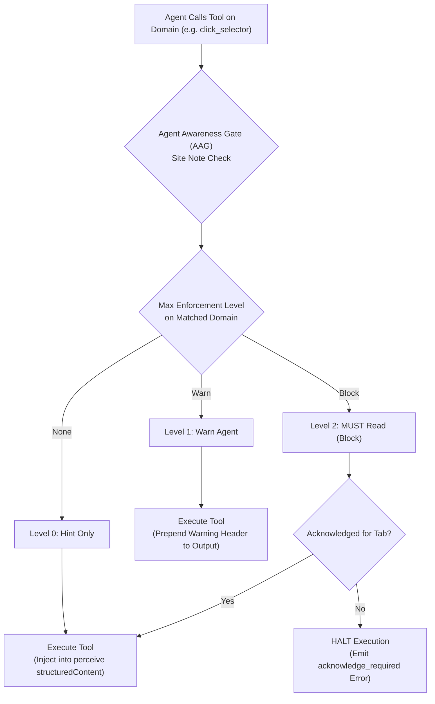
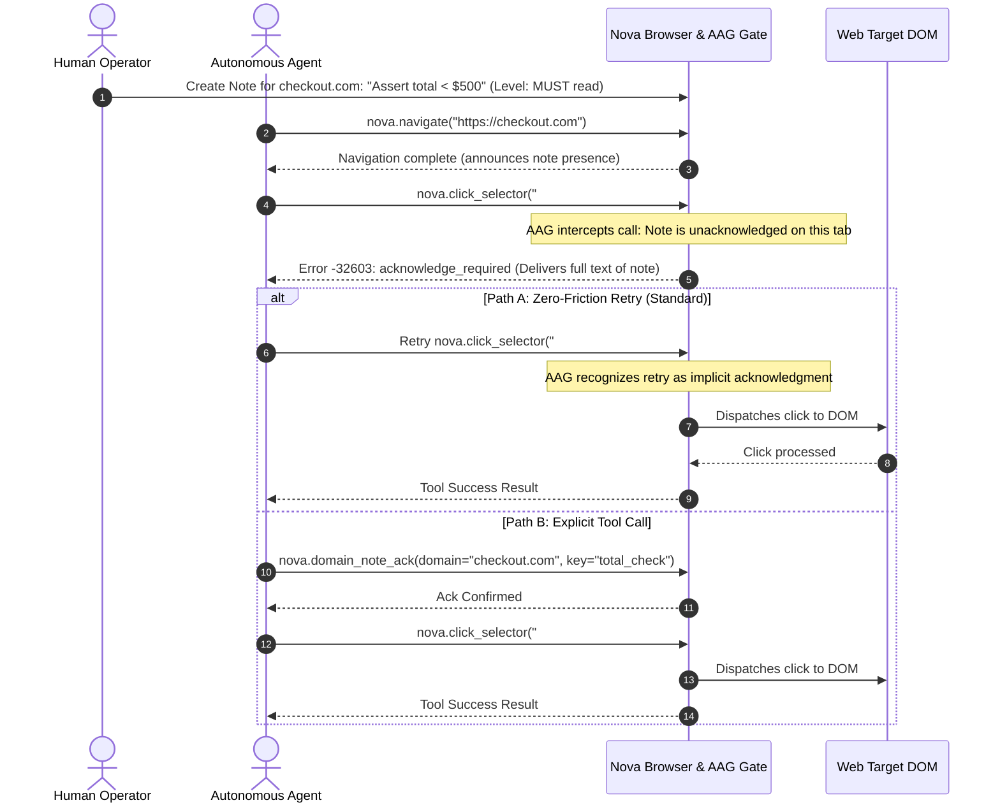

# Domain Notes (Site Notes)

> [!NOTE]
> **Domain Notes** (presented in the UI as **Site notes**) preserve persistent website instructions, operational runbooks, and behavioral constraints across autonomous agent sessions in Nova AI Workspace. By combining dual-scope isolation (global vs sandbox), three enforcement levels (**Hint only**, **Warn the agent**, and **MUST read**), and explicit human authorship protection, Domain Notes provide operators with direct control over agent behavior on specific websites.

---

## 1. Executive Summary: Intentional Guidance vs. Heuristic Memory

In autonomous browser automation, agents frequently interact with complex, high-stakes web interfaces (such as billing portals, production dashboards, and corporate CRMs). Without persistent, host-bound directives:

* **Repetitive Mistakes:** An agent in session A learns that a particular table requires a specific search filter to prevent page crashes, but an agent in session B must painfully rediscover that constraint from scratch.
* **Uncontrolled Actions:** Agents may execute destructive actions (e.g. creating test records, deleting live accounts, or clicking express checkout buttons) that the human user specifically wanted to forbid.
* **Prompt Clutter:** Manually injecting instructions for dozens of websites into an agent's system prompt exhausts token budgets and degrades reasoning quality.

Domain Notes bridge this gap by binding rules directly to the website's normalized domain. When an agent visits the site, Nova evaluates the relevant notes and delivers them at the required enforcement intensity.

---

## 2. Knowledge Taxonomy in Nova

Domain Notes form an essential component of Nova's multi-tiered knowledge architecture:

| Knowledge System | Scope | Core Question Answered | Primary MCP Tools |
| :--- | :--- | :--- | :--- |
| **Domain Notes (Site Notes)** | Web Host / Domain | *What human rules, warnings, or operational tips govern this specific website?* | `nova.domain_note`, `nova.domain_notes_list`, `nova.domain_note_ack`, `nova.domain_note_delete` |
| **[Operator Notes](../operator-notes/README.md)** | Workspace / Sandbox | *What global preferences, secrets, or environment guidelines apply regardless of website?* | `nova.operator_notes_store`, `nova.operator_notes_query` |
| **[Operational Knowledge (OK)](../operational-knowledge-ok/README.md)** | Live Tab / Target | *What is the active operational state of this target (login state, plan tier, model)?* | `nova.ok_observe`, `nova.ok_signal_schema` |
| **[PKS (Procedural Memory)](../phenomenological-knowledge-store-pks/README.md)** | Site / Platform | *How does this website function, what selectors work, and how are dialogs dismissed?* | `nova.pks_get`, `nova.pks_upsert`, `nova.phenomenon_apply` |
| **[Browser Memory](../browser-memory/README.md)** | Web Domain | *What unstructured user notes and preferences should be recalled for this domain?* | `nova.memory_note`, `nova.memory_recall`, `nova.memory_forget` |
| **[Episodic Task Memory (ETM)](../episodic-task-memory-etm/README.md)** | Task & Run | *What multi-step task is currently underway, and what work units remain?* | `nova.task_match`, `nova.task_instance_create`, `nova.task_instance_progress` |

---

## 3. The 3-Tier Delivery Architecture

Nova provides three distinct delivery intensities:



| Level | Numerical Value | Execution Impact | Behavior |
| :--- | :---: | :--- | :--- |
| **Hint only** | `None (0)` | **Non-blocking** | Injected as inspection context during [`nova.perceive`](../../../mcp-reference/tools/dom-and-reading/nova-perceive.md) calls. |
| **Warn the agent** | `Warn (1)` | **Non-blocking** | Tool executes normally, but a prominent `[DOMAIN NOTE WARNING]` header is prepended to the tool output. |
| **MUST read** | `Block (2)` | **Blocking** | Halts tool execution immediately with an `acknowledge_required` error until acknowledged by the agent. |

---

## 4. End-to-End Acknowledgment Flow



---

## 5. Complete MCP Tool Reference Suite

Domain Notes are managed via four dedicated tools registered in Nova's `system_tools` bundle:

### 1. `nova.domain_note`
Creates or updates a note scoped to a specific domain and optional sandbox.

| Parameter | Type | Required | Default | Description |
| :--- | :--- | :---: | :--- | :--- |
| `domain` | `string` | **Yes** | — | Web domain or hostname (e.g. `github.com`). |
| `key` | `string` | **Yes** | — | Unique title/identifier for the note (max 50 chars). |
| `value` | `string` | **Yes** | — | Note content or instruction (max 100,000 chars). |
| `enforcement` | `string` | No | `"none"` | Enforcement level: `'none'`, `'warn'`, or `'block'`. |
| `sandboxId` | `string` | No | `null` | Ephemeral letter identifier (e.g. `"A"`). If set, requires `sandboxRef`. |
| `sandboxRef` | `string` | No | `null` | Immutable Persistent UID of the target sandbox. |
| `repeatMinutes` | `integer` | No | `null` | Re-acknowledgment time interval in minutes (`0` = never repeat). |
| `repeatToolCalls`| `integer` | No | `null` | Re-acknowledgment interaction interval in tool calls (`0` = never repeat). |

---

### 2. `nova.domain_notes_list`
Retrieves stored notes for a target domain and sandbox scope.

| Parameter | Type | Required | Default | Description |
| :--- | :--- | :---: | :--- | :--- |
| `domain` | `string` | **Yes** | — | Target domain or hostname. |
| `scope` | `string` | No | `"current_sandbox"` | Retrieval scope: `'current_sandbox'`, `'global'`, `'all'`, or `'orphaned'`. |
| `sandboxId` | `string` | No | `null` | Optional explicit sandbox letter identifier. |
| `sandboxRef` | `string` | No | `null` | Optional explicit sandbox Persistent UID. |

---

### 3. `nova.domain_note_ack`
Explicitly acknowledges a `Block`-level note for the active tab context.

```json
{
  "domain": "portal.example.com",
  "key": "mandatory_export_rules",
  "targetId": "active"
}
```

---

### 4. `nova.domain_note_delete`
Deletes a domain note within a specified sandbox or global scope.

```json
{
  "domain": "portal.example.com",
  "key": "temporary_layout_fix",
  "scope": "current_sandbox"
}
```

---

## 6. Operational Invariants & Security Boundaries

1. **Subdomain Isolation Invariant:** Parent domain notes appear as inspection hints on subdomains, but **never enforce MUST-read blocks** on subdomains. A note on `acme.com` will not halt execution on `portal.acme.com`.
2. **Multi-Tenant Protection:** Multi-tenant root domains (e.g. `github.io`, `vercel.app`) never inherit parent domain fallback notes across distinct tenant subdomains.
3. **User-Note Override Protection:** Notes authored by the human user (`Source = User`) cannot be overwritten or deleted by an agent without interactive confirmation via the `agent.user_note_override` permission gate.
4. **Source Spoofing Prohibition:** All notes written through the MCP pipeline are enforced as `Source = Agent`. An agent cannot mark its own notes as written by the user.
5. **Bulk-Acknowledgment Semantic:** When multiple `Block` notes exist on a domain, a single retry or single `nova.domain_note_ack` clears the **entire set** of pending notes for that tab, eliminating sequential block cycles.
6. **Deadlock Prevention:** The four domain note administrative tools (`nova.domain_note`, `nova.domain_note_ack`, `nova.domain_notes_list`, `nova.domain_note_delete`) are **exempt from the site-note gate**, preventing circular execution deadlocks.

---

## 7. Deep-Dive Guides

For detailed specifications, schemas, and implementation mechanics, explore the sub-guides:

* **[Delivery Levels, Dual-Mode Acknowledgment & AAG Enforcement](delivery-levels-and-aag-enforcement.md)** — The three delivery levels, AAG gate evaluation, retry vs tool ack, bulk-acknowledgment, and tool exemptions.
* **[Scoping, Host Normalization & Re-Acknowledgment Policies](scoping-normalization-and-repeat-policies.md)** — Host normalization, eTLD+1 fallback, sandbox scoping, heuristic scope advisor, and repeat policies.
* **[Authorship, Override Permissions & Storage Architecture](authorship-permissions-and-storage.md)** — User vs agent authorship, override permission overlays, atomic JSON persistence, and sandbox deletion cleanup.

---

[Domain Notes User Guide](../../../user-guide/agents/domain-notes.md) · [Learning Overview](../README.md) · [All Core Features](../../README.md)
