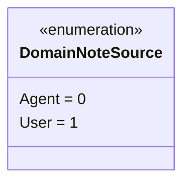
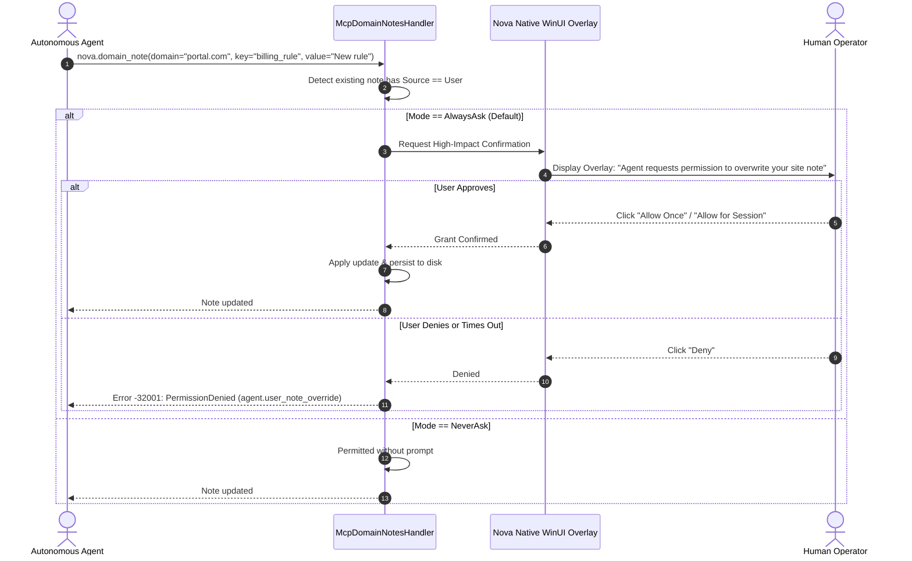
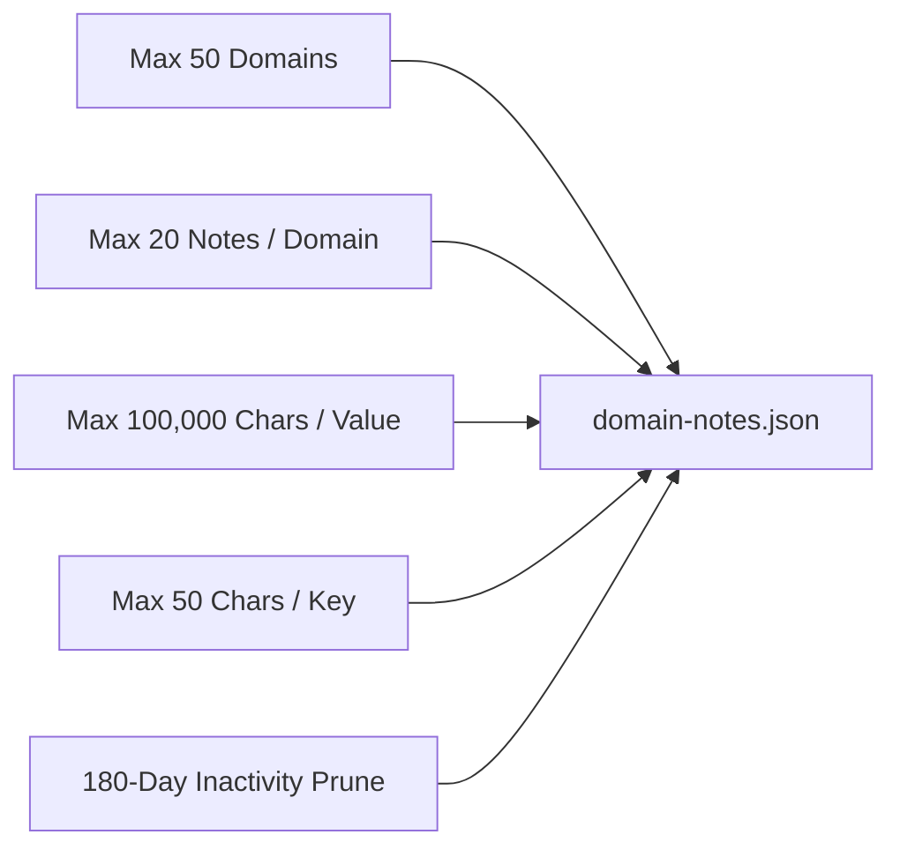

# Authorship, Override Permissions & Storage Architecture

> [!NOTE]
> This guide details the authority and storage layers of Domain Notes: the distinction between human directives and agent observations, the User-Note Override Permission Gate, atomic JSON persistence, and lifecycle cleanup cascades.

---

## 1. The Dual Authorship Model

Domain Notes strictly differentiate between two distinct sources of knowledge:

| Authorship Source | Creation Channel | Operational Role | Mutation Authority |
| :--- | :--- | :--- | :--- |
| **`User`** | Authored directly by the human operator via Nova's **Site Information** panel or **Settings**. | **Explicit human directives.** Definitive UX constraints (e.g. *„Never touch the Billing tab without asking“*). | **Protected.** Agents cannot edit, overwrite, or delete user notes without explicit human permission. |
| **`Agent`** | Created programmatically via the [`nova.domain_note`](../../../mcp-reference/tools/task-memory/nova-domain-note.md) MCP tool. | **Empirical observations.** Heuristic working notes (e.g. *„The search input renders as an iframe“*). | **Flexible.** Autonomous agents can update, refine, or delete agent notes as site behavior evolves. |

> [!IMPORTANT]
> **Source Spoofing Prohibited:** The MCP tool handler enforces that all agent-initiated writes are assigned `Source = Agent`. An agent cannot label its own notes as written by the user.

---

## 2. The User-Note Override Permission Gate

If an autonomous agent attempts to modify or delete a note whose source is `User`, Nova intercepts the operation with the **User-Note Override Permission Gate** (`agent.user_note_override`):

### Confirmation Modes
Managed under **Settings → AI & agents → Access & rules → Site notes → Agent override permission**:

1. **`AlwaysAsk` (Default):** Every attempt by an agent to mutate or delete a user note halts execution and presents an interactive WinUI 3 dialog to the operator.
2. **`OncePerSession`:** The operator is prompted on the first override attempt. If approved, the permission is cached for the duration of the Nova application session for that specific `(scope, domain, key, noteId)` tuple.
3. **`NeverAsk`:** Overrides proceed without interactive prompts (used primarily in headless automated testing environments).

### Cache Invalidation on Edit
To prevent stale permission reuse, Once-Per-Session allowances incorporate the note's `updatedUtc` timestamp ticks into the cache key. Any modification to the note instantly invalidates prior approvals.

---

## 3. Storage Architecture & Capacities

Domain Notes are persisted to disk as human-readable JSON within the local application data directory:

$$\text{Path: } \%LOCALAPPDATA\%\backslash\text{NovaBrowser}\backslash\text{domain-notes.json}$$

### Atomic Persistence Pipeline
To prevent data corruption caused by abrupt application terminations or power failures, Nova manages disk writes through an **atomic write cycle**:
1. Acquires a process-wide mutex (`GlobalWriteLock`).
2. Serializes the note collection to UTF-8 without BOM.
3. Writes the serialized payload to a temporary file (`domain-notes.json.tmp`).
4. Atomically replaces the target file via native OS file replacement (`AtomicFileWriter`).

### Hard Capacity Limits & Retention

* **Max Domains:** 50 distinct registered hosts.
* **Max Notes Per Domain:** Up to 20 individual notes per host.
* **Max Value Length:** Up to **100,000 characters** per note value. This generous limit allows power users to embed exhaustive, system-prompt-grade operational runbooks in a single note.
* **Max Key Length:** 50 characters, restricted to alphanumeric characters, dashes, underscores, and spaces.
* **180-Day Stale Pruning:** Notes that have not been read or modified in over 180 days are automatically pruned during save cycles.

---

## 4. Sandbox Deletion Cleanup Cascade

When a user deletes a sandbox profile from Nova:
1. Nova's sandbox deletion pipeline invokes the cleanup hook.
2. Scans `domain-notes.json` for notes matching the deleted sandbox's `PersistentUid`.
3. Purges all associated sandbox-specific notes from disk while leaving global notes completely intact.
4. Clears all cached session permissions associated with that sandbox, preventing ghost permissions if a future sandbox reuses an ephemeral letter identifier (`"B"`).

---

## Related Documentation

* **[Domain Notes Overview](README.md)** — Architectural hub, taxonomy, and system integrations.
* **[Delivery Levels & AAG Enforcement](delivery-levels-and-aag-enforcement.md)** — Three delivery levels, dual-path ack, and bulk-acknowledgment.
* **[Scoping, Normalization & Repeat Policies](scoping-normalization-and-repeat-policies.md)** — Canonical host normalization, eTLD+1 fallback, and re-acknowledgment.
* **[Tool Reference: nova.domain_note](../../../mcp-reference/tools/task-memory/nova-domain-note.md)** — MCP parameter specification and code examples.
