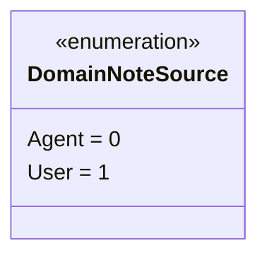
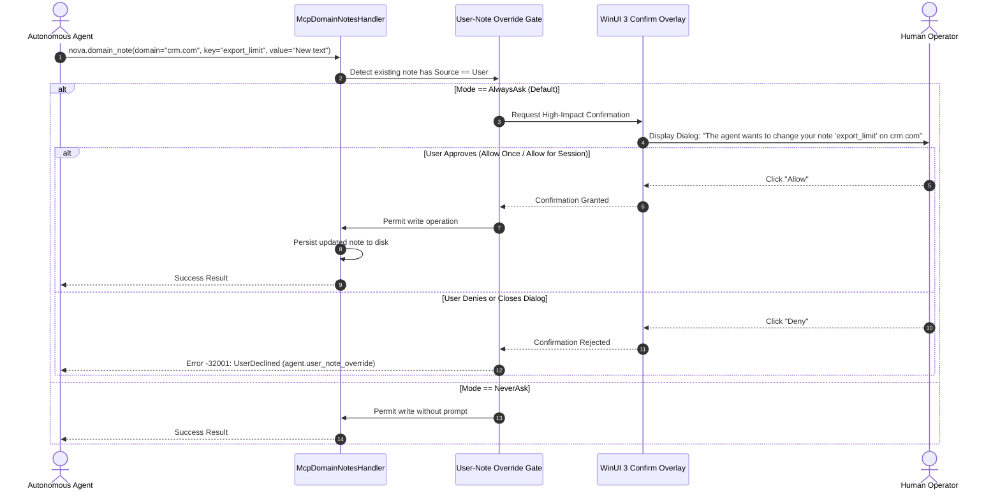
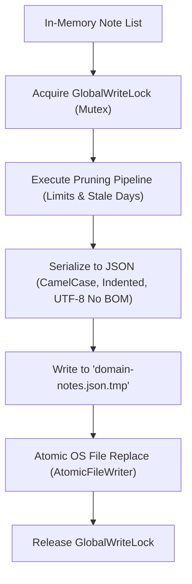
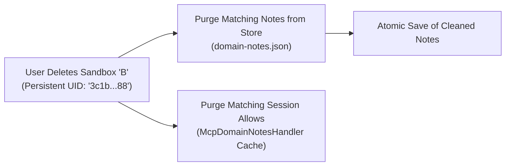

# Authorship, Override Permissions & Storage Architecture

> [!NOTE]
> This guide details the authority model, security gates, persistence layer, and lifecycle management of Domain Notes in Nova AI Workspace: human vs agent authorship, the User-Note Override Permission Gate, atomic JSON storage, key validation rules, capacity pruning, and sandbox deletion cascades.

---

## 1. The Dual Authorship Model

Domain Notes strictly distinguish between two sources of operational knowledge to maintain human control over browser automation:



| Source Property | Origin Channel | Operational Nature | Mutation Authority & Safeguards |
| :--- | :--- | :--- | :--- |
| **`User` (Human Directives)** | Authored via Nova's **Site Information** panel or **Settings → Site Notes**. | **Definitive UX intent.** High-stakes instructions, legal requirements, or personal boundaries (e.g. *„Never submit payment without asking“*). | **Protected.** Autonomous agents cannot modify, re-enforce, or delete user notes without explicit human permission via the `agent.user_note_override` gate. |
| **`Agent` (Heuristic Memory)** | Authored programmatically via the [`nova.domain_note`](../../../mcp-reference/tools/task-memory/nova-domain-note.md) MCP tool. | **Empirical observations.** Selector hints, layout quirks, or authentication patterns (e.g. *„The search bar is inside an iframe“*). | **Adaptive.** Autonomous agents can freely update, refine, re-enforce, or delete agent notes as websites evolve. |

---

### Core Authorship Invariants

1. **Source Spoofing Prohibition:** All notes written or updated through the MCP tool handler (`nova.domain_note`) are enforced as `Source = Agent`. An agent cannot mark its own notes as written by the user.
2. **Backward Compatibility Guarantee:** Notes authored before the introduction of the source field are automatically initialized as `Source = Agent` upon load, matching historical behavior.
3. **Store Choke-Point Repeat Protection:** Even if an agent attempts an upsert on an existing user note without changing its text, the persistence store choke-point **strictly forbids agents from modifying `repeatMinutes` or `repeatToolCalls` on user-authored notes**. Only human operators using the graphical interface may tune repeat thresholds for user directives.

---

## 2. The User-Note Override Permission Gate

When an autonomous agent attempts to modify the text, change the enforcement level, or delete a note whose source is `User`, Nova intercepts execution via the **User-Note Override Permission Gate** (`agent.user_note_override`):



### Confirmation Modes

Managed under **Settings → AI & agents → Access & rules → Site notes → Agent override permission**:

* **`AlwaysAsk` (Default):** Every individual attempt by an agent to mutate or delete a user note halts execution and presents an interactive WinUI 3 dialog to the operator.
* **`OncePerSession`:** Prompts the user on the first override attempt. If approved, the allowance is cached for the duration of the Nova application session for that specific note and action.
* **`NeverAsk`:** Overrides proceed immediately without user prompts (primarily used in automated CI/CD and regression testing environments).

---

### Session Allowance Cache Architecture

In `OncePerSession` mode, approved overrides are stored in an in-memory cache bounded to **512 entries** (`MaxUserNoteOverrideSessionAllows`):

$$\text{Cache Key Format: } \texttt{usernote\_override:\{scopeKey\}:\{domain\}:\{key\}:\{action\}:\{noteId\}:\{updatedTicks\}}$$

Where:
* `scopeKey`: `"global"` or `"sandbox:{persistentUid}"` (prevents allowances granted on Sandbox A from bleeding into Sandbox B or global notes).
* `action`: `"update"`, `"enforcement"`, or `"delete"`.
* `noteId`: The immutable GUID of the target note.
* `updatedTicks`: The note's `UpdatedUtc.Ticks` timestamp.

> [!IMPORTANT]
> **Automatic Invalidation via Timestamp Ticks:** Because `updatedTicks` is baked into the cache key, any subsequent edit to the note immediately changes its timestamp ticks, instantly invalidating the cached approval.

---

### Stale-State Detection (-32003)

If a user edits or deletes a site note in the browser UI while an agent's override confirmation dialog is open on screen, the underlying state changes. 

When the confirmation resolves, Nova verifies that `latest.UpdatedUtc == authorizedUserNoteUpdateStamp`. If the timestamps mismatch, Nova cancels the write and returns:

```json
{
  "code": -32003,
  "message": "Your site note \"export_limit\" changed while the agent override was pending. Retry so the permission check can use the current note.",
  "data": {
    "gateId": "agent.user_note_override",
    "reasonCode": "stale_user_note_state",
    "action": "update",
    "domain": "crm.com",
    "key": "export_limit"
  }
}
```

---

### Multi-User-Note Delete Protection & Ambiguity Handling

1. **Individual Confirmations on Multi-Delete:** When an agent attempts a broad delete across multiple user notes (e.g. `scope="all"` matching both global and sandboxed user notes), Nova enforces separate confirmations for **each user note in the target set**. A single cached session allow cannot silently delete multiple user notes.
2. **Ambiguous Target Detection (-32602):** If both a global note and a sandbox-scoped note share the same `domain` and `key`, a bare delete call without an explicit `scope` or `sandboxId` will be rejected with `ambiguous_note_target`, returning candidate metadata so the agent can specify the exact target.
3. **Destructive Action Asymmetry:** In contrast to read paths (which combine global and sandbox notes), a delete call specifying `sandboxId` **deletes ONLY the sandbox-bound note**, preserving the global twin.

---

## 3. Storage Architecture & Persistence Pipeline

Domain Notes are stored on local storage as clean, human-readable JSON:

$$\text{Path: } \%LOCALAPPDATA\%\backslash\text{NovaBrowser}\backslash\text{domain-notes.json}$$



### The Atomic Write Pipeline

To protect against data corruption during abrupt system power loss, process termination, or disk saturation, Nova employs atomic file writes:
1. **Thread Synchronization:** All load-mutate-save cycles synchronize on a process-wide mutex (`DomainNotesStore.GlobalWriteLock`).
2. **Temporary File Staging:** Serialized JSON (formatted using UTF-8 without BOM) is written to a staging file (`domain-notes.json.tmp`).
3. **Native Atomic Replacement:** The staging file replaces the target file via native OS filesystem replace calls (`AtomicFileWriter.WriteAllText`). If writing fails at any point, the existing `domain-notes.json` remains completely intact.

---

### Backward-Compatibility Wire Migrations

When loading older `domain-notes.json` files, Nova performs automatic, one-time in-place migrations:
1. **Stable GUID Assignment:** Legacy notes authored before the introduction of note IDs have a stable GUID generated once and persisted back to disk. This ensures that per-tab acknowledgment caches remain stable across app restarts.
2. **Punycode Domain Key Migration:** Stored domain keys containing Unicode characters (e.g. `münchen.de`) are converted to ASCII wire form (`xn--mnchen-3ya.de`), ensuring future lookups align with WebView2 host reporting.

---

## 4. Key Validation & Strict Capacity Limits

To ensure robust performance and protect LLM token budgets, Nova enforces strict input validation and automated capacity pruning:

```mermaid
mindmap
  root((Capacity &<br/>Validation Limits))
    Keys & Values
      Key: Max 50 Chars
      Key Regex: ^[a-zA-Z0-9_\- ]+$
      Value: Max 100,000 Chars
    Store Capacities
      Max 50 Registered Domains
      Max 20 Notes per Domain
      180-Day Inactivity Prune
```

### String Guards & Validation Rules

* **Key Length:** Maximum **50 characters**.
* **Key Character Pattern:** Strictly validated against the regular expression `^[a-zA-Z0-9_\- ]+$` (alphanumeric characters, hyphens, underscores, and spaces). Leading and trailing whitespace is trimmed.
* **Value Length:** Generous upper limit of **100,000 characters**. This allows power users to embed complete, system-prompt-grade runbooks and multi-step protocols into a single `Block` directive.
* **Domain Validation:** Hostnames must contain a period, cannot contain ports, protocols, spaces, or consecutive dots, and must be under standard hostname length limits.

---

### Automated Store Pruning (`DomainNotesStore.Prune`)

During every save cycle, Nova automatically maintains storage bounds:
1. **180-Day Inactivity Prune (`StaleDays = 180`):** Notes whose `UpdatedUtc` timestamp is older than 180 days are permanently purged.
2. **Per-Domain Note Capping (`MaxNotesPerDomain = 20`):** If a single domain exceeds 20 notes, notes are ordered by `UpdatedUtc` descending; the newest 20 notes are kept, and older notes are dropped.
3. **Global Domain Capping (`MaxDomains = 50`):** If more than 50 distinct domains exist in the store, domains are ranked by their most recent note update; the top 50 domains are preserved, and older domains are pruned.

---

## 5. Sandbox Deletion Cleanup Cascade

When a user deletes a sandbox profile through Nova's settings or user interface:



1. **Disk Store Purge:** The sandbox deletion pipeline scans `domain-notes.json` and deletes all notes where `SandboxUid == persistentUid`. Global notes (`SandboxUid == null`) and notes belonging to other sandboxes remain completely untouched.
2. **Session Allowance Purge (`PurgeSandboxScopedAllowsForUid`):** Cleanses all cached Once-Per-Session approvals matching `:sandbox:{persistentUid}:` from memory.
3. **Identity Safety:** If a user subsequently creates a new sandbox that happens to receive the reused letter handle `"B"`, it will not inherit ghost permissions or orphaned notes from the deleted sandbox.

---

## Related Documentation

* **[Domain Notes Overview](README.md)** — Architectural hub, knowledge taxonomy, and tool suite.
* **[Delivery Levels & AAG Enforcement](delivery-levels-and-aag-enforcement.md)** — Three delivery tiers, dual-mode ack protocol, and bulk-acknowledgment.
* **[Scoping, Normalization & Repeat Policies](scoping-normalization-and-repeat-policies.md)** — Canonical host normalization, eTLD+1 resolution, and repeat intervals.
* **[Agent Awareness Gates (AAG)](../../agent-awareness-gates-aag/README.md)** — Runtime gate interception, tab leases, and safety guardrails.
