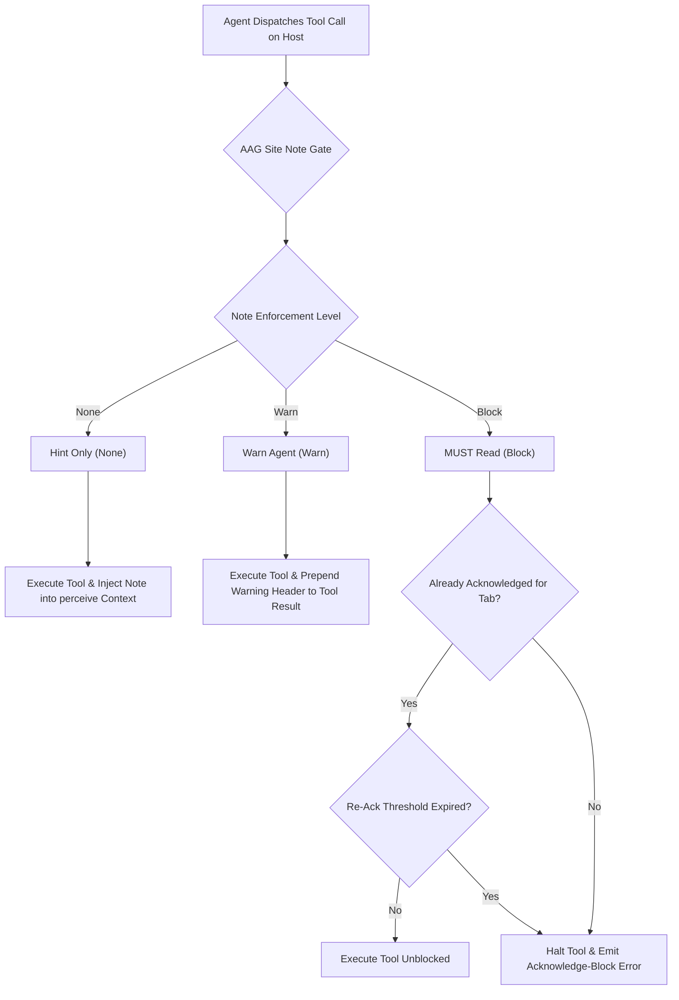
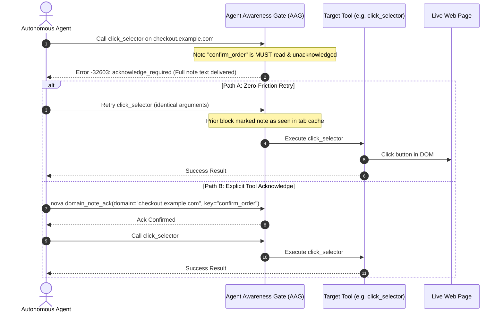

# Delivery Levels, Dual-Mode Acknowledgment & AAG Enforcement

> [!NOTE]
> This guide details the delivery pipeline and runtime enforcement of Domain Notes: how the Agent Awareness Gate (AAG) evaluates note severity, the mechanics of acknowledge-blocks, the zero-friction retry vs explicit tool-call paths, bulk-acknowledgment semantics, and circular deadlock prevention.

---

## 1. The Three Delivery Levels

Every Domain Note is assigned an enforcement level that dictates how Nova delivers it to an autonomous agent:



| Level in Nova | Numerical Enum | Execution Impact | Intended Purpose |
| :--- | :---: | :--- | :--- |
| **Hint only** | `None (0)` | **Non-blocking.** Surfaced only during page inspection (`nova.perceive`). | Informational context: page architecture, non-critical selector suggestions, or background site notes. |
| **Warn the agent** | `Warn (1)` | **Non-blocking.** The tool executes normally, but a formatted warning header is prepended to the tool output. | Operational cautions: delicate form fields, non-fatal rate limit advisories, or recommended search-before-create policies. |
| **MUST read** | `Block (2)` | **Blocking.** The tool is halted immediately with an acknowledge-block error until the agent confirms receipt. | High-stakes user directives: mandatory approval before database mutations, strict confidentiality rules, or forbidden destructive actions. |

---

## 2. Precedence & The Global Enforcement Switch

Enforcement operates under a strict two-tier hierarchy: **Global Override Setting** vs **Per-Note Level**.

* **Global Switch Location:** **Settings → AI & agents → Access & rules → Site notes → Global override**.
* **Precedence Rules:**
  1. If Global Override is **Off (`AagGateMode.Off`)**, all domain notes act strictly as **Hint only**. No calls are blocked, and no warnings are injected into tool results.
  2. If Global Override is **Warn (`AagGateMode.Warn`)**, notes configured as `Block` are degraded to `Warn`. Tool calls are never halted.
  3. If Global Override is **On — per-note level wins (`AagGateMode.Block`)**, individual notes enforce their configured level (`None`, `Warn`, or `Block`). This is the recommended operational configuration.

---

## 3. The Anatomy of an Acknowledge-Block

When a `Block` note has not yet been acknowledged on the active tab, the Agent Awareness Gate intercepts the call before tool execution and returns a structured diagnostic:



### The Dual-Mode Acknowledgment Protocol

AAG supports two distinct acknowledgment flows to accommodate diverse LLM agent frameworks:

#### Path A: The Zero-Friction Retry (Recommended)
Because the purpose of the gate is to ensure the agent has ingested the instruction into its prompt context, Nova marks the note as provisionally delivered the moment the block error is returned.
* The agent simply repeats the exact same tool call (e.g. `nova.click_selector`).
* The retry passes through unhindered.
* Zero additional round-trips or specialized tool invocations are required.

#### Path B: Explicit Tool Call (`nova.domain_note_ack`)
Certain agent frameworks have hard-coded safety rules prohibiting retrying a failed tool call. For these architectures, the agent can call `nova.domain_note_ack`:
```json
{
  "domain": "checkout.example.com",
  "key": "confirm_order"
}
```
Once executed, the tab is marked acknowledged, and the agent proceeds with its intended workflow.

---

## 4. Bulk-Acknowledgment Semantics

When a human user or operator has configured multiple `Block`-level notes for the same domain (e.g. *„Check billing address“*, *„Assert order total < $500“*, and *„Do not select express delivery“*), naive enforcement would trap the model in an agonizing sequence of sequential blocks.

Nova eliminates this friction via **Bulk-Acknowledgment**:
1. When any `Block` note trips the gate, Nova gathers **all unacknowledged `Block` notes** for that domain and sandbox.
2. The block error message renders the full text of all pending notes simultaneously (ordered newest-first).
3. A single retry or a single call to `nova.domain_note_ack` clears the **entire pending set** for that tab in one shot.

---

## 5. Tool Exemptions & Deadlock Prevention

To prevent circular dependency deadlocks, Nova explicitly exempts four administrative meta-tools from the Domain Note gate:

```csharp
// Administrative tools exempted from Domain Note gate checks
nova.domain_note
nova.domain_note_ack
nova.domain_notes_list
nova.domain_note_delete
```

Because these tools operate on the notes themselves and lack an active browser `targetId`, evaluating site note blocks against them would create an inescapable loop where an agent could neither read nor acknowledge the note that blocked it.

---

## Related Documentation

* **[Domain Notes Overview](README.md)** — Architectural hub, taxonomy, and system integrations.
* **[Scoping, Normalization & Repeat Policies](scoping-normalization-and-repeat-policies.md)** — Host normalization, sandbox binding, and re-acknowledgment intervals.
* **[Authorship, Permissions & Storage](authorship-permissions-and-storage.md)** — User vs agent authorship, override permission overlays, and disk persistence.
* **[Agent Awareness Gates (AAG)](../../agent-awareness-gates-aag/README.md)** — Execution gates, tab leases, and safety policies.
