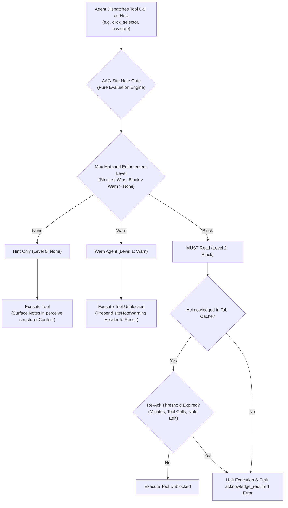
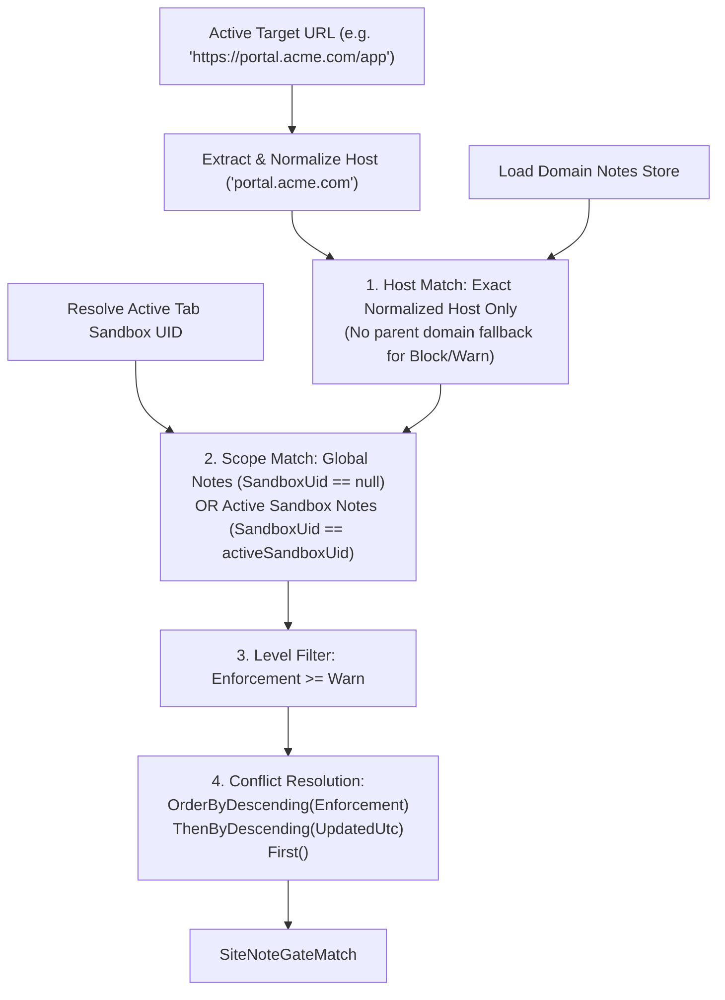
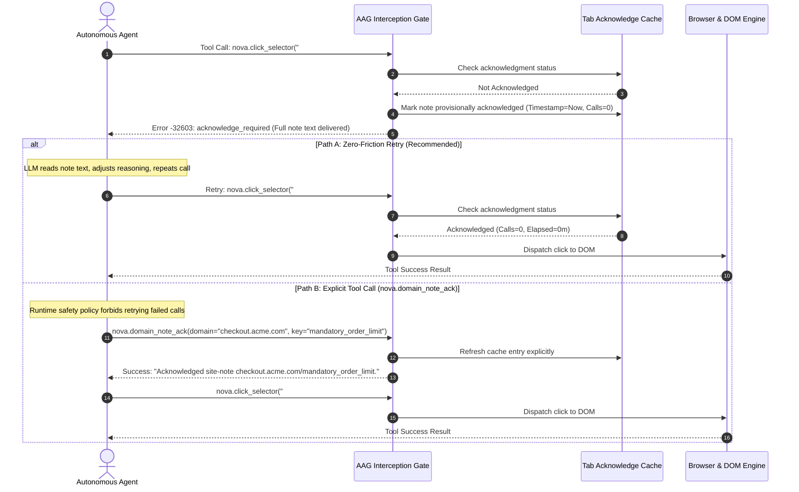
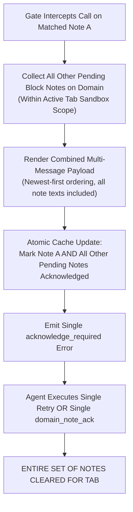
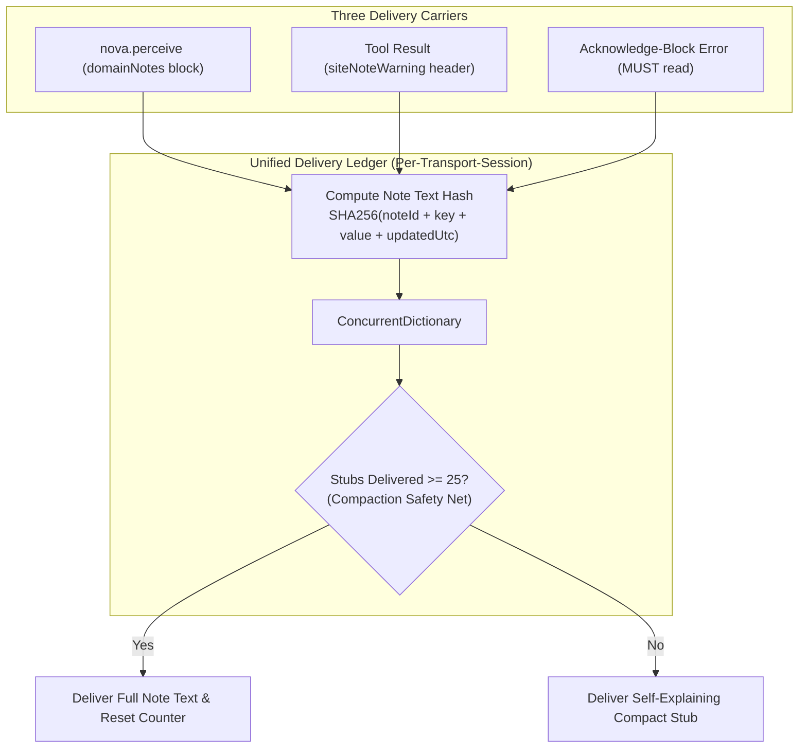

# Delivery Levels, Dual-Mode Acknowledgment & AAG Enforcement

> [!NOTE]
> This guide details the delivery pipeline and runtime enforcement of Domain Notes: how the Agent Awareness Gate (AAG) evaluates note severity, the mechanics of acknowledge-blocks, the zero-friction retry vs explicit tool-call paths, bulk-acknowledgment semantics, the per-tab in-memory cache architecture, the cross-carrier text deduplication ledger, and circular deadlock prevention.

---

## 1. The Three Delivery Levels

Every Domain Note is assigned an enforcement intensity that dictates how Nova delivers it to an autonomous agent during page interactions:



| Level in Nova | Numerical Enum | Execution Impact | Delivery Channel | Intended Operational Purpose |
| :--- | :---: | :--- | :--- | :--- |
| **Hint only** | `None (0)` | **Non-blocking.** Never interrupts tool execution. | Surfaced within the `domainNotes` structured block of [`nova.perceive`](../../../mcp-reference/tools/dom-and-reading/nova-perceive.md). | Architectural context, selector suggestions, iframe layout hints, or general site documentation. |
| **Warn the agent** | `Warn (1)` | **Non-blocking.** Tool executes normally, but output carries an advisory. | Prepends a prominent `siteNoteWarning` header directly to the tool's return text and structured payload. | Operational cautions: delicate form elements, non-fatal rate limit advisories, or recommended search patterns. |
| **MUST read** | `Block (2)` | **Blocking.** Halts tool execution immediately before the DOM or browser engine is touched. | Emits a structured `-32603 acknowledge_required` JSON-RPC error containing the full note text. | High-stakes user directives: mandatory confirmation before checkout, forbidden navigation paths, or database deletion bans. |

---

## 2. Precedence & The Global Enforcement Switch

Enforcement operates under a strict two-tier hierarchy: **Global Override Setting** vs **Per-Note Enforcement Level**.

* **Global Configuration Path:** **Settings → AI & agents → Access & rules → Site notes → Global override**.
* **Precedence Rules:**
  1. **`Off` (`AagGateMode.Off`):** All domain notes are degraded to **Hint only**. No tool calls are blocked, and no warnings are injected into tool results. Useful during debugging or unconstrained exploration.
  2. **`Warn` (`AagGateMode.Warn`):** Global ceiling caps enforcement at Level 1. Notes configured as `Block` are automatically degraded to `Warn`. Tool calls are never halted, but warnings are injected into tool outputs.
  3. **`Block` (`AagGateMode.Block` — Default):** Full fidelity. Each note enforces its individually configured level (`None`, `Warn`, or `Block`). This is the standard production mode.

---

## 3. Pure Evaluation Engine Mechanics

Before any tool call executes, the Agent Awareness Gate intercepts the call through a referentially transparent evaluation function:



### Invariants of the Evaluation Engine

1. **Exact Host Match Only:** Unlike page perception (`nova.perceive`), which allows non-blocking parent domain hints (e.g. `assets.vxlive.net` $\rightarrow$ `vxlive.net`), **enforcement gates require an exact normalized host match**. A note on `acme.com` will never block or warn on `portal.acme.com`.
2. **Sandbox Boundary Enforcement:** Notes bound to Sandbox B are strictly invisible to tabs running in Sandbox A. An agent operating in Sandbox A will never receive a block or warning triggered by a note from Sandbox B.
3. **Strictest Rule Precedence:** If multiple notes match the target domain, Nova selects the strictest rule (`Block > Warn`). If multiple notes share the highest enforcement level, the most recently updated note (`UpdatedUtc`) is selected as the primary blocking subject.

---

## 4. The Anatomy of an Acknowledge-Block

When a `Block`-level note is tripped on an unacknowledged tab, Nova immediately halts execution and returns an `acknowledge_required` response:

```json
{
  "jsonrpc": "2.0",
  "id": "14",
  "error": {
    "code": -32603,
    "message": "MUST READ — a message was left for you on checkout.acme.com.\n\nTitle: \"mandatory_order_limit\"\nMessage: Do not submit orders totaling more than $500 without asking the user for confirmation.\n\nAcknowledge by retrying this call, or call nova.domain_note_ack(domain='checkout.acme.com', key='mandatory_order_limit'). Subsequent tool calls on this tab will pass freely.",
    "data": {
      "gateId": "aag.site_note",
      "reasonCode": "acknowledge_required",
      "domain": "checkout.acme.com",
      "key": "mandatory_order_limit",
      "noteId": "4c8f9b2e10a74d2891f7c5e2390b11aa",
      "effectiveRepeatMinutes": 60,
      "effectiveRepeatToolCalls": 50,
      "pendingNotesCount": 1
    }
  }
}
```

---

## 5. The Dual-Mode Acknowledgment Protocol

Nova accommodates different agent runtime capabilities through two parallel acknowledgment flows:



### Path A: Zero-Friction Retry (Standard)
* **Design Philosophy:** The objective of an acknowledge-block is to ensure that the human directive is present in the model's active reasoning context. Because the block error delivers the full note text into the model's conversation history, simply repeating the failed tool call proves that the model has ingested the instruction.
* **Provisional Cache Population:** Nova populates the tab's acknowledgment cache the instant the block error is emitted. Repeating the tool call passes through without delay.
* **Token Efficiency:** Requires zero specialized tool invocations, completing the cycle in a single retry step.

### Path B: Explicit Tool Call (`nova.domain_note_ack`)
* **Framework Safety Compatibility:** Certain agent frameworks enforce rigid safety policies that treat repeating a failed tool call as an infinite loop failure.
* **Target Validation:** `nova.domain_note_ack` validates that the active tab (or explicit `targetId`) is currently navigated to the note's domain. If the tab has navigated away, it returns `-32602 host_mismatch`.

---

## 6. Bulk-Acknowledgment Semantics

When an operator authors multiple `Block`-level notes for a single domain (e.g. *„Verify shipping country“*, *„Assert total < $500“*, and *„Do not select express courier“*), naive systems would block the agent sequentially: block on note 1 $\rightarrow$ retry $\rightarrow$ block on note 2 $\rightarrow$ retry $\rightarrow$ block on note 3.

Nova prevents this cascading friction via **Bulk-Acknowledgment**:



* **Comprehensive Context Delivery:** The block response formats the primary note first, followed by an `"Also pending on this domain"` appendix listing all other pending directives.
* **Single-Shot Resolution:** When the cache is populated, **all pending block notes on that domain are marked acknowledged simultaneously**. A single retry or tool ack clears the entire set, allowing the agent to proceed immediately with full situational awareness.

---

## 7. Per-Tab Acknowledge Cache Internals

Nova maintains acknowledgment states in memory using an internal thread-safe concurrency structure:

$$\text{Structure: } \text{ConcurrentDictionary}<\text{targetId}, \text{ConcurrentDictionary}<\text{subjectKey}, \text{SiteNoteAckState}>>$$

### The Subject Key Architecture

To guarantee strict isolation between global notes, sandbox-specific notes, and sibling notes sharing titles, the cache subject key is constructed as:

$$\text{Key Format: } \texttt{site\_note:\{scopeKey\}:\{domain\}:\{key\}:\{noteId\}}$$

Where:
* `scopeKey`: `"global"` for machine-wide notes, or `"sandbox:{persistentUid}"` for sandbox-bound notes.
* `domain`: The canonical normalized host.
* `key`: The note identifier string.
* `noteId`: The immutable 32-character hexadecimal GUID assigned to the note upon creation.

> [!IMPORTANT]
> **Sandbox Isolation Defense:** Because `scopeKey` and `noteId` are embedded in the subject key, acknowledging a global note on `acme.com` will **never inadvertently satisfy** a sandbox-scoped note on the same host.

---

### Atomic Concurrency & State Invalidation

The acknowledgment state record tracks three critical metrics:

```csharp
// Internal state representation per acknowledged note
internal sealed record SiteNoteAckState(
    DateTimeOffset AcknowledgedAtUtc,
    int ToolCallsSinceAcknowledge,
    DateTime NoteUpdatedUtcAtAcknowledge);
```

On every subsequent tool call against the tab, Nova updates and evaluates the state atomically using `AddOrUpdate`:

1. **Lost-Update Prevention:** Increments `ToolCallsSinceAcknowledge` atomically, ensuring concurrent tool calls across parallel execution threads cannot corrupt the counter.
2. **Note-Edit Auto-Invalidation:** Compares `pending.UpdatedUtc > current.NoteUpdatedUtcAtAcknowledge`. If a user or agent modifies the note on disk while the tab is open, the cache entry is immediately discarded, forcing a fresh acknowledge-block on the next tool call without requiring complex cross-process message brokers.
3. **Threshold Expiration:** Compares elapsed wall-clock minutes against `effectiveRepeatMinutes` and interaction counts against `effectiveRepeatToolCalls`. If either threshold is exceeded, the entry is evicted and re-armed.

---

## 8. Cross-Carrier Text Deduplication Ledger

A critical challenge in long-running agent workflows is **context token waste**. A 3.5 KB operational runbook can arrive at the agent via three distinct carriers:
1. The `domainNotes` structured block on [`nova.perceive`](../../../mcp-reference/tools/dom-and-reading/nova-perceive.md).
2. The `siteNoteWarning` header prepended to tool execution results.
3. The `MUST read` acknowledge-block error message.

Without deduplication, a multi-hour session can resend the identical 3.5 KB text dozens of times, consuming hundreds of thousands of tokens. Nova eliminates this redundancy through the **Unified Delivery Ledger**:



### Ledger Architecture Rules

1. **Keyed by Transport Session:** Keyed by the agent's MCP connection session (`GetCurrentClaimSessionKey()`), **not by tab**. Because conversation context lives in the LLM runtime rather than the browser tab, opening a second tab within the same agent session will not re-deliver redundant text.
2. **SHA-256 96-Bit Content Hash:** Changes to note text, keys, or update timestamps alter the content hash, instantly triggering a full re-delivery across whichever carrier touches the agent next.
3. **Compaction Safety Net (`NoteTextResendAfterStubs = 25`):** Counts stubs rather than wall-clock minutes. If an agent compacts its context window during an extended session, Nova guarantees that full note text is re-sent once every 25 appearances.
4. **Self-Explaining Dedup Stubs:** When deduplication suppresses full text, Nova delivers a compact, informative stub:
   ```json
   {
     "unchanged": true,
     "hash": "7a8b9c0d1e2f3a4b",
     "count": 1,
     "keys": ["production_runbook"],
     "rehydrate": "nova.domain_notes_list",
     "hint": "Unchanged since it was delivered in full earlier in this session. If it is no longer in your context, re-read it with nova.domain_notes_list(domain=...)."
   }
   ```
5. **Agent-Confirmed Hash Bypass (`knownDomainNotesHash`):** An agent calling `nova.perceive` can provide `knownDomainNotesHash`. If the hash matches Nova's calculated domain hash, Nova delivers the compact stub immediately without evaluating the stub counter.

---

## 9. Tool Exemptions & Deadlock Prevention

To prevent fatal execution deadlocks, Nova explicitly exempts four administrative meta-tools from the Domain Note gate:

```csharp
// Administrative meta-tools exempted from AAG Site Note gate interception
nova.domain_note
nova.domain_note_ack
nova.domain_notes_list
nova.domain_note_delete
```

### Rationale for Exemption
* **Targetless Administration:** These four tools manage the notes themselves and operate without a browser `targetId`. Evaluating site note gates against them would prevent the cache from ever being satisfied.
* **Deadlock Elimination:** If `nova.domain_note_ack` or `nova.domain_notes_list` were subject to acknowledge-blocks, an agent trapped by a `Block` directive could neither inspect the note collection nor dispatch an acknowledgment, creating an unrecoverable execution lock.

---

## Related Documentation

* **[Domain Notes Overview](README.md)** — Architectural hub, knowledge taxonomy, and tool suite.
* **[Scoping, Normalization & Repeat Policies](scoping-normalization-and-repeat-policies.md)** — Host normalization, eTLD+1 resolution, and repeat intervals.
* **[Authorship, Permissions & Storage](authorship-permissions-and-storage.md)** — User vs agent authorship, override permission overlays, and atomic persistence.
* **[Agent Awareness Gates (AAG)](../../agent-awareness-gates-aag/README.md)** — Runtime gate interception, tab leases, and safety guardrails.
