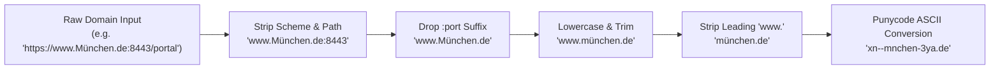
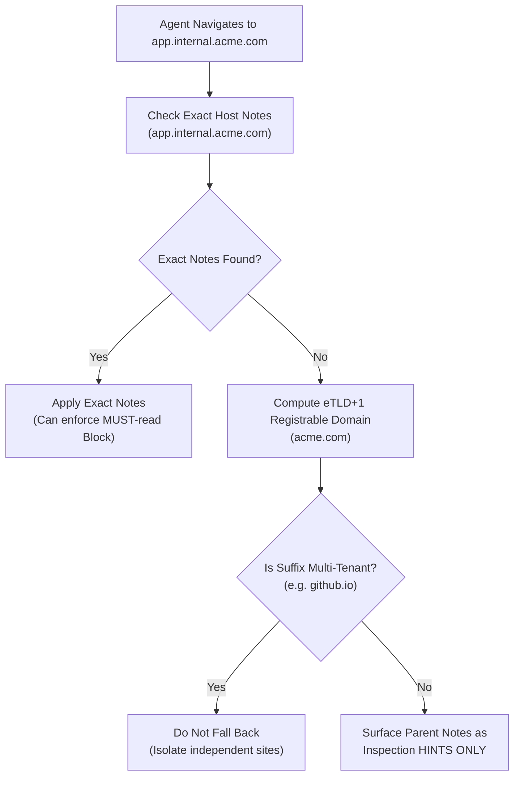
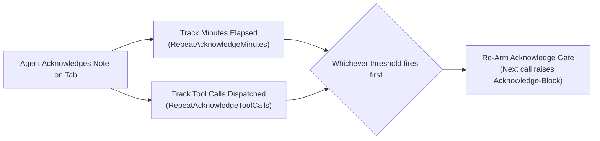

# Scoping, Host Normalization & Re-Acknowledgment Policies

> [!NOTE]
> This guide details the scoping and lifecycle mechanics of Domain Notes: canonical host normalization, eTLD+1 fallback vs subdomain isolation, sandbox binding via Persistent UIDs, the heuristic scope advisor, and re-acknowledgment intervals.

---

## 1. Canonical Host Normalization

Websites present varying URL notations depending on DNS configuration, localization, and port bindings. To prevent duplicate records and ensure reliable matching, Nova applies deterministic normalization:



### Normalization Rules
1. **Leading `www.` Stripping:** Domains are stripped of a leading `www.` prefix (`www.github.com` $\rightarrow$ `github.com`). A note created for `github.com` matches `www.github.com` identically.
2. **Port Number Removal:** Suffixes like `:8080` or `:3000` are stripped. WebView2 URL events never report ports in `Uri.Host`, so stripping ports guarantees local development hosts (e.g. `localhost:3000`) match their notes.
3. **Punycode / ASCII Translation:** Internationalized domain names (IDNs) containing Unicode glyphs (e.g. German umlauts or accented characters) are converted to canonical ASCII wire form (`xn--...`), ensuring lookups from the browser engine match agent inputs.
4. **Bracketed IPv6 Preservation:** Literal IPv6 addresses with ports (`[::1]:8080`) drop the port while preserving brackets (`[::1]`).

---

## 2. Subdomain Isolation vs. Parent Domain Fallback

Modern web services frequently distribute workflows across subdomains (e.g. `admin.shopify.com`, `checkout.shopify.com`, `help.shopify.com`).



### The Subdomain Isolation Invariant
> [!IMPORTANT]
> **Parent domain notes NEVER block child subdomains.**
> A note created for `acme.com` with `Block` enforcement will **not** halt tool calls on `portal.acme.com`. MUST-read enforcement requires an exact host match.

Parent domain notes are provided solely as **inspection hints** during `nova.perceive` or `nova.domain_notes_list`. If a specific operational directive must be strictly enforced on a subdomain, an explicit note must be authored for that exact subdomain.

### Multi-Tenant Suffix Protection
To safeguard shared cloud platforms, Nova maintains a strict blocklist of multi-tenant root domains (such as `github.io`, `vercel.app`, `webflow.io`). On these domains, parent fallback is completely disabled, preventing `user1.github.io` from inheriting instructions authored for `user2.github.io`.

---

## 3. Sandbox Scoping & Identity Isolation

Nova allows users to isolate browser sessions into distinct profiles called **Sandboxes** (e.g. Sandbox A for Personal, Sandbox B for Work). Domain Notes reflect this architecture through dual-scoping:

| Scope | `sandboxUid` | Description |
| :--- | :--- | :--- |
| **Global** | `null` | Applies across all sandboxes on this machine. Ideal for site-wide UI notes, bug workarounds, and structural tips. |
| **Sandbox-Bound** | `persistentUid` | Bound to a specific sandbox profile via its immutable UUID (not its ephemeral letter handle). Visible only within that sandbox. |

### The Coexistence Invariant
A global note and a sandbox-specific note can share the same `(domain, key)` pair without colliding. When querying notes on an active tab, Nova combines global notes with the notes of the active sandbox, while notes belonging to other sandboxes remain strictly hidden.

### The Domain Note Scope Advisor
Because global notes are the default when agents call `nova.domain_note`, models frequently save account-specific data globally. Nova integrates a passive heuristic analyzer:

* **Trigger Signals:** Scans note content for account/session indicators:
  * Plan tiers: `"pro account"`, `"free tier"`, `"enterprise"`, `"subscription"`
  * Session states: `"logged in as"`, `"signed in"`, `"my account"`
  * Quotas & limits: `"rate limit"`, `"workspace"`, `"quota"`
  * Identity tokens: Email addresses (`user@domain.com`)
* **Advisory Diagnostic:** If an agent saves a global note tripping these signals, Nova returns a non-blocking advisory notice:
  ```json
  {
    "code": "identity_signal_global_note",
    "message": "This note reads as account-/identity-bound but was saved globally. If the information is specific to one login, re-write it with sandboxId + sandboxRef."
  }
  ```

---

## 4. Re-Acknowledgment (Repeat) Policies

In extended autonomous sessions, models experience context drift: early prompt tokens are pushed out of immediate attention, increasing the probability of violating initial site directives.

To maintain active awareness, Nova provides configurable **Re-Acknowledgment Intervals** for `Block` notes:



### Configuration Hierarchy
1. **Global Defaults:** Managed under **Settings → AI & agents → Access & rules → Site notes**:
   * `SiteNoteRepeatAcknowledgeMinutesDefault` (e.g. 60 minutes)
   * `SiteNoteRepeatAcknowledgeToolCallsDefault` (e.g. 50 tool calls)
2. **Per-Note Overrides:** Authors can configure custom thresholds on individual notes (`repeatMinutes`, `repeatToolCalls`):
   * Setting a value to `0` explicitly disables repeat delivery for that metric (one-shot per tab).
   * Setting positive integers defines custom intervals.
3. **Tab Lifecycle Boundary:** Closing a browser tab always purges its in-memory acknowledgment cache. Opening a new tab to the same domain immediately re-arms the acknowledge gate.
4. **Note Edit Invalidation:** If a user or agent updates a note's content or enforcement level, its acknowledgment state is instantly invalidated across all open tabs.

---

## Related Documentation

* **[Domain Notes Overview](README.md)** — Architectural hub, taxonomy, and system integrations.
* **[Delivery Levels & AAG Enforcement](delivery-levels-and-aag-enforcement.md)** — Three delivery levels, dual-path ack, and bulk-acknowledgment.
* **[Authorship, Permissions & Storage](authorship-permissions-and-storage.md)** — User vs agent authorship, override permission overlays, and disk persistence.
* **[Sandboxes & Profiles Guide](../../../user-guide/identity-and-security/sandboxes-and-profiles.md)** — Profile boundaries, persistent UIDs, and disk separation.
