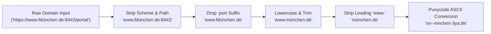
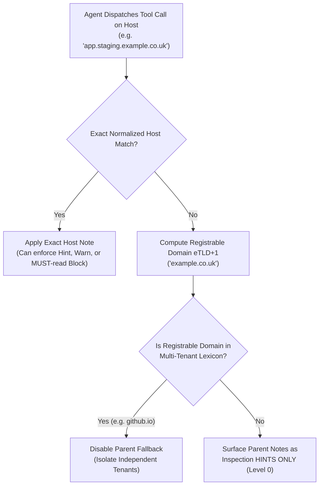
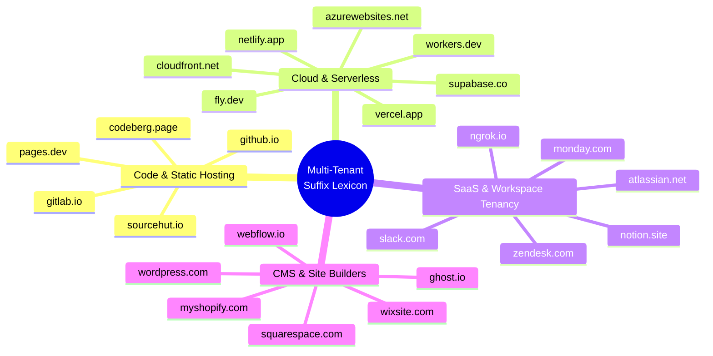
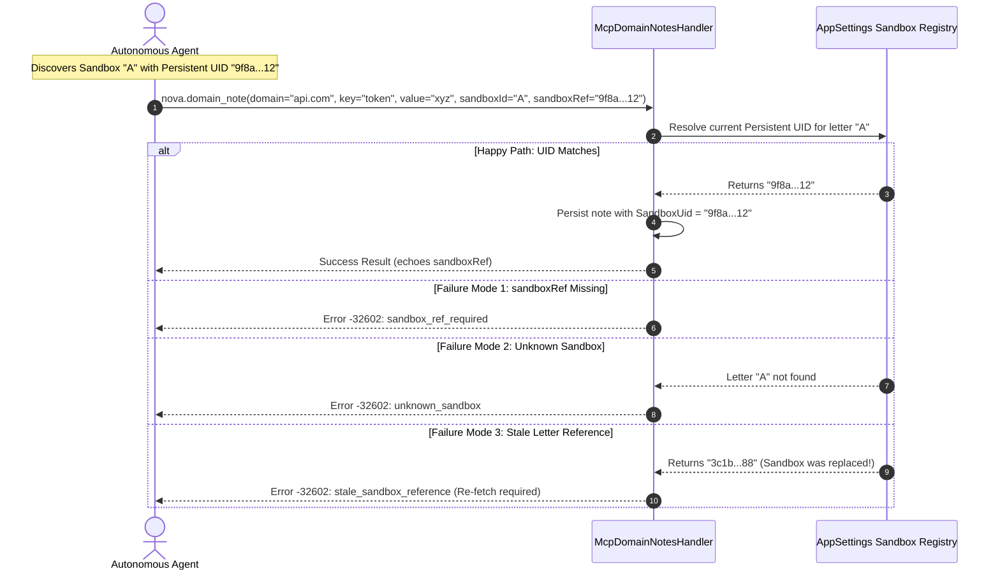
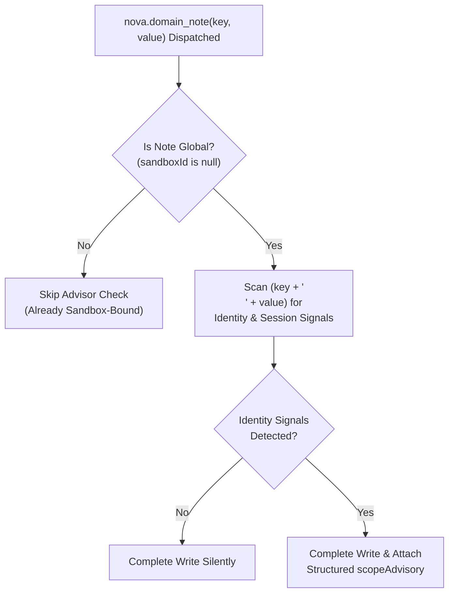
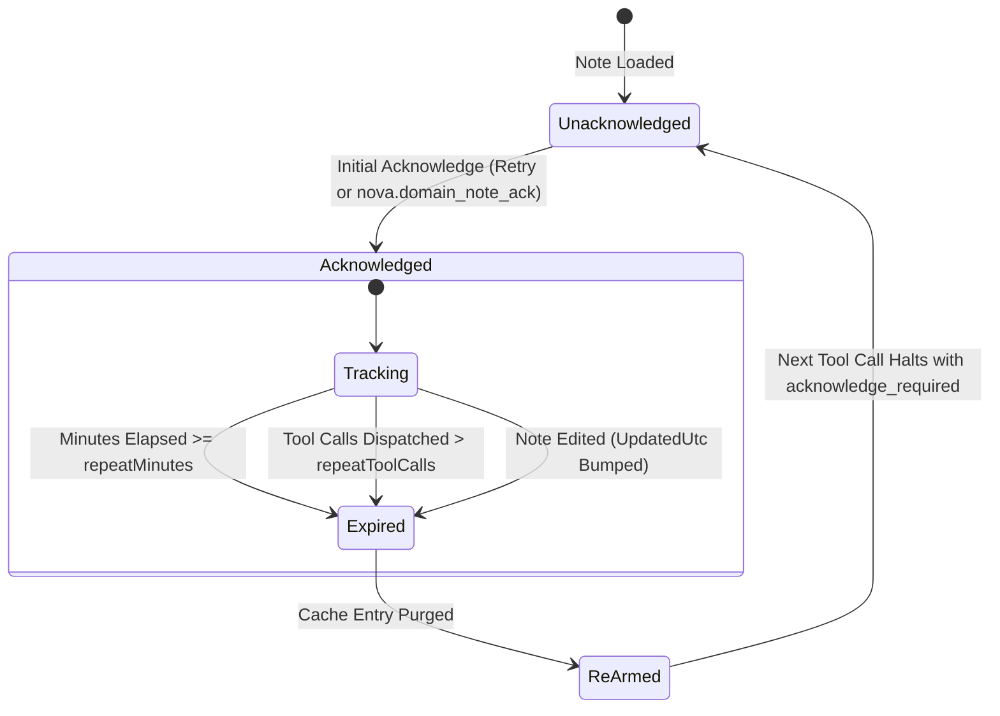
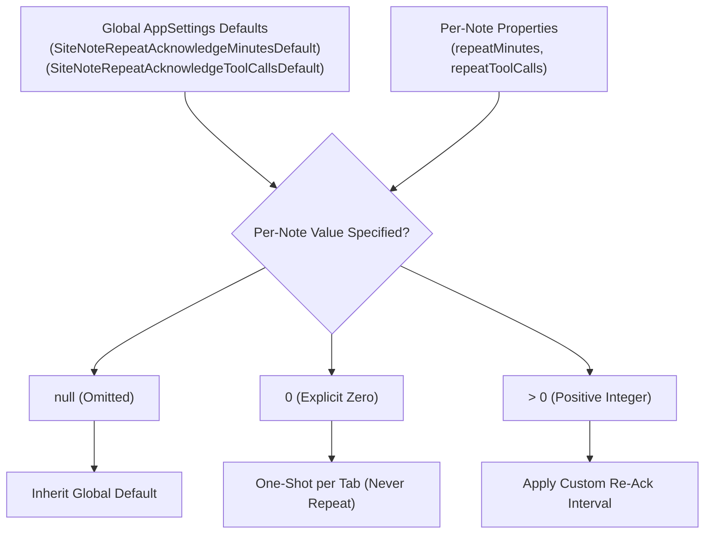

# Scoping, Host Normalization & Re-Acknowledgment Policies

> [!NOTE]
> This guide details the scoping, resolution, and lifecycle mechanics of Domain Notes in Nova AI Workspace: canonical host normalization, eTLD+1 fallback resolution, the curated Multi-Tenant Suffix Lexicon, sandbox binding with the Stale-Letter Defense Protocol, the heuristic Scope Advisor Engine, and dual-trigger re-acknowledgment policies.

---

## 1. Canonical Host Normalization

Web applications and agents present host addresses in diverse notations: fully-qualified URLs, protocol-relative hosts, uppercase hostnames, development ports, and internationalized scripts. To ensure that an instruction created for `vxlive.net` reliably intercepts an agent browsing `https://www.vxlive.net:8443/app`, Nova processes all domain keys through a canonical normalization pipeline:



### Normalization Pipeline Rules

1. **Case-Insensitive Trimming:** Leading and trailing whitespace is stripped, and the string is cast to lowercase invariant.
2. **Leading `www.` Stripping:** If the hostname begins with `www.` and exceeds 4 characters, the prefix is removed (`www.vxlive.net` $\rightarrow$ `vxlive.net`). This aligns agent mental models with real browser routing, where hosts frequently redirect between `www.` and root apexes.
3. **Port Suffix Stripping:** Suffixes matching `:port` (e.g. `:8080`, `:3000`) are removed. WebView2 page events report `Uri.Host`, which never contains ports. Stripping ports ensures that development servers (`localhost:8791`) match their notes without requiring separate entries per port.
4. **Bracketed IPv6 Preservation:** Literal IPv6 addresses with port bindings (`[::1]:8080`) drop the port while preserving the bracketed host notation (`[::1]`). Bare IPv6 addresses (`::1`) containing multiple colons remain untouched.
5. **Punycode / ASCII Wire Form Translation:** Hostnames containing internationalized Unicode glyphs (such as German umlauts or non-Latin alphabets) are translated to canonical Punycode (`xn--...`). Because WebView2 internally reports IDNs in ASCII wire form, converting agent inputs to Punycode guarantees exact-match parity across the persistence store and live browser tabs.

---

## 2. Subdomain Fallback & The Multi-Tenant Lexicon

Modern web architectures split services across complex subdomain trees (e.g. `assets.vxlive.net`, `api.checkout.service.co.uk`). Nova balances broad operational guidance with surgical enforcement through a two-level resolution model.



### The Subdomain Isolation Invariant

> [!IMPORTANT]
> **Parent domain notes NEVER enforce MUST-read blocks on subdomains.**
> A note created for `acme.com` with `Block` enforcement will **never halt execution** on `portal.acme.com`. 
> 
> Parent domain notes are surfaced **exclusively as non-blocking inspection hints** during page perception (`nova.perceive`). If an operational constraint must block tool execution on a specific subdomain, an explicit note must be registered directly for that exact subdomain.

---

### Registrable Domain (eTLD+1) Resolution

To determine the parent domain fallback, Nova calculates the effective top-level domain plus one label (eTLD+1). Standard two-label calculations fail on country-code TLDs: for example, naive splitting of `shop.example.co.uk` would yield `co.uk`, which is a public registry suffix rather than a registrable domain.

Nova integrates a curated catalog of two-part country-code TLDs:

| Geographic Region | Curated Two-Part TLD Examples | Host Example | Calculated Registrable Domain (eTLD+1) |
| :--- | :--- | :--- | :--- |
| **United Kingdom** | `co.uk`, `org.uk`, `ac.uk`, `gov.uk`, `ltd.uk` | `portal.service.co.uk` | `service.co.uk` |
| **Australia & New Zealand** | `com.au`, `net.au`, `edu.au`, `co.nz`, `org.nz` | `cdn.store.com.au` | `store.com.au` |
| **Latin America** | `com.br`, `net.br`, `com.co`, `com.pe`, `com.mx` | `api.pagos.com.br` | `pagos.com.br` |
| **Asia & Middle East** | `co.jp`, `or.jp`, `co.kr`, `co.in`, `com.sg`, `co.ae` | `auth.console.co.jp` | `console.co.jp` |
| **Europe & Africa** | `com.tr`, `com.pl`, `co.za`, `com.ng`, `com.ua` | `dev.app.co.za` | `app.co.za` |

---

### Multi-Tenant Suffix Defense

Public cloud platforms and software-as-a-service providers host millions of mutually untrusted customer workspaces under shared parent domains. If an agent navigating `customerA.github.io` fell back to notes stored on `github.io`, operational instructions or credentials belonging to customer B could be improperly leaked or applied.

To eliminate cross-tenant contamination, Nova's Multi-Tenant Suffix Lexicon completely disables parent fallback across four major service categories:



| Category | High-Value Suffixes | Isolation Rationale |
| :--- | :--- | :--- |
| **Code & Static Hosting** | `github.io`, `github.app`, `pages.dev`, `gitlab.io`, `codeberg.page` | Each subdomain represents an independent developer repository or documentation site. |
| **Cloud & Serverless** | `vercel.app`, `netlify.app`, `fly.dev`, `workers.dev`, `supabase.co`, `azurewebsites.net`, `appspot.com`, `firebaseapp.com` | Microservices and web apps deployed by disparate organizations share the cloud platform suffix. |
| **CMS & Publishing** | `wordpress.com`, `blogspot.com`, `ghost.io`, `substack.com`, `gitbook.io`, `readthedocs.io` | Independent publications, editorial teams, and authors. |
| **SaaS & Tenant Workspaces** | `slack.com`, `atlassian.net`, `notion.site`, `zendesk.com`, `monday.com`, `ngrok.io` | Corporate tenant workspaces containing sensitive enterprise knowledge and permissions. |
| **E-Commerce & Site Builders** | `myshopify.com`, `webflow.io`, `squarespace.com`, `square.site`, `wixsite.com`, `framer.app` | Competing merchant storefronts with distinct billing, checkout, and inventory rules. |

---

## 3. Sandbox Scoping & The Stale-Letter Defense Protocol

Nova isolates browser environments into independent profiles called **Sandboxes** (e.g. Sandbox A for Personal, Sandbox B for Staging). Domain Notes reflect this architecture by supporting both global and sandbox-specific bindings:

| Scope | `sandboxUid` | Behavioral Semantics |
| :--- | :--- | :--- |
| **Global** | `null` | Applies across all sandboxes on this machine. Ideal for site layout quirks, iframe navigation tips, and public documentation notes. |
| **Sandbox-Bound** | `32-char hex UUID` | Bound to a specific sandbox profile via its immutable Persistent UID. Visible only to tabs running within that sandbox. |

---

### The Note Coexistence Invariant

A global note and a sandbox-scoped note can share the identical `(domain, key)` pair simultaneously.
* **Tuple Identity:** Unique note identity is defined by the 3-tuple `(domain, key, sandboxUid)`.
* **Non-Interference:** Updating or deleting a sandbox-specific note will not overwrite, alter, or remove the global note of the same name.
* **Context Resolution:** When resolving notes for a tab, Nova retrieves all global notes plus any notes bound to that tab's active sandbox. Notes bound to other sandboxes remain strictly invisible.

---

### The Stale-Letter Defense Protocol (`sandboxId` + `sandboxRef`)

When agents interact with sandboxes via MCP tools, sandboxes are identified by friendly, ephemeral letter handles (e.g. `"A"`, `"B"`). However, users can delete Sandbox A and create a brand-new Sandbox A during a long-running agent session.

If an agent cached letter `"A"` and subsequently attempted to store sensitive domain notes, those notes would attach to the new sandbox, causing identity confusion. To prevent this race condition, Nova enforces the **Stale-Letter Defense Protocol**:



### The Three Validation Invariants (-32602)

1. **`sandbox_ref_required`:** If `sandboxId` is provided, `sandboxRef` is mandatory. Agents cannot write sandbox-scoped notes using bare letter handles.
2. **`unknown_sandbox`:** The supplied `sandboxId` does not correspond to any active sandbox profile.
3. **`stale_sandbox_reference`:** The Persistent UID resolved for `sandboxId` does not match the supplied `sandboxRef`. The user has replaced or recreated the sandbox since the agent last queried `nova.tabs`. The write is rejected, requiring the agent to rediscover active tabs.

---

### Retrieval Scopes (`nova.domain_notes_list`)

When inspecting domain notes, agents can select from four retrieval scopes:

| Scope | Wire Parameter | Filter Behavior |
| :--- | :--- | :--- |
| **`current_sandbox` (Default)** | `"current_sandbox"` | Returns global notes (`sandboxUid == null`) plus notes bound to the active tab's sandbox. Fails closed to global notes if no active tab context exists. |
| **`global`** | `"global"` | Returns strictly global notes, filtering out all sandbox-specific entries. |
| **`all`** | `"all"` | Administrative overview returning all notes for the domain across all sandboxes. |
| **`orphaned`** | `"orphaned"` | Maintenance view returning notes whose `sandboxUid` references a sandbox that was previously deleted. |

---

## 4. The Heuristic Scope Advisor Engine

Because `sandboxId` is optional, autonomous agents tend to save all domain notes globally by default. If an agent records *„Logged in as test-admin on the Pro tier“* as a global note, other sandboxes operating on free or read-only tiers inherit that incorrect assumption.

Nova integrates a passive, zero-overhead heuristic analyzer that inspects note keys and bodies during upsert operations:



### Curated Signal Lexicon

The Scope Advisor matches high-signal terms across English and German while avoiding generic vocabulary (such as "role" or "login") that frequently collide with standard ARIA and DOM attributes:

* **Account & Plan Tiers:** `"pro account"`, `"pro-account"`, `"pro plan"`, `"pro tier"`, `"premium"`, `"plus account"`, `"free tier"`, `"free plan"`, `"kostenlose version"`, `"kostenloser tarif"`, `"paid plan"`, `"subscription"`, `"abonnement"`.
* **Login & Session State:** `"eingeloggt"`, `"angemeldet"`, `"logged in"`, `"signed in"`, `"my account"`, `"mein account"`, `"mein konto"`.
* **Tenancy & Quotas:** `"workspace"`, `"arbeitsbereich"`, `"organization"`, `"organisation"`, `"tenant"`, `"mandant"`, `"entitlement"`, `"quota"`, `"kontingent"`, `"rate limit"`, `"rate-limit"`, `"ratenlimit"`.
* **Credentials & Persona:** `"credentials"`, `"zugangsdaten"`, `"anmeldedaten"`, `"persona"`.
* **Email Address Detection:** Validates email-like patterns using a dedicated regex with a strict 100 ms timeout to protect against regular expression denial-of-service (ReDoS).

### Advisory Structured Response

The Scope Advisor is purely advisory—it **never rejects or blocks** a write. If identity signals are detected in a global note, the tool response returns a structured advisory:

```json
{
  "content": [{ "type": "text", "text": "Domain note created: portal.acme.com/auth_state" }],
  "structuredContent": {
    "action": "created",
    "domain": "portal.acme.com",
    "key": "auth_state",
    "sandboxRef": null,
    "scopeAdvisory": {
      "reasonCode": "identity_signal_global_note",
      "message": "This note reads as account-/identity-bound but was saved globally, so every sandbox on this domain will inherit it. If the information is specific to one account/login/plan, re-write it with sandboxId + sandboxRef (from nova.tabs / nova.sandbox_context) so other sandboxes do not see it. If it is genuinely site-wide, ignore this hint.",
      "signals": ["logged in", "pro plan", "email-address"]
    }
  }
}
```

---

## 5. Re-Acknowledgment (Repeat) Policies

In long-running autonomous workflows, models experience context drift: early instructions are pushed far up the context window or compressed during context summarization.

To guarantee that safety-critical instructions remain active in the model's immediate reasoning window, Nova equips `Block`-level notes with dual-trigger **Re-Acknowledgment Policies**:



### Dual Independent Triggers

Re-acknowledgment intervals are defined along two orthogonal axes:
1. **Wall-Clock Time (`repeatMinutes`):** Re-arms the gate once the specified number of minutes has elapsed since acknowledgment.
2. **Interaction Volume (`repeatToolCalls`):** Re-arms the gate once the specified number of tool calls has been executed against the tab since acknowledgment.

> [!NOTE]
> **Whichever Threshold Fires First Wins:** If a note specifies `repeatMinutes = 30` and `repeatToolCalls = 20`, the gate re-arms as soon as either 30 minutes pass OR 20 tool calls occur.

---

### Configuration Hierarchy



* **`null` (Omitted):** Inherits the global system default configured under **Settings → AI & agents → Access & rules → Site notes**.
* **`0` (Explicit Zero):** Disables repeat re-acknowledgment entirely for that metric (remains acknowledged for the entire lifetime of the browser tab).
* **Positive Integer ($> 0$):** Enforces the exact metric threshold.

### Automatic Invalidation Hooks

In addition to timer and call-count expirations, acknowledgment state is invalidated by two automatic lifecycle events:
1. **Note Edit Invalidation:** If a user or agent updates a note's text, enforcement level, or scope, its `UpdatedUtc` timestamp is updated. On the next tool call, the gate compares `UpdatedUtc` against `NoteUpdatedUtcAtAcknowledge`, immediately invalidating the cache and presenting the updated instruction to the agent.
2. **Tab Lifecycle Boundary:** The acknowledgment cache is held strictly in memory per browser target (`targetId`). Closing a tab destroys its cache; navigating to the site in a newly opened tab requires a fresh acknowledgment.

---

## Related Documentation

* **[Domain Notes Overview](README.md)** — Architectural hub, knowledge taxonomy, and tool suite.
* **[Delivery Levels & AAG Enforcement](delivery-levels-and-aag-enforcement.md)** — Three delivery tiers, dual-mode ack protocol, and bulk-acknowledgment.
* **[Authorship, Permissions & Storage](authorship-permissions-and-storage.md)** — User vs agent authorship, override permission overlays, and atomic persistence.
* **[Sandboxes & Profiles Guide](../../../user-guide/identity-and-security/sandboxes-and-profiles.md)** — Sandbox boundaries, persistent UIDs, and filesystem separation.
