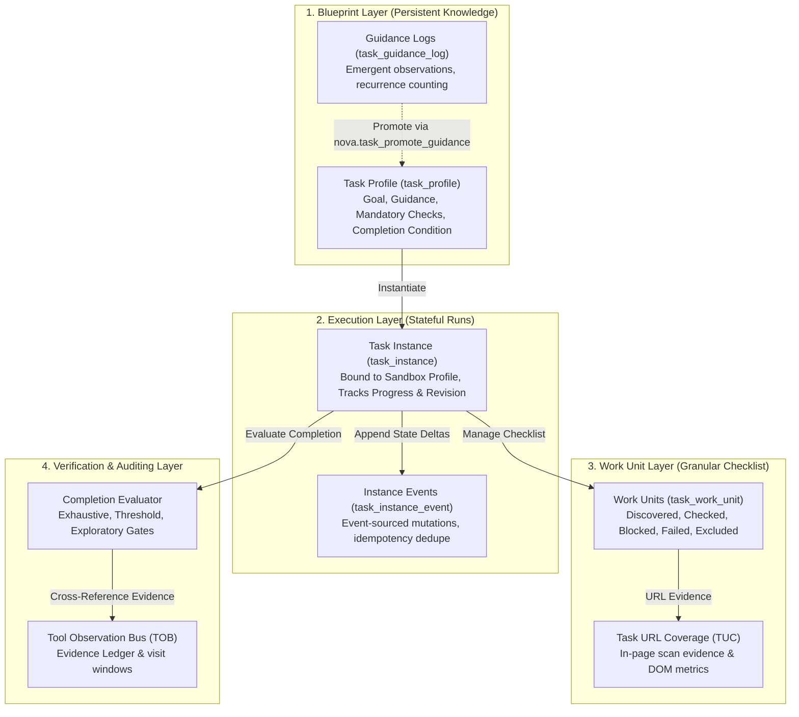
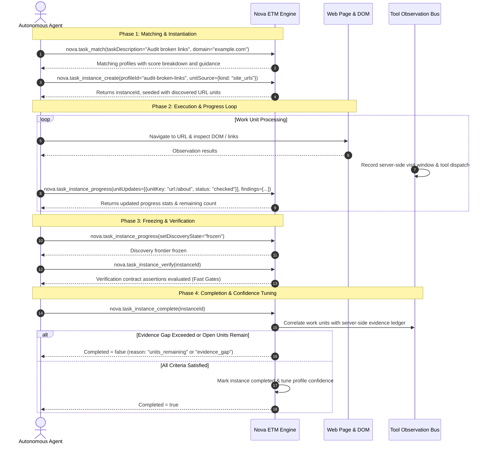

# Episodic Task Memory (ETM)

> [!NOTE]
> **Episodic Task Memory (ETM)** provides persistent, structured task memory for autonomous agents in Nova AI Workspace. By decoupling reusable task definitions (**Profiles**) from concrete execution runs (**Instances**), tracking granular work units, enforcing deterministic completion gates, and auditing server-side execution evidence via the Tool Observation Bus (TOB), ETM eliminates session-bound amnesia and ensures large-scale tasks are completely executed before being declared finished.

---

## 1. Executive Summary: The Problem of Session-Bound Amnesia

Traditional LLM agent workflows suffer from critical structural weaknesses when handling long-running or multi-session tasks:

* **Session Amnesia:** An agent assigned to audit 120 web pages checks 17 before its token limit or session ends. The next agent started in a new session has no structured recollection of which pages were already checked, what defects were identified, or what work remains open.
* **Premature Completion Hallucinations:** When confronted with repetitive tasks, models frequently declare victory prematurely, generating an eloquent concluding narrative while skipping large portions of the actual work.
* **Lack of Progress Serialization:** Without an explicit state machine for work units and discovery frontiers, multi-agent collaboration or interrupted runs inevitably result in duplicate effort or missed items.

### The Guiding Invariant
> *"The final report is the byproduct, not the goal."*

In Nova, task completion is never evaluated against the agent's prose. It is evaluated deterministically by Nova against the instance's **completion condition**, the verified state of its **work units**, its **mandatory checks**, and **server-side tool evidence**.

---

## 2. Nova Knowledge Taxonomy

Episodic Task Memory is a core pillar of Nova's multi-layered cognitive architecture. Each memory system addresses a distinct operational dimension:

| Subsystem | Scope | Core Question Answered | Primary MCP Tools |
| :--- | :--- | :--- | :--- |
| **[ETM (Episodic Task Memory)](README.md)** | Task & Run | *What is this task, what remains to be done, and has this run satisfied its completion conditions?* | `nova.task_match`, `nova.task_instance_create`, `nova.task_instance_progress`, `nova.task_instance_complete` |
| **[TUC (Task URL Coverage)](../task-url-coverage-tuc/README.md)** | URL Units | *Which specific URLs within the task instance have verified inspection evidence?* | `nova.coverage_scan`, `nova.task_instance_reconcile_coverage` |
| **[PKS (Procedural Memory)](../phenomenological-knowledge-store-pks/README.md)** | Site / Platform | *How does this website function, what selectors are reliable, and what playbooks handle common dialogs?* | `nova.pks_get`, `nova.pks_upsert`, `nova.phenomenon_apply` |
| **[OK (Operational Knowledge)](../operational-knowledge-ok/README.md)** | Sandbox / Target | *What is the live operational state of this target (login status, active AI model, account tier)?* | `nova.ok_observe`, `nova.ok_signal_schema` |
| **[Operator Notes](../operator-notes/README.md)** | Operator Guidance | *What human rules, preferences, or secrets govern agent behavior in this workspace?* | `nova.operator_notes_store`, `nova.operator_notes_query` |
| **[Domain Notes](../domain-notes/README.md)** | Web Domain | *What site-specific guidelines, credentials, or warnings apply to this specific host?* | `nova.domain_note`, `nova.domain_notes_list` |
| **[TOB (Tool Observation Bus)](../../tool-observation-bus-tob/README.md)** | Server Audit | *What tools did the agent actually call, and do visit windows back up the agent's claims?* | Internal Evidence Ledger, `WaitForOkFlushAsync` |

---

## 3. Core Architecture: Profiles, Instances & Units

ETM organizes task knowledge into three distinct layers:

1. **Task Profile:** The reusable specification. Defines the task type, goal, curated operational rules (`stableGuidance`), mandatory checkpoints, and completion rules.
2. **Task Instance:** A stateful execution run. Tracks unit counts, findings, current discovery status, and resume data.
3. **Work Units:** Discrete checklist items that transition through a rigorous state machine (`discovered` $\rightarrow$ `checked`, `excluded`, `blocked`, `failed`).
4. **Events & Idempotency:** Changes to an instance are event-sourced through `task_instance_event` with client UUID deduplication.

---

## 4. End-to-End Execution Sequence

---

## 5. Complete MCP Tool Reference Suite

Episodic Task Memory exposes 15 specialized tools in Nova's `system_tools` bundle, grouped into four functional categories:

### 1. Profiles & Discovery
* **`nova.task_search`:** Free-text search over stored task profiles.
* **`nova.task_match`:** Multi-factor scoring engine evaluating task descriptions against profiles with detailed score breakdowns.
* **`nova.task_profiles`:** Lists available profiles, filtered by `taskType`, `domain`, `platform`, or archival status.
* **`nova.task_profile_get`:** Fetches the complete JSON definition, usage metrics, and guidance of a specific profile.
* **`nova.task_profile_upsert`:** Creates or updates a task profile specification.

### 2. Instance Lifecycle
* **`nova.task_instance_create`:** Initializes an execution run from a profile or ad-hoc goal, with optional automated unit ingestion (`unitSource`).
* **`nova.task_instance_get`:** Reconstructs the complete instance state, open units, findings, and mandatory check status for resuming.
* **`nova.task_instance_abort`:** Terminates an instance when external blockers prevent satisfying completion criteria.

### 3. Progress Tracking & Verification
* **`nova.task_instance_progress`:** Reports incremental progress, unit state transitions, findings, mandatory check updates, and frontier freezing.
* **`nova.task_instance_verify`:** Runs programmatic verification contract assertions (Fast Gates) prior to completion.
* **`nova.task_instance_complete`:** Intercepts completion requests and evaluates deterministic completion conditions and TOB evidence.

### 4. Guidance & Continuous Learning
* **`nova.task_guidance_log_add`:** Logs emergent operational tips during an active run without mutating the profile.
* **`nova.task_guidance_logs`:** Queries logged operational observations.
* **`nova.task_promotion_candidates`:** Identifies recurring guidance entries eligible for promotion.
* **`nova.task_promote_guidance`:** Atomically merges accepted guidance into a task profile, incrementing its revision.

---

## 6. Operational Invariants & Safety Guarantees

1. **Irreversible Frontier Freezing:** Once an instance transitions its `discoveryState` to `'frozen'`, it **cannot** transition back to `'partial'` or `'unknown'`. Agents cannot circumvent exhaustive checks by reopening discovery when difficult units are encountered.
2. **Terminal Unit States:** Work units marked `checked` or `excluded` enter terminal states that cannot be reverted to `discovered` or `blocked`.
3. **Empty Frontier Protection:** In `exhaustive` mode, an instance with zero discovered units (`counts.Total == 0`) is strictly rejected with `no_units_discovered`. An agent cannot freeze an empty list and claim completion.
4. **Zero Blocked/Failed Completion:** Exhaustive completion requires zero units in `blocked` or `failed` states (`units_blocked_or_failed`). Blocked units must either be resolved or explicitly waived as `excluded` with recorded rationale.
5. **Tool Observation Bus (TOB) Evidence Gap Blocking:** When `evidencePolicy.mode = "block"`, Nova cross-references claimed checked units against server-side tool calls and visit windows. If ungrounded claims exceed `maxGapPercent`, completion is rejected with `evidence_gap`.
6. **Task URL Coverage (TUC) Gate:** If URL units remain open in an instance, `nova.task_instance_complete` rejects completion with `url_units_remaining`.
7. **Dynamic Confidence Tuning:** Successful completions and terminal failures automatically trigger `TaskConfidenceTuner`, adjusting profile confidence via a deterministic formula combining completion rate, match acceptance rate, and usage volume.

---

## 7. Deep-Dive Guides

For exhaustive architectural breakdowns, schemas, and implementation details, explore the dedicated guides:

* **[Task Profiles, Matching Engine & Confidence Tuning](task-profiles-and-matching.md)** — Profile blueprints, multi-factor scoring algorithms, dynamic thresholds, and confidence tuning formulas.
* **[Task Instances, Work Units & Progress Tracking](instances-work-units-and-progress.md)** — Execution runs, work unit and discovery state machines, automated unit ingestion, event sourcing, and multi-session resuming.
* **[Completion Evaluator, TOB Evidence & Verification Contracts](completion-evaluator-and-evidence-verification.md)** — Exhaustive/threshold/exploratory modes, mandatory check cross-referencing, verification contracts, and TOB evidence ledgers.
* **[Guidance Lifecycle, Promotion & Scheduled Tasks](guidance-lifecycle-and-scheduled-execution.md)** — Staged guidance lifecycle, recurrence deduplication, promotion pipelines, scheduled cron tasks, and reflection gates.

---

[Learning Overview](../README.md) · [All Core Features](../../README.md)
