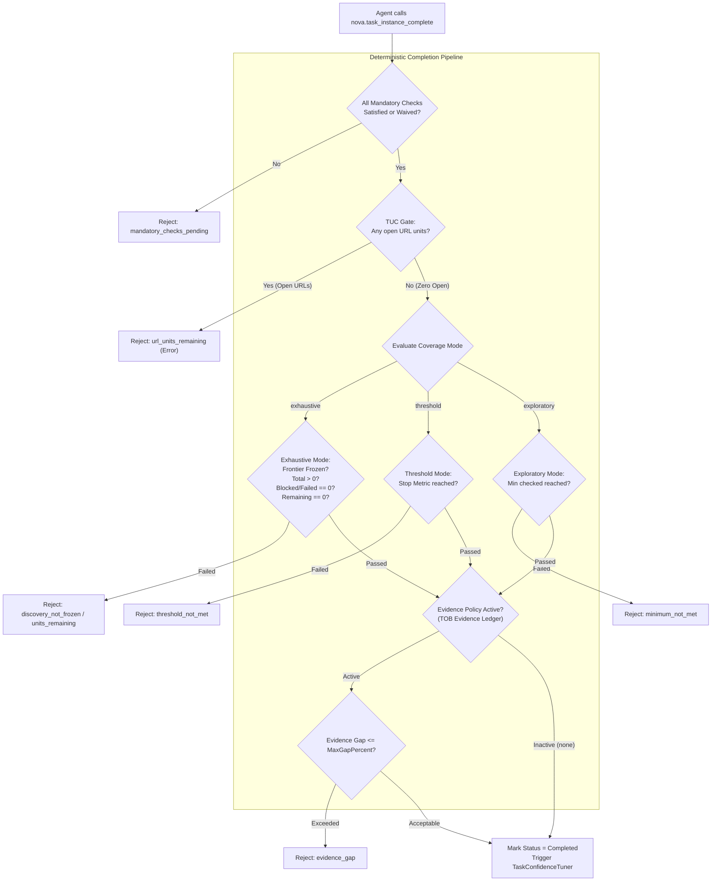
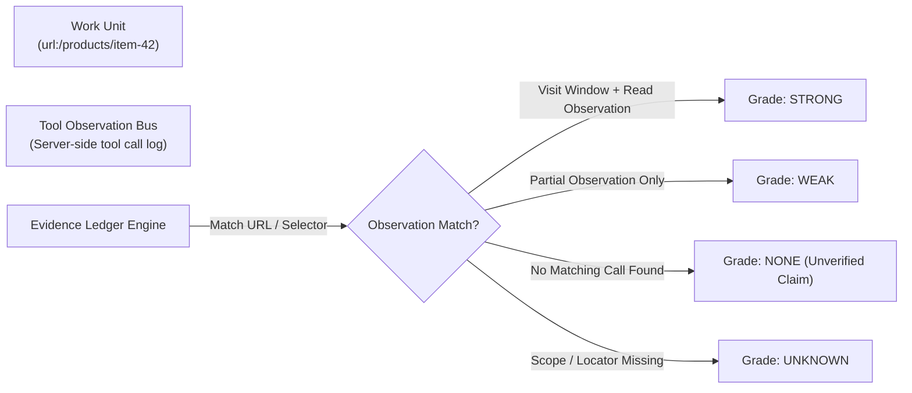

# Completion Evaluator, TOB Evidence & Verification Contracts

> [!NOTE]
> This guide details the rigorous verification core of Episodic Task Memory (ETM): why task completion is governed by deterministic condition evaluation rather than model narratives, the three coverage modes, mandatory check cross-referencing, verification contracts, and Tool Observation Bus (TOB) evidence auditing.

---

## 1. The Core Philosophy: Output is a Byproduct

In traditional LLM agent architectures, completion is determined purely by the agent itself: when the model decides it has finished, it outputs a concluding message and halts.

In complex web workflows, this "self-attested completion" leads to catastrophic failure modes:
* **Premature Abandonment:** An agent checks 15 out of 100 pages, encounters a repetitive pattern, hallucinatingly assumes all remaining pages are identical, and declares: *„Audit completed successfully.“*
* **Invisible Failure Hiding:** An agent fails to access 10 pages due to authentication redirects or bot detection, omits them from its final text, and claims full coverage.
* **Unperformed Checks:** Critical mandatory verifications (e.g. clearing CDN cache, verifying database balance, or asserting that zero 500 errors occurred) are skipped.

**The ETM Guiding Invariant:**
> *"The final report is the byproduct, not the goal."*

In Nova, calling `nova.task_instance_complete` does **not** unconditionally mark a task finished. Instead, Nova's **Task Completion Evaluator** intercepts the request and verifies the instance against its declared completion condition, work unit states, mandatory checks, and server-side execution evidence.



---

## 2. The Three Coverage Modes

Every task completion condition defines one of three operational modes:

| Coverage Mode | Intended Use Case | Strict Criteria for Completion |
| :--- | :--- | :--- |
| **`exhaustive`** | Complete audits, data migrations, site-wide link checks, sitemap verifications. | 1. `discoveryState == 'frozen'`<br/>2. Discovered units $> 0$<br/>3. Blocked or failed units $== 0$<br/>4. Open remaining units $== 0$<br/>5. All mandatory checks satisfied. |
| **`threshold`** | Sampling checks, targeted bug hunting, lead generation, batch processing. | 1. Specified `stopMetric` reaches `stopValue`<br/>2. All mandatory checks satisfied. |
| **`exploratory`** | Open-ended research, surface discovery, interactive debugging. | 1. Minimum checked units threshold satisfied (default 1)<br/>2. All mandatory checks satisfied. |

### Exhaustive Mode Invariants
* **Non-Empty Frontier (`no_units_discovered`):** An agent cannot freeze discovery on an empty list and claim completion.
* **Zero Blocked or Failed Units (`units_blocked_or_failed`):** Units that encountered captchas, network drops, or broken assertions must either be successfully resolved, or explicitly transitioned to `excluded` with a recorded rationale.
* **Frontier Lock (`discovery_not_frozen`):** The agent must have explicitly frozen discovery via `nova.task_instance_progress(discoveryState="frozen")`.

### Threshold Mode Metrics
The `stopMetric` parameter supports three evaluation targets:
1. `checked_units`: Requires at least $N$ units to be transitioned to `checked`.
2. `distinct_findings`: Requires finding at least $N$ unique defects or issues.
3. `all_units_processed`: Enforces that all currently discovered units are processed (checked or excluded) without requiring discovery to be frozen upfront.

---

## 3. Mandatory Checks Cross-Referencing

Tasks frequently require specific prerequisites that are distinct from individual work units (e.g. *„Download baseline database“*, *„Assert zero 500 responses in server logs“*).

Profiles declare mandatory checks:
```json
[
  { "checkId": "db_backup_verified", "description": "Verify backup snapshot exists" },
  { "checkId": "cache_purged", "description": "Purge edge cache after deployment" }
]
```

### Verification Logic
1. During evaluation, Nova cross-references the defined `checkId` list in the profile context against the instance's active `mandatoryChecksState`.
2. Any defined check not explicitly marked `satisfied`, `waived`, or `not_applicable` is treated as **implicitly pending**.
3. If pending checks remain, completion is rejected with reason `mandatory_checks_pending`, listing the exact missing check IDs.

---

## 4. Verification Contracts & Fast Gates

Before invoking `nova.task_instance_complete`, an agent can run `nova.task_instance_verify` to evaluate profile-defined **Verification Contracts**.

A verification contract specifies programmatic assertions that validate system integrity:

```json
{
  "steps": [
    {
      "stepId": "check_broken_links_empty",
      "gate": "fast",
      "required": true,
      "assertionType": "empty_result",
      "targetRef": "findings:404_errors"
    },
    {
      "stepId": "verify_checkout_status",
      "gate": "deep",
      "required": false,
      "assertionType": "field_equals",
      "targetRef": "order:checkout_state",
      "expectedValue": "confirmed"
    }
  ]
]
```

### Assertion Types & Gate Enforcement
* **Assertion Types:**
  * `empty_result`: Asserts that an array of error findings is empty.
  * `has_results`: Asserts that expected deliverables were generated.
  * `field_match`: Regex match against target output fields.
  * `field_equals`: Exact equality check.
* **Gate Types:**
  * `fast`: Evaluated immediately in-process. If a `required` fast-gate step fails, `task_instance_complete` is rejected with `verification_failed`.
  * `deep`: Long-running external verification (e.g. full integration test run).
  * `restricted`: Requires human review or elevated privileges.

---

## 5. Tool Observation Bus (TOB) Evidence Ledger

To eliminate the vulnerability of agents simply marking units as `checked` without actually visiting the underlying web pages or running tools, Nova correlates ETM work units with the **Tool Observation Bus (TOB)**.



### The Four Evidence Grades
1. **`strong`:** The unit has both an active **visit window** (tab was navigated to the target URL for a sustained duration) and a verified **read-like observation** (`read_dom`, `read_text`, `perceive`, or `capture_screenshot`).
2. **`weak`:** Tool calls occurred against the target, but lacked either a sustained visit window or deep reading inspection.
3. **`none`:** The agent marked the unit as `checked`, but TOB found **zero corresponding tool calls** in the server logs. This indicates an ungrounded or hallucinated claim.
4. **`unknown`:** The unit lacked deterministic locators or server-side projection was incomplete.

### Evidence Policy Enforcement
Profiles can configure an `evidencePolicy`:
```json
{
  "mode": "block",
  "maxGapPercent": 10,
  "treatUnknownAs": "pass"
}
```

* If `mode = "block"`, Nova calculates the discrepancy:
  $$\text{GapPercent} = \frac{\text{ClaimedChecked} - \text{ObservedChecked}}{\text{ClaimedChecked}} \times 100$$
* If $\text{GapPercent} > \text{MaxGapPercent}$, `nova.task_instance_complete` is rejected with reason `evidence_gap`.

---

## 6. Task URL Coverage (TUC) Blocking Gate

When a task instance operates on URL work units (`unitSource: site_urls`), ETM activates the **TUC Coverage Gate**:

* If open URL units remain in the task, calling `nova.task_instance_complete` returns:
  ```json
  {
    "ok": false,
    "completed": false,
    "reason": "url_units_remaining",
    "message": "3 URL coverage unit(s) remain open. Use nova.coverage_scan or explicitly exclude non-applicable URLs before completing."
  }
  ```
* Under strict gate modes (`AagGateMode.Block`), this condition triggers a blocking error, ensuring the agent cannot terminate its workflow while pages in the defined scope remain unvisited.

---

## Related Documentation

* **[Episodic Task Memory Overview](README.md)** — Architectural hub, taxonomy, and system integrations.
* **[Task Profiles & Matching Engine](task-profiles-and-matching.md)** — Profile blueprints, multi-factor scoring, and confidence tuning.
* **[Instances, Work Units & Progress](instances-work-units-and-progress.md)** — Task execution runs, frontier freezing, and state transitions.
* **[Guidance Lifecycle & Scheduled Execution](guidance-lifecycle-and-scheduled-execution.md)** — Logging emergent tips, promotion pipelines, and cron triggers.
* **[Task URL Coverage (TUC)](../task-url-coverage-tuc/README.md)** — URL work units, trusted scan evidence, and coverage gates.
* **[Tool Observation Bus (TOB)](../../tool-observation-bus-tob/README.md)** — Immutable execution log, claims, and visit windows.
