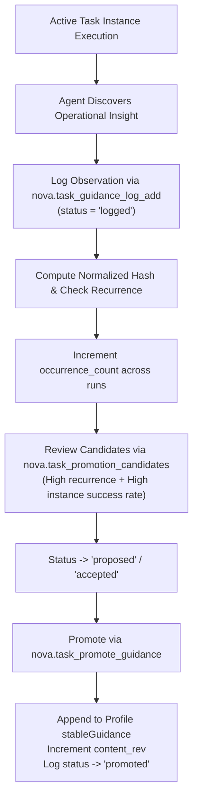
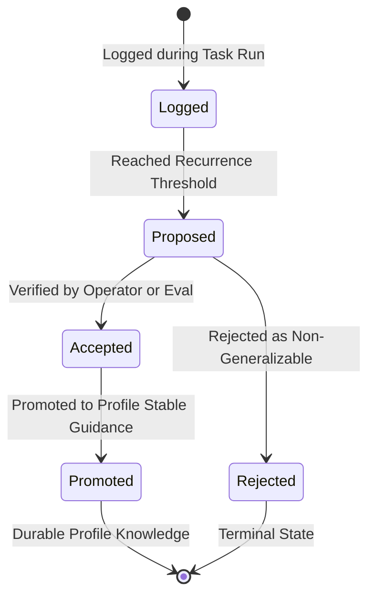
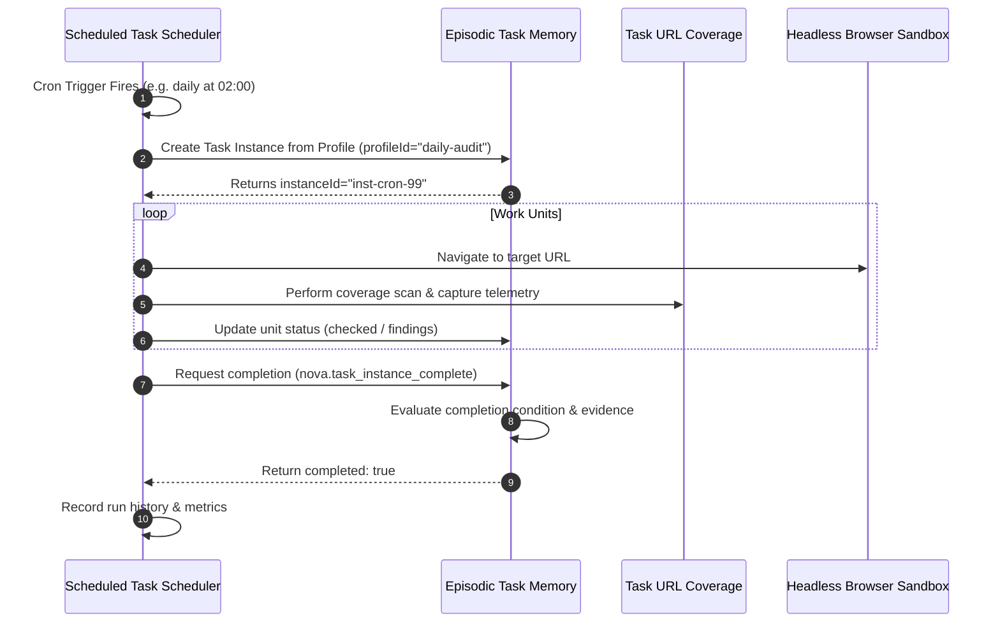

# Guidance Lifecycle, Promotion & Scheduled Tasks

> [!NOTE]
> This guide details the evolutionary learning loop of Episodic Task Memory (ETM): how emergent operational tips are captured without corrupting stable profiles, how recurrence metrics promote battle-tested guidance, and how headless scheduled tasks execute recurring ETM instances.

---

## 1. The Guidance Feedback Loop

When agents execute complex web tasks, they frequently discover non-obvious operational insights (e.g. *„Clicking the sort dropdown requires a 500 ms pause for the AJAX grid to settle“*, or *„The logout button is hidden under an expandable sub-menu on mobile viewports“*).

If agents were permitted to edit task profiles directly during active runs, profiles would quickly become polluted with transient workarounds, hallucinated rules, or session-specific idiosyncrasies.

ETM resolves this dilemma through a **staged guidance lifecycle**:



---

## 2. Guidance Log States & Deduplication

Emergent observations are stored in `task_guidance_log` and transition through five lifecycle states:



| State | Description |
| :--- | :--- |
| `logged` | Initial state. An agent observed an insight and recorded it during a run. |
| `proposed` | The insight has recurred across multiple runs and is nominated for promotion. |
| `accepted` | The guidance has been validated and approved for inclusion. |
| `rejected` | The guidance was deemed invalid, redundant, or overly specific to a single session. |
| `promoted` | The guidance has been atomically merged into the profile's `stableGuidance`, and its revision was incremented. |

### Normalized Hash Deduplication
To prevent log spamming, Nova computes a `normalized_hash` from the guidance content:
* Whitespace, casing, and minor punctuation variations are normalized.
* If an identical insight is logged again in a future run, Nova does not create duplicate rows; it increments the `occurrence_count` of the existing record and updates `updated_at`.

---

## 3. The Promotion Pipeline

Promoting guidance transforms empirical runtime observations into durable, trusted institutional memory.

### Step 1: Discovering Promotion Candidates
Agents or automated evaluators call `nova.task_promotion_candidates`:

```json
{
  "profileId": "shopify-inventory-sync",
  "minOccurrences": 3
}
```

#### Response Example
```json
{
  "content": [{ "type": "text", "text": "Task promotion candidates: 1 candidate(s) ready." }],
  "structuredContent": {
    "ok": true,
    "candidates": [
      {
        "guidanceLogId": "guide-4a8b1c",
        "profileId": "shopify-inventory-sync",
        "guidanceKind": "selector_strategy",
        "occurrenceCount": 4,
        "payload": {
          "advice": "Use aria-label='Save variant' instead of button.submit to prevent triggering background batch sync"
        },
        "successCorrelation": 1.0,
        "status": "proposed"
      }
    ]
  }
}
```

### Step 2: Promoting to Stable Guidance
Calling `nova.task_promote_guidance` executes an atomic database transaction:
1. Appends the advice string to the profile's `stableGuidance` array.
2. Increments the profile's `contentRev` by 1.
3. Updates the guidance log's `status` to `promoted` and records `promotedToProfileRev`.
4. Subsequent task instances instantiated from this profile automatically receive the newly promoted advice in their effective context.

---

## 4. Integration with Scheduled Tasks

ETM provides the core state engine for **Scheduled Tasks** (Nova's built-in cron and automation scheduler). When a scheduled job runs headless in the background, it executes through an ETM instance:



### Benefits of ETM for Scheduled Jobs
* **Zero Lost Work on Crash:** If a background runner process terminates unexpectedly, the next scheduled run detects the unfinished instance and can resume seamlessly.
* **Deterministic Completion:** Background jobs cannot exit early with false success; the completion evaluator enforces all stop metrics and mandatory checks.
* **Telemetry & History:** Every scheduled run produces full event logs, finding tallies, and TOB evidence records.

---

## 5. The Reflection Gate Breakpoint

At critical execution milestones, Nova's **Agent Awareness Gate (AAG) Reflection Gate** monitors tool dispatches to ensure agents do not discard valuable knowledge.

When an agent calls `nova.task_instance_complete`:
1. The Reflection Gate inspects the interaction depth and error history of the session.
2. If the agent overcame significant UI friction or encountered new authentication flows, the gate issues a **reflection notice**, advising the model:
   > *„You resolved complex selector errors during this task. Consider persisting these insights to PKS (`nova.pks_upsert`) or logging guidance (`nova.task_guidance_log_add`) before closing the instance.“*
3. This creates a self-reinforcing flywheel: every completed task instance leaves behind higher-quality procedural playbooks and refined task profiles.

---

## 6. MCP Tool Reference: Guidance & Promotion

### 1. `nova.task_guidance_log_add`
Records an emergent operational observation during task execution.

| Parameter | Type | Required | Description |
| :--- | :--- | :---: | :--- |
| `profileId` | `string` | No | Associated task profile ID. |
| `instanceId` | `string` | No | Active instance ID where the observation was made. |
| `guidanceKind` | `string` | **Yes** | Category: `'selector_strategy'`, `'timing'`, `'navigation'`, `'error_recovery'`, `'domain_behavior'`. |
| `payload` | `object` | **Yes** | Structured advice payload (e.g. `{ "advice": "..." }`). |
| `sourceRef` | `string` | No | Optional reference to the URL or tool call that triggered the insight. |

---

### 2. `nova.task_guidance_logs`
Queries logged guidance with optional filters for `profileId`, `guidanceKind`, and `status`.

---

### 3. `nova.task_promotion_candidates`
Lists guidance logs that meet recurrence and success thresholds, eligible for promotion to stable profile guidance.

---

### 4. `nova.task_promote_guidance`
Promotes an accepted guidance log entry directly into a task profile's permanent guidance.

```json
{
  "guidanceLogId": "guide-4a8b1c",
  "profileId": "shopify-inventory-sync"
}
```

#### Response Example
```json
{
  "content": [{ "type": "text", "text": "Guidance guide-4a8b1c successfully promoted to profile shopify-inventory-sync (rev 4)." }],
  "structuredContent": {
    "ok": true,
    "profileId": "shopify-inventory-sync",
    "contentRev": 4,
    "promotedCount": 1
  }
}
```

---

## Related Documentation

* **[Episodic Task Memory Overview](README.md)** — Architectural hub, taxonomy, and system integrations.
* **[Task Profiles & Matching Engine](task-profiles-and-matching.md)** — Profile blueprints, multi-factor scoring, and confidence tuning.
* **[Instances, Work Units & Progress](instances-work-units-and-progress.md)** — Task execution runs, frontier freezing, and state transitions.
* **[Completion Evaluator & Evidence Verification](completion-evaluator-and-evidence-verification.md)** — Completion modes, TOB evidence ledgers, and gates.
* **[Phenomenological Knowledge Store (PKS)](../phenomenological-knowledge-store-pks/README.md)** — Procedural UI memory and playbooks.
