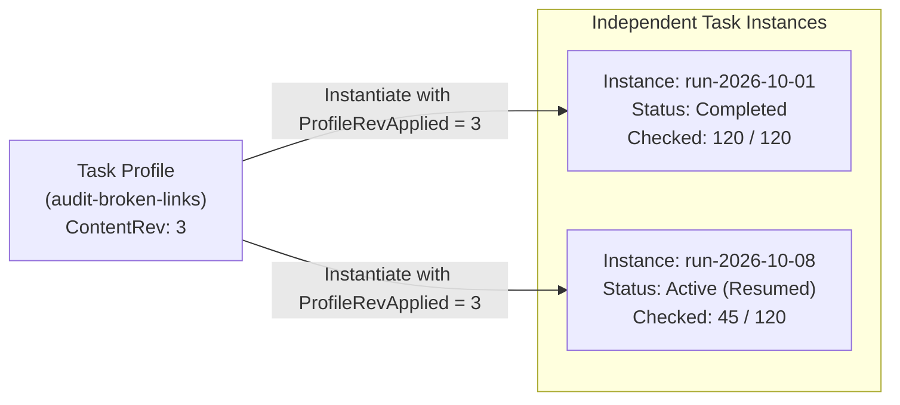
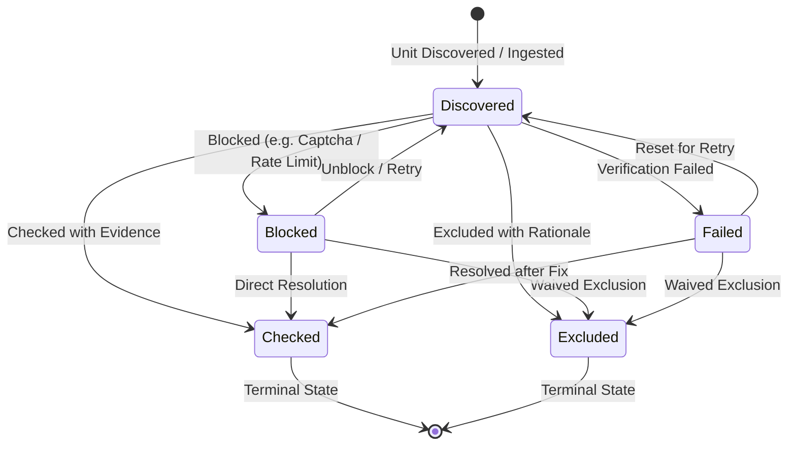
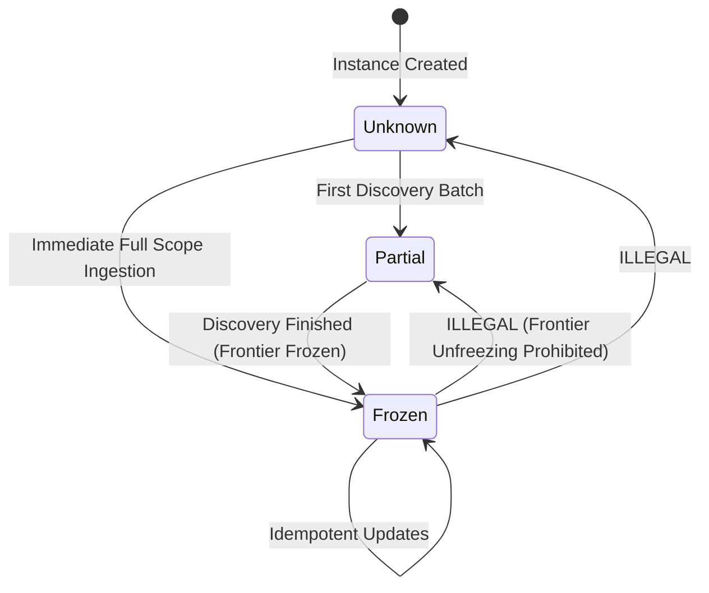
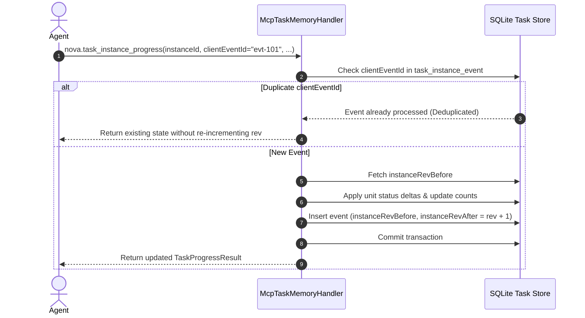

# Task Instances, Work Units & Progress Tracking

> [!NOTE]
> This guide details the execution mechanics of Episodic Task Memory (ETM): how task instances encapsulate individual runs, how work units model discrete checklist items, the discovery and unit state machines, event-sourced optimistic concurrency, and resuming tasks across agent sessions.

---

## 1. Profiles vs. Instances: Separation of Concerns

A fundamental invariant of ETM is the strict distinction between **declarative knowledge** and **operational execution**:

* **Task Profile (The Blueprint):** Reusable knowledge defining what the task requires, stable guidance, mandatory checks, and completion conditions. Profiles persist across runs and are shared across sessions.
* **Task Instance (The Execution Run):** A concrete, stateful execution of a profile. It binds the profile to a specific active browser sandbox, tracks discovered work units, records findings, logs progress events, and stores resume states.



---

## 2. Work Unit State Machine

A **Work Unit** represents a discrete, trackable item of work within a task instance (e.g. an individual URL to crawl, a form field to test, an invoice to verify, or a database record to reconcile).

### Unit States & Transitions



| State | Classification | Description |
| :--- | :--- | :--- |
| `discovered` | Non-Terminal | The unit has been identified and added to the frontier, but has not yet been processed. |
| `checked` | **Terminal** | The unit has been inspected and satisfied. Cannot be transitioned to any other state. |
| `excluded` | **Terminal** | The unit was determined to be out of scope or non-applicable, accompanied by an explicit reason. |
| `blocked` | Non-Terminal | The unit cannot be completed due to an external obstruction (e.g. login wall, rate limit). Can transition back to `discovered` for retry. |
| `failed` | Non-Terminal | The unit failed verification. Blocks exhaustive completion unless resolved or explicitly excluded. |

---

## 3. The Discovery Frontier State Machine

To prevent agents from prematurely claiming that a task is finished before discovering all relevant items, ETM enforces an irreversible **Discovery State Machine**:



* **`unknown`:** Initial default state. The total volume of work is completely undetermined.
* **`partial`:** Work units are actively being discovered or paginated. The agent is finding new items as it navigates.
* **`frozen`:** The discovery phase is officially closed. The frontier of work is locked.

> [!IMPORTANT]
> **Frontier Unfreezing is Prohibited:** Once an instance reaches `discoveryState = 'frozen'`, it **cannot** transition back to `partial` or `unknown`. This guarantees that an agent cannot circumvent exhaustive completion checks by re-opening the discovery window when encountering difficult units.

---

## 4. Automated Unit Ingestion via `unitSource`

While agents can report units dynamically, ETM integrates directly with Nova's crawl and sitemap engine to populate initial work units automatically upon creation:

```json
{
  "profileId": "accessibility-audit-v1",
  "unitSource": {
    "kind": "site_urls",
    "domain": "docs.nova-cognitive.com",
    "filterPattern": "^/docs/core-features/.*"
  }
}
```

When `unitSource.kind = "site_urls"` is passed:
1. Nova queries its internal indexed URL store for the matching domain and pattern.
2. Creates one `task_work_unit` per matching URL with `unitKind = "url"` and `status = "discovered"`.
3. Automatically sets `discoveredUnitCount` to the ingested count.
4. If the URL store represents an exhaustive crawl, the agent can immediately freeze discovery.

---

## 5. Event Sourcing & Optimistic Concurrency

All modifications to a task instance are captured as immutable delta records in `task_instance_event`. This architecture guarantees complete auditability and prevents race conditions between parallel tools or multi-agent collaborators.



### Key Concurrency Invariants
* **`clientEventId` Deduplication:** Clients supply an idempotency key with every progress call. Network retransmissions or retries return the committed result without applying duplicate state shifts.
* **Revision Locking (`instanceRev`):** Every mutation increments `instanceRev`. If an agent attempts to mutate state against an outdated revision, the transaction rejects stale writes.
* **Delta Serialization:** `deltaJson` preserves the exact diff of units, findings, and mandatory check updates for historical auditing and recovery.

---

## 6. Resuming Multi-Session Workflows

When an agent's context window closes or a long-running audit is handed over to a successor agent, the task state is fully reconstructed via `nova.task_instance_get`:

```json
{
  "instanceId": "inst-8f2a1b9c"
}
```

#### Snapshot Response
```json
{
  "content": [{ "type": "text", "text": "Task instance: inst-8f2a1b9c (active), 45/120 units checked (37.5%)." }],
  "structuredContent": {
    "ok": true,
    "instance": {
      "instanceId": "inst-8f2a1b9c",
      "profileId": "audit-broken-links",
      "status": "active",
      "discoveryState": "frozen",
      "discoveredUnitCount": 120,
      "checkedUnitCount": 45,
      "remainingUnitCount": 75,
      "percentComplete": 37.5,
      "completionAllowed": false,
      "mandatoryChecksState": {
        "sitemap_downloaded": "satisfied",
        "cdn_cache_cleared": "pending"
      },
      "openUnits": [
        { "unitKey": "url:/docs/setup", "status": "discovered" },
        { "unitKey": "url:/docs/api", "status": "discovered" }
      ],
      "recentFindings": [
        { "findingKey": "404_image", "detail": "Missing logo on /about" }
      ]
    }
  }
}
```

The resuming agent receives immediate clarity:
1. Which units remain open.
2. Which mandatory checks still require execution.
3. What findings have already been identified.
4. Whether discovery has already been frozen.

---

## 7. MCP Tool Reference: Instances & Progress

### 1. `nova.task_instance_create`
Spawns a new execution run from an existing profile or ad-hoc goal.

| Parameter | Type | Required | Description |
| :--- | :--- | :---: | :--- |
| `profileId` | `string` | No | ID of the profile to instantiate. |
| `goal` | `string` | No | Ad-hoc goal (if creating without a profile). |
| `unitSource` | `object` | No | Source configuration for automated unit discovery (e.g. `kind: site_urls`). |
| `initialUnits` | `array[object]`| No | Initial list of work units to seed. |
| `targetUrl` | `string` | No | Primary web URL associated with this run. |

---

### 2. `nova.task_instance_progress`
The workhorse tool for reporting incremental progress, marking units, adding findings, and updating discovery states.

| Parameter | Type | Required | Description |
| :--- | :--- | :---: | :--- |
| `instanceId` | `string` | **Yes** | Active task instance identifier. |
| `clientEventId` | `string` | **Yes** | Client-generated UUID for idempotency. |
| `discoveryState` | `string` | No | New discovery state: `'partial'` or `'frozen'`. |
| `unitUpdates` | `array[object]`| No | List of unit transitions (e.g. `[{ "unitKey": "...", "status": "checked" }]`). |
| `newUnits` | `array[object]`| No | Newly discovered work units. |
| `findings` | `array[object]`| No | Structured findings or issues discovered during inspection. |
| `mandatoryCheckUpdates`| `object` | No | Map of `checkId` to state (`'satisfied'`, `'failed'`, `'waived'`). |

---

### 3. `nova.task_instance_abort`
Terminates an instance that cannot satisfy its completion criteria due to permanent external blockers.

```json
{
  "instanceId": "inst-8f2a1b9c",
  "reason": "Target site returned HTTP 503 Maintenance Mode indefinitely",
  "markRemainingAs": "blocked"
}
```

---

## Related Documentation

* **[Episodic Task Memory Overview](README.md)** — Architectural hub, taxonomy, and system integrations.
* **[Task Profiles & Matching Engine](task-profiles-and-matching.md)** — Profile blueprints, multi-factor scoring, and confidence tuning.
* **[Completion Evaluator & Evidence Verification](completion-evaluator-and-evidence-verification.md)** — Completion modes, TOB evidence ledgers, and gates.
* **[Guidance Lifecycle & Scheduled Execution](guidance-lifecycle-and-scheduled-execution.md)** — Logging emergent tips, promotion pipelines, and cron triggers.
