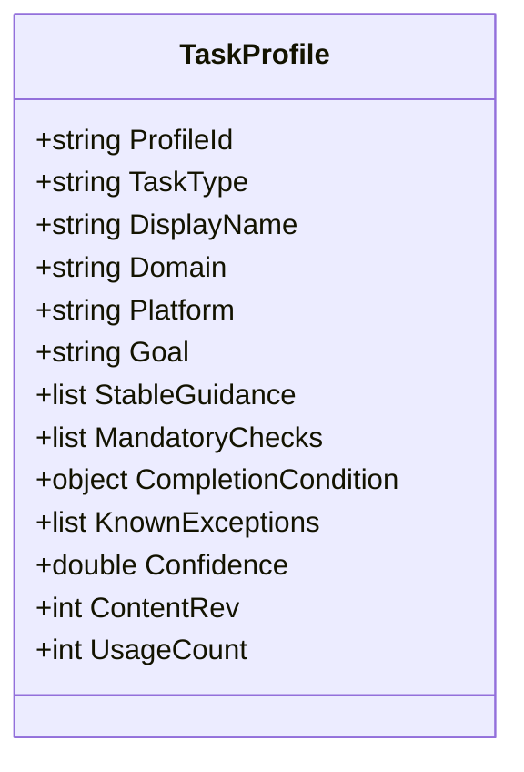
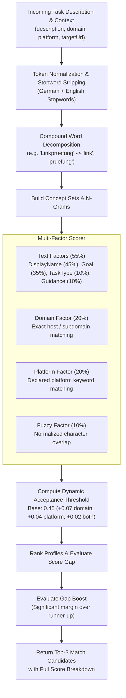
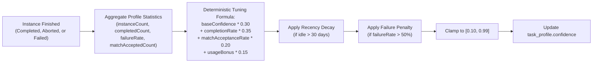

# Task Profiles, Matching Engine & Confidence Tuning

> [!NOTE]
> This guide details the foundational blueprint of Episodic Task Memory (ETM): how task profiles define recurring operational workflows, how the multi-factor matching engine pairs agent intents to existing profiles, and how dynamic confidence tuning adjusts profile trustworthiness from real execution signals.

---

## 1. Anatomy of a Task Profile

A **Task Profile** represents a reusable, domain-specific or platform-specific operational specification. Unlike one-off chat prompts, a profile captures not only the intended outcome, but also the structural constraints, mandatory verifications, known failure modes, and completion criteria required to execute the task reliably.

### Profile Schema & Key Fields



| Field | Type | Description |
| :--- | :--- | :--- |
| `profileId` | `string` | Unique, stable identifier (e.g. `audit-broken-links-v2`, `shopify-order-sync`). |
| `taskType` | `string` | Broad classification (e.g. `audit`, `reconciliation`, `extraction`, `migration`, `form_submission`). |
| `displayName` | `string` | Human-readable title displayed in logs, search results, and match listings. |
| `domain` | `string?` | Optional website domain binding (e.g. `example.com`). Scopes the profile to a specific web property. |
| `platform` | `string?` | Optional platform binding (e.g. `shopify`, `jira`, `wordpress`, `github`). |
| `goal` | `string` | Concise statement of the ultimate operational objective. |
| `stableGuidance` | `array[string]` | Curated operational rules, tips, and selector strategies proven across prior runs. |
| `mandatoryChecks` | `array[object]` | Explicit verification checkpoints that must be satisfied before the task can be marked complete. |
| `completionCondition` | `object` | Deterministic completion contract defining coverage mode, unit kind, and stop criteria. |
| `knownExceptions` | `array[object]` | Documented edge cases, acceptable non-fatal errors, and bypass conditions. |
| `confidence` | `double` | Dynamic quality score between `0.10` and `0.99`, tuned automatically from execution history. |
| `contentRev` | `integer` | Monotonically increasing revision counter incremented upon guidance promotion or schema edits. |
| `usageCount` | `integer` | Lifetime counter of instances initiated from this profile. |

---

## 2. The Multi-Factor Task Matching Engine

When an agent receives an instruction or queries `nova.task_match`, Nova does not rely on opaque embedding approximations or brittle exact-string matching. It executes a **multi-factor deterministic scoring pipeline** that evaluates semantic and topological relevance.



### 1. Token Preprocessing & Compound Decomposition
- **Bilingual Stopword Filtering:** Filters high-frequency functional words across German and English (e.g. *der, die, das, mit, für, the, is, at, with, from*).
- **Compound Decomposition:** Decomposes concatenated terminology common in European languages (e.g. German compound nouns like *„Rechnungsprüfung“* $\rightarrow$ *„rechnung“*, *„prüfung“*).

### 2. Weighted Field Distribution
Relevance is calculated across four structured fields within the candidate profile:
$$\text{Score}_{\text{Fields}} = 0.45 \cdot \text{DisplayName} + 0.35 \cdot \text{Goal} + 0.10 \cdot \text{TaskType} + 0.10 \cdot \text{Guidance}$$

### 3. Topological Context Factors
Field matches are combined with topological environmental cues:
$$\text{FinalScore} = 0.55 \cdot \text{TextScore} + 0.20 \cdot \text{DomainScore} + 0.20 \cdot \text{PlatformScore} + 0.10 \cdot \text{FuzzyScore}$$

### 4. Dynamic Acceptance Thresholds
Rather than applying a static cutoff that either lets through noise or rejects valid general profiles, the acceptance threshold adapts dynamically based on query specificity:
$$\text{Threshold} = 0.45 + (0.07 \text{ if Domain provided}) + (0.04 \text{ if Platform provided}) + (0.02 \text{ if both provided})$$

### 5. Gap Boost Heuristic
If a top candidate scores slightly below the strict threshold (e.g. 0.42 against a 0.45 threshold) but exhibits a **substantial score gap** over the second-place candidate ($\Delta \ge 0.10$) with strong keyword overlap, Nova triggers a **Gap Boost**, safely accepting the clear winner while avoiding false-negative misses.

---

## 3. Dynamic Confidence Tuning

Every profile maintains a `confidence` metric ($0.10 \le c \le 0.99$). Rather than relying on static developer assertions, Nova recalculates profile confidence after every instance completion or terminal failure.



### The Tuning Formula
$$\text{Adjusted} = \text{Clamp}\Big(0.30 \cdot c_{\text{base}} + 0.35 \cdot \text{Rate}_{\text{completion}} + 0.20 \cdot \text{Rate}_{\text{matchAccept}} + 0.15 \cdot \text{Bonus}_{\text{usage}},\; 0.10,\; 0.99\Big)$$

1. **Completion Rate ($\text{Weight} = 0.35$):** The primary quality signal. Measures the proportion of started instances that successfully satisfied their completion condition.
2. **Match Acceptance Rate ($\text{Weight} = 0.20$):** Tracks how often agents accepted this profile when suggested during task matching.
3. **Usage Volume Bonus ($\text{Weight} = 0.15$):** Logarithmic scale rewarding battle-tested profiles:
   $$\text{Bonus}_{\text{usage}} = \min\left(\frac{\ln(\text{InstanceCount} + 1)}{\ln(51)},\; 1.0\right)$$
4. **Recency Decay:** If a profile has not been updated or used for over 30 days, a gentle decay factor ($1.0 \rightarrow 0.7$ over 365 days) is applied to prioritize actively maintained playbooks.
5. **High-Failure Dampening:** If the terminal failure rate exceeds 50%, an aggressive penalty dampens confidence:
   $$\text{Confidence} = \text{Confidence} \cdot \Big(1.0 - (\text{FailureRate} - 0.5) \cdot 0.4\Big)$$

---

## 4. MCP Tool Reference: Task Profiles

### 1. `nova.task_match`
Matches an agent's task description against stored profiles with an exhaustive mathematical score breakdown.

```json
{
  "taskDescription": "Audit all landing pages for broken links and 404 images",
  "domain": "acme-corp.com",
  "platform": "wordpress"
}
```

#### Response Example
```json
{
  "content": [{ "type": "text", "text": "Task match: 1 profile(s) accepted, top match: audit-broken-links (score 0.82)." }],
  "structuredContent": {
    "ok": true,
    "topMatch": {
      "profileId": "audit-broken-links",
      "displayName": "Broken Link & Resource Audit",
      "finalScore": 0.82,
      "accepted": true,
      "scoreBreakdown": {
        "displayNameScore": 0.88,
        "goalScore": 0.79,
        "taskTypeScore": 1.0,
        "domainContribution": 0.20,
        "platformContribution": 0.20,
        "thresholdUsed": 0.58,
        "evidenceMask": "D+P+K"
      }
    },
    "matches": [ ... ]
  }
}
```

---

### 2. `nova.task_profile_upsert`
Creates or updates an operational task profile.

| Parameter | Type | Required | Description |
| :--- | :--- | :---: | :--- |
| `profileId` | `string` | **Yes** | Stable profile identifier. |
| `taskType` | `string` | **Yes** | Broad operational classification. |
| `displayName` | `string` | **Yes** | Human-readable title. |
| `goal` | `string` | **Yes** | Operational objective description. |
| `domain` | `string` | No | Target domain filter. |
| `platform` | `string` | No | Target platform filter. |
| `stableGuidance` | `array[string]` | No | Curated operational guidelines. |
| `mandatoryChecks` | `array[object]` | No | Verification checkpoints required before completion. |
| `completionCondition`| `object` | No | Structured completion criteria. |
| `knownExceptions` | `array[object]` | No | Documented permissible edge cases. |

#### Upsert Payload Example
```json
{
  "profileId": "shopify-inventory-sync",
  "taskType": "reconciliation",
  "displayName": "Shopify Inventory Sync & Audit",
  "domain": "admin.shopify.com",
  "platform": "shopify",
  "goal": "Reconcile product variant stock levels against warehouse export",
  "stableGuidance": [
    "Navigate to /admin/products?selectedView=all to bypass pagination limits",
    "Use data-bind-stock selector to verify settled inventory updates"
  ],
  "mandatoryChecks": [
    {
      "checkId": "export_file_loaded",
      "description": "Warehouse CSV export must be parsed and verified"
    },
    {
      "checkId": "zero_stock_confirmed",
      "description": "Out-of-stock items must be flagged with warning tag"
    }
  ],
  "completionCondition": {
    "coverageMode": "exhaustive",
    "unitKind": "product_variant",
    "stopMetric": "all_units_processed"
  }
}
```

---

### 3. `nova.task_profiles` & `nova.task_profile_get`
- `nova.task_profiles`: Lists available profiles, supporting optional filtering by `taskType`, `domain`, `platform`, and `includeArchived`.
- `nova.task_profile_get`: Retrieves the full JSON definition, confidence score, usage stats, and guidance list for a specific `profileId`.

---

## Related Documentation

* **[Episodic Task Memory Overview](README.md)** — Architectural hub, taxonomy, and system integrations.
* **[Instances, Work Units & Progress](instances-work-units-and-progress.md)** — Task execution runs, frontier freezing, and state transitions.
* **[Completion Evaluator & Evidence Verification](completion-evaluator-and-evidence-verification.md)** — Completion modes, TOB evidence ledgers, and gates.
* **[Guidance Lifecycle & Scheduled Execution](guidance-lifecycle-and-scheduled-execution.md)** — Logging emergent tips, promotion pipelines, and cron triggers.
