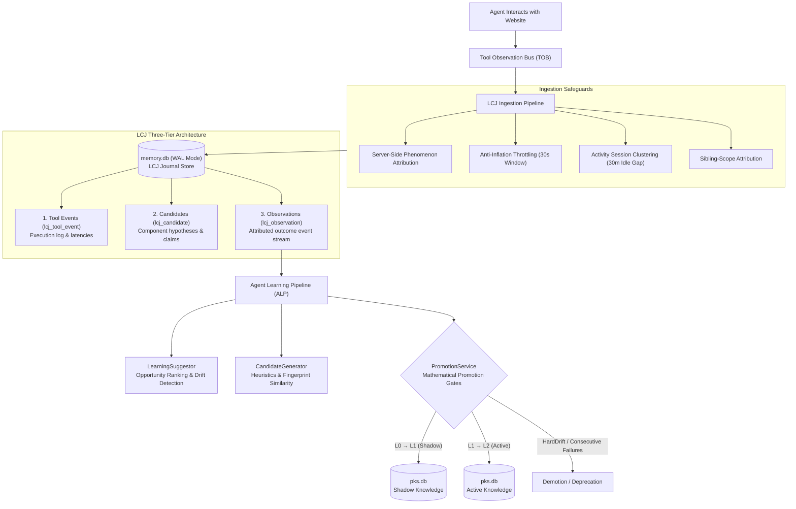
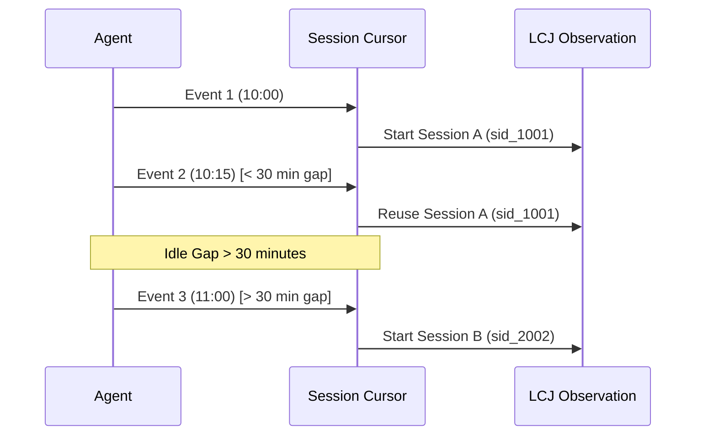
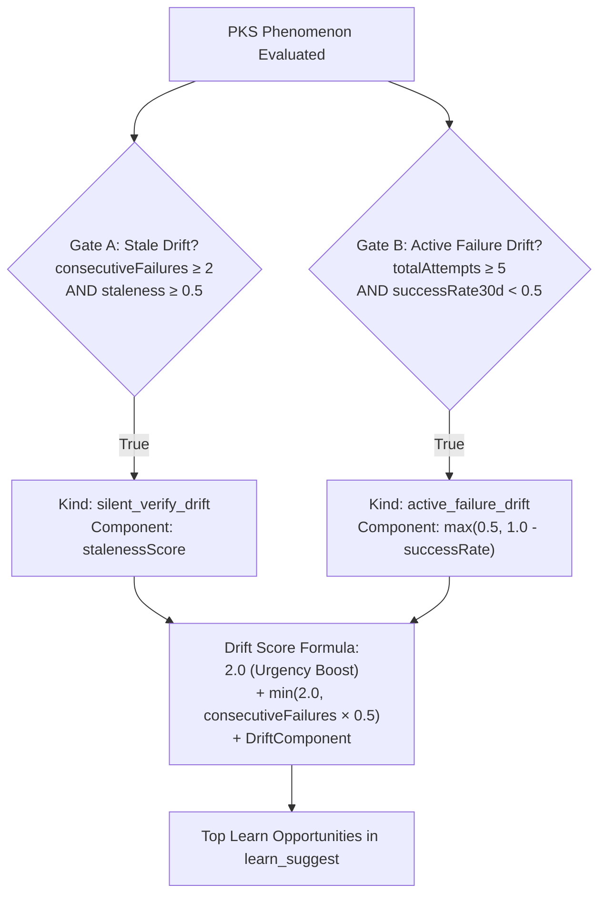
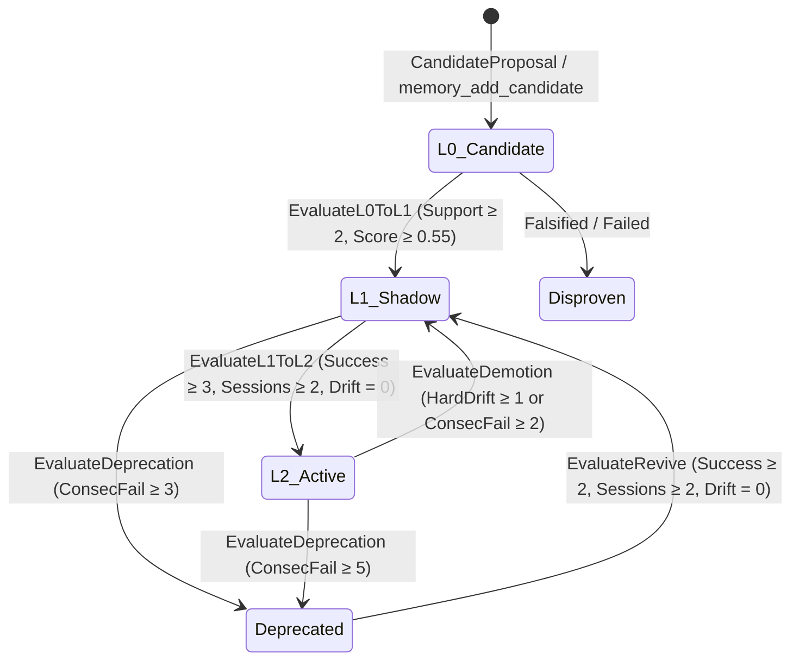

# Learning Candidate Journal (LCJ)

> [!NOTE]
> **Learning Candidate Journal (LCJ)** is Nova's empirical observation journal. It captures every tool execution, selector interaction, blocker event, failure mode, and explicit agent feedback during web tasks. As the foundational evidence layer for the [Agent Learning Pipeline (ALP)](../agent-learning-pipeline-alp/README.md), LCJ ensures that knowledge promoted to the [Phenomenological Knowledge Store (PKS)](../phenomenological-knowledge-store-pks/README.md) is grounded in verifiable, cross-session empirical proof rather than single-run flukes.

---

## 1. Role in the Learning Ecosystem

Autonomous web agents face a fundamental challenge: web pages are dynamic, brittle, and constantly changing. If an agent promotes an element selector or interaction playbook into long-term memory after a single successful run, it risks codifying transient page quirks, ephemeral A/B test variations, or timing coincidences as permanent truth.

LCJ addresses this by strictly separating **empirical observation telemetry** from **curated, actionable knowledge**:



### Memory Subsystems Matrix

Nova maintains multiple distinct memory stores with dedicated retention, access patterns, and trust models:

| Memory Subsystem | Database File | Data Stored | Trust & Lifecycle Model |
| :--- | :--- | :--- | :--- |
| **Learning Candidate Journal (LCJ)** | `%LOCALAPPDATA%\NovaBrowser\Memory\memory.db` | MCP tool events, component hypotheses, observations, promotion audit events | Empirical evidence store; 30-day hot retention with reference protection; feeds ALP. |
| **Phenomenological Knowledge Store (PKS)** | `%LOCALAPPDATA%\NovaBrowser\Pks\pks.db` | UI interaction playbooks, CSS selectors, domain hints, platform templates | Curated, high-trust operational knowledge; staged trust levels (L1 Shadow, L2 Active); drift-gated. |
| **[Browser Memory](../browser-memory/README.md)** | `%LOCALAPPDATA%\NovaBrowser\Pks\pks.db` | Domain notes, user preferences, short-lived session context | Half-life exponential decay; guidance for future agent sessions. |
| **[Episodic Task Memory (ETM)](../episodic-task-memory-etm/README.md)** | `%LOCALAPPDATA%\NovaBrowser\Memory\memory.db` | Task profiles, execution checklists, guidance logs, coverage scans | Task-scoped operational tracking; unit-level verification and replay logs. |

---

## 2. The Three Structural Layers of LCJ

The LCJ database schema organizes telemetry into three distinct abstraction tiers:

```
┌──────────────────────────────────────────────────────────────────┐
│ 1. Tool Events (lcj_tool_event)                                  │
│    Execution telemetry, parameters, durations & error diagnostics│
├──────────────────────────────────────────────────────────────────┤
│ 2. Candidates (lcj_candidate)                                    │
│    Component hypotheses and UI claims (unverified / verified)    │
├──────────────────────────────────────────────────────────────────┤
│ 3. Observations (lcj_observation)                                │
│    Attributed outcome stream powering mathematical ALP gates     │
└──────────────────────────────────────────────────────────────────┘
```

### 2.1 Tool Events (`lcj_tool_event`)

Every MCP tool invocation executed by an agent is recorded as a structured tool event. This provides an execution log for diagnostic review, tool reliability metrics, and heuristic candidate extraction.

| Field | Type | Description |
| :--- | :--- | :--- |
| `event_id` | `TEXT PRIMARY KEY` | Unique UUID string identifying the tool call. |
| `task_id` | `TEXT NOT NULL` | Identifier of the active agent task. |
| `tab_id` | `TEXT NOT NULL` | Target tab where the tool executed. |
| `owner_id` | `TEXT NOT NULL` | Claiming agent identity (e.g. `'default'`). |
| `tool_name` | `TEXT NOT NULL` | Canonical tool name (e.g. `nova.click_selector`). |
| `success` | `INTEGER NOT NULL` | Boolean flag (`1` for success, `0` for error). |
| `duration_ms` | `INTEGER NOT NULL` | Execution latency in milliseconds. |
| `error_text` | `TEXT` | Bounded error string (truncated to 220 characters). |
| `context_host` | `TEXT` | Normalized domain where the tool ran (e.g. `example.com`). |
| `args_summary` | `TEXT` | Compact JSON argument summary (truncated to 400 characters). |
| `activity_session_id` | `TEXT NOT NULL` | Hex session cluster ID derived from idle gaps. |
| `created_at` | `INTEGER NOT NULL` | Unix timestamp in milliseconds. |

#### Event-Driven Candidate Heuristics
When a tool event is recorded, LCJ automatically applies heuristic evaluation:
1. **On Tool Failure (`success = 0`):** An `unverified` candidate is inserted with confidence `0.4` recording the failure claim (e.g. `"Tool nova.click_selector failed: Element not found"`).
2. **On Tool Success (`success = 1`):** The most recent unverified candidate for the matching tool and tab is upgraded to `verified` with confidence `0.75`.
3. **High-Signal Success Tools:** Specific operations (`nova.run_sequence`, `nova.pks_upsert`, `nova.pks_patch`, `nova.pks_upsert_hint`, `nova.telemetry_report`) represent explicit, verified outcomes. When successful, they automatically seed a `verified` candidate with confidence `0.82`.

### 2.2 Candidates (`lcj_candidate`)

Candidates represent concrete, testable hypotheses regarding website components, UI patterns, or interaction rules.

| Field | Type | Description |
| :--- | :--- | :--- |
| `candidate_id` | `INTEGER PRIMARY KEY` | Autoincrementing candidate ID. |
| `task_id` | `TEXT NOT NULL` | Originating task identifier. |
| `tab_id` | `TEXT NOT NULL` | Originating tab identifier. |
| `owner_id` | `TEXT NOT NULL` | Owning agent identifier. |
| `component` | `TEXT NOT NULL` | Component category key (max 256 chars, e.g. `cookie_banner`, `search_input`). |
| `claim` | `TEXT NOT NULL` | Single-sentence hypothesis (max 280 chars, e.g. `"Accept button selector #accept-btn"`). |
| `status` | `TEXT NOT NULL` | Lifecycle status: `unverified`, `verified`, or `disproven`. |
| `confidence` | `REAL NOT NULL` | Confidence score clamped between `0.0` and `1.0`. |
| `source_event_id` | `TEXT` | Tool event ID that generated the candidate. |
| `resolution_event_id` | `TEXT` | Tool event ID that verified or disproved the candidate. |
| `context_host` | `TEXT NOT NULL` | Normalized host scope. |
| `activity_session_id` | `TEXT NOT NULL` | Associated activity session identifier. |
| `candidate_key` | `TEXT NOT NULL` | Deterministic SHA-256 deduplication key (`lcj_ck_<hash>`). |
| `fingerprint_hash` | `TEXT NOT NULL` | Normalized component/claim fingerprint (`sha256:<hash>`). |
| `stable_id` | `TEXT NOT NULL` | Deterministic candidate stable ID (`lcj_sid_<hash>`). |
| `candidate_level` | `INTEGER NOT NULL` | Learning level (defaults to `0` = L0 Candidate). |
| `created_at` / `updated_at` | `INTEGER NOT NULL` | Millisecond timestamps for tracking freshness. |
| `verified_at` | `INTEGER` | Nullable timestamp set when transitioning to `verified`. |

#### Candidate Open-Unique Guarantee
To prevent duplicate rows and race conditions across parallel agent sessions, LCJ enforces a partial unique index:
```sql
CREATE UNIQUE INDEX idx_cand_open_unique
ON lcj_candidate(owner_id, context_host, candidate_key)
WHERE candidate_key <> '' AND status <> 'disproven';
```
If an open candidate already exists for the same owner, host, and candidate key, incoming updates merge into the existing row rather than generating duplicates.

#### Diagnostic vs. Semantic Candidates
Nova distinguishes between two candidate origins:
- **Diagnostic Candidates:** Automatically generated when tools fail (e.g. `"Tool nova.click_selector failed"`). These remain in the journal as diagnostic scratchpad evidence and are filtered out from being promoted to PKS playbooks.
- **Semantic Candidates:** Explicitly proposed by agents via [`nova.memory_add_candidate`](../../../mcp-reference/tools/task-memory/nova-memory-add-candidate.md) (e.g. `"Modal dialog dismissed via button.close-modal"`). These describe actual web phenomena and are eligible for ALP promotion.

### 2.3 Observations (`lcj_observation`)

Observations are the most detailed and granular empirical records in Nova. They feed directly into the mathematical gates of the Agent Learning Pipeline.

| Field | Type | Description |
| :--- | :--- | :--- |
| `observation_id` | `INTEGER PRIMARY KEY` | Autoincrementing record ID. |
| `owner_id` | `TEXT NOT NULL` | Claiming agent identifier. |
| `task_id` / `tab_id` | `TEXT NOT NULL` | Task and tab context. |
| `activity_session_id` | `TEXT NOT NULL` | Clustered session identifier. |
| `context_host` | `TEXT NOT NULL` | Target host where interaction occurred. |
| `kind` | `TEXT NOT NULL` | Observation category (see table below). |
| `outcome` | `INTEGER NOT NULL` | Outcome polarity: `1` (Success), `0` (Neutral), `-1` (Failure). |
| `severity` | `INTEGER NOT NULL` | Drift severity: `0` (Normal), `1` (LightDrift), `2` (HardDrift). |
| `tool_name` | `TEXT NOT NULL` | MCP tool that emitted the observation. |
| `target_stable_id` | `TEXT NOT NULL` | Associated PKS phenomenon ID (`pks_...`), if applicable. |
| `candidate_key` | `TEXT NOT NULL` | Associated LCJ candidate key (`lcj_ck_...`), if applicable. |
| `selector_norm` | `TEXT NOT NULL` | Normalized CSS selector extracted from the tool action. |
| `payload_json` | `TEXT NOT NULL` | Bounded diagnostic payload (capped at 64 KB). |
| `throttle_key` | `TEXT NOT NULL` | Coalescing key used to prevent event inflation. |
| `dispatch_call_id` | `TEXT` | TOB dispatch call ID correlating to the execution envelope. |
| `dispatch_seq` | `INTEGER NOT NULL` | Monotonic sequence number driving flush barriers. |
| `source_scope` | `TEXT` | Populated during sibling-scope inheritance to attribute outcomes. |
| `created_at` | `INTEGER NOT NULL` | Timestamp in milliseconds. |

#### Observation Kinds and Triggers

| Kind | Outcome | Severity | Typical Triggering Tools | Purpose |
| :--- | :---: | :---: | :--- | :--- |
| `perceive_signature` | `0` | `0` | `nova.perceive(mode='summary')` | Records visual/DOM layout hash changes over time. |
| `action_success` | `1` | `0` | `nova.click_selector`, `nova.type_selector`, `nova.select_option`, `nova.guarded_*`, `nova.phenomenon_apply` | Confirms that an interactive element or playbook succeeded. |
| `action_failure` | `-1` | `0` | Action tools when element is missing, obscured, or unresponsive | Flags execution failure for error clustering and demotion checks. |
| `blocker_dismissed` | `1` / `-1` | `0` | `nova.dismiss_blockers` | Verifies whether overlays/cookie banners were successfully cleared without being blocked. |
| `selector_drift` | `-1` | `2` | `nova.telemetry_report(outcome='failure')` | Hard drift signal indicating an existing PKS playbook selector broke. |
| `telemetry_confirmed` | `1` | `0` | `nova.telemetry_report(outcome='success')` | Explicit agent confirmation of successful playbook execution. |

> [!IMPORTANT]
> **Precondition Protection:** Precondition errors during `nova.phenomenon_apply` (e.g. applying a cookie playbook on a page where the cookie banner is already absent) are discarded rather than recorded as `action_failure`. This prevents false negatives from polluting knowledge health when a phenomenon is simply not present.

---

## 3. Ingestion Pipeline & Anti-Inflation Safeguards

To prevent observation poisoning, rapid click-loop database bloating, or forged evidence, LCJ incorporates four protective filters during ingestion:

### 3.1 Server-Side Phenomenon Attribution

Action tools such as `nova.click_selector`, `nova.type_selector`, and `nova.select_option` **do not accept a `phenomenonId` argument**. Allowing agents to submit arbitrary phenomenon IDs would enable untrusted scripts or compromised agents to stamp false promotion evidence onto unrelated clicks.

Instead, Nova performs **server-side phenomenon attribution**:
1. When a selector action executes, Nova inspects the active PKS entries for that domain.
2. If the executed selector uniquely matches exactly one non-deprecated phenomenon (via primary selector or fallback selector), Nova server-side binds `target_stable_id` to that phenomenon.
3. This creates honest, tamper-proof `action_success` and `action_failure` evidence for L1 Shadow phenomena during normal exploratory agent browsing.

### 3.2 Anti-Inflation Throttling & Coalescing

Agents or scripts frequently retry actions rapidly (e.g. clicking a submit button 5 times in 2 seconds). Recording each attempt as an independent observation would artificially inflate support counts and bypass promotion gates.

LCJ calculates a deterministic **throttle key**:

```math
\text{ThrottleKey} = \text{kind} \mathbin{\Vert} \text{context\_host} \mathbin{\Vert} \text{tab\_id} \mathbin{\Vert} \text{discriminator}
```

Where `discriminator` selects the first non-empty value in order of specificity:

```math
\text{target\_stable\_id} \longrightarrow \text{candidate\_key} \longrightarrow \text{selector\_norm} \longrightarrow \text{fingerprint\_hash} \longrightarrow \text{tool\_name} \longrightarrow \text{"generic"}
```

- **30-Second Window:** Within any 30-second window (`minIntervalMs = 30000`), only the first observation for a given `ThrottleKey` is written to `lcj_observation`.
- **Bounded LRU Cache:** The in-memory throttle cache is capped at 5,000 entries. When reached, the oldest 25% are evicted in a single pass to ensure stable memory consumption.

### 3.3 Activity Session Clustering (`lcj_session_cursor`)

A single agent session verifying a button three times within 5 minutes proves that the button works right now, but does not prove that it survives page refreshes, daily deployments, or site updates.

LCJ implements **Activity Session Clustering**:
- Sessions are tracked in the database table `lcj_session_cursor` under `cursor_key = owner_id|context_host`.
- **30-Minute Idle Gap Rule:** If a new event occurs within 30 minutes of the previous event on that domain, it shares the current `activity_session_id`. If more than 30 minutes have elapsed, a new 16-character hexadecimal session identifier is generated.
- **Cross-Session Proof:** All ALP promotion gates require a minimum number of `distinct_success_sessions`. An agent cannot promote knowledge to L1 or L2 within a single session, regardless of how many successful clicks it executes.



### 3.4 Sibling-Scope Attribution (`source_scope`)

When an agent browses a subdomain (e.g. `checkout.store.example.com`) that inherited PKS playbooks or domain hints from a parent sibling scope (`store.example.com`), observations set:
- `context_host`: `checkout.store.example.com` (where the execution took place)
- `source_scope`: `store.example.com` (where the phenomenon originated)

This allows downstream ALP evaluations to attribute success or drift back to the author scope without corrupting the local domain's independent learning profile.

### 3.5 TOB Correlation & Flush Barrier

Every observation records:
- `dispatch_call_id`: UUID matching the Tool Observation Bus dispatch envelope.
- `dispatch_seq`: Monotonically increasing sequence number.

#### Asynchronous Flush Barrier (`WaitForLcjFlushAsync`)
Because database writes run asynchronously on a background worker channel, task completion routines call `WaitForLcjFlushAsync(barrierSeq)`. This awaits the committed sequence counter until all queued observations are safely persisted to disk. If persistence times out (5-second default deadline), Nova gracefully reports `ingestionComplete = false` rather than claiming uncommitted evidence was saved.

---

## 4. Opportunity Ranking & Drift Surfacing (`LearningSuggestor`)

The `LearningSuggestor` subsystem analyzes LCJ observations to rank domain learning opportunities and surface broken knowledge for autonomous repair.

### 4.1 Observation Clustering (`QueryTopObservationClusters`)

Observations are clustered by domain and interaction target using SQL aggregation:
```sql
SELECT
  context_host,
  COALESCE(NULLIF(candidate_key, ''), NULLIF(target_stable_id, ''), NULLIF(selector_norm, ''), tool_name || '|unknown') AS cluster_key,
  COALESCE(MAX(NULLIF(target_stable_id, '')), '') AS target_stable_id,
  GROUP_CONCAT(kind, ',') AS kinds_concat,
  COUNT(*) AS support_count,
  COALESCE(SUM(CASE WHEN outcome = 1 THEN 1 ELSE 0 END), 0) AS success_count,
  COALESCE(SUM(CASE WHEN outcome = -1 THEN 1 ELSE 0 END), 0) AS failure_count,
  COUNT(DISTINCT NULLIF(activity_session_id, '')) AS distinct_sessions,
  MIN(created_at) AS first_seen_at,
  MAX(created_at) AS last_seen_at
FROM lcj_observation
WHERE (@contextHost IS NULL OR context_host = @contextHost)
  AND created_at >= @from AND created_at < @to
GROUP BY context_host, cluster_key
HAVING support_count >= 2
ORDER BY support_count DESC, last_seen_at DESC;
```

### 4.2 Scoring Formula

Each cluster receives a composite priority score:

```math
\text{Score} = \text{SupportScore} + \text{SessionBonus} + \text{SuccessRateFactor}
```

Where:
- **Support Score (Logarithmic):** Dampens high-volume repetitive actions so they do not dominate the priority queue:

  ```math
  \text{SupportScore} = \text{round}\left(\log_2(\max(1, \text{SupportCount})), 2\right)
  ```

- **Multi-Session Bonus:** Grants $+2.0$ points when observations span $\ge 2$ distinct activity sessions.
- **Success Rate Factor:** Proportional to empirical reliability:

  ```math
  \text{SuccessRateFactor} = \text{round}\left(\frac{\text{SuccessCount}}{\text{SuccessCount} + \text{FailureCount}} \times 2.0, 2\right)
  ```

### 4.3 Dual-Gate Drift Detection

To surface broken or degraded playbooks for autonomous repair, `LearningSuggestor` evaluates two independent drift gates:



- **Gate A (Stale Broken Knowledge):** Detects dormant playbooks that failed during silent revalidation probes.
- **Gate B (Actively-Used Failing Knowledge):** Detects frequently executed playbooks that fail in real agent tasks despite low staleness.

---

## 5. Candidate Proposal Heuristics & Similarity Deduplication (`CandidateGenerator`)

`CandidateGenerator` converts observation clusters into formal `CandidateProposal` objects ready for PKS generation.

### 5.1 Heuristic Engines (Priority Order)

1. **`TryCookieAccept`:** Recognizes CMP vendor signatures (`sourcepoint`, `onetrust`, `cookiebot`, `didomi`, `quantcast`, `usercentrics`) from selectors or DOM text. Sourcepoint receives first priority (TCF CMP ID 6) to ensure consent playbooks receive strict `consent_cmp` gating.
2. **`TryOverlayDismiss`:** Identifies modal dialogs, promotional overlays, and newsletter popups dismissed via close buttons or escape keys.
3. **`TrySelectorReplacement`:** Detects when an existing phenomenon failed on its primary selector but succeeded via a working fallback selector, proposing a targeted selector patch.
4. **`TryResultItem`:** Identifies repeating item structures (e.g. search results, catalog cards).

### 5.2 Fingerprint Similarity Deduplication

Before creating a new phenomenon proposal, `CandidateGenerator` compares the proposed fingerprint against existing domain phenomena using Jaccard signal matching and SimHash tokenization:

```math
\text{Similarity}(P_{\text{new}}, P_{\text{existing}}) \in [0.0, 1.0]
```

- **$\text{Similarity} \ge 0.92$ (ThresholdDedup):** The proposal is dropped as duplicate. The existing phenomenon already covers this behavior.
- **$\text{Similarity} \ge 0.88$ (ThresholdPreferPatch):** Instead of creating a new phenomenon, the proposal is automatically converted into a `PatchPhenomenon` targeting the existing stable ID. This updates selectors or playbooks in place and prevents phenomenon proliferation.
- **$\text{Similarity} < 0.88$:** The proposal proceeds as a brand-new `NewPhenomenon` candidate.

---

## 6. Promotion, Demotion & Audit Trail (`PromotionService`)

The mathematical core of knowledge progression resides in `PromotionService`. It evaluates transitions across learning levels using strict empirical gates:



### 6.1 L0 Candidate $\rightarrow$ L1 Shadow (`EvaluateL0ToL1`)

Evaluates whether an unverified candidate hypothesis should be promoted to PKS at L1 (Shadow).

#### Evidence Query (`ReadEvidence_L0ToL1`)
- **Lookback Window:** 14 days.
- **Key:** `(context_host, candidate_key)`.

#### Mathematical Gates
1. **Candidate Status:** Must not be `disproven`.
2. **Confidence Threshold:**

   ```math
   \text{Confidence} \ge 0.70
   ```

3. **Minimum Support:**

   ```math
   \text{SupportCount} \ge 2
   ```

4. **Minimum Success Support:**

   ```math
   \text{SuccessSupportCount} \ge 1
   ```

5. **Evidence Score Gate:**

   ```math
   \text{EvidenceScore} = \text{SupportSignal} \times 0.40 + \text{SuccessRatio} \times 0.30 + \text{Confidence} \times 0.30 \ge 0.55
   ```

   Where:

   ```math
   \text{SupportSignal} = \min\left(1.0, \frac{\text{SupportCount}}{5.0}\right), \quad \text{SuccessRatio} = \frac{\text{SuccessSupportCount}}{\text{SupportCount}}
   ```

### 6.2 L1 Shadow $\rightarrow$ L2 Active (`EvaluateL1ToL2`)

Evaluates whether a Shadow phenomenon has proven reliable enough to be actively matched by `pks_match`.

#### Evidence Query (`ReadEvidence_L1ToL2`)
- **Lookback Window:** 30 days (drift window: last 7 days).
- **Key:** `(context_host, target_stable_id)`.
- **Anti-Double-Counting Formula:** To prevent an agent from counting both an action success and an explicit telemetry report for the same execution attempt, success count is calculated as:

  ```math
  \text{SuccessCount} = \max\left(\sum(\text{action\_success} + \text{blocker\_dismissed}), \sum(\text{telemetry\_confirmed})\right)
  ```

#### Standard Gates vs. Consent CMP Gates

| Promotion Gate | Standard Phenomena | `consent_cmp` (Cookie Banners) | Rationale |
| :--- | :---: | :---: | :--- |
| **Minimum Success Count** | $\ge 3$ | $\ge 5$ | Consent playbooks alter persistent user privacy state. |
| **Distinct Success Sessions** | $\ge 2$ | $\ge 3$ | Ensures verification across multiple independent browser boots. |
| **Maximum Failures (30d)** | $\le 1$ | $\mathbf{0}$ | Zero tolerance for failure on privacy choices. |
| **Drift Events (7d)** | $\mathbf{0}$ | $\mathbf{0}$ | Must show zero selector drift in the past week. |

### 6.3 Demotion: L2 Active $\rightarrow$ L1 Shadow (`EvaluateDemotion`)

Demotes degraded active playbooks back to Shadow before they cause repeated task failures:
- **Fast-Demotion Trigger:** $\ge 1$ `HardDrift` event (severity 2, reported via `nova.telemetry_report(outcome='failure')`) within the last 24 hours.
- **Consecutive Failures:** $\ge 2$ consecutive interaction failures.

#### Consecutive Failures Algorithm (`CountConsecutiveFailures`)
Outcomes are inspected in reverse chronological order (`DESC`). Crucially, **both `Success` (+1) and `Neutral` (0, such as `perceive_signature`)** interrupt the consecutive failure chain. This ensures that an actively functioning page perceived hundreds of times is not accidentally deprecated due to occasional transient errors.

### 6.4 Deprecation & Revive Gates

- **Deprecation (L1 Shadow $\rightarrow$ Deprecated):** Requires $\ge 3$ consecutive failures.
- **Deprecation (L2 Active $\rightarrow$ Deprecated):** Requires $\ge 5$ consecutive failures.
- **Revive (Deprecated $\rightarrow$ L1 Shadow):** Requires $\ge 2$ successes in 30 days across $\ge 2$ distinct sessions, with strictly $0$ drift events in the last 7 days.

### 6.5 Promotion Audit Log (`lcj_promotion_event`)

Every state transition is recorded in `lcj_promotion_event` with:
- `stable_id`: Phenomenon ID.
- `from_level` / `to_level`: Level transition.
- `reason_kind`: `l0_to_l1`, `l1_to_l2`, `demotion`, `deprecation`, `revive`.
- `reason_json`: Full JSON payload containing evidence counts, gate comparisons, and explainability notes generated by `ExplainabilityEngine`.

Agents inspect this audit history using [`nova.learn_feedback`](../../../mcp-reference/tools/pks-and-learning/nova-learn-feedback.md).

---

## 7. Storage Architecture & Concurrency Model

### 7.1 SQLite Persistence (`memory.db`)

LCJ persists data in SQLite at:
```
%LOCALAPPDATA%\NovaBrowser\Memory\memory.db
```
This is physically isolated from `pks.db`, ensuring heavy ingestion writes never block PKS playbook lookups.

#### High-Throughput SQLite PRAGMAs
```sql
PRAGMA journal_mode = WAL;
PRAGMA synchronous = NORMAL;
PRAGMA foreign_keys = ON;
PRAGMA busy_timeout = 2000;
PRAGMA temp_store = MEMORY;
```

#### Single-Reader Channel Worker (`MemoryDb`)
All database writes are serialized via a dedicated long-running worker thread connected to a bounded channel (`BoundedChannelOptions(512)` with `SingleReader = true`). This prevents SQLite locking contention during parallel tab execution. Caller threads await `MemoryStore.ExecuteAsync(...)` without blocking.

#### Corruption Recovery Circuit Breaker
If hardware failure or abrupt power loss corrupts SQLite (`SQLITE_CORRUPT` or `SQLITE_NOTADB`):
1. `MemoryDb` intercepts the exception.
2. The corrupt database files (`memory.db`, `memory.db-wal`, `memory.db-shm`) are renamed to `memory.db.bad.<timestamp>`.
3. A clean database file is instantiated automatically.
4. Circuit breaker limit: A maximum of 3 recovery attempts prevents infinite restart loops if disk space is exhausted.

### 7.2 Complete Database Schema & Indexes

```sql
CREATE TABLE IF NOT EXISTS lcj_tool_event (
    event_id             TEXT PRIMARY KEY,
    task_id              TEXT NOT NULL,
    tab_id               TEXT NOT NULL,
    owner_id             TEXT NOT NULL,
    tool_name            TEXT NOT NULL,
    success              INTEGER NOT NULL,
    duration_ms          INTEGER NOT NULL,
    error_text           TEXT,
    context_host         TEXT,
    args_summary         TEXT,
    activity_session_id  TEXT NOT NULL DEFAULT '',
    created_at           INTEGER NOT NULL
);

CREATE TABLE IF NOT EXISTS lcj_candidate (
    candidate_id         INTEGER PRIMARY KEY,
    task_id              TEXT NOT NULL,
    tab_id               TEXT NOT NULL,
    owner_id             TEXT NOT NULL,
    component            TEXT NOT NULL,
    claim                TEXT NOT NULL,
    status               TEXT NOT NULL,
    confidence           REAL NOT NULL DEFAULT 0.5,
    source_event_id      TEXT,
    resolution_event_id  TEXT,
    context_host         TEXT NOT NULL DEFAULT '',
    activity_session_id  TEXT NOT NULL DEFAULT '',
    candidate_key        TEXT NOT NULL DEFAULT '',
    fingerprint_hash     TEXT NOT NULL DEFAULT '',
    stable_id            TEXT NOT NULL DEFAULT '',
    candidate_level      INTEGER NOT NULL DEFAULT 0,
    created_at           INTEGER NOT NULL,
    updated_at           INTEGER NOT NULL,
    verified_at          INTEGER
);

CREATE TABLE IF NOT EXISTS lcj_observation (
    observation_id       INTEGER PRIMARY KEY AUTOINCREMENT,
    owner_id             TEXT NOT NULL,
    task_id              TEXT NOT NULL DEFAULT '',
    tab_id               TEXT NOT NULL DEFAULT '',
    activity_session_id  TEXT NOT NULL,
    context_host         TEXT NOT NULL,
    kind                 TEXT NOT NULL,
    outcome              INTEGER NOT NULL DEFAULT 0,
    severity             INTEGER NOT NULL DEFAULT 0,
    tool_name            TEXT NOT NULL DEFAULT '',
    target_stable_id     TEXT NOT NULL DEFAULT '',
    candidate_key        TEXT NOT NULL DEFAULT '',
    fingerprint_hash     TEXT NOT NULL DEFAULT '',
    selector_norm        TEXT NOT NULL DEFAULT '',
    payload_json         TEXT NOT NULL DEFAULT '{}',
    throttle_key         TEXT NOT NULL DEFAULT '',
    dispatch_call_id     TEXT,
    dispatch_seq         INTEGER NOT NULL DEFAULT 0,
    source_scope         TEXT,
    created_at           INTEGER NOT NULL
);

CREATE TABLE IF NOT EXISTS lcj_session_cursor (
    cursor_key           TEXT PRIMARY KEY,
    activity_session_id  TEXT NOT NULL,
    last_event_at        INTEGER NOT NULL
);

CREATE TABLE IF NOT EXISTS lcj_promotion_event (
    promotion_event_id   INTEGER PRIMARY KEY AUTOINCREMENT,
    owner_id             TEXT NOT NULL,
    context_host         TEXT NOT NULL,
    stable_id            TEXT NOT NULL,
    from_level           INTEGER NOT NULL,
    to_level             INTEGER NOT NULL,
    reason_kind          TEXT NOT NULL,
    reason_json          TEXT NOT NULL DEFAULT '{}',
    created_at           INTEGER NOT NULL
);

CREATE TABLE IF NOT EXISTS lcj_curated_entry (
    curated_id           INTEGER PRIMARY KEY,
    candidate_id         INTEGER NOT NULL UNIQUE,
    task_id              TEXT NOT NULL,
    tab_id               TEXT NOT NULL,
    component            TEXT NOT NULL,
    claim                TEXT NOT NULL,
    confidence           REAL NOT NULL,
    promoted_at          INTEGER NOT NULL,
    dedupe_key           TEXT NOT NULL DEFAULT '',
    merge_count          INTEGER NOT NULL DEFAULT 1,
    last_promoted_at     INTEGER NOT NULL DEFAULT 0
);
```

### 7.3 Retention Policy & Reference Protection

Automated maintenance prunes historical data while guaranteeing that evidence supporting promoted knowledge is never destroyed:

| Data Tier | Retention Window | Prune Behavior |
| :--- | :---: | :--- |
| **Hot Telemetry** (`lcj_tool_event`, `lcj_candidate`, `lcj_observation`) | **30 Days** | Deleted when `created_at` or `updated_at` exceeds 30 days. |
| **Curated Audit Logs** (`lcj_curated_entry`, `lcj_promotion_event`) | **180 Days** | Retained for 6 months to enable long-term drift analysis. |
| **Rollup Tables** (`lcj_rollup_*`) | Permanent | Daily domain and phenomenon summaries (not pruned by age). |

#### Reference Protection Invariants
- **Curated Candidate Protection:** Candidates that possess a corresponding row in `lcj_curated_entry` are **never** deleted by hot retention.
- **Referenced Tool Event Protection:** Tool events that are referenced as `source_event_id` or `resolution_event_id` of an existing candidate are **never** deleted by hot retention.

After pruning, `MemoryRepository` executes `PRAGMA optimize;` to refresh SQLite query planner statistics.

---

## 8. MCP Tool Reference & Agent Workflows

### 8.1 `nova.memory_add_candidate`
Allows agents to record explicit, structured hypotheses for the currently claimed tab:

```json
{
  "name": "nova.memory_add_candidate",
  "arguments": {
    "targetId": "tab-1",
    "component": "cookie_banner",
    "claim": "Dismiss button uses selector #onetrust-accept-btn-handler",
    "status": "unverified",
    "confidence": 0.70
  }
}
```

*Full specification:* [`nova.memory_add_candidate` Reference](../../../mcp-reference/tools/task-memory/nova-memory-add-candidate.md)

### 8.2 `nova.memory_stats`
Provides comprehensive health metrics, verification rates, and heuristic rollout statuses:

```json
{
  "name": "nova.memory_stats",
  "arguments": {
    "windowHours": 24,
    "topComponents": 5,
    "componentFilter": "cookie_banner"
  }
}
```

*Full specification:* [`nova.memory_stats` Reference](../../../mcp-reference/tools/task-memory/nova-memory-stats.md)

### 8.3 Learning Lifecycle Tool Matrix

| Tool | LCJ Role | Typical Workflow |
| :--- | :--- | :--- |
| [`nova.learn_suggest`](../../../mcp-reference/tools/pks-and-learning/nova-learn-suggest.md) | Reads observation clusters & drift items | Inspect high-priority learning opportunities across visited domains. |
| [`nova.learn_generate`](../../../mcp-reference/tools/pks-and-learning/nova-learn-generate.md) | Reads detailed observations & claims | Propose and seed a new L0 candidate phenomenon in PKS. |
| [`nova.learn_promote`](../../../mcp-reference/tools/pks-and-learning/nova-learn-promote.md) | Evaluates mathematical promotion gates | Advance Shadow phenomena to Active, demote broken playbooks, or revive deprecated entries. |
| [`nova.learn_feedback`](../../../mcp-reference/tools/pks-and-learning/nova-learn-feedback.md) | Reads `lcj_promotion_event` audit logs | Review historical transition decisions and gate breakdowns. |
| [`nova.telemetry_report`](../../../mcp-reference/tools/pks-and-learning/nova-telemetry-report.md) | Ingests explicit outcomes | Report playbook success (`outcome='success'`) or selector drift (`outcome='failure'`). |

---

## 9. Related Documentation

- [Agent Learning Pipeline (ALP)](../agent-learning-pipeline-alp/README.md) — How ALP analyzes LCJ observations to automate knowledge promotion.
- [Phenomenological Knowledge Store (PKS)](../phenomenological-knowledge-store-pks/README.md) — The curated playbook and hint store driven by LCJ evidence.
- [Tool Observation Bus (TOB)](../../tool-observation-bus-tob/README.md) — The event bus infrastructure dispatching observations into LCJ.
- [Browser Memory](../browser-memory/README.md) — Domain notes and human guidance memory with exponential decay.
- [Episodic Task Memory (ETM)](../episodic-task-memory-etm/README.md) — Task-specific execution checklists and unit guidance.

[Learning overview](../README.md) · [All core features](../../README.md)
