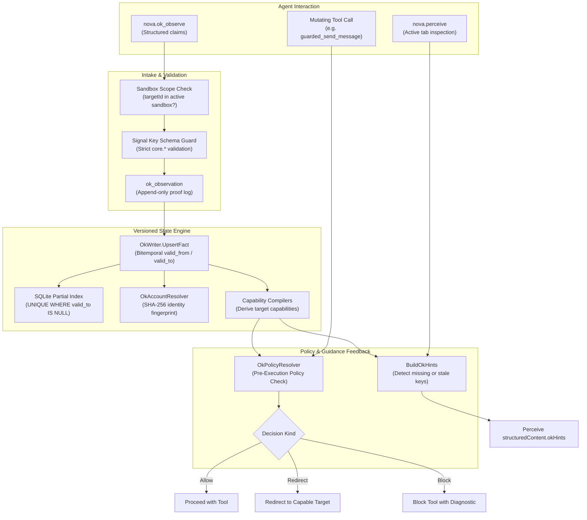

# Operational Knowledge (OK) & Real-Time Environment State

Operational Knowledge (OK) is Nova's real-time semantic state engine. It maintains a structured, versioned, and provenance-tracked model of the live services active within browser tabs: service identity, target bindings, authentication status, subscription plan tiers, and selected model capabilities.

By operating from explicit, verified state rather than repeatedly re-scraping web pages or guessing runtime conditions, agents make safer, faster, and more coherent decisions.

> [!IMPORTANT]
> **The Core Guiding Principle:**  
> *The agent semantically understands the page; the system aggregates and versions the truth.*  
> Agents possess multimodal visual awareness of dynamic web interfaces. OK gives models a first-class ingestion channel to report structured state, while the backend database enforces temporal versioning, supersedence competition, and pre-execution safety gates.

---

## Sub-Guides & Deep Dives

To explore specific subsystems of the Operational Knowledge architecture, consult the specialized guides:

* **[Canonical Signal Vocabulary & Observations Log](signal-vocabulary-and-observations.md)**  
  The 15 canonical core signal keys, strict schema validation, experimental `vendor.*` namespaces, the certainty-to-confidence mathematical mapping, and the append-only `ok_observation` proof log.
* **[Fact Lifecycle, Supersedence & Account Resolution](fact-lifecycle-and-supersedence.md)**  
  Bitemporal fact versioning (`valid_from` / `valid_to`), the SQLite partial unique index, the five claim outcome states (`fresh`, `superseded_fresh`, `conflicted`, `observation_only`, `scope_full`), +0.15 confidence margin competition, SHA-256 account fingerprinting, and sandbox deletion cascading purges.
* **[Policy Resolution, Guarded Commitments & Perceive Hints](policy-resolution-and-perceive-hints.md)**  
  The Pre-Execution Policy Check engine, tool operation classes (Observe, Navigate, Mutate, Submit), candidate evaluation, target redirection, the fail-open safety principle, proactive `okHints` in `nova.perceive`, and the TOB flush barrier protocol.

---

## 1. Practical Examples

### Observing Authentication and Model Selection
When an agent navigates to an AI chat platform, it inspects the live page and reports the observed environment via [`nova.ok_observe`](../../../mcp-reference/tools/app-shell-and-ui/nova-ok-observe.md):

```json
{
  "targetId": "active",
  "claims": [
    {
      "signalKey": "core.login_state",
      "value": "logged_in",
      "certainty": "certain",
      "evidence": "User profile avatar and workspace menu are visible in header"
    },
    {
      "signalKey": "core.model.active",
      "value": "gpt-4o",
      "certainty": "certain",
      "evidence": "Model selector button displays 'GPT-4o'"
    },
    {
      "signalKey": "core.plan.tier",
      "value": "pro",
      "certainty": "likely",
      "evidence": "Pro badge rendered adjacent to account name"
    }
  ]
}
```

Nova records the claims in the append-only observation log, runs supersedence logic to update active facts, and derives service capabilities.

### Discovering Accepted Vocabulary
If an agent encounters an unfamiliar web application or wants to know what standard signals are supported, it queries the schema catalog via [`nova.ok_signal_schema`](../../../mcp-reference/tools/app-shell-and-ui/nova-ok-signal-schema.md):

```json
{
  "namespace": "core",
  "includeDeprecated": false
}
```

The tool returns the complete list of accepted core signal keys, their expected JSON types, and usage descriptions.

---

## 2. Nova Memory Systems: Knowledge Taxonomy

Nova features several complementary memory engines, each engineered for distinct scopes, lifetimes, and verification standards:

| Memory Engine | Operational Anchor | Primary Content | Epistemic Nature | MCP Access |
| :--- | :--- | :--- | :--- | :--- |
| **Operational Knowledge (OK)** | Real-Time Target Binding (`target` / `binding`) | Live login state, active model, subscription tier, available features | **Live Environmental State** (Versioned telemetry; not procedural code) | [`nova.ok_observe`](../../../mcp-reference/tools/app-shell-and-ui/nova-ok-observe.md)<br/>[`nova.ok_signal_schema`](../../../mcp-reference/tools/app-shell-and-ui/nova-ok-signal-schema.md) |
| [Operator Notes](../operator-notes/README.md) | Global or Sandbox Profile (`SandboxUid`) | User preferences, workflow guidelines, server ports, environment variables | Persistent guidelines & working preferences | [`nova.operator_notes_store`](../../../mcp-reference/tools/task-memory/nova-operator-notes-store.md)<br/>[`nova.operator_notes_query`](../../../mcp-reference/tools/task-memory/nova-operator-notes-query.md) |
| [Domain Notes](../domain-notes/README.md) | Website Origin (`example.com`) | Origin-specific policies, warning notices, required operator acknowledgements | Human-directed domain rules (`mustAck=true`) | [`nova.domain_note`](../../../mcp-reference/tools/task-memory/nova-domain-note.md)<br/>[`nova.domain_notes_list`](../../../mcp-reference/tools/task-memory/nova-domain-notes-list.md) |
| [Browser Memory](../browser-memory/README.md) | Website Domain / Tab Session | Domain-bound browsing observations, dynamic site quirks, recalled context | Read/write episodic recall | [`nova.memory_recall`](../../../mcp-reference/tools/task-memory/nova-memory-recall.md)<br/>[`nova.memory_note`](../../../mcp-reference/tools/task-memory/nova-memory-note.md) |
| [Phenomenological Knowledge Store (PKS)](../phenomenological-knowledge-store-pks/README.md) | DOM Phenomenon / Selectors | Reusable interaction recipes, robust selector fallbacks, recovery playbooks | Procedural automation playbooks | [`nova.pks_get`](../../../mcp-reference/tools/pks-and-learning/nova-pks-get.md)<br/>[`nova.pks_upsert`](../../../mcp-reference/tools/pks-and-learning/nova-pks-upsert.md) |
| [Episodic Task Memory (ETM)](../episodic-task-memory-etm/README.md) | Task Instance / Task Profile | Multi-turn task progress, work units, milestone verifications | Task execution logs & milestones | [`nova.task_instance_create`](../../../mcp-reference/tools/task-memory/nova-task-instance-create.md)<br/>[`nova.task_instance_progress`](../../../mcp-reference/tools/task-memory/nova-task-instance-progress.md) |
| [Evidence Verification Mode (EVM)](../../../research/evidence-verification-mode-evm/README.md) | Research Claims & Candidates | Empirical research claims, citation trails, multi-source corroboration | Fact-checked empirical evidence | [`nova.memory_add_candidate`](../../../mcp-reference/tools/task-memory/nova-memory-add-candidate.md)<br/>[`nova.memory_stats`](../../../mcp-reference/tools/task-memory/nova-memory-stats.md) |

---

## 3. End-to-End Architectural Data Flow

The OK pipeline bridges agent perception, database persistence, capability derivation, and pre-execution safety:



---

## 4. MCP Tool Reference Suite

Operational Knowledge provides two specialized MCP tools registered in Nova's `system_tools` bundle:

### 1. `nova.ok_observe`
Ingests structured state claims from the agent for the specified tab target.

| Parameter | Type | Required | Default | Allowed / Constraints | Description |
| :--- | :--- | :---: | :--- | :--- | :--- |
| `targetId` | `string` | No | `"active"` | — | Target profile or tab ID. Must resolve within the active sandbox. |
| `perceptionId` | `string` | No | — | — | Optional correlation token linking the observation to a preceding perception call. |
| `claims` | `array[object]`| **Yes** | — | 1 to 50 items | Array of structured claims to assert. |

#### Claim Object Schema
| Field | Type | Required | Default | Allowed | Description |
| :--- | :--- | :---: | :--- | :--- | :--- |
| `signalKey` | `string` | **Yes** | — | Regex: `^[a-z][a-z0-9]*(\.[a-z][a-z0-9_]*)+$` | Canonical signal key (max 128 chars). Unknown `core.*` keys are rejected. |
| `value` | `any` | **Yes** | — | Max 16,384 JSON chars | Raw JSON value (string, boolean, array, or object). |
| `certainty` | `string` | No | `"likely"` | `certain`, `likely`, `tentative` | Semantic certainty of the observation. |
| `evidence` | `string` | No | — | — | Human-readable textual rationale supporting the claim. |

#### Response Schema
```json
{
  "content": [{ "type": "text", "text": "OK observe: 3 accepted, 0 rejected, 0 conflicted, 0 observation-only, 1 superseded." }],
  "structuredContent": {
    "ok": true,
    "accepted": 3,
    "rejected": 0,
    "conflicted": 0,
    "observationOnly": 0,
    "superseded": 1,
    "facts": [
      { "key": "core.login_state", "value": "logged_in", "state": "fresh", "isNew": false },
      { "key": "core.model.active", "value": "gpt-4o", "state": "fresh", "isNew": true },
      { "key": "core.plan.tier", "value": "pro", "state": "fresh", "isNew": false }
    ],
    "warnings": null
  }
}
```

---

### 2. `nova.ok_signal_schema`
Retrieves registered signal keys from the live schema database.

| Parameter | Type | Required | Default | Allowed / Range | Description |
| :--- | :--- | :---: | :--- | :--- | :--- |
| `namespace` | `string` | No | `null` | e.g. `'core'`, `'vendor'` | Optional filter restricting returned signals to a specific namespace. |
| `includeDeprecated` | `boolean` | No | `false` | `true`, `false` | Whether to include deprecated signal keys. |
| `maxEntries` | `integer` | No | `200` | `1` – `500` | Maximum number of keys to return. |

#### Response Schema
```json
{
  "content": [{ "type": "text", "text": "OK signal schema: 15 key(s)." }],
  "structuredContent": {
    "ok": true,
    "namespaceFilter": "core",
    "includeDeprecated": false,
    "maxEntries": 200,
    "count": 15,
    "truncated": false,
    "keys": [
      {
        "signalKey": "core.login_state",
        "namespace": "core",
        "valueType": "string",
        "description": "Login state of the service",
        "exampleJson": "\"logged_in\"",
        "deprecated": false
      }
    ]
  }
}
```

---

## 5. Proactive Observation Nudges (`okHints` in `nova.perceive`)

To ensure models maintain fresh state without needing custom prompt engineering, [`nova.perceive`](../../../mcp-reference/tools/dom-and-reading/nova-perceive.md) evaluates target bindings on every invocation and populates `structuredContent.okHints`:

```json
{
  "okHints": {
    "shouldObserve": true,
    "missingOrStaleKeys": ["core.login_state", "core.model.active", "core.plan.tier"],
    "lastObservedAgoMs": null,
    "serviceKey": "chatgpt",
    "currentFacts": {},
    "firstVisit": true,
    "urlChanged": false
  }
}
```

When `shouldObserve` is `true`, the agent is advised to inspect the page and invoke `nova.ok_observe` before executing mutating workflows. Subsequent duplicate calls on the same URL are de-duplicated at the session level to avoid prompt noise.

---

## 6. Operational Invariants & Security Boundaries

1. **Sandbox Scope Boundary:** An agent cannot push observations for a foreign sandbox. The target ID must resolve to the active sandbox context; cross-sandbox target claims throw `-32602 sandbox_scope_mismatch`.
2. **Observe Tools Exemption:** Inspection and perception tools (`perceive`, `read_dom`, `screenshot`, etc.) are **never blocked** by pre-execution policies. Observation is the sole prerequisite for state learning.
3. **The Fail-Open Principle:** If a policy evaluation fails, times out, or encounters an unrecognized service rule, Nova defaults to **Allow**. Unwarranted false-positive execution blocks are strictly avoided.
4. **Per-Scope Fact Cap:** Each scope can hold a maximum of **500 active facts**. Excessive claim spamming is rejected with state `scope_full`.
5. **Sandbox Deletion Cascading Purge:** Deleting a sandbox profile synchronously purges its `ok_target` row and cascades deletion across `ok_target_state` and `ok_binding`, preventing ghost state inheritance.
---

## 7. Deep-Dive Guides

For detailed specifications, schemas, and operational mechanics, see the specialized guides:

* **[Signal Vocabulary & Observations Log](signal-vocabulary-and-observations.md)** — Canonical signals, regex schemas, certainty-to-confidence math, and proof-log storage.
* **[Fact Lifecycle & Supersedence](fact-lifecycle-and-supersedence.md)** — Temporal versioning (`valid_from`/`valid_to`), SQLite partial index, and account fingerprinting.
* **[Policy Resolution & Perceive Hints](policy-resolution-and-perceive-hints.md)** — Pre-execution policy check engine, tool classification, alternative candidate routing, and proactive `okHints`.
* **[Derived Capabilities & Shadow Learning](derived-capabilities-and-shadow-learning.md)** — Capability compiler derivations, post-execution shadow learning, Closed-Loop contract verification, and decision auditing.

---

[Learning Overview](../README.md) · [All Core Features](../../README.md)
