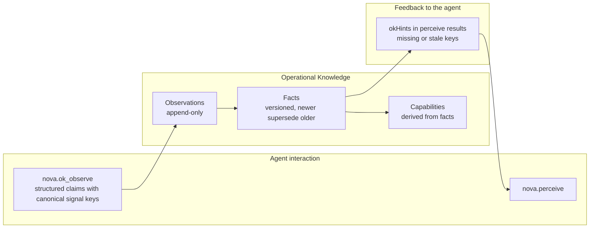

# Operational Knowledge (OK) & Real-Time Environment State

> [!NOTE]
> Operational Knowledge (OK) keeps a structured, versioned picture of the reported state of services open in Nova's tabs: target bindings, login state, plan and active model. It preserves observations, their source and confidence so agents can work from explicit state rather than repeatedly reconstructing it from scratch.

---

## 1. Start with a state that can change

An agent inspects an AI service and reports that the tab is logged in, a paid plan is available and a particular model is selected. Later, the user switches models or the session expires. Reusing the old state without checking it would make the next decision unreliable.

OK records structured observations for the resolved target and maintains facts derived from them. When new evidence changes a fact, the system keeps its versioning and provenance. `nova.perceive` can return hints identifying missing or stale signals so the agent knows what to inspect and report next.

**OK answers “what state is reported for this target now?”** It is a state model, not a reusable recipe for operating the website.

### Observations retain their provenance

`nova.ok_observe` accepts the agent's structured claims about the page. Nova records them with an agent source, confidence and any supplied evidence. Storing a claim as a fact does not independently verify the website's account, subscription or model selection. Missing, tentative or stale state must not be treated as confirmed current state.

An observation can be recorded without replacing the current fact. Supersedence depends on the writer's confidence and freshness rules; a newer tentative claim is not automatically authoritative. Tool results report those per-claim outcomes.

### Where OK fits among Nova's memories

| System | What it helps answer |
| :--- | :--- |
| **OK** | What login, plan or model state is currently reported for this target? |
| [Domain Notes](../domain-notes/README.md) | Which instructions apply to this website and sandbox? |
| [Browser Memory](../browser-memory/README.md) | What site notes, preferences and context should be recalled? |
| [PKS](../phenomenological-knowledge-store-pks/README.md) | How has a recurring web situation been handled and verified? |
| [ETM](../episodic-task-memory-etm/README.md) | What task is running, and what work remains? |

Derived capabilities summarize the available facts. They do not confer permission, upgrade a subscription or guarantee that a remote service will accept an action. Authorization and outcome checks remain separate.

---

## 2. Core Concepts & Data Flow

1. **Canonical Signal Vocabulary:**
   * Observations use fixed signal keys instead of free text, for example `core.login_state = "logged_in"`, `core.plan.tier = "pro"`, `core.model.active = "gpt-4o"`. `nova.ok_signal_schema` lists the accepted keys. Unknown `core.*` keys are rejected; platform-specific `vendor.*` keys are accepted without registration.
2. **Supersedence & Versioning:**
   * Facts are versioned. An accepted update supersedes the prior version of the same scoped fact rather than overwriting it silently. Not every incoming observation qualifies to replace it; observations remain append-only.
3. **Hints in `nova.perceive`:**
   * `nova.perceive` returns `okHints` that tell the agent which signal keys are missing or stale for the current page, so it knows what to report via `nova.ok_observe`.

### Domain notes are guidance, not state observations

“This tab is currently logged out” belongs in OK's observations. “Read the site's export instructions before downloading” belongs in the separate [Domain Notes](../domain-notes/README.md) feature. Its own article covers scope, delivery and acknowledgement; those instructions are not OK state signals.

---

## 3. MCP Tooling for OK

| Tool | Purpose |
| :--- | :--- |
| `nova.ok_observe` | Pushes structured observations about the current page state of a tab. |
| `nova.ok_signal_schema` | Lists the canonical signal keys accepted by `nova.ok_observe`. |

---

## 4. Architecture of the OK Pipeline

---

## 5. Implementation notes

`McpOkObserveHandler` validates canonical signals and records the agent source. `OkWriter` decides whether an incoming observation inserts, reinforces or supersedes a fact, or remains observation-only. `OkRepository` persists observations, versioned facts and derived capabilities.

---

## Related Documentation

* **[Domain Notes](../domain-notes/README.md)** — Persistent website instructions, warnings and required acknowledgement.
* **[Phenomenological Knowledge Store (PKS)](../phenomenological-knowledge-store-pks/README.md)** — Long-term procedural UI memory and playbooks.
* **[Tool Observation Bus (TOB)](../../tool-observation-bus-tob/README.md)** — Server-side record of executed tool calls.
* **[Agent Awareness Gates (AAG)](../../agent-awareness-gates-aag/README.md)** — Precondition gates and tab leases.

[Learning overview](../README.md) · [All core features](../../README.md)
