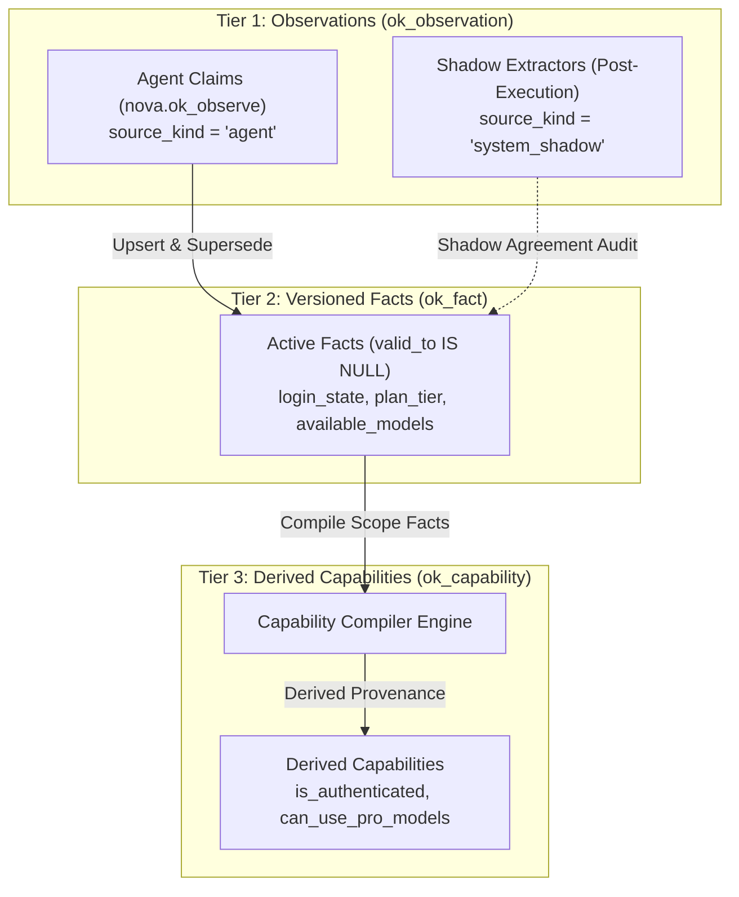
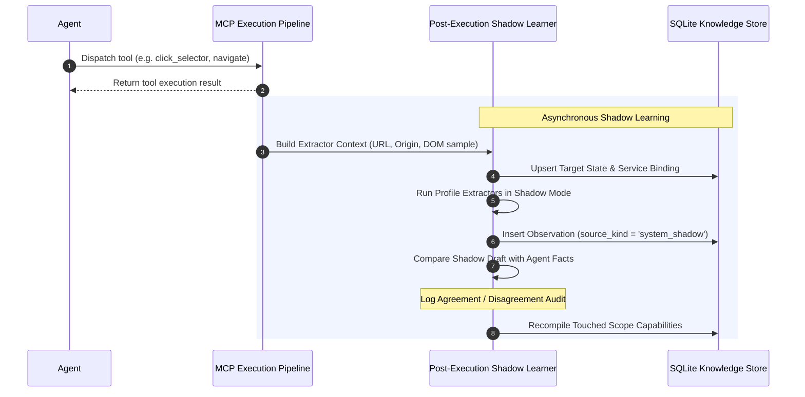

# Derived Capabilities, Shadow Learning & Closed-Loop Verification

> [!NOTE]
> This guide explores the higher-order reasoning layer of Operational Knowledge: how raw facts are compiled into derived capabilities, how background extractors perform non-destructive shadow observation, and how Closed-Loop transition contracts query the operational fact store.

---

## 1. The Evidence-Fact-Capability Pipeline

Operational Knowledge enforces a strict three-tier hierarchy that separates raw observations from higher-level capability assertions:



1. **Tier 1 — Observations (`ok_observation`):** Point-in-time claims backed by visual, DOM, or text evidence.
2. **Tier 2 — Versioned Facts (`ok_fact`):** The consolidated, current state of the target across scopes (`binding`, `account`, `service`, `target`).
3. **Tier 3 — Capabilities (`ok_capability`):** Functional affordances computed deterministically from active facts. Policies evaluate capabilities rather than raw facts to make routing decisions.

---

## 2. Capability Compilers & Derivation Semantics

Capabilities represent actionable semantic affordances (e.g. *„Can this tab execute complex reasoning prompts with Pro models?“*). Because raw facts vary by service, specialized **Capability Compilers** evaluate the active facts of a scope and project them into standardized capability keys.

### Bidirectional vs. Asymmetric Derivations

Capability compilation employs two distinct inference strategies:

#### 1. Bidirectional Capabilities
When a fact provides exhaustive binary state, the capability mirrors both positive and negative values.
* **Example:** `core.login_state` or `chatgpt.login_state`:
  * If fact is `"logged_in"`, capability `chatgpt.is_authenticated` compiles to `true`.
  * If fact is `"logged_out"`, capability `chatgpt.is_authenticated` compiles to `false`.

#### 2. Asymmetric (Positive-Only) Capabilities
On dynamic web pages, the absence of an element in the current DOM does **not** prove the absence of an account entitlement (e.g. a model dropdown might simply be closed, or the user may not have navigated to the settings page yet).
* **Example:** `chatgpt.can_use_pro_models`:
  * Compiles to `true` if positive evidence exists:
    * Plan label fact is `"pro"`, `"plus"`, or `"team"`.
    * Current model label includes `"pro"` or `"o1-pro"`.
    * Available models list contains Pro-tier models.
  * If no positive evidence is found, the compiler **does not assert `false`**. It leaves the capability unasserted or indeterminate, avoiding false-negative blocks.

### Derivation Provenance & Auditing

Every entry in `ok_capability` records its derivation lineage:

```json
{
  "capabilityKey": "chatgpt.can_use_pro_models",
  "valueJson": "true",
  "capabilityState": "fresh",
  "confidence": 0.95,
  "derivation": {
    "supportCount": 2,
    "contradictionCount": 0,
    "sourceFactIds": [1042, 1045],
    "compilerKey": "chatgpt.capability.compiler",
    "derivationVersion": "v1"
  }
}
```

* `supportCount`: Number of distinct active facts validating this capability.
* `contradictionCount`: Number of facts contesting this capability.
* `sourceFactIds`: Primary keys in `ok_fact` providing input evidence.
* `compilerKey`: The identifier of the compiler algorithm responsible for the projection.

---

## 3. Post-Execution Shadow Learner

While primary observations originate from autonomous agents via `nova.ok_observe`, Nova runs an asynchronous **Post-Execution Shadow Learner** after tool dispatches to maintain baseline situational awareness.



### Shadow Mode & The Principle of Agent Primacy

To ensure autonomous agents retain authority over semantic interpretation, background extractors operate strictly in **shadow mode**:

1. **Non-Destructive Observation Logging:** Background extractors write to `ok_observation` with `source_kind = "system_shadow"`.
2. **Fact Shielding:** Shadow extractors **never directly upsert or overwrite facts** in `ok_fact`. Agent-asserted facts remain untouched.
3. **Shadow Agreement Auditing:** The system compares shadow observations against active agent facts:
   * **Agreement:** Recorded in telemetry to reinforce confidence ratings.
   * **Disagreement:** Flagged in diagnostics for operational review without interrupting agent flow.

---

## 4. Closed-Loop Verification with OK Facts

The **[Closed-Loop System (CLS)](../../closed-loop-system-cls/README.md)** validates actions using transition contracts. While CLS includes built-in providers for DOM selectors and standard browser properties, it seamlessly queries the Operational Knowledge Fact Store for semantic state verification.

### Transition Contract Vocabulary Resolution

When an agent specifies a `transitionContract` on tools like `nova.click_selector`, `nova.type_selector`, or `nova.guarded_send_message`, CLS resolves `factKey` identifiers using a dual-path mechanism:

| Fact Key Pattern | Resolver Provider | Verification Semantics |
| :--- | :--- | :--- |
| `dom.<css-selector>` | DOM Provider | Tests selector visibility, presence, text, or attribute in the live web frame. |
| Fixed prefixes (`page.*`, `form.*`, `chat.*`, `model.*`, `auth.*`, `runtime.*`) | Native Browser State Providers | Verifies internal browser lifecycle, ConPTY stream, or active URL properties. |
| **Un-prefixed semantic keys** (e.g. `core.login_state`, `core.plan.tier`) | **Operational Knowledge Fact Store** | Resolves directly against the active facts (`valid_to IS NULL`) of the target scope. |

### Example: Verifying Login State Transition

An agent logging into a dashboard can assert that successful authentication has occurred directly through OK facts:

```json
{
  "transitionContract": {
    "intent": "Submit credentials and verify authenticated session",
    "preconditions": [
      {
        "factKey": "core.login_state",
        "operator": "NotEq",
        "expectedValue": "logged_in"
      }
    ],
    "postconditions": [
      {
        "factKey": "core.login_state",
        "operator": "Eq",
        "expectedValue": "logged_in",
        "stabilityMs": 500
      }
    ],
    "timeoutMs": 8000
  }
}
```

If the OK fact store does not reflect the asserted state within the timeout window, CLS halts further execution, preventing downstream tools from acting on an unverified session.

---

## 5. Policy Decision Audit Trail (`ok_policy_decision`)

Whenever a pre-execution policy check runs, the engine commits a structured audit entry to `ok_policy_decision`. This provides full transparency into routing decisions, redirections, and diagnostic blocks:

| Column | Type | Description |
| :--- | :--- | :--- |
| `request_id` | `TEXT` | Correlation token of the incoming tool request. |
| `policy_id` | `INTEGER` | Foreign key referencing the matched rule in `ok_policy`. |
| `tool_name` | `TEXT` | Name of the tool being evaluated (e.g. `guarded_send_message`). |
| `operation_class` | `TEXT` | Functional class (`observe`, `navigate`, `mutate`, `submit`). |
| `task_class` | `TEXT` | Optional semantic task category (e.g. `reasoning`, `data_extraction`). |
| `service_key` | `TEXT` | Identified service context (e.g. `chatgpt`). |
| `decision_kind` | `TEXT` | Evaluation outcome: `allow`, `redirect`, `block`, `degraded`. |
| `reason_json` | `TEXT` | Diagnostic explanation including satisfied or violated capability requirements. |
| `created_at` | `INTEGER` | Unix epoch timestamp in milliseconds. |

---

## Related Documentation

* **[Operational Knowledge Overview](README.md)** — Architectural hub, taxonomy, and system integrations.
* **[Signal Vocabulary & Observations Log](signal-vocabulary-and-observations.md)** — Canonical signals, certainty math, and input defense limits.
* **[Fact Lifecycle & Supersedence](fact-lifecycle-and-supersedence.md)** — Temporal versioning, SQLite partial index, and account fingerprinting.
* **[Policy Resolution & Perceive Hints](policy-resolution-and-perceive-hints.md)** — Pre-execution policy check engine, tool classification, and proactive hints.
* **[Closed-Loop System (CLS)](../../closed-loop-system-cls/README.md)** — Deterministic action verification and transition contracts.
