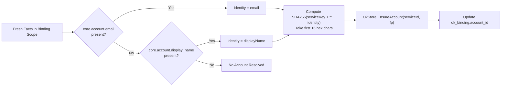

# Fact Lifecycle, Supersedence & Account Resolution

> [!NOTE]
> This guide details the temporal versioning of facts (`valid_from` / `valid_to`), SQLite partial indexing, the five claim outcome states, supersedence competition rules, and account fingerprint resolution in Operational Knowledge (OK).

---

## 1. Facts vs. Observations: State Consolidation

In Operational Knowledge, a fundamental architectural distinction exists between **Observations** and **Facts**:

* **Observation (Raw Claim):** A point-in-time assertion made by an agent or automated sensor (*"At 14:02:15, the agent claimed login_state is logged_in with likely certainty"*). Observations are immutable and append-only.
* **Fact (Consolidated State):** The system's current, authoritative belief regarding a specific key within an operational scope (*"The active login state for Binding 42 is logged_in, verified at Content Revision 3"*). Facts are versioned and subject to supersedence competition.

```mermaid
stateDiagram-v2
    [*] --> Fresh: New Observation inserted
    Fresh --> Fresh: Identical Value (Reinforce support_count++)
    
    Fresh --> Conflicted: Conflicting Value (Incoming loses: confidence < existing + 0.15)
    Conflicted --> Fresh: Conflicting Value resolved (Incoming wins)
    
    Fresh --> Superseded: Conflicting Value (Incoming wins: confidence >= existing + 0.15)
    Superseded --> [*]: valid_to = now, superseded_by_fact_id set
    
    Fresh --> ObservationOnly: Tentative claim with differing value
    ObservationOnly --> Fresh: Observation logged; Fact untouched
```



---

## 2. Temporal Versioning & The SQLite Partial Index

To maintain historical auditability without database bloat or ambiguous lookups, Nova implements **bitemporal versioning** within SQLite.

### Schema Structure (`ok_fact`)

```sql
CREATE TABLE ok_fact (
    fact_id                 INTEGER PRIMARY KEY AUTOINCREMENT,
    scope_ref               TEXT NOT NULL,          -- e.g. "binding:42" or "target:5"
    scope_kind              TEXT NOT NULL,          -- "binding", "target", "account"
    target_id               INTEGER NOT NULL,
    service_id              INTEGER,
    account_id              INTEGER,
    binding_id              INTEGER,
    fact_key                TEXT NOT NULL,          -- Canonical signal key
    value_json              TEXT NOT NULL,          -- JSON serialized value
    value_type              TEXT NOT NULL DEFAULT 'json',
    fact_state              TEXT NOT NULL DEFAULT 'fresh',
    confidence              REAL NOT NULL,          -- 0.0 to 1.0
    support_count           INTEGER NOT NULL DEFAULT 1,
    contradiction_count     INTEGER NOT NULL DEFAULT 0,
    source_observation_id   INTEGER,
    provenance_json         TEXT,
    content_rev             INTEGER NOT NULL DEFAULT 1,
    created_at              INTEGER NOT NULL,
    updated_at              INTEGER NOT NULL,
    first_observed_at       INTEGER NOT NULL,
    last_observed_at        INTEGER NOT NULL,
    last_verified_at        INTEGER,
    valid_from              INTEGER NOT NULL,       -- Epoch ms when fact became valid
    valid_to                INTEGER,                -- NULL = actively current
    superseded_by_fact_id   INTEGER,                -- Pointer to successor row
    certainty_level         TEXT NOT NULL DEFAULT 'likely',
    source_kind             TEXT NOT NULL DEFAULT 'agent'
);
```

### The Partial Unique Index

A naive relational database constraint like `UNIQUE(scope_ref, fact_key)` prevents storing historical superseded rows. Nova resolves this using SQLite's **partial index**:

```sql
CREATE UNIQUE INDEX idx_ok_fact_scope_key_current
    ON ok_fact(scope_ref, fact_key) WHERE valid_to IS NULL;
```

#### Invariants of the Partial Index:
1. **Uniqueness of Current State:** Exactly **one** active row (`valid_to IS NULL`) can exist for any `(scope_ref, fact_key)` pair.
2. **Infinite Historical Depth:** When a fact is updated, the previous row receives `valid_to = now` and `superseded_by_fact_id = newRowId`. It immediately ceases to trigger the partial unique index, allowing the new active row to be inserted seamlessly.

---

## 3. The 4 Hierarchical Operational Scopes

Operational Knowledge organizes service state across four nested scope layers:

| Scope Kind | Scope Reference (`scope_ref`) | Semantic Meaning | Example Context |
| :--- | :--- | :--- | :--- |
| **`target`** | `target:{targetId}` | The physical browser tab or sandbox profile. | Identity-stabilized stable key `sandbox:{PersistentUid}`. |
| **`service`** | `service:{serviceId}` | The identified remote web platform. | Extracted service domain (e.g. `chatgpt`, `claude`, `gemini`). |
| **`binding`** | `binding:{bindingId}` | The active pairing of a specific Target and Service. | Active tab session at `https://chatgpt.com`. |
| **`account`** | `account:{accountId}` | An identified user account identity. | SHA-256 fingerprint derived from user email or name. |

### Parent-Scope Content Revision Bumping

Whenever a fact is modified within a child scope (such as `binding:42`), the storage engine increments its `content_rev` and cascades the revision bump up to the parent scope (`target:5`):

```csharp
// Parent scope cascade executed inside OkWriter
BumpParentScopeContentRev(scopeKind, bindingId, accountId, targetId, now);
```

This allows caches, pre-execution evaluators, and perception hooks to quickly detect state changes by comparing integer revision numbers without performing expensive table scans.

---

## 4. The Five Claim Outcome States

When an agent calls `nova.ok_observe`, every individual claim is evaluated and assigned one of five discrete outcome states:

| Outcome State | Fact Mutated? | Accepted by Protocol? | Operational Meaning |
| :--- | :---: | :---: | :--- |
| **`fresh`** | **Yes** | **Yes** | A new fact was created, or an existing fact was reinforced with an identical value (`support_count++`). |
| **`superseded_fresh`** | **Yes** | **Yes** | An existing active fact was archived (`valid_to = now`) and replaced by a winning incoming claim. |
| **`conflicted`** | No | No | An incoming claim contradicted an existing fact, but failed to meet the confidence margin (+0.15). Existing fact remains active, marked `conflicted`. |
| **`observation_only`** | No | No | A tentative claim differed from an existing fact. The observation was recorded in the proof log, but the active fact was left untouched. |
| **`scope_full`** | No | No | The target scope has reached the maximum ceiling of **500 active facts**. Claim is rejected to prevent database bloat. |

---

## 5. Supersedence Competition Rules

When an incoming observation presents a value that **differs** from an existing active fact, Nova evaluates a strict hierarchy of supersedence rules to determine whether the incoming claim wins:

$$\text{IncomingWins} \iff \begin{cases} 
\text{True} & \text{if } \text{ExistingState} \in \{\text{"stale"}, \text{"conflicted"}, \text{"invalid"}\} \\
\text{True} & \text{if } \text{ExpiresAt} \le \text{ObservedAt} \\
\text{True} & \text{if } \text{Confidence}_{\text{incoming}} \ge \text{Confidence}_{\text{existing}} + 0.15 \\
\text{True} & \text{if } \text{Source}_{\text{incoming}} = \text{"agent"} \land \text{Certainty} = \text{"certain"} \land \text{Source}_{\text{existing}} = \text{"system"} \\
\text{False} & \text{otherwise}
\end{cases}$$

### Key Invariants

1. **The +0.15 Confidence Margin:** To prevent state flapping (rapid oscillations between two conflicting values), an incoming claim must exceed the existing fact's confidence by at least **0.15** to replace it.
2. **Tentative Insulation:** Tentative claims (`certainty = "tentative"`, confidence `0.50`) **can never supersede an existing fact** with a differing value. They are safely isolated as `observation_only`.
3. **Agent Trump Rule:** If a legacy automated system extractor previously asserted a fact with source `"system"`, an explicit agent observation with `certainty = "certain"` immediately supersedes it, honoring agent primacy.

---

## 6. Account Fingerprint Resolution (`OkAccountResolver`)

User identities (e.g. login accounts) frequently span multiple sandbox tabs. To decouple account capabilities from dynamic browser tabs, Nova automatically synthesizes **Account Fingerprints**:



### Fingerprint Derivation Formula

Let $\text{serviceKey}$ be the normalized service identifier (e.g. `"chatgpt"`) and $\text{identity}$ be the trimmed email or display name:

$$\text{Fingerprint} = \text{HexSubstring}\left(\text{SHA256}\left(\text{serviceKey} \parallel \text{":"} \parallel \text{identity}\right),\; 0,\; 16\right)$$

* **Deterministic & One-Way:** The 16-character hexadecimal hash uniquely anchors the account across sessions without exposing the raw plaintext email in foreign bindings.
* **Binding Linkage:** Once an account row is resolved, `ok_binding.account_id` is updated, enabling capability compilers to infer account-level features (such as paid subscriptions) regardless of which tab is active.

---

## 7. Sandbox Lifecycle & Cascading Purge

In Nova, sandbox profiles can be deleted by the operator. Because `ok_target.stable_key` is anchored to the sandbox's immutable `PersistentUid` (`sandbox:{PersistentUid}`), deleting a profile triggers an immediate cleanup hook:

```csharp
// Executed synchronously on sandbox deletion
OkStore.PurgeForSandboxUid(persistentUid);
```

```sql
DELETE FROM ok_target WHERE stable_key = 'sandbox:d8e3b2a1c4f567890123456789abcdef';
```

Through SQLite foreign key constraints, deleting the `ok_target` row automatically cascades:
1. Purges associated `ok_target_state` entries.
2. Purges associated `ok_binding` rows.
3. Completely isolates historical observations so a newly created sandbox reusing an ephemeral letter handle (`"B"`) can never inherit stale service facts.

---

## Related Documentation

* **[Operational Knowledge Overview](README.md)** — Architectural hub, taxonomy, and tool catalogs.
* **[Signal Vocabulary & Observations Log](signal-vocabulary-and-observations.md)** — Canonical signals, certainty math, and input validation.
* **[Policy Resolution & Perceive Hints](policy-resolution-and-perceive-hints.md)** — Pre-execution gates, candidate evaluation, and `okHints`.
* **[Derived Capabilities & Shadow Learning](derived-capabilities-and-shadow-learning.md)** — Capability compilers, shadow learning, and Closed-Loop verification.
