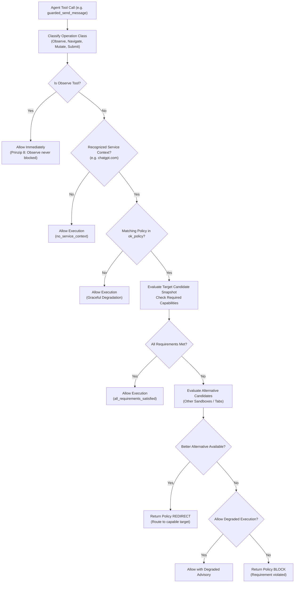

# Policy Resolution, Guarded Commitments & Perceive Hints

> [!NOTE]
> This guide details the Pre-Execution Policy Check engine, tool operation classes, candidate evaluation and target redirection, the fail-open safety principle, proactive `okHints` generation during perception, and the TOB flush barrier protocol.

---

## 1. The Pre-Execution Policy Engine

In autonomous multi-tab workspaces, agents frequently make assumptions about the active tab's capabilities (e.g. attempting to send a complex reasoning prompt to a tab that is logged out, or expecting a Pro model in a Free account).

Operational Knowledge acts as an **advisory and protective gatekeeper** before tool execution:



---

## 2. Tool Operation Classification

Before policy evaluation, tools are categorized into four functional operation classes:

| Operation Class | Tools Included | Policy Constraint |
| :--- | :--- | :--- |
| **Observe** | `perceive`, `read_dom`, `read_text`, `capture_screenshot`, `page_info`, `search_text`, `tabs`, `get_instructions`, `pks_get`, `operator_notes_query` | **Never blocked under any circumstance.** Observation is the foundational prerequisite for learning and adaptation. |
| **Navigate** | `navigate`, `back`, `forward`, `reload`, `tab_new` | Evaluated against target routing policies and allowed origins. |
| **Mutate** | `click_selector`, `type_selector`, `input_text`, `input_click`, `guarded_switch_model`, `scroll_by`, `cdp`, `eval` | Checked for basic session validity and interaction state. |
| **Submit** | `guarded_send_message`, `guarded_submit_form`, `guarded_login`, `type_selector_secret`, `vault_prepare_fill` | **High-impact actions.** Strictly enforced against required capabilities (e.g. authenticated session, active subscription, model tier). |

---

## 3. The 6-Step Decision Hierarchy

When a non-observe tool is invoked, `OkPolicyResolver.Resolve` executes a six-step evaluation hierarchy:

1. **Observe-Tools Exemption (Principle 8):** Observe tools immediately return `Allow` with reason `observe_always_allowed`.
2. **Missing Service Context:** If the target URL does not match a known service key (e.g. a plain local file or unindexed website), returns `Allow` with reason `no_service_context`.
3. **No Configured Policies (Principle 7 — Graceful Degradation):** If the service has no active rules in `ok_policy`, execution proceeds unhindered (`no_policies_configured`).
4. **All Requirements Met:** If the current target's compiled capabilities satisfy all required criteria, returns `Allow` (`all_requirements_satisfied`).
5. **Requirement Violated & Alternative Search:**
   * If a required capability is missing or unknown on the active target, Nova inspects alternative candidate snapshots across all configured sandboxes and open tabs (`OkStore.LoadAlternativeCandidateSnapshots`).
   * **Redirect:** If an alternative sandbox satisfies the requirement, the engine returns a `Redirect` decision pointing to the capable target ID.
   * **Block vs. Degraded:** If no alternative exists:
     * If the policy allows degraded fallback (`AllowDegraded = true`), execution proceeds with an advisory notice (`Degraded`).
     * If degraded fallback is disallowed, tool execution is halted with a structured `Block` diagnostic.
6. **The Fail-Open Principle (Principle 6):** If policy evaluation encounters an unresolved state, an internal database timeout, or an unhandled exception, **it defaults to Allow**. A false-positive block causes total agent paralysis, whereas failing open allows the model to attempt its task and inspect real error feedback.

---

## 4. Proactive Perception Hints (`okHints` in `nova.perceive`)

Rather than relying on agents to remember when to update state, Nova embeds proactive hints directly into every call to `nova.perceive`.

### Hint Generation Invariants

Inside perception orchestration, `BuildOkHints` evaluates the target binding and returns an `okHints` object in `structuredContent`:

```json
{
  "okHints": {
    "shouldObserve": true,
    "missingOrStaleKeys": [
      "core.login_state",
      "core.model.active",
      "core.plan.tier"
    ],
    "lastObservedAgoMs": 420000,
    "serviceKey": "chatgpt",
    "currentFacts": {
      "core.page.type": {
        "valueJson": "\"chat\"",
        "factState": "fresh",
        "certaintyLevel": "likely",
        "lastObservedAt": 1709500000000
      }
    },
    "firstVisit": false,
    "urlChanged": false
  }
}
```

### When is `shouldObserve = true`?

`shouldObserve` is set to `true` whenever any of the following three conditions are met:
1. **First Visit (`firstVisit = true`):** No prior facts exist in the database for this target binding.
2. **URL Route Shift (`urlChanged = true`):** The tab has navigated to a different URL or route since the last observation.
3. **Stale or Missing Canonical Keys:** One or more canonical schema keys have never been observed or have not been refreshed within the **5-minute staleness threshold** (`stalenessThresholdMs = 300,000 ms`).

### Session-Level De-duplication

To eliminate prompt clutter and save model tokens, Nova de-duplicates perception hints:
* The system caches `(currentUrl, missingKeysFingerprint)` per `profileId|serviceKey`.
* If an agent calls `perceive` repeatedly on the same page without navigating or resolving keys, identical hint payloads are **silently suppressed**.
* Re-delivery occurs only when the tab navigates to a new URL or when the set of missing/stale keys changes.

---

## 5. Tool Observation Bus (TOB) Flush Barrier

Operational Knowledge features a background post-execution learning loop that tracks completed dispatches asynchronously. 

When tool execution completes, the Tool Observation Bus (TOB) coordinates with OK via the **Flush Barrier Protocol**:

```csharp
// TOB Barrier Flush Coordination
await WaitForOkFlushAsync(barrierSeq, cancellationToken, pollIntervalMs: 25, maxWaitMs: 5000);
```

1. **Asynchronous Commitment:** The background learner updates `_okCommittedSeq` as each dispatch finishes processing.
2. **Evidence Synchronization:** Before TOB emits evidence completion tokens, `WaitForOkFlushAsync` polls until all observations up to `barrierSeq` are committed to SQLite.
3. **Graceful Timeout:** If disk I/O prevents completion within 5,000 ms, the wait gracefully times out and reports `ingestionComplete = false` rather than hanging the agent turn.

---

## Related Documentation

* **[Operational Knowledge Overview](README.md)** — Architectural hub, taxonomy, and system integrations.
* **[Signal Vocabulary & Observations Log](signal-vocabulary-and-observations.md)** — Canonical signals, certainty math, and input validation.
* **[Fact Lifecycle & Supersedence](fact-lifecycle-and-supersedence.md)** — Temporal versioning, SQLite partial index, and account fingerprinting.
* **[Derived Capabilities & Shadow Learning](derived-capabilities-and-shadow-learning.md)** — Capability compilers, shadow learning, and Closed-Loop verification.
