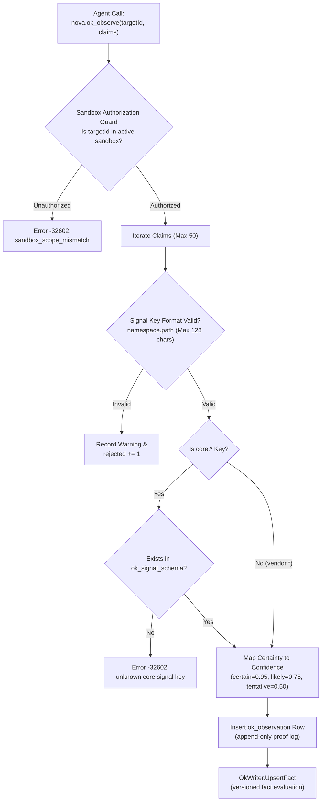

# Canonical Signal Vocabulary & Observations Log

> [!NOTE]
> This guide details the canonical signal schema (`ok_signal_schema`), the distinction between core and vendor namespaces, the certainty-to-confidence mathematical mapping, and the append-only observation intake pipeline used by Operational Knowledge (OK).

---

## 1. The Real-Time State Ingestion Pipeline

Unlike static configuration files or unstructured chat messages, Operational Knowledge relies on **structured semantic telemetry**. The primary entrance into the system is the MCP tool `nova.ok_observe`, where agents submit typed claims about the live tab environment.



---

## 2. The Canonical Signal Vocabulary (`ok_signal_schema`)

To prevent fragmentation (e.g. one agent reporting `"user_logged_in": true` while another reports `"auth_state": "authenticated"`), Nova seeds a standardized vocabulary of **15 canonical core signals**.

### Core Signal Catalog

| Signal Key | Type | Description | Example Value |
| :--- | :--- | :--- | :--- |
| `core.login_state` | `string` | Authentication status of the target service. | `"logged_in"`, `"logged_out"`, `"session_expired"` |
| `core.model.active` | `string` | The currently selected / active model label. | `"gpt-4o"`, `"claude-3-7-sonnet"`, `"gemini-2.5-pro"` |
| `core.model.family` | `string` | High-level product generation or model family. | `"chatgpt-5.2"`, `"claude-3.5"`, `"gemini-2"` |
| `core.model.routing_mode` | `string` | Active model selection mechanism. | `"auto"`, `"manual"`, `"pro"`, `"instant"` |
| `core.plan.label` | `string` | The human-visible subscription label displayed on page. | `"Pro"`, `"Team"`, `"Enterprise"`, `"Free"` |
| `core.plan.tier` | `string` | Normalized tier classification. | `"pro"`, `"team"`, `"enterprise"`, `"free"` |
| `core.models.available` | `json_array` | Array of models selectable in UI dropdowns. | `["gpt-4o", "o3-pro", "o1"]` |
| `core.account.display_name`| `string` | Visible user name or account display label. | `"Jane Doe"`, `"Admin"` |
| `core.account.email` | `string` | User email address (strongest identity anchor). | `"jane.doe@example.com"` |
| `core.session.state` | `string` | Lifecycle state of the active web session. | `"active"`, `"idle"`, `"throttled"`, `"blocked"` |
| `core.page.type` | `string` | Functional classification of the current view. | `"chat"`, `"dashboard"`, `"login"`, `"settings"` |
| `core.ui.language` | `string` | Detected language of the service interface. | `"en"`, `"de"`, `"fr"`, `"ja"` |
| `core.ui.theme` | `string` | Visual appearance theme. | `"dark"`, `"light"`, `"system"` |
| `core.subscription.active`| `boolean`| Binary subscription validity flag. | `true`, `false` |
| `core.feature.available` | `json_array` | Specific features unlocked in the active session. | `["canvas", "code_execution", "search"]` |

### Key Naming Grammar

All signal keys must satisfy the hierarchical namespace regex:
```regex
^[a-z][a-z0-9]*(\.[a-z][a-z0-9_]*)+$
```
* Keys must start with a lowercase letter.
* Hierarchy levels are separated by dots (`.`).
* Segments may contain lowercase alphanumeric characters and underscores.
* Maximum key length: **128 characters**.

### Core vs. Vendor Namespaces

* **`core.*` (Strict Governance):** Core keys represent universal concepts shared across multiple web services (login, model, subscription, theme). **Unknown `core.*` keys are strictly rejected** with `-32602` to protect the integrity of cross-platform reasoning.
* **`vendor.*` (Extensible Sandbox):** Platform-specific or experimental signals (e.g. `vendor.chatgpt.sidebar_collapsed`, `vendor.claude.artifact_visible`, `vendor.gemini.thinking_budget`) can be emitted freely without prior registration in SQLite.

---

## 3. Certainty Levels & Mathematical Confidence Mapping

When agents observe a web application, they operate under differing degrees of epistemic certainty. OK transforms discrete semantic certainty levels into continuous mathematical confidence weights:

$$w_{\text{source}} = \begin{cases} 
1.00 & \text{if } \text{source} = \text{"agent"} \text{ (Semantic visual understanding)} \\
0.80 & \text{if } \text{source} = \text{"system"} \text{ (Heuristic pattern matching)}
\end{cases}$$

$$\text{Confidence} = \text{clamp}\left(\text{BaseConfidence}(\text{Certainty}) \times w_{\text{source}},\; 0.0,\; 1.0\right)$$

| Certainty Level | Base Confidence | Agent Final Weight ($w=1.0$) | System Shadow Weight ($w=0.8$) | Semantic Meaning |
| :--- | :---: | :---: | :---: | :--- |
| `certain` | `0.95` | **`0.95`** | `0.76` | Unambiguous visual proof (e.g. visible user avatar, clear "Pro" badge). |
| `likely` *(Default)* | `0.75` | **`0.75`** | `0.60` | Strong indirect evidence (e.g. model selector defaults to GPT-4o). |
| `tentative` | `0.50` | **`0.50`** | `0.40` | Speculative or weak hint (e.g. URL route suggests dashboard, but content is still loading). |

### The Agent Primacy Invariant
Agent observations are weighted higher than automated system extractors ($1.00$ vs $0.80$). An agent possesses holistic multimodal awareness of page layout and dynamic state, whereas static heuristic scrapers are vulnerable to minor CSS or DOM layout changes.

---

## 4. The Append-Only Observation Proof Log (`ok_observation`)

Every claim accepted by `nova.ok_observe` generates an immutable row in the SQLite `ok_observation` table:

```sql
CREATE TABLE ok_observation (
    observation_id       INTEGER PRIMARY KEY AUTOINCREMENT,
    target_id            INTEGER NOT NULL,
    service_id           INTEGER,
    account_id           INTEGER,
    binding_id           INTEGER,
    extractor_key        TEXT NOT NULL,          -- e.g. "agent.ok_observe"
    scope_ref            TEXT NOT NULL,          -- e.g. "binding:42" or "target:5"
    scope_kind           TEXT NOT NULL,          -- "binding" or "target"
    signal_key           TEXT NOT NULL,          -- e.g. "core.login_state"
    signal_value_json    TEXT NOT NULL,          -- Canonical JSON value
    confidence           REAL NOT NULL,          -- Scaled 0.0 to 1.0
    observed_at          INTEGER NOT NULL,       -- Milliseconds UTC epoch
    page_url             TEXT,
    page_title           TEXT,
    route_key            TEXT,                   -- e.g. "chatgpt.com/c"
    source_tool_name     TEXT NOT NULL,          -- "nova.ok_observe"
    source_call_id       TEXT NOT NULL,          -- Perception ID or execution nonce
    evidence_json        TEXT,                   -- Optional human-readable rationale
    source_kind          TEXT NOT NULL DEFAULT 'agent'
);
```

### Invariant: Observations are Append-Only
Observations are **never updated or deleted**. Even if an observation is later contradicted or superseded by a newer claim, the historical observation row remains intact. This establishes a verifiable audit trail for post-incident debugging and reinforcement learning.

---

## 5. Input Validation & Defense Limits

To protect the local embedded database from resource exhaustion or malicious payloads, Nova enforces strict validation boundaries:

| Parameter | Boundary Limit | Failure Mode |
| :--- | :--- | :--- |
| Max Claims per Call | **50 claims** | Immediate rejection of entire call (`-32602`). |
| Max Value JSON Size | **16,384 characters** | Immediate rejection of entire call (`-32602`). |
| Signal Key Length | **128 characters** | Immediate rejection of entire call (`-32602`). |
| Active Facts per Scope | **500 active facts** | Rejects claim with state `"scope_full"`, records warning. |
| Sandbox Isolation | Target must match active sandbox | Rejects call with `-32602 sandbox_scope_mismatch`. |

---

## 6. Schema Discovery Tool: `nova.ok_signal_schema`

Agents can query the live schema catalog at any time using `nova.ok_signal_schema`:

### Protocol Example

#### JSON-RPC Request
```json
{
  "name": "nova.ok_signal_schema",
  "arguments": {
    "namespace": "core",
    "includeDeprecated": false,
    "maxEntries": 20
  }
}
```

#### JSON-RPC Response
```json
{
  "content": [{ "type": "text", "text": "OK signal schema: 15 key(s)." }],
  "structuredContent": {
    "ok": true,
    "namespaceFilter": "core",
    "includeDeprecated": false,
    "maxEntries": 20,
    "count": 15,
    "truncated": false,
    "keys": [
      {
        "signalKey": "core.login_state",
        "namespace": "core",
        "valueType": "string",
        "description": "Login state of the service",
        "exampleJson": "\"logged_in\"",
        "deprecated": false
      },
      {
        "signalKey": "core.model.active",
        "namespace": "core",
        "valueType": "string",
        "description": "Currently active model",
        "exampleJson": "\"gpt-4o\"",
        "deprecated": false
      }
    ]
  }
}
```

---

## Related Documentation

* **[Operational Knowledge Overview](README.md)** — Architectural hub, taxonomy, and system integrations.
* **[Fact Lifecycle & Supersedence](fact-lifecycle-and-supersedence.md)** — Temporal versioning, SQLite partial index, and account fingerprinting.
* **[Policy Resolution & Perceive Hints](policy-resolution-and-perceive-hints.md)** — Pre-execution gates, tool classification, and `okHints`.
* **[Derived Capabilities & Shadow Learning](derived-capabilities-and-shadow-learning.md)** — Capability compilers, shadow learning, and Closed-Loop verification.
