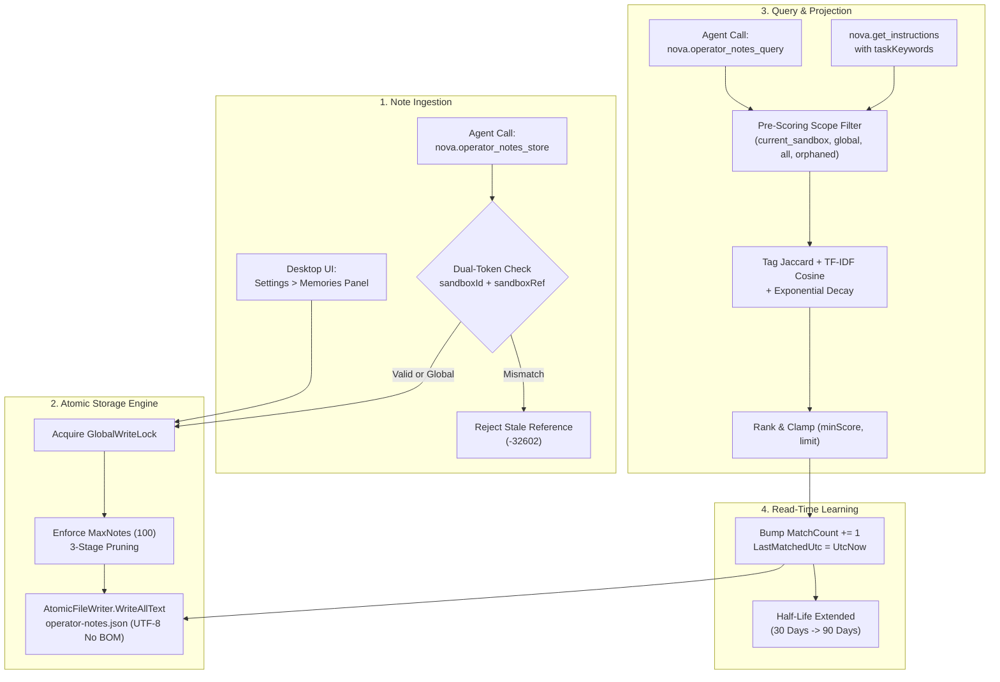

# Operator Notes

Operator Notes preserve human-directed operating guidance, user preferences, workflow boundaries, and environment context across agent sessions. Unlike website-bound notes or automated recognition stores, Operator Notes represent **cross-session operational memory** that functions independently of any specific web domain or URL.

Notes are searchable by keywords and tags, support optional categorization, and operate under either a global or sandbox-isolated scope. Storing a note records an operator instruction or an agent observation; it establishes a historical snapshot rather than verified factual truth.

---

## Sub-Guides & Deep Dives

To explore the mathematical formulas, scoring models, and security mechanics in detail, consult the specialized guides:

* **[Scoring Engine, TF-IDF & Temporal Decay](scoring-and-retrieval.md)**  
  Mathematical specification of the retrieval pipeline, tag intersection scoring ($\text{tagScore}$), Vector Space TF-IDF cosine similarity ($\text{contentScore}$), non-dilutive maximum blending, and dynamic exponential temporal decay with the 3x reinforcement dynamic.
* **[Sandbox Binding, Identity & Lifecycle](sandbox-binding-and-lifecycle.md)**  
  Deep analysis of the recycled-handle vulnerability, dual-token handshake (`sandboxId` + `sandboxRef`), the four retrieval scopes (`current_sandbox`, `global`, `all`, `orphaned`), the anti-leakage orphan invariant during sandbox deletion, and 3-stage capacity pruning (`MaxNotes = 100`).
* **[Provider Neutrality, Prompt Projection & Runtime Contracts](provider-neutrality-and-system-prompts.md)**  
  Architecture of cross-model memory synchronization, how Operator Notes eliminate provider silos (Claude, Codex, Gemini), `ContextSnapshot` prompt injection, epistemological guardrails (`NotesDynamicHint`), and resilient argument coercion.

---

## 1. Practical Examples

### Saving Operator Guidance
When working on recurring tasks, operators frequently supply guidelines that should persist into subsequent sessions. For example, when an operator establishes a preference for CSV exports:

> *"Save an Operator Note that I prefer CSV exports for quarterly report analysis. Use relevant report, CSV, and workflow tags. Keep it scoped to Sandbox B where we perform reporting tasks, then return the saved note ID and persistent sandbox reference."*

The agent calls `nova.operator_notes_store` to record the preference. In any later session within Sandbox B, searching for task keywords (or requesting instructions via `nova.get_instructions`) brings this guidance directly into the agent's context window.

### Recording Environmental Discoveries
An agent can also record environmental facts discovered during task execution:

> *"Note that the local preview server for the documentation pipeline binds to port 8080 and requires the environment variable `DOCS_PORT=8080`. Tag it with `preview`, `pipeline`, and `env`."*

---

## 2. Nova Memory Systems: Knowledge Taxonomy

Nova features several complementary memory systems designed for distinct operational scopes and verification standards:

| Memory System | Scope / Anchor | Primary Content | Verification Gate | Persistence | MCP Access |
| :--- | :--- | :--- | :--- | :--- | :--- |
| **Operator Notes** | Global or Sandbox Profile (`SandboxUid`) | User preferences, workflow guidance, environment variables, tool constraints | **None** (Historical snapshot; not verified truth) | Persistent across sessions; pruned at 100 notes | [`nova.operator_notes_store`](../../../mcp-reference/tools/task-memory/nova-operator-notes-store.md)<br/>[`nova.operator_notes_query`](../../../mcp-reference/tools/task-memory/nova-operator-notes-query.md) |
| [Domain Notes](../domain-notes/README.md) | Website Origin / Domain (`example.com`) | Origin-specific instructions, policy requirements, required acknowledgements | Optional mandatory ACK gate (`mustAck=true`) | Persistent per domain across all tabs | [`nova.domain_note`](../../../mcp-reference/tools/task-memory/nova-domain-note.md)<br/>[`nova.domain_notes_list`](../../../mcp-reference/tools/task-memory/nova-domain-notes-list.md) |
| [Browser Memory](../browser-memory/README.md) | Website Domain / Tab Session | Domain-bound browsing observations, dynamic site behaviors, recalled context | Read/write recall without policy gates | Persistent per domain | [`nova.memory_recall`](../../../mcp-reference/tools/task-memory/nova-memory-recall.md)<br/>[`nova.memory_note`](../../../mcp-reference/tools/task-memory/nova-memory-note.md) |
| [Episodic Task Memory (ETM)](../episodic-task-memory-etm/README.md) | Task Instance / Task Profile | Multi-turn task progress, subtask execution logs, milestone completions | Milestone completion & verification gates | Persistent per task lifecycle | [`nova.task_instance_create`](../../../mcp-reference/tools/task-memory/nova-task-instance-create.md)<br/>[`nova.task_instance_progress`](../../../mcp-reference/tools/task-memory/nova-task-instance-progress.md) |
| [Phenomenological Knowledge Store (PKS)](../phenomenological-knowledge-store-pks/README.md) | DOM Phenomenon / Selectors | Procedural UI automation recipes, selector fallbacks, recovery playbooks | Empirical DOM validation & drift detection | Persistent playbook repository | [`nova.pks_get`](../../../mcp-reference/tools/pks-and-learning/nova-pks-get.md)<br/>[`nova.pks_upsert`](../../../mcp-reference/tools/pks-and-learning/nova-pks-upsert.md) |
| [Operational Knowledge (OK)](../operational-knowledge-ok/README.md) | System / Network / Runtime Service | Real-time machine-learned facts, target bindings, service capabilities | Live runtime signal schema validation | Ephemeral & runtime-scoped | [`nova.ok_observe`](../../../mcp-reference/tools/app-shell-and-ui/nova-ok-observe.md)<br/>[`nova.ok_signal_schema`](../../../mcp-reference/tools/app-shell-and-ui/nova-ok-signal-schema.md) |
| [Evidence Verification Mode (EVM)](../../../research/evidence-verification-mode-evm/README.md) | Research Claims & Candidates | Verifiable empirical research facts, claims, sources, and audit trails | Cross-source citation & claim verification | Candidate journal & persistent notes (`tag="evm"`) | [`nova.memory_add_candidate`](../../../mcp-reference/tools/task-memory/nova-memory-add-candidate.md)<br/>[`nova.memory_stats`](../../../mcp-reference/tools/task-memory/nova-memory-stats.md) |

---

## 3. End-to-End Architectural Lifecycle

The complete lifecycle of an Operator Note spans initial creation, atomic storage, relevance-ranked query retrieval, read-time reinforcement, and capacity reconciliation:



---

## 4. MCP Tool Reference Suite

Operator Notes are managed through four specialized MCP tools registered in Nova's `system_tools` capability bundle:

### 1. `nova.operator_notes_store`
Stores a new note or updates an existing note.

| Parameter | Type | Required | Default | Description |
| :--- | :--- | :---: | :--- | :--- |
| `content` | `string` | **Yes** | — | Note content text (max 10,000 characters). |
| `tags` | `array[string]` | **Yes** | — | Keywords for search matching (1 to 20 tags; each max 100 characters). |
| `category` | `string` | No | — | Optional classification (e.g., `'environment'`, `'workflow'`, `'preference'`). |
| `source` | `string` | No | `"agent"` | Note author: `'agent'` or `'user'`. |
| `id` | `string` | No | — | Existing 32-hex note ID to update. If missing on disk, creates a new note and returns `action: "created_id_not_found"`. |
| `sandboxId` | `string` | No | — | Sandbox letter handle (e.g., `'A'`, `'B'`). Omit for a global note. Mandatory with `sandboxRef`. |
| `sandboxRef` | `string` | No | — | Persistent 32-hex unique identifier (`PersistentUid`) from `nova.tabs` or `nova.sandbox_context`. |

#### Response Schema
```json
{
  "content": [{ "type": "text", "text": "Operator note created." }],
  "structuredContent": {
    "action": "created",
    "noteCount": 42,
    "noteId": "a3f1c9e2b4d6487f9a21e0d4f1a2b3c4",
    "missedId": null,
    "sandboxRef": "d8e3b2a1c4f567890123456789abcdef"
  }
}
```

* If an existing `id` was specified and matched: `action` is `"updated"`.
* If an existing `id` was specified but could not be found: `action` is `"created_id_not_found"`, and `missedId` echos the unresolvable ID.

---

### 2. `nova.operator_notes_query`
Queries notes matching task keywords with relevance scoring and temporal decay.

| Parameter | Type | Required | Default | Allowed / Range | Description |
| :--- | :--- | :---: | :--- | :--- | :--- |
| `keywords` | `array[string]` | **Yes** | — | Non-empty | Query keywords to match against tags and content. |
| `minScore` | `number` | No | `0.3` | `0.0` – `1.0` | Minimum relevance threshold after decay. |
| `limit` | `integer` | No | `10` | `1` – `50` | Maximum number of results to return. |
| `scope` | `string` | No | `"current_sandbox"` | `current_sandbox`, `global`, `all`, `orphaned` | Operational search scope. |
| `sandboxId` | `string` | No | — | — | Explicit sandbox letter handle to override active tab target. |
| `sandboxRef` | `string` | No | — | — | Mandatory persistent UID token if `sandboxId` is provided. |

#### Response Schema
```json
{
  "content": [{ "type": "text", "text": "1 matching note(s) (scope=current_sandbox)." }],
  "structuredContent": {
    "scope": "current_sandbox",
    "resolvedSandboxRef": "d8e3b2a1c4f567890123456789abcdef",
    "notes": [
      {
        "id": "a3f1c9e2b4d6487f9a21e0d4f1a2b3c4",
        "content": "Always export financial reports as UTF-8 CSV.",
        "tags": ["report", "csv", "finance"],
        "category": "workflow",
        "source": "user",
        "score": 0.942,
        "scoreBreakdown": {
          "tagScore": 1.0,
          "contentScore": 0.884,
          "decayFactor": 0.942
        },
        "sandboxId": "B",
        "sandboxName": "Financial Operations",
        "sandboxRef": "d8e3b2a1c4f567890123456789abcdef",
        "sandboxStatus": "active"
      }
    ],
    "hint": "These notes are snapshots from earlier sessions, not guaranteed facts..."
  }
}
```

---

### 3. `nova.operator_notes_list`
Retrieves a paginated inventory of notes filtered by scope.

| Parameter | Type | Required | Default | Allowed / Range | Description |
| :--- | :--- | :---: | :--- | :--- | :--- |
| `offset` | `integer` | No | `0` | $\ge 0$ | Zero-indexed pagination offset. |
| `limit` | `integer` | No | `20` | `1` – `100` | Maximum entries per page. |
| `scope` | `string` | No | `"current_sandbox"` | `current_sandbox`, `global`, `all`, `orphaned` | Filter scope. |
| `sandboxId` | `string` | No | — | — | Explicit sandbox letter handle. |
| `sandboxRef` | `string` | No | — | — | Mandatory persistent UID token if `sandboxId` is provided. |

#### Response Schema
```json
{
  "content": [{ "type": "text", "text": "1 of 12 note(s) (scope=global)." }],
  "structuredContent": {
    "total": 12,
    "offset": 0,
    "scope": "global",
    "resolvedSandboxRef": null,
    "notes": [
      {
        "id": "c1a2e3f4b5d67890123456789abcdef0",
        "content": "Always produce concise markdown summaries.",
        "tags": ["formatting", "markdown"],
        "category": "preference",
        "source": "user",
        "createdUtc": "2026-09-15T10:30:00.0000000Z",
        "lastMatchedUtc": "2026-10-01T14:15:22.0000000Z",
        "matchCount": 8,
        "sandboxId": null,
        "sandboxName": null,
        "sandboxRef": null,
        "sandboxStatus": null
      }
    ],
    "hint": "These notes are snapshots from earlier sessions, not guaranteed facts..."
  }
}
```

---

### 4. `nova.operator_notes_delete`
Permanently deletes an operator note by its unique identifier.

| Parameter | Type | Required | Default | Description |
| :--- | :--- | :---: | :--- | :--- |
| `id` | `string` | **Yes** | — | Unique identifier of the note to remove. |

#### Response Schema
```json
{
  "content": [{ "type": "text", "text": "Deleted operator note 'a3f1c9e2b4d6487f9a21e0d4f1a2b3c4'." }],
  "structuredContent": {
    "deleted": true,
    "id": "a3f1c9e2b4d6487f9a21e0d4f1a2b3c4"
  }
}
```

If the ID is not found, `deleted` is `false`, and an informational message is returned without raising an RPC error.

---

## 5. Proactive Instruction Projection (`nova.get_instructions`)

To eliminate the friction of agents having to remember to query notes at the start of a task, Nova supports **proactive note surfacing** directly inside the primary instruction dispatch tool [`nova.get_instructions`](../../../mcp-reference/tools/app-shell-and-ui/nova-get-instructions.md).

### How It Works
When an agent passes `taskKeywords` to `nova.get_instructions`:
```json
{
  "taskKeywords": ["report", "csv", "finance"]
}
```

Nova automatically executes an internal query against the active sandbox scope:
1. Matches are scored using the standard hybrid TF-IDF and temporal decay engine.
2. A formatted markdown block is appended to the prose instructions:
   ```markdown
   ### Matched Operator Notes
   - [a3f1c9e2b4d6487f9a21e0d4f1a2b3c4] (score=0.94) Always export financial reports as UTF-8 CSV.
   ```
3. A structured array `matchedOperatorNotes` is returned in the structured response object.
4. **Read-Time Reinforcement:** Each matched note atomically receives `MatchCount += 1` and `LastMatchedUtc = UtcNow`, extending its half-life to 90 days.

---

## 6. Storage Mechanics & Data Structure

Operator Notes are persisted in the user profile directory:
```
%LOCALAPPDATA%\NovaBrowser\operator-notes.json
```

### Concurrency & Atomic Writes
* **Global Write Lock:** All read-modify-write sequences are synchronized under an internal global lock, preventing race conditions between parallel MCP tool calls and the desktop UI.
* **Atomic File Updates:** Serialization uses an atomic file writer (writing to a temporary file before performing an atomic replace) encoded in UTF-8 without BOM.

### Data Model Schema
Each note entry adheres to the following record structure:

```json
{
  "id": "a3f1c9e2b4d6487f9a21e0d4f1a2b3c4",
  "sandboxUid": "d8e3b2a1c4f567890123456789abcdef",
  "content": "Always export financial reports as UTF-8 CSV.",
  "tags": ["report", "csv", "finance"],
  "category": "workflow",
  "source": "user",
  "createdUtc": "2026-09-20T12:00:00.0000000Z",
  "lastMatchedUtc": "2026-10-08T18:45:10.1234567Z",
  "matchCount": 5
}
```

* **ID Format:** 32-character hexadecimal GUID (`N` format). Legacy 8-character IDs from earlier releases remain valid for lookups.
* **`sandboxUid`:** The immutable 32-hex `PersistentUid` of the associated sandbox, or `null` for global notes.
* **`source`:** `'agent'` when created via MCP tools; `'user'` when created or edited by the human operator in the Settings UI.

---

## 7. Desktop Settings UI Integration

In addition to programmatic MCP management, Nova provides a full desktop management panel under **Settings > Memories & Sandboxes**:

```
┌────────────────────────────────────────────────────────────────────────┐
│  Settings > Memories & Sandboxes                                       │
├────────────────────────────────────────────────────────────────────────┤
│  [ Add New Memory Form ]                                               │
│  Content:  [ Enter note...                                          ]  │
│  Tags:     [ sandbox, gpt, pro, B                                   ]  │
│  Category: [ workflow           ]  Scope: [ Only for B (Finance) ▾ ]  │
│                                    [ Add Button ]                      │
├────────────────────────────────────────────────────────────────────────┤
│  Filter:   [ Search content, tags, category... ]  Scope: [ All ▾ ]     │
├────────────────────────────────────────────────────────────────────────┤
│  ┌──────────────────────────────────────────────────────────────────┐  │
│  │ Always export financial reports as UTF-8 CSV.                   │  │
│  │ Tags: report, csv, finance                                      │  │
│  │ Category: workflow            Scope: [ Only for B ▾ ]           │  │
│  │ [user] [Sandbox B] 2026-09-20 14:00   5x matched   [Delete Icon] │  │
│  └──────────────────────────────────────────────────────────────────┘  │
│  ...                                                                   │
│  ┌──────────────────────────────────────────────────────────────────┐  │
│  │ Orphaned memories (1)                                            │  │
│  │ Memories anchored to deleted sandboxes. Not visible to agents.   │  │
│  │ [ Delete all orphaned memories ]                                 │  │
│  └──────────────────────────────────────────────────────────────────┘  │
└────────────────────────────────────────────────────────────────────────┘
```

* **Interactive Creation Card:** Easily compose new notes with multi-line content, tags, category, and an intuitive sandbox scope picker.
* **Instant Inline Editing:** Edit content, tags, category, or re-bind sandbox scopes directly inside the card. Edits persist on `LostFocus` under the global write lock. Editing a note automatically flips `source` to `"user"`.
* **Live Filtering:** Substring search across content, tags, and category, paired with a scope filter dropdown.
* **Orphaned Notes Recovery Section:** When a sandbox is deleted, orphaned notes are rendered in a dedicated review section at the bottom of the list. Operators can migrate them to an active sandbox via the scope picker or execute a bulk delete.

---

## 8. Operational Invariants & Security Boundaries

1. **Snapshots, Not Authorizations:** A saved preference is an operational guideline, not permission to bypass user confirmation gates for purchases, message transmission, or account changes.
2. **Pre-Filtering Invariant:** Scope filtering is strictly evaluated **before** relevance scoring. Foreign sandbox notes never compete for top-$K$ rankings.
3. **Anti-Leakage Orphan Invariant:** Deleting a sandbox profile never converts its notes into global notes. Orphaned notes remain strictly isolated from active agents until explicitly reassigned by the operator.
4. **Recycled-Handle Defense:** Specifying a `sandboxId` requires the corresponding `sandboxRef` token. Recycled sandbox letter handles throw `-32602 stale_sandbox_reference` rather than accepting stale bindings.
5. **Capacity Protection:** Storage is capped at 100 notes with a 3-stage pruning algorithm to protect local disk resources and agent token context.

---

[Learning Overview](../README.md) · [All Core Features](../../README.md)
