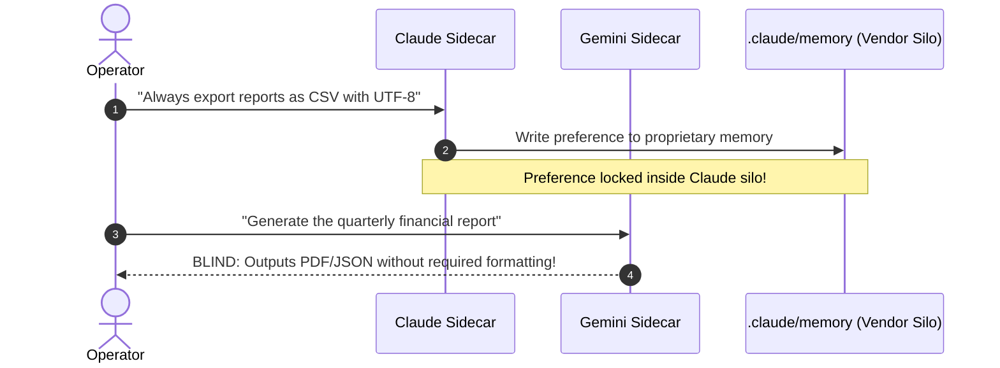
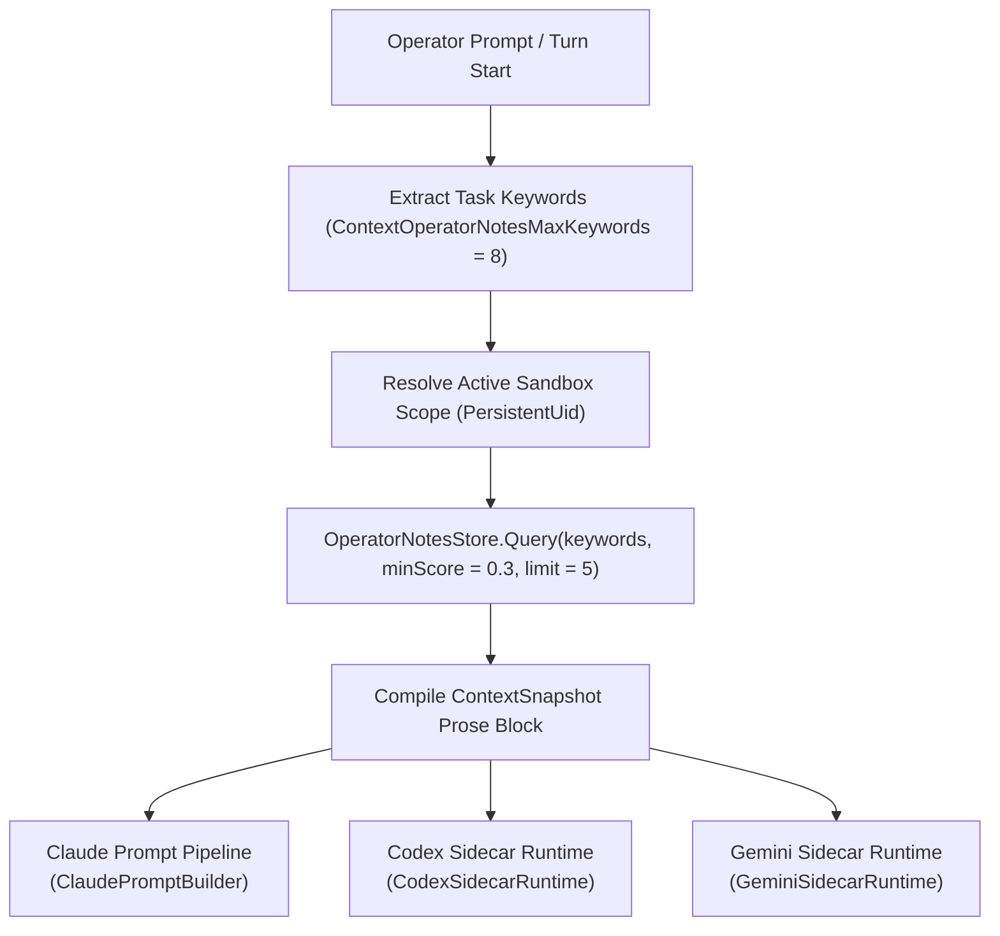

# Provider Neutrality, Prompt Projection & Runtime Contracts

> [!NOTE]
> This guide details how Operator Notes solve the "Provider Memory Silo" problem in multi-model workspaces, how Nova's host runtime projects notes into sidecar prompts via `ContextSnapshot`, the epistemological guardrail contract (`NotesDynamicHint`), and robust agent string-coercion fallbacks.

---

## 1. The Provider Memory Silo Problem

Modern AI development environments often feature multiple frontier models and runtimes. Within Nova AI Workspace, an operator may deploy:
* **Claude 3.7 / 3.5 Sonnet** for complex architectural refactoring and tool interaction.
* **OpenAI o1 / o3 / GPT-4o** (via Codex Sidecar or direct web sandboxes) for deep logical puzzles and reasoning passes.
* **Gemini 2.0 / 2.5 Pro** for massive context synthesis, web analysis, and multimodal reviews.

Each frontier model ecosystem introduces its own proprietary, vendor-locked memory mechanisms:
* Claude utilizes `.claude/memory/` and project memory files.
* Codex relies on `.codex/` and model-specific instructions.
* Web-based LLMs maintain account-level personalization profiles.

### The Fragmentation Vulnerability

When an agent records critical workflow preferences (such as *"Always format financial report exports as UTF-8 RFC 4180 CSV"* or *"Our staging server requires header `X-Environment: Dev`"*), saving that preference to a model's proprietary local memory produces dangerous blind spots:



If the operator later asks Gemini or Codex to execute the same workflow, that model has **zero visibility** into Claude's proprietary memory. The model violates user preferences, makes erroneous assumptions, or halts execution to ask questions the user already answered in a previous session.

---

## 2. The Provider-Neutral Universal Substrate

To guarantee cross-model consistency, Nova designates **Operator Notes as the provider-neutral ground truth**. 

### The Core Architectural Contract

Nova establishes a strict policy across all base system prompt templates (`CLAUDE.base.md`, `AGENTS.base.md`, and Codex/Gemini bootstrap headers):

```text
Provider memory is not shared; if it matters, call nova.operator_notes_store.
```

1. **Vendor Memories are Ephemeral:** Proprietary local caches (`.claude/memory/`, `.codex/`) are treated as local, disposable caches.
2. **Universal Persistence via Nova MCP:** Any instruction that represents workflow-relevant guidance, user preferences, security rules, environment details, or tool constraints **must be persisted via `nova.operator_notes_store`**.
3. **Cross-Model Parity:** When an operator switches active sidecars or alternates between models, Nova projects the exact same Operator Notes into the new model's context window.

---

## 3. Turn-Level `ContextSnapshot` Projection

Instead of forcing agents to manually invoke retrieval tools at the start of every turn, Nova's Host Runtime automatically compiles and injects relevant Operator Notes into every model turn via `ContextSnapshot`:



### Injection Limits & Context Economy

To prevent token bloat while ensuring high recall, the host runtime applies strict context bounding constants:

| Host Runtime Constant | Value | Purpose |
| :--- | :--- | :--- |
| `ContextOperatorNotesMaxKeywords` | `8` | Maximum keyword tokens extracted from current conversation context. |
| `ContextOperatorNotesMaxMatches` | `5` | Maximum number of notes injected into a turn's prompt context. |
| `ContextOperatorNoteTextMaxChars` | `180` | Maximum character length displayed per note snippet in the prompt header. |

This compact injection ensures that models receive crucial operating constraints immediately without consuming valuable reasoning budget.

---

## 4. The Epistemological Guardrail Contract (`NotesDynamicHint`)

Large Language Models are prone to two critical failure modes when presented with historical memory:
1. **Fact Hallucination:** Treating historical notes as immutable physical facts rather than historical snapshots that may have changed.
2. **Authority Escalation:** Treating a saved user preference (e.g., *"I like to purchase domain renewals automatically"*) as blanket authorization to execute irreversible actions (e.g., spending funds or sending outbound emails) without operator confirmation.

### The Wire Disclaimer Invariant

To mitigate these risks, Nova's MCP server injects a mandatory epistemological disclaimer into every response returned by `nova.operator_notes_query` and `nova.operator_notes_list`:

```json
{
  "structuredContent": {
    "hint": "These notes are snapshots from earlier sessions, not guaranteed facts. Contents may be outdated. If you find a note is no longer accurate, update it via operator_notes_store(id=...) or delete it via operator_notes_delete(id=...)."
  }
}
```

### The Three Operational Guardrails

1. **Snapshot, Not Truth:** Notes reflect what was observed or requested in a previous session. Environment state (such as open ports, running services, or live API credentials) must be re-verified against live systems.
2. **Active Hygiene Mandate:** If an agent discovers that a note is outdated, it is instructed to proactively update it via `nova.operator_notes_store(id=...)` or delete it via `nova.operator_notes_delete(id=...)`.
3. **No Blanket Permission:** A note stating *"Prefers staging deployment on port 8080"* does not grant permission to overwrite existing production containers or bypass interactive approval gates.

---

## 5. Resilient Parameter Coercion & Schema Defense

Automated agents often exhibit schema variations during JSON serialization. For example, an agent might serialize a numeric parameter as a string (e.g., `"minScore": "0.5"` or `"limit": "20"`).

### Robust String-Coercion Fallback

Nova implements resilient type-coercion fallbacks for all numeric arguments across Operator Notes handlers:

```csharp
// Agent string-coercion fallback
if (prop.ValueKind == JsonValueKind.String &&
    double.TryParse(prop.GetString()?.Trim(),
                    NumberStyles.Float,
                    CultureInfo.InvariantCulture,
                    out var parsedValue) &&
    double.IsFinite(parsedValue))
{
    return parsedValue;
}
```

* **InvariantCulture Parsing:** Guarantees period decimal separators (`0.5`) parse reliably regardless of local system locale settings (e.g., European comma separators).
* **Finite Check:** Rejects `NaN` and `Infinity` inputs.
* **Strict Rejection of Non-Numeric Strings:** Inputs like `"limit": "unlimited"` or `"minScore": "high"` are strictly rejected with JSON-RPC error `-32602`.

### Strict Allowlist Validation

To prevent parameter leakage and silent typos, every tool enforces an explicit argument allowlist:

```csharp
internal static readonly HashSet<string> StoreAllowedArgs = new(StringComparer.Ordinal)
{
    "content", "tags", "category", "source", "id", "sandboxId", "sandboxRef"
};
```

Any unknown property passed in the root arguments object (e.g., `"extra": "value"` or `"priority": 1`) triggers an immediate `-32602` error listing the allowed parameter set.

---

## 6. Golden Test Suite Matrix

The reliability of Operator Notes across edge cases is verified through an extensive golden test harness (`OPN-S01` – `OPN-S04`, `OPN-E01` – `OPN-E18`):

| Test Case ID | Tool Target | Condition Tested | Expected Outcome |
| :--- | :--- | :--- | :--- |
| `OPN-S01` | `nova.operator_notes_store` | Valid store payload with content and tags | Success (`action: "created"`) |
| `OPN-S02` | `nova.operator_notes_query` | Query with keywords, minScore, and limit | Success (Ranked matches array) |
| `OPN-S03` | `nova.operator_notes_list` | Paginated listing with offset and limit | Success (Paginated slice) |
| `OPN-S04` | `nova.operator_notes_delete` | Note deletion by ID | Success (`deleted: true`) |
| `OPN-E01` | `nova.operator_notes_store` | Missing required `content` | Error `-32602` (`content is required`) |
| `OPN-E02` | `nova.operator_notes_store` | Empty `tags` array | Error `-32602` (`at least one tag is required`) |
| `OPN-E03` | `nova.operator_notes_query` | Empty `keywords` array | Error `-32602` (`at least one keyword is required`) |
| `OPN-E04` | `nova.operator_notes_delete` | Missing or whitespace `id` | Error `-32602` (`id is required`) |
| `OPN-E05` | `nova.operator_notes_list` | Non-numeric string for `limit` (`"bad"`) | Error `-32602` (`limit must be an integer`) |
| `OPN-E06` | `nova.operator_notes_store` | Non-string `content` type | Error `-32602` (`content must be a string`) |
| `OPN-E07` | `nova.operator_notes_store` | Non-array `tags` type | Error `-32602` (`tags must be an array`) |
| `OPN-E08` | `nova.operator_notes_query` | Non-string entry within `keywords` array | Error `-32602` (`keywords entries must be strings`) |
| `OPN-E10` | `nova.operator_notes_store` | Invalid `source` value (e.g., `"system"`) | Error `-32602` (`must be 'agent' or 'user'`) |
| `OPN-E11` | `nova.operator_notes_store` | Unknown top-level parameter | Error `-32602` (`unknown property`) |
| `OPN-E15` | `nova.operator_notes_store` | Non-object arguments payload (`"bad"`) | Error `-32602` (`expected object`) |

---

## Related Documentation

* **[Operator Notes Overview](README.md)** — Architectural hub, memory taxonomy, and tool catalog.
* **[Scoring Engine & Temporal Decay](scoring-and-retrieval.md)** — TF-IDF vector similarity and exponential decay formulas.
* **[Sandbox Binding & Lifecycle](sandbox-binding-and-lifecycle.md)** — Dual-token identity, orphan recovery, and capacity pruning.
