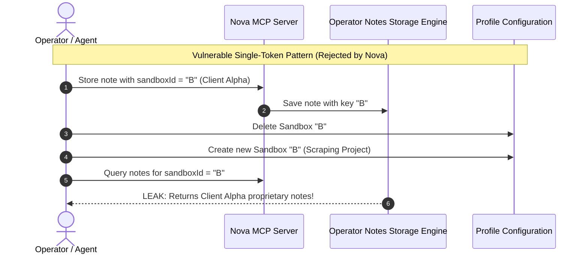
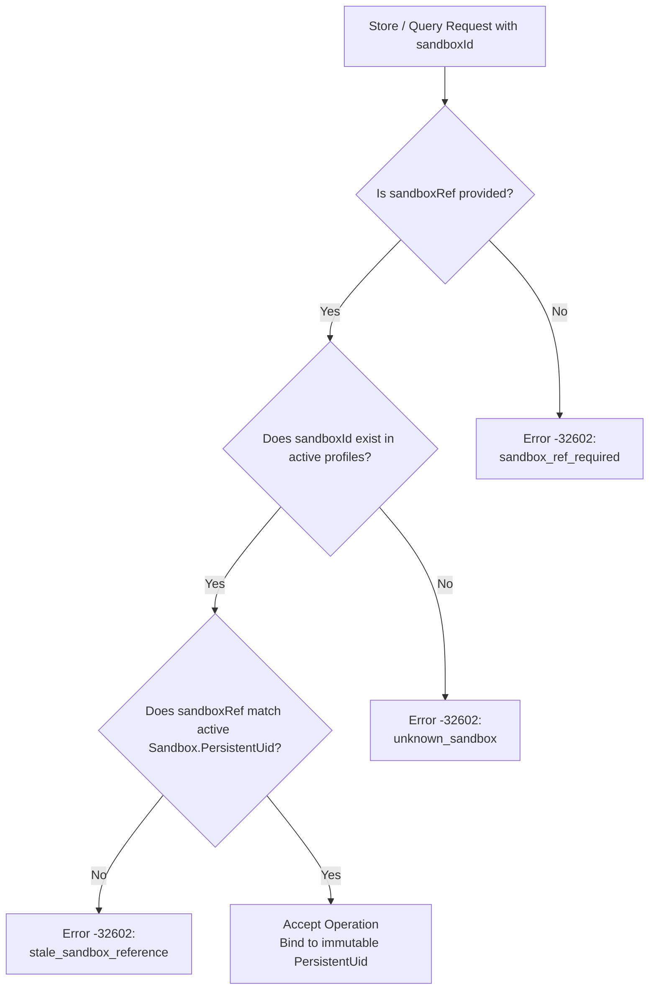
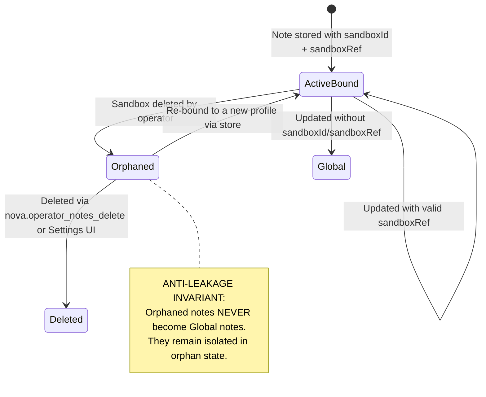
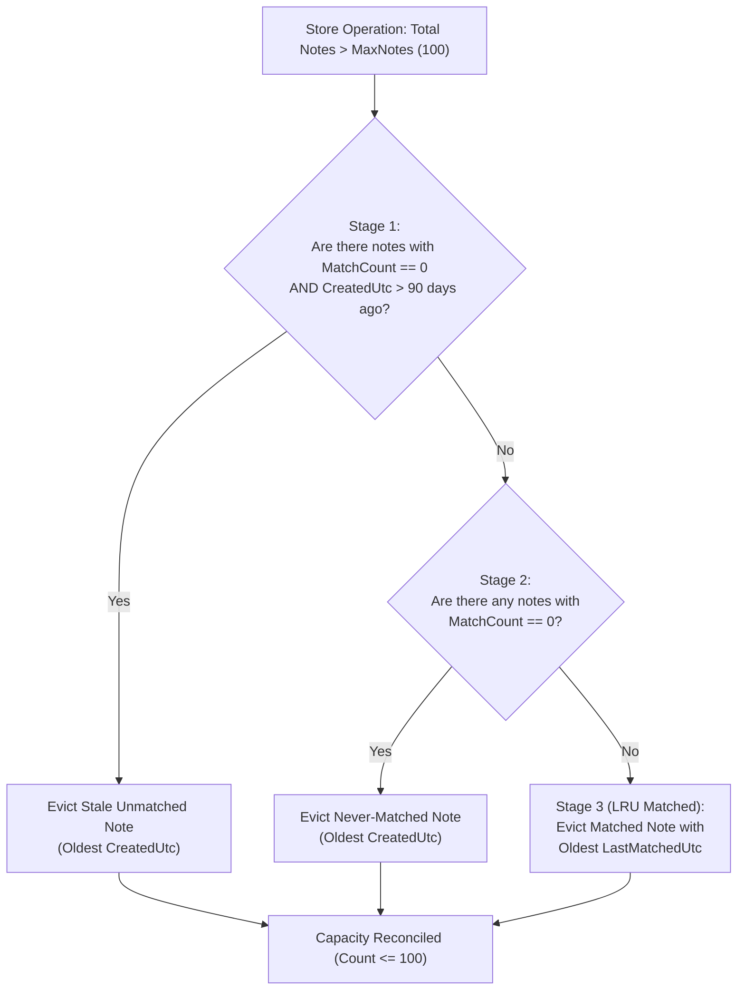

# Sandbox Binding, Identity & Lifecycle

> [!NOTE]
> This guide details how Operator Notes enforce profile isolation, prevent cross-session guidance leakage through the dual-token handshake, handle sandbox deletion with the anti-leakage orphan invariant, and maintain storage health via 3-stage capacity pruning.

---

## 1. The Isolation Principle

In Nova, users and agents operate within isolated sandbox profiles (e.g., Sandbox A for general development, Sandbox B for client reporting, Sandbox C for web scraping). Operating guidance, workflow preferences, and local environment facts often contain sensitive or context-specific instructions that must not bleed across profiles.

Operator Notes support two primary levels of locality:

1. **Global Notes (`sandboxUid = null`):** Universal user preferences and overarching operating guidelines applicable across all sandboxes (e.g., *"Always write unit tests for public methods"*, *"Prefer concise markdown responses"*).
2. **Sandbox-Bound Notes (`sandboxUid = <uuid>`):** Highly specific instructions tied directly to a particular profile's filesystem, credentials, or task domain (e.g., *"Sandbox B uses port 8080 for report preview servers"*, *"Always export financial summaries as UTF-8 CSV"*).

To uphold strict isolation, Nova enforces that **sandbox scope filtering executes prior to any relevance scoring**, ensuring notes from foreign sandboxes can never be observed or matched.

---

## 2. The Recycled Handle Vulnerability & Dual-Token Handshake

### The Stale-Letter-Id Problem

In desktop browser environments, user-facing sandboxes are identified by intuitive display letters (such as `"A"`, `"B"`, or `"C"`). However, display letters are ephemeral:
- An operator might delete Sandbox `"B"` (e.g., a temporary client sandbox containing proprietary API instructions).
- Weeks later, the operator creates a new, unrelated sandbox that is assigned the visual letter `"B"`.

If operating notes were keyed solely by the visual handle (`sandboxId = "B"`), the new sandbox would silently inherit all private notes and credentials from the deleted sandbox.



### The Dual-Token Handshake Solution

To eliminate this vulnerability, Nova mandates a **Dual-Token Handshake** whenever notes are bound to or filtered by a specific sandbox:

| Parameter | Type | Description | Example |
| :--- | :--- | :--- | :--- |
| `sandboxId` | `string` | The user-visible visual letter handle | `"B"` |
| `sandboxRef` | `string` | The immutable, 32-character hexadecimal persistent unique identifier (`PersistentUid`) | `"a8f9c1e4d2a45b88120c98f1234abcd"` |



### Error Reason Codes

When validation fails, the MCP protocol returns a standard JSON-RPC error `-32602` with an explicit diagnostic `reason`:

* **`sandbox_ref_required`:** Returned when `sandboxId` was passed but `sandboxRef` was omitted or empty.
* **`unknown_sandbox`:** Returned when the provided `sandboxId` letter handle does not match any configured sandbox.
* **`stale_sandbox_reference`:** Returned when `sandboxId` exists, but its active `PersistentUid` does not match the provided `sandboxRef`. This indicates the sandbox was deleted and recreated under the same letter.

---

## 3. Retrieval Scopes

When listing or querying notes via `nova.operator_notes_query` or `nova.operator_notes_list`, agents can specify one of four operational scopes:

| Scope | Candidate Notes Returned | Typical Use Case |
| :--- | :--- | :--- |
| `current_sandbox`<br/>*(Default)* | Notes bound to the active sandbox (`SandboxUid == activeUid`) **PLUS** all Global notes (`SandboxUid == null`). | Standard agent execution. Merges profile-specific context with universal preferences. |
| `global` | Only notes with `SandboxUid == null`. | Auditing or modifying global behavioral instructions without profile context. |
| `all` | Every note in the store, across all sandboxes and global scope. | Operator oversight, global maintenance, or administrative export. |
| `orphaned` | Notes where `SandboxUid != null`, but the UID no longer matches any existing sandbox profile. | Cleanup routines, manual migration, or post-deletion audits. |

### Scope Matching Rules

```
MatchesScope(note, scope, activeUid):
  if scope == "global":
      return note.SandboxUid is null
  if scope == "all":
      return true
  if scope == "orphaned":
      return note.SandboxUid is not null and not ExistsInSettings(note.SandboxUid)
  if scope == "current_sandbox":
      return note.SandboxUid is null or (activeUid is not null and note.SandboxUid == activeUid)
```

---

## 4. Deletion Lifecycle & The Anti-Leakage Orphan Invariant

When an operator removes a sandbox profile from Nova, any notes created within that sandbox lose their active profile anchor.



### The Anti-Leakage Invariant

A naive storage implementation might convert notes with dangling references into global notes. In Nova, this is **strictly forbidden**:

$$\text{Deleted}(\text{Sandbox}) \implies \forall n \in \text{Notes}_{\text{Sandbox}},\; n.\text{SandboxUid} \neq \text{null}$$

If orphaned notes became global, private guidance (such as internal IP addresses, database schemas, or secret tokens) would immediately become visible to every other sandbox on the system.

Instead:
1. Notes retain their original `SandboxUid`.
2. They are instantly excluded from all `current_sandbox` queries across all remaining sandboxes.
3. They are discoverable only when explicitly querying `scope = "orphaned"`.

### Orphan Management in Nova Settings

Nova surfaces orphaned notes directly in the desktop Settings UI under **Settings > Memories & Sandboxes**:
- Displays a dedicated **Orphaned Notes Card** when unresolvable notes exist.
- Shows the note content, tags, creation date, and the defunct sandbox reference.
- Allows the operator to bulk-delete orphaned records or re-assign them to an active sandbox.

---

## 5. Capacity Management & 3-Stage Pruning

To keep local retrieval fast, memory lightweight, and prompt token overhead bounded, Nova limits the note store size:

| Parameter | Limit | Description |
| :--- | :--- | :--- |
| `MaxNotes` | **100** | Maximum total notes stored across all sandboxes and global scope. |
| `StaleDays` | **90 days** | Inactivity threshold for never-matched notes. |
| `Content` | **10,000 chars** | Maximum character length for a single note's content body. |
| `Tags` | **20 tags** | Maximum number of tags per note (each tag max 100 chars). |

### The 3-Stage Pruning Algorithm

When a store operation would cause the total note count to exceed `MaxNotes` (100), Nova executes an atomic 3-stage eviction policy inside the storage write lock:



1. **Stage 1 (Stale Unmatched Guidance):** Prunes notes that have **never been matched** (`MatchCount == 0`) and were created more than 90 days ago.
2. **Stage 2 (Never-Matched Guidance):** If no stale notes remain, prunes notes with `MatchCount == 0`, evicting the oldest by `CreatedUtc`.
3. **Stage 3 (Least-Recently-Used Matched Guidance):** If all notes in the store have been matched at least once, evicts the note whose `LastMatchedUtc` timestamp is the oldest.

This hierarchy ensures that established, high-utility instructions are vigorously protected, while speculative or dead notes are shed automatically.

---

## 6. Note Mutation Semantics & `created_id_not_found`

### Updating an Existing Note

When calling `nova.operator_notes_store` with an `id`:
* If the note exists, Nova updates its `content`, `tags`, and optional `category`.
* `UpdatedUtc` is bumped to the current UTC timestamp.
* Historical utility metrics (`MatchCount`, `CreatedUtc`, `LastMatchedUtc`) are preserved.

### The Missing ID Fallback (`created_id_not_found`)

If an agent attempts to update an ID that does not exist (e.g., due to prior manual deletion or an ID hallucination):
* Nova does **not** fail the MCP request.
* Instead, it creates a new note with a fresh ID.
* It returns the explicit action status `"created_id_not_found"` along with `missedId: "<supplied-id>"`.

```json
{
  "action": "created_id_not_found",
  "id": "7f2b189a0c3d4e8b9a12c456d78e9012",
  "missedId": "non_existent_note_id_12345",
  "content": "Updated operating instruction...",
  "scope": "current_sandbox"
}
```

This notifies the calling agent that its target note was not found and that a brand new record was created instead.

> [!WARNING]
> When updating a note, sandbox binding parameters must be passed again. If `sandboxId` and `sandboxRef` are omitted during an update, the note is **converted to a Global note** (`sandboxUid = null`).

---

## Related Documentation

* **[Operator Notes Overview](README.md)** — Architectural hub, memory taxonomy, and complete MCP tool reference.
* **[Scoring Engine & Temporal Decay](scoring-and-retrieval.md)** — Hybrid TF-IDF vector similarity and exponential decay formulas.
* **[Provider Neutrality & Runtime Contracts](provider-neutrality-and-system-prompts.md)** — Multi-model memory synchronization, ContextSnapshot injection, and schema fallbacks.
* **[Tool Reference: nova.operator_notes_store](../../../mcp-reference/tools/task-memory/nova-operator-notes-store.md)** — Parameter specification and store schema.
* **[Tool Reference: nova.operator_notes_list](../../../mcp-reference/tools/task-memory/nova-operator-notes-list.md)** — Paginated listing and scope filtering.
