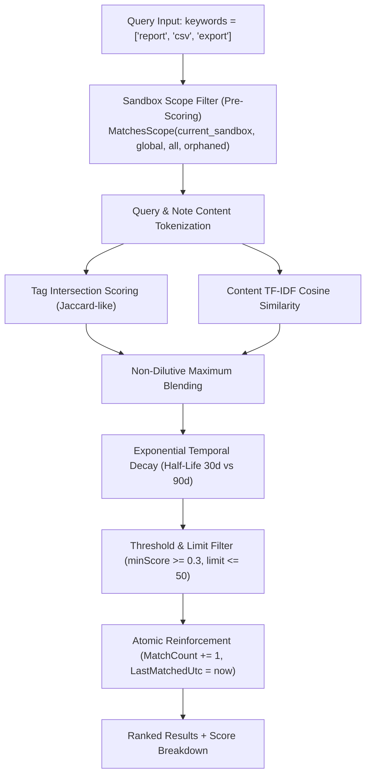

# Scoring Engine, TF-IDF & Temporal Decay

> [!NOTE]
> This guide details the mathematical retrieval algorithms, hybrid tag and content scoring, exponential temporal decay formulas, and proactive context injection mechanisms used by Operator Notes.

---

## 1. The Retrieval Pipeline

When an agent searches for stored operating guidance using `nova.operator_notes_query` or supplies `taskKeywords` during `nova.get_instructions`, Nova executes a multi-stage retrieval pipeline:



### Sandbox Scope Pre-Filtering Invariant

A critical architectural constraint in Nova is that **sandbox scope filtering occurs strictly before scoring and ranking**:

$$\text{CandidateSet} = \{n \in \text{AllNotes} \mid \text{MatchesScope}(n, \text{scope}, \text{effectiveSandboxUid})\}$$

If scoring occurred across the entire note collection prior to scope filtering, a high-scoring global note or irrelevant foreign-sandbox note could consume the top-$K$ limit, completely hiding relevant sandbox-specific guidance. Filtering before scoring guarantees that the top-$K$ results represent the best matches within the requested operational scope.

---

## 2. Mathematical Scoring Formulas

Nova combines structured tag matching with unstructured full-text vector similarity to ensure that both precisely tagged notes and naturally phrased guidance are retrieved accurately.

### 1. Tag Intersection Scoring ($\text{tagScore}$)

Let $K_{\text{norm}}$ be the normalized query keywords and $T_{\text{norm}}$ be the normalized note tags (trimmed, lowercased, and deduplicated):

$$\text{tagScore} = \begin{cases} 
\frac{|K_{\text{norm}} \cap T_{\text{norm}}|}{\max(|K_{\text{norm}}|, |T_{\text{norm}}|)} & \text{if } |T_{\text{norm}}| > 0 \\
0.0 & \text{if } |T_{\text{norm}}| = 0 
\end{cases}$$

* Normalizing by $\max(|K_{\text{norm}}|, |T_{\text{norm}}|)$ penalizes notes that hoard excessive irrelevant tags while rewarding concise, focused tagging.
* A note with tags `["csv", "reports"]` queried with `["csv", "reports"]` receives a perfect $\text{tagScore} = 1.0$.

### 2. TF-IDF Content Cosine Similarity ($\text{contentScore}$)

For un-tagged or partially tagged notes, Nova indexes the note text using a Vector Space Model with Term Frequency-Inverse Document Frequency (TF-IDF):

#### Term Frequency ($\text{TF}$)
$$\text{TF}(t, d) = \text{count of term } t \text{ in document } d$$

#### Inverse Document Frequency ($\text{IDF}$)
Computed dynamically across the currently evaluated candidate note collection $N$:

$$\text{IDF}(t) = \ln\left(\frac{N}{\text{DF}(t)}\right)$$

Where $\text{DF}(t)$ is the document frequency (number of candidate notes containing term $t$).

#### Cosine Similarity
Let $\mathbf{q}$ be the query vector and $\mathbf{d}$ be the document vector, where element weights are $w(t) = \text{TF}(t) \times \text{IDF}(t)$:

$$\text{contentScore} = \cos(\mathbf{q}, \mathbf{d}) = \frac{\mathbf{q} \cdot \mathbf{d}}{\|\mathbf{q}\| \|\mathbf{d}\|} = \frac{\sum_{t \in \mathbf{q} \cap \mathbf{d}} (\text{TF}(t, q) \cdot \text{IDF}(t)) \cdot (\text{TF}(t, d) \cdot \text{IDF}(t))}{\sqrt{\sum_{t \in \mathbf{q}} (\text{TF}(t, q) \cdot \text{IDF}(t))^2} \cdot \sqrt{\sum_{t \in \mathbf{d}} (\text{TF}(t, d) \cdot \text{IDF}(t))^2}}$$

If the query or document contains zero overlapping tokens, $\text{contentScore} = 0.0$.

### 3. Non-Dilutive Maximum Blending ($\text{blendedScore}$)

To prevent a weak content similarity score from dragging down an exact tag match, Nova blends the two signals using a non-dilutive maximum formula:

$$\text{blendedScore} = \max\left(\text{tagScore},\; 0.5 \times \text{tagScore} + 0.5 \times \text{contentScore}\right)$$

* **Exact Tag Advantage:** If an operator assigns exact tags, $\text{tagScore} = 1.0$, ensuring $\text{blendedScore} = 1.0$ regardless of content variation.
* **Content Boost:** If tags only partially match ($\text{tagScore} = 0.5$) but the text body strongly discusses the query ($\text{contentScore} = 0.9$), the blended score rises to $0.70$.
* **Untagged Recovery:** If a note has no tags ($\text{tagScore} = 0.0$), the content score still yields $0.5 \times \text{contentScore}$, enabling discovery of untagged notes.

---

## 3. Exponential Temporal Decay

Working guidance naturally ages. Environment details, endpoint paths, or temporary preferences change over time. Nova implements **exponential temporal decay** to reduce the prominence of stale guidance while actively preserving frequently retrieved notes.

### Mathematical Decay Formula

Let $\text{ageDays} = \text{UtcNow} - \text{CreatedUtc}$:

$$\text{decayFactor} = \exp\left(-\frac{\text{ageDays} \times \ln(2)}{\text{halfLife}}\right)$$

Where the half-life ($\text{halfLife}$) dynamically adapts to note utility:

$$\text{halfLife} = \begin{cases} 
90.0 \text{ days} & \text{if } \text{MatchCount} > 0 \text{ (Useful, validated guidance)} \\
30.0 \text{ days} & \text{if } \text{MatchCount} == 0 \text{ (Unused, speculative guidance)} 
\end{cases}$$

$$\text{decayFactor}_{\text{clamped}} = \max(\text{decayFactor}, 0.05)$$

$$\text{finalScore} = \text{blendedScore} \times \text{decayFactor}_{\text{clamped}}$$

```
Decay Factor
 1.0 ┼───────────────╮
     │                \   MatchCount > 0 (Half-Life = 90 Days)
 0.8 │                 \
     │                  \───────╮
 0.5 │   MatchCount == 0         \
     │   (Half-Life = 30 Days)    \
 0.2 │        \                    \───────────
 0.05┼─────────\─────────────────────────────── Floor (0.05)
     └─────────┴─────────┴─────────┴─────────┴──── Age (Days)
     0        30        60        90       120
```

### The 3x Reinforcement Dynamic

1. **Unused Guidance (30-Day Half-Life):** Notes created but never matched decay rapidly. After 60 days, their score drops by 75%, allowing fresher notes to outrank them.
2. **Reused Guidance (90-Day Half-Life):** Whenever a note matches a query, its utility is confirmed. Notes with $\text{MatchCount} > 0$ decay **3 times slower**, ensuring established preferences remain accessible across months of work.
3. **The 0.05 Floor:** Decay never drops to zero. Highly specific keywords will still locate very old notes if no competing newer notes exist.

---

## 4. Atomic Read-Time Reinforcement

When `nova.operator_notes_query` or `nova.get_instructions` returns matching notes meeting the `minScore` threshold, Nova automatically updates the note's utility metadata:

```csharp
// Atomically executed inside GlobalWriteLock
notes[idx] = notes[idx] with
{
    LastMatchedUtc = DateTime.UtcNow,
    MatchCount = notes[idx].MatchCount + 1,
};
```

* **Zero-Turn Learning:** The agent does not need to call an extra tool to indicate that a note was useful. The act of retrieval itself reinforces the note's half-life and protects it from background pruning.
* **Concurrency Safety:** Read-time updates are serialized under `OperatorNotesStore.GlobalWriteLock` to prevent race conditions during parallel agent operations.

---

## 5. Proactive Context Injection (`nova.get_instructions`)

Agents often neglect to search for notes before starting a task. To ensure critical operating guidance is applied from the very first turn, Nova's instruction dispatch supports **proactive note surfacing**.

### The `taskKeywords` Mechanism

When an agent requests session instructions:

```json
{
  "taskKeywords": ["report", "csv", "quarterly"]
}
```

Nova automatically queries the active sandbox's notes and injects a formatted markdown block directly into the instruction prose:

```markdown
### Matched Operator Notes
- [0a8f9c1e...] (score=0.92) Always format report outputs as RFC 4180 CSV with UTF-8 encoding.
- [e4b10782...] (score=0.74) Sandbox B contains financial reporting templates.
```

Alongside the prose, the JSON response includes the structured note objects:

```json
{
  "matchedOperatorNotes": [
    {
      "id": "0a8f9c1e4d2a45b88120c98f1234abcd",
      "content": "Always format report outputs as RFC 4180 CSV with UTF-8 encoding.",
      "tags": ["report", "csv", "export"],
      "category": "workflow",
      "score": 0.92
    }
  ]
}
```

This ensures that the model assimilates user preferences and environmental constraints before making any tool calls.

---

## Related Documentation

* **[Operator Notes Overview](README.md)** — Architectural hub, memory taxonomy, and tool catalog.
* **[Sandbox Binding & Lifecycle](sandbox-binding-and-lifecycle.md)** — Dual-token identity, orphan recovery, and capacity pruning.
* **[Provider Neutrality & Runtime Contracts](provider-neutrality-and-system-prompts.md)** — Multi-model memory synchronization, ContextSnapshot injection, and schema fallbacks.
* **[Tool Reference: nova.operator_notes_query](../../../mcp-reference/tools/task-memory/nova-operator-notes-query.md)** — Parameter and return schema.
* **[Tool Reference: nova.get_instructions](../../../mcp-reference/tools/app-shell-and-ui/nova-get-instructions.md)** — Session instruction dispatch.
