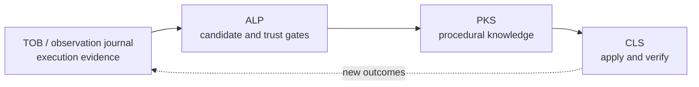

# Phenomenological Knowledge Store (PKS)

> [!NOTE]
> PKS is Nova AI Workspace's procedural long-term memory: verified experience about how recurring situations on websites work. It remembers how to recognize a situation, what to do, how to check the result, and whether that knowledge is still reliable.

## 1. Start with a situation: a cookie banner

Imagine an agent encounters a cookie banner for which it does not yet have a suitable learned playbook.

**On the first encounter**, the agent observes the overlay, its text and any consent-vendor markers. It finds the action for rejecting optional cookies, executes it under the applicable consent policy, and checks that the obstruction has cleared and the page is usable again. The observed signals, action and outcome provide evidence for learning.

**On later visits**, PKS can match the situation to an active learned entry and supply its playbook. The action is executed and its outcome checked again. Success supports continued trust; failures or drift can reduce trust and eventually retire the entry.

Recognition can use several signals rather than one CSS class. A changed class therefore need not make the entire situation unrecognizable if other signals still match. It can still break the action selector: recognition and successful execution are separate checks, and a replacement selector must be verified before the playbook is updated.

The experience being preserved is more than “click this button.” It answers four questions:

| Question | What PKS keeps |
| :--- | :--- |
| How do I recognize this situation? | A fingerprint of observable signals. |
| What action has worked here? | A playbook with an interaction sequence. |
| How do I know it worked? | Verification steps for the expected outcome. |
| How reliable is this knowledge now? | Health, evidence and a learning level. |

## 2. Why Nova needs procedural memory

Without persistent procedural knowledge, an agent can successfully handle a situation and still have to rediscover it in the next session. Nova would retain none of the verified experience that could guide the next attempt.

PKS carries that experience across agent sessions. Less repeated inspection and lower token overhead are useful consequences; the central benefit is that a new task can build on earlier verified interactions.

**PKS remembers how a recurring web situation behaves, not merely what was previously said about it.**

| Memory or context | What it preserves |
| :--- | :--- |
| [Browser memory](../browser-memory/README.md), including `nova.memory_note` | Site notes, preferences and context. |
| Operator notes | Guidance supplied for the agent's work. |
| [Task memory (ETM)](../episodic-task-memory-etm/README.md) | Recurring tasks, work units and progress. |
| **PKS** | Recognition, actions, verification and reliability for recurring web situations. |

## 3. What is a phenomenon?

A **phenomenon** is a recurring, observable situation: a cookie banner blocking a page, a login wall, or a modal preventing the intended action. PKS also stores declarative hints for structures such as repeated search-result items; those hints describe regions rather than executing a playbook.

“Phenomenological” refers to what can be observed about the situation: its signals, interaction behavior and checked outcomes. Nova does not need to assume knowledge of the website's internal implementation to describe that experience.

An interactive phenomenon entry combines:

* **Fingerprint:** Signals of the kinds `dom` (selectors), `text` (visible label text, optionally per locale), `vendor` (framework and consent-vendor markers), `layout` (position and size hints) and `interaction`, plus a minimum confidence.
* **Playbook:** A sequence of actions (`click`, `type`, `press_key`, `wait`, `dismiss`). `click` and `type` actions may carry up to 5 `fallbackSelectors` for the same element.
* **Verification:** Post-execution checks (`click`, `wait`, `absent`, `obstruction_cleared`, `scroll_unlocked`, `topmost_clickability_restored`). Verify steps never use fallback selectors.
* **Health and lifecycle:** Outcome summaries, consecutive failures, staleness, learning level and deprecation state.

## 4. How the systems work together

The roles form a feedback loop:

| System | Role |
| :--- | :--- |
| [TOB — Tool Observation Bus](../../tool-observation-bus-tob/README.md) | Provides server-side evidence of what was actually executed and observed. |
| [ALP — Agent Learning Pipeline](../agent-learning-pipeline-alp/README.md) | Uses journal evidence to propose knowledge and evaluate whether it has earned trust. |
| **PKS** | Stores the resulting procedural knowledge, including candidates, trusted playbooks and their health. |
| [CLS — Closed-Loop System](../../closed-loop-system-cls/README.md) | Applies playbooks through checked state transitions and feeds outcomes back into learning. |

Checked outcomes feed the next learning decision. The Learning Candidate Journal (LCJ) holds observations and promotion evidence separately from PKS; TOB supplies execution evidence and selector proof.

## 5. Why knowledge needs trust levels

**One successful interaction is not enough to turn an observation into durable autonomous behavior.** A click can succeed by accident, work in only one session, or stop meaning the same thing after a redesign.

| Level | Plain meaning | Current behavior |
| :---: | :--- | :--- |
| **L0 — Candidate** | Maybe useful. | Observations and candidate evidence live in LCJ. `nova.learn_generate` can materialize a new phenomenon as an L0 entry in PKS; it is not returned by `nova.pks_match`. |
| **L1 — Shadow** | Stored, not yet trusted for active matching. | Present in PKS, but not returned by `nova.pks_match`. New manual `nova.pks_upsert` entries start here. |
| **L2 — Active** | Trusted enough for active matching. | Eligible for `nova.pks_match` when not deprecated. Active status does not itself authorize every use or ambient application. |

### The LCJ / PKS boundary

L0 is a learning level, not a synonym for a particular database. LCJ stores the evidence; a generated L0 phenomenon can already be stored in PKS with a candidate key linking it to that evidence.

`nova.learn_promote` loads existing PKS entries, retrieves their LCJ evidence and evaluates their transitions. It does not simply copy every raw journal observation into PKS. Generation and manual upsert are distinct entry paths, followed by evidence-based lifecycle decisions.

### Promotion gates

`nova.learn_promote` supports `dryRun` to inspect decisions without applying them. While an agent works on a site, Nova also runs the same lifecycle evaluation in the background, at most once every 30 minutes per site.

* **L0 → L1:** A disproven candidate is rejected. Other candidates need sufficient confidence and supporting evidence, including observed success.
* **L1 → L2:** Repeated successful applications across sessions must establish reliability, with failures and recent drift taken into account. Cookie-consent knowledge has stricter requirements. Ambient eligibility is evaluated separately: active knowledge can remain available only for explicit use.

`nova.explain` shows which gate passes or fails for a phenomenon and why. See [CLS](../../closed-loop-system-cls/README.md) for the separate eligibility and confirmation rules governing ambient auto-apply.

## 6. Knowledge must continue to earn trust

Learned knowledge is not permanently true. A website can change its layout, move a control or change the behavior behind a familiar-looking button.

PKS's lifecycle therefore includes **learn → verify → trust → monitor → detect drift → reduce trust → retire**:

* **Demotion L2 → L1:** Repeated failures or significant recent drift can remove active trust.
* **Deprecation:** Persistently unreliable knowledge can be retired. Deprecated entries are excluded from active matching.
* **Revalidation:** Background checks can detect missing fingerprint selectors without executing the playbook. Suggested replacement selectors are not applied automatically; an agent must verify and update them.
* **Revival:** A deprecated entry may return to Shadow when fresh evidence passes the revival gates. It must earn active status again.

A missing or demoted match is useful information: Nova should stop treating outdated experience as dependable guidance. The [ALP lifecycle](../agent-learning-pipeline-alp/README.md) describes revalidation and recovery in more detail.

## 7. Preventing dangerous mislearning

A learned “Reject optional cookies” playbook must never silently become “Accept all” because a selector now points at a different button. Clearing an overlay alone would not prove that the intended consent choice was preserved.

Cookie-consent phenomena therefore have stricter trust requirements and checks that preserve the intended consent choice. Declared intent, target evidence and the proposed interaction must be consistent. An overlay disappearing is insufficient evidence that optional consent was rejected.

Learning does not grant permission to change consent. Runtime policy and apply-time checks still govern execution. The principle remains **dynamic knowledge, static guardrails**.

## 8. Storage and tools

PKS persists knowledge locally in `pks.db` in Nova's profile folder (`%LOCALAPPDATA%\nova-cognitive\Nova\`; installations from before the folder change keep using `%LOCALAPPDATA%\NovaBrowser\`). LCJ uses the separate `Memory/memory.db` database.

| PKS table | Contents |
| :--- | :--- |
| `pks_domain` | Site scope and trust. |
| `pks_phenomenon` | Fingerprint, playbook, health and learning level. |
| `pks_domain_hint` | Declarative hints for ad containers, noise regions and result items. |
| `pks_platform` | Cross-site platform templates. |
| `pks_platform_pattern` | Template patterns. |
| `pks_platform_alias` | Platform-recognition markers. |

Each phenomenon carries its own health record, including success rate over 30 days, consecutive failures, staleness and total attempts. Preinstalled platform templates cover OneTrust, Cookiebot, Quantcast Choice, Didomi, Usercentrics, iubenda and Sourcepoint.

| Tool | Purpose |
| :--- | :--- |
| `nova.pks_get` | Retrieves stored phenomena (`outputDetail='summary'` or `'full'`). |
| `nova.pks_upsert` | Stores or updates a phenomenon with fingerprint, playbook and verification. |
| `nova.pks_match` | Ranks active, non-deprecated phenomena against observed signals. |
| `nova.phenomenon_apply` | Runs a stored playbook and reports its outcome. |
| `nova.pks_upsert_hint` | Stores declarative region or result-item hints. |
| `nova.telemetry_report` | Records an outcome (`success`, `failure`, `not_applicable`) to update health. |
| `nova.learn_generate` | Proposes and stores candidates from journal observation clusters. |
| `nova.learn_promote` | Evaluates existing entries against LCJ evidence for promotion, demotion, deprecation and revival. |

Full schemas and examples are in the [MCP reference](../../../mcp-reference/README.md).

## 9. Implementation notes

`PksDb` serializes SQLite access; `PksRepository` implements persistence and queries; `PksStore` exposes the store facade. `PromotionService` evaluates evidence gates, while learning orchestration joins PKS entries with LCJ evidence and applies approved transitions. These components implement the recognition, action, verification and trust lifecycle described above.

## Related documentation

* [Learning Pipeline (ALP)](../agent-learning-pipeline-alp/README.md) — Candidate generation, evidence gates and revalidation.
* [Tool Observation Bus (TOB)](../../tool-observation-bus-tob/README.md) — Server-side observations and selector proof.
* [Closed-Loop System (CLS)](../../closed-loop-system-cls/README.md) — Checked actions and ambient auto-apply.
* [Operational Knowledge (OK)](../operational-knowledge-ok/README.md) — Live tab state and account capabilities.
* [Agent-native affordances](../../agent-native-affordances/README.md) — How Nova accommodates learned interaction expectations.

[Learning overview](../README.md) · [All core features](../../README.md)
