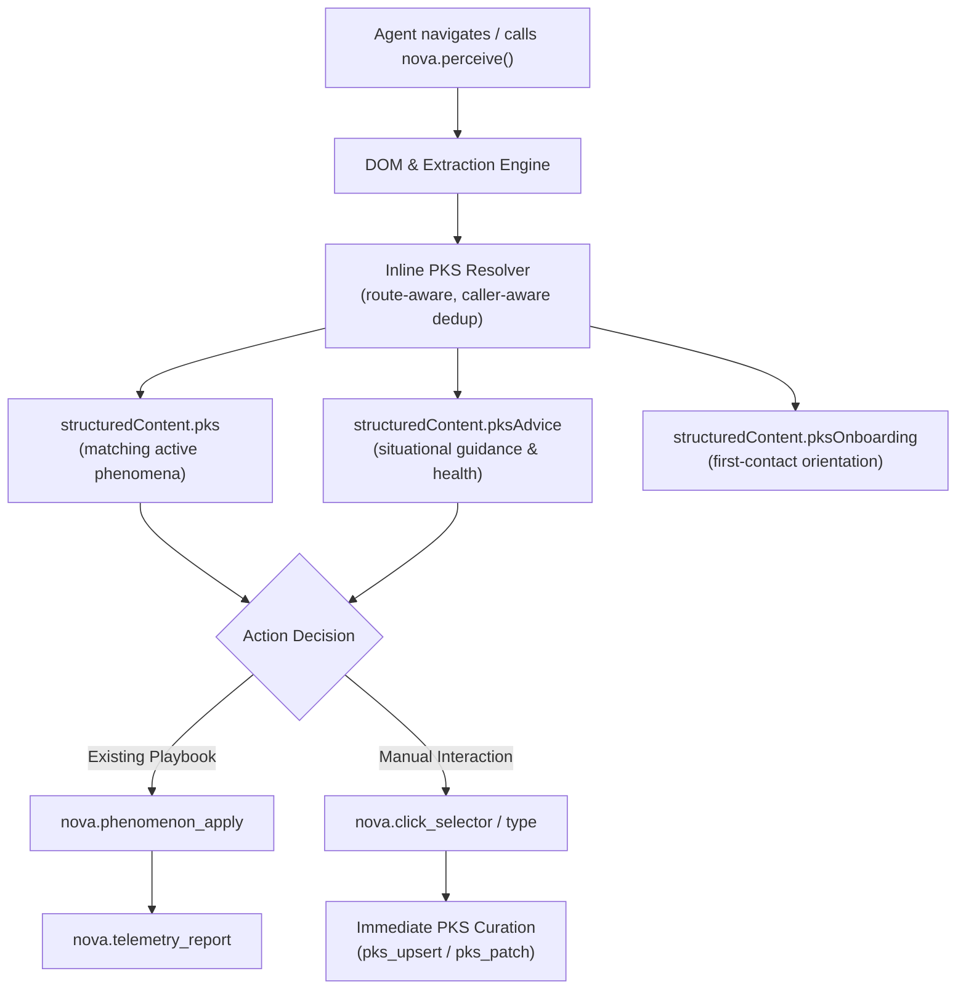
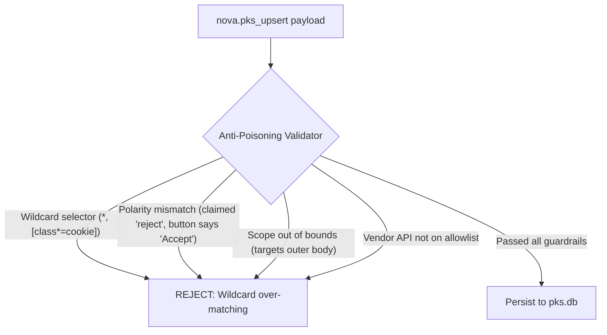
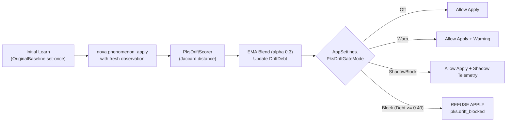
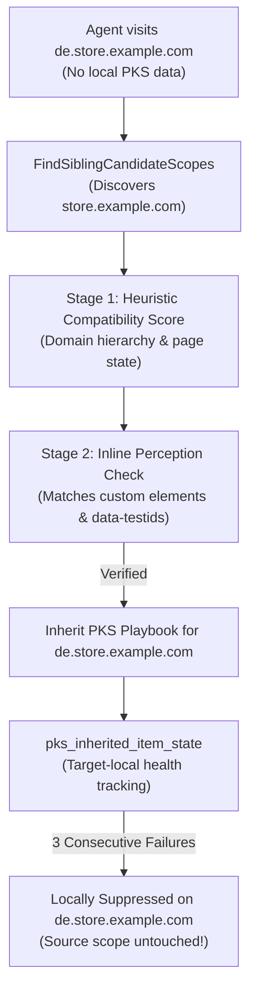
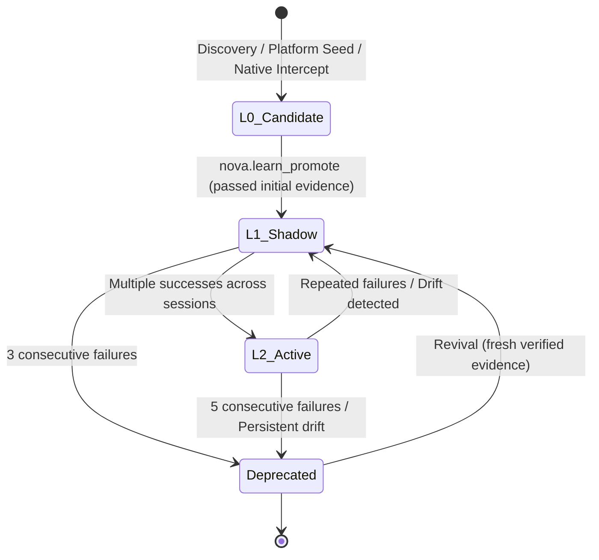

# Phenomenological Knowledge Store (PKS)

> [!NOTE]
> **PKS** is Nova AI Workspace's procedural long-term memory. It captures, curates, and verifies operational knowledge about how recurring web situations behave — including how to recognize them, what actions resolve them, how to prove the expected outcome, and how to detect when that knowledge has drifted over time.

---

## 1. Procedural Memory: Why Agents Need PKS

When an autonomous AI agent interacts with the modern web, it encounters recurring situations: cookie consent overlays, login barriers, paywalls, dynamic navigation drawers, and ephemeral popups. 

Without persistent procedural memory, an agent is forced to rediscover and re-analyze these structures on every visit:
1. Re-inspecting DOM trees and CSS layouts costs time, cognitive overhead, and tokens.
2. An agent might choose a brittle or incorrect selector on subsequent attempts.
3. Successful operational experience gained in one session evaporates as soon as the session closes.

**PKS preserves how to operate a website, not what content was found on it.**

Unlike unstructured notes or static bookmarking, PKS models web interactions as **phenomenological records**: observable signals, reproducible action sequences, strict outcome verifications, and empirical health scores.

### The Persistence Routing Matrix

Nova maintains distinct memory layers tailored to specific operational requirements. Understanding their division of responsibility is essential:

| Store / Memory Layer | Primary Responsibility | Example Data | Key MCP Tools |
| :--- | :--- | :--- | :--- |
| **PKS** | Reusable domain-specific UI patterns, interaction playbooks, verification checks, and structural domain capabilities. | Cookie banner dismissal, modal closing, pagination triggers, ad container rules. | [`nova.pks_get`](../../../mcp-reference/tools/pks-and-learning/nova-pks-get.md), [`nova.pks_upsert`](../../../mcp-reference/tools/pks-and-learning/nova-pks-upsert.md), [`nova.phenomenon_apply`](../../../mcp-reference/tools/pks-and-learning/nova-phenomenon-apply.md) |
| [Browser Memory](../browser-memory/README.md) | Domain notes, user preferences, and free-form site facts. | User's preferred dark theme, site language preferences, general notes. | `nova.memory_note`, `nova.memory_recall` |
| Operator Notes | Human-directed instructions, operator guidance, and workflow boundaries. | "Never place orders above $100 without confirmation", "Prefer CSV exports". | `nova.operator_notes_store`, `nova.operator_notes_query` |
| [Task Memory (ETM)](../episodic-task-memory-etm/README.md) | Recurring task profiles, completion criteria, and milestone progress. | Research workflow recipes, progress tracking across multi-step jobs. | `nova.task_profile_upsert`, `nova.task_instance_create` |
| [Operational Knowledge (OK)](../operational-knowledge-ok/README.md) | Real-time tab state, account capabilities, and live operational signals. | Current logged-in user email, active account tier, tab ownership. | `nova.ok_observe`, `nova.ok_signal_schema` |
| [Domain Notes](../domain-notes/README.md) | Persistent website instructions, scope and optional acknowledgement requirements. | Search existing records first; ask before creating or deleting records. | `nova.domain_note`, `nova.domain_notes_list`, `nova.domain_note_ack` |
| Extracted Page Content | Transient task outputs and search results. | Article bodies, video titles, tabular data. | *Transient task output — not persisted to long-term memory.* |

---

## 2. The Perception Loop & Inline PKS Delivery

In Nova, PKS is deeply woven into the perception engine. Agents do not need to execute separate lookup calls before deciding what to do.



### Inline Delivery via `structuredContent.pks`

Whenever an agent calls [`nova.perceive()`](../../../mcp-reference/tools/dom-and-reading/nova-perceive.md) (or when navigation completes via [`nova.navigate`](../../../mcp-reference/tools/browser-automation/nova-navigate.md) and `nova.tab_new`), Nova's host automatically resolves matching PKS phenomena for the active domain and path route:

* **Zero Roundtrip Overhead:** Active, proven phenomena for the current site are delivered immediately in the response payload under `structuredContent.pks`.
* **Advisory Memory, Not Ground Truth:** Current perception is always fresher than stored memory. If the live DOM differs from stored PKS signals, the agent must trust current perception, avoid repetitive retry loops on failing selectors, and update PKS accordingly.

### Payload Modes: `off`, `summary`, and `full`

To balance situational awareness against token consumption, PKS provides configurable payload levels via the `pksInclude` parameter:

| Mode | Phenomena Returned | Content Detail | Token Footprint | Best Used For |
| :---: | :---: | :--- | :---: | :--- |
| `off` | None | Only minimal dedup metadata or domain presence indicator. | ~5 tokens | High-speed repetitive tool loops or non-UI data scraping. |
| `summary` *(default)* | Up to 8 active phenomena | Compact overview: phenomenon IDs, types, verification state (`verified`), success rates, and boolean health flags (`hasFragileSelectors`). | ~30–80 tokens | Standard browsing, routine navigation, and perception turns. |
| `full` | All active phenomena on route | Complete structural definition: full fingerprint signals, entire playbook action sequences, fallback selectors, verification checks, route annotations, and exact telemetry. | ~150–500+ tokens | Direct playbook execution, learning curation, debugging, and initial domain inspection. |

### Smart Route- and Caller-Aware Deduplication (`pksDedup`)

To eliminate wasteful token duplication when an agent repeatedly perceives the same view without DOM revision changes, Nova applies an automated deduplication contract:

* **Revision Tracking (`content_rev`):** Each domain in PKS carries a monotonic content revision. If an agent calls `perceive()` multiple times on the same page and no PKS data has changed, Nova suppresses redundant payloads (`auto_unchanged`, `summary_unchanged`).
* **Periodic Refresh:** After a configured interval or call count, Nova automatically delivers a fresh summary (`auto_refresh`) to keep the agent oriented.
* **Caller Isolation:** Deduplication state is tracked per calling agent session. One agent consuming the seed payload never starves a concurrent second agent working in another tab or session.

### Contextual PKS Advice (`structuredContent.pksAdvice`)

Alongside raw records, Nova evaluates the current page and provides dynamic, situational recommendations under `structuredContent.pksAdvice`:

* **`pks_gap`:** Indicates that a reusable UI interaction (e.g., closing an overlay) succeeded and passed postcondition verification, but is not yet recorded in PKS. The agent is advised to store it via `nova.pks_upsert`.
* **`existing_pks_reuse`:** Identifies that an active, proven phenomenon already covers this element, advising playbook application and subsequent telemetry reporting.
* **`fragile_selectors`:** Warns when stored or encountered selectors rely on ephemeral or hashed CSS classes.
* **`native_dialog_warning`:** Specifically flags known native file upload triggers (e.g., `<input type="file">` masquerading as a normal button), directing the agent away from `click_selector` to [`nova.file_upload`](../../../mcp-reference/tools/browser-automation/nova-file-upload.md).

### First-Contact Domain Onboarding (`pksOnboarding`)

The first time an agent arrives at a domain in a session (via [`nova.navigate`](../../../mcp-reference/tools/browser-automation/nova-navigate.md) or `nova.tab_new`), Nova injects a lightweight orientation block under `pksOnboarding`:
* **Known Scope Inventory:** Shows total stored active entries and their distinct types (`knownEntries`, `entryTypes`).
* **Explicit Responsibility Clarification:** Informs the agent whether the site is virgin territory or already mapped, and clarifies what only the agent can contribute (reporting execution success/failure via `nova.telemetry_report`, patching broken entries via `nova.pks_patch`, and solving novel blockers).
* **Once-Per-Domain Session Budget:** Emitted exactly once per (caller, scope) pair, avoiding repetitive advisory fatigue.

---

## 3. Phenomenon Data Model: Anatomy of a Learned Pattern

An interactive phenomenon in PKS (`pks_phenomenon`) represents a comprehensive recipe for recognizing, handling, and verifying a recurring UI situation.

```
pks_domain (scope, trust, context_json, content_rev)
  │
  ├── pks_phenomenon (stable_id, type, learning_level, health)
  │     ├── PksFingerprint (multi-signal recognition rules)
  │     ├── PksPlaybook (ordered actions + verification checks)
  │     ├── PksPhenomenonContext (device, auth, route filters)
  │     └── PksHealth (30d success rate, drift debt, failures)
  │
  └── pks_domain_hint (passive declarative rules evaluated in JS)
        ├── content_filter.ad_container
        ├── noise_region
        └── content_container.result_item
```

### Canonical Scope Normalization & Homoglyph Protection

Domain scopes (`scope`) in PKS undergo strict canonical normalization (`NormalizeScope`):
* **Path/Query Stripping:** Full URLs passed as scope strings are stripped to their bare hostname.
* **Port Preservation:** Non-default port numbers (e.g., `localhost:8080` vs `localhost:3000`) are explicitly preserved to prevent development environment collisions.
* **Punycode / IDN Normalization:** Hostnames are converted to ASCII Punycode via `IdnMapping`. This thwarts homoglyph scope squatting (e.g., an adversarial domain using Cyrillic characters to mimic a legitimate domain).

### Phenomenon Types

Nova categorizes phenomena into specialized types to govern execution safety, auto-apply eligibility, and validation rules:

| Type | Intended Purpose | Real-World Example |
| :--- | :--- | :--- |
| `consent_cmp` | Cookie consent banners and CMP overlays managed by third-party or custom consent vendors. | OneTrust, Cookiebot, Didomi, Usercentrics, Sourcepoint dialogs. |
| `modal` | Blocking informational or promotional overlays. | Newsletter signup popups, promotional discounts, survey prompts. |
| `login_wall` | Authentication barriers blocking page content. | "Log in or create a free account to continue reading." |
| `paywall` | Paid subscription boundaries and meter barriers. | Metered news paywalls, premium feature prompts. |
| `layout_shift` | Persistent sticky headers, floating banners, or intrusive expanding elements. | Sticky top navs that obscure clicks, floating sticky video widgets. |
| `native_dialog` | Elements that trigger OS-native file pickers or authentication prompts. | Hidden or styled file input triggers. |
| `nav_link.same_origin`<br/>`nav_link.cross_origin` | Stable structural navigation tabs and anchor destinations across application views. | GitHub "Issues" or "Pull requests" tabs, Jira navigation bars. |
| `spa_hydration_drift` | Signals that a single-page app requires internal routing over hard navigation. | Advises [`nova.route`](../../../mcp-reference/tools/browser-automation/nova-route.md) over [`nova.navigate`](../../../mcp-reference/tools/browser-automation/nova-navigate.md). |
| `popover_open` | Collapsed menus or dropdown drawers that must be opened to access core features. | "More filters", navigation hamburger toggles, accordion sections. |
| `custom` | Domain-specific interactive workflows unique to a platform. | Custom multi-step wizard dismissals, site tour walkthroughs. |

### Multi-Signal Fingerprinting (`PksFingerprint`)

Single CSS selectors break easily. PKS uses a composite fingerprint containing diverse signals:

```json
{
  "signals": [
    { "kind": "dom", "match": "#onetrust-banner-sdk, .ot-sdk-container" },
    { "kind": "vendor", "match": "onetrust, cookielaw" },
    { "kind": "text", "match": "cookies akzeptieren|alle ablehnen", "locale": "de" },
    { "kind": "layout", "match": "coverage>0.20 AND position=fixed" }
  ],
  "minConfidence": 0.60
}
```

* **`dom` (Weight: 1.00):** CSS selectors, ID fragments, or attribute matches (`[id*=onetrust]`).
* **`vendor` (Weight: 0.85):** Known CMP vendor identification markers and script domain patterns.
* **`text` (Weight: 0.70):** Visible button text, heading labels, or aria-labels, optionally tagged with language locale (`de`, `en`, etc.).
* **`layout` (Weight: 0.55):** Structural layout hints, such as viewport screen coverage and CSS positioning (`position=fixed`, `position=sticky`).
* **`interaction` (Weight: 0.60):** Behavioral attributes, such as modal traps and scroll locks.

### Playbook Structure, Actions, and Policies

A playbook (`PksPlaybook`) dictates what policy to follow and what actions to execute:

```json
{
  "policy": "reject_preferred",
  "actions": [
    {
      "type": "click",
      "selector": "#onetrust-reject-all-handler",
      "fallbackSelectors": [
        "button[data-action='reject-all']",
        ".ot-sdk-button-reject",
        "button[aria-label='Reject all']"
      ],
      "declaredPolarity": "reject",
      "maxScope": "scoped_to_cmp_surface",
      "allowedEffect": "consent_state_only"
    }
  ],
  "verify": [
    { "type": "obstruction_cleared", "threshold": 0.05 },
    { "type": "scroll_unlocked" },
    { "type": "topmost_clickability_restored" }
  ]
}
```

#### Policies
* `dismiss`: Close or hide the overlay with minimal mutation.
* `reject_preferred`: For consent banners, reject optional tracking when possible; fall back cleanly if only accept or configure exists.
* `accept`: Explicitly accept (only when directed by operator policy).
* `ignore`: Passive observation; do not attempt to dismiss (typical for paywalls).
* `warn`: Advisory warning policy (typical for hydration drift or risky selectors).
* `custom`: Complex multi-step interaction sequences.

#### Ordered Fallback Selectors (`fallbackSelectors`)
For mutating `click` and `type` actions, Nova supports up to 5 ordered `fallbackSelectors`. If a site undergoes a minor redesign (e.g., automated build systems remove a `data-testid` attribute, but the `aria-label` or semantic class remains intact), the playbook seamlessly tries the fallbacks before aborting.

#### Dynamic Value Indirection (`valueSource`)
For input steps, PKS supports semantic indirection via `valueSource` instead of embedding raw secrets:
* `"from_vault"`: The agent retrieves the credential securely from Nova's encrypted vault ([`nova.vault_get`](../../../mcp-reference/tools/vault-and-security/nova-vault-get.md)).
* `"agent_supplied"`: The value is supplied dynamically from the agent's task context.
* `"user_prompt"`: The agent explicitly asks the operator before inputting the value.

#### Strict Post-Execution Verification (`verify`)
Every playbook specifies mandatory postconditions that must hold true after actions execute:
* `obstruction_cleared`: Confirms that the modal or overlay covering the viewport is gone (within a specified area threshold).
* `scroll_unlocked`: Proves that `overflow: hidden` or DOM lock-classes have been removed from `<body>` and `<html>`.
* `topmost_clickability_restored`: Verifies that the underlying page coordinates receive mouse clicks again rather than being intercepted by an invisible backdrop.
* `absent`: Proves that a specific DOM element has been removed or hidden.
* `wait`: Short stabilization pause.

> [!IMPORTANT]
> **Verification steps never use fallback selectors.** While an action can try alternative elements to achieve an effect, verification must remain rigorous. A verification check that "falls back" to checking a different element proves nothing.

### Route-Aware Phenomenon Scoping (`context.routes`)

Modern web applications (e.g., SPAs like LinkedIn, GitHub, or Jira) behave differently across different URL paths. A modal or filter control relevant to `/jobs/` might conflict with `/feed/`.

PKS supports optional route scoping via `phenomenon.context.routes`:
* `["feed"]`: Matches only when the first path segment is `/feed`.
* `["in/*"]`: Wildcard match for all sub-paths starting with `/in/`.
* `["_root"]`: Matches only the root landing page (`/`).
* `["*"]` or `null`: Global scope — phenomenon applies everywhere on the domain.

### Weighted Match-Ranking Model (`weighted_v1`)

When searching or matching active phenomena via [`nova.pks_match`](../../../mcp-reference/tools/pks-and-learning/nova-pks-match.md), Nova computes a multi-dimensional ranking score:

$$\text{MatchScore} = (\text{Confidence} \times 0.65) + (\text{HealthScore} \times 0.20) + (\text{TrustScore} \times 0.10) + (\text{ContextSpecificity} \times 0.05)$$

* **Confidence ($65\%$):** Multi-signal match ratio of current DOM observation against the stored fingerprint.
* **HealthScore ($20\%$):** 30-day empirical success rate minus penalties for staleness (up to $20\%$) and consecutive failures (up to $30\%$).
* **TrustScore ($10\%$):** Domain trust rating (`high` = 1.0, `medium` = 0.75, `low` = 0.50, `unknown` = 0.25).
* **ContextSpecificity ($5\%$):** Bonus for phenomena tailored to exact client context keys (Device, Locale, Auth state).

---

## 4. Selector Fragility & Hashed CSS Class Analysis

Modern frontend architectures heavily utilize CSS Modules, styled-components, Emotion, and bundler-generated class names. These classes are frequently regenerated on every website redeployment, making them dangerous for long-term storage.

PKS includes a built-in selector safety and fragility classifier:

| Pattern | Example | Framework / Bundler Origin | Fragility Classification |
| :--- | :--- | :--- | :--- |
| `css-*` | `.css-1a2b3c` | Emotion / CSS-in-JS | **Fragile** |
| `sc-*` | `.sc-bdfBwQ` | styled-components | **Fragile** |
| `emotion-*` | `.emotion-abc123` | Emotion | **Fragile** |
| `styled-*` | `.styled-xyz789` | styled-components | **Fragile** |
| `__hash` | `.styles_header__2f3Gk` | CSS Modules | **Fragile** |
| Short prefix + hash | `.a-1b2c3d` | Vite / Webpack chunk hashing | **Fragile** |
| Pure hex hash (7+ chars) | `.af78672f`, `._401b0ae4` | Enterprise bundlers (e.g. LinkedIn) | **Fragile** |
| Semantic attributes | `[data-testid='reject-all']`, `[aria-label='Close']` | Semantic HTML / testing anchors | **Safe** |
| Positional paths | `div:nth-child(3) > button` | Brittle DOM index | **Risky** |

### Runtime Protection
* **Summary Mode:** If active phenomena contain hashed classes, Nova flags `hasFragileSelectors: true`.
* **Full Mode:** Emits `selectorWarning` highlighting the exact count of fragile selectors and prompting the agent to re-anchor them against stable attributes like `data-testid`, `name`, or `aria-label`.
* **Upsert Guard:** When an agent attempts to store a purely positional or ephemeral selector, PKS advice cautions against persisting it until a durable anchor is established.

---

## 5. Cross-Cutting Anti-Poisoning & Guardrails

Procedural memory can be targeted by adversarial websites (e.g., phishing pages attempting to overwrite legitimate playbooks) or corrupted by agent hallucinations. PKS enforces a multi-layered anti-poisoning validation DSL at upsert time:



### 1. Declared Polarity (`declaredPolarity`)
For `consent_cmp` phenomena, any mutating action (`click`, `type`, `press_key`) must declare its explicit intent:
* Allowed values: `"reject"`, `"accept"`, `"manage"`, `"navigate"`, `"noop"`.
* **Text Cross-Check:** The validator checks the target element's visible text and `aria-label` using a polarity analyzer. An upsert claiming `declaredPolarity="reject"` whose visible label says `"Accept all cookies"` is rejected immediately. This prevents accidental inversion of user privacy choices.

### 2. Maximum DOM Scope (`maxScope`)
Prevents clickjacking and bait-and-switch injection:
* `"scoped_to_cmp_surface"`: Default for consent banners. The targeted selector must resolve strictly within the matched banner subtree. If an overlay tricks the agent into clicking an element in the main page `<body>` (e.g., an ad or subscription link), the upsert is blocked.
* `"scoped_to_frame"`: Restricted to the capturing frame.
* `"scoped_to_top_frame"`: Restricted to the top window, blocking unauthorized iframe manipulation.

### 3. Allowed Side Effects (`allowedEffect`)
Declares the permitted consequences of the action:
* `"consent_state_only"`: The action must only alter consent storage/cookies without navigating away or modifying unrelated DOM trees.
* `"navigation_only"`: Dedicated navigation triggers.
* `"read_only"`: Pure observation.

### 4. Vendor API Allowlist (`vendorApiCall`)
If a playbook utilizes programmatic consent vendor APIs instead of raw DOM clicks, it must use Nova's strict closed allowlist (e.g., `__tcfapi.postRejectAll`, `OneTrust.RejectAll`, `Cookiebot.submitCustomConsent.reject`). Arbitrary string evals or unverified partner calls are strictly forbidden.

### 5. Wildcard Rejection
Selectors such as `*`, `* span`, `[class*=consent]`, `[id*=banner]`, or `[role=dialog]` are rejected for consent actions. They over-match across unrelated elements and sites, risking cross-domain pollution.

---

## 6. Drift-Gate & Drift Debt Architecture

Websites evolve over time: redesigned layouts, altered button classes, or modified DOM hierarchies can cause learned playbooks to become obsolete. Rather than failing unexpectedly, PKS proactively monitors and measures **drift debt**.



### Original Baseline (Set-Once Semantics)
When a phenomenon is first created, Nova captures a frozen snapshot of its fingerprint signals into `OriginalBaseline`. This baseline is never modified by subsequent observations, serving as an immutable ground truth.

### Drift Scorer & EMA Blending
When an agent executes [`nova.phenomenon_apply`](../../../mcp-reference/tools/pks-and-learning/nova-phenomenon-apply.md), it can provide a fresh `observation` snapshot captured from its recent perceive call:
1. **Jaccard Distance:** PKS computes the symmetric distance between the baseline signals and current observation signals across `(Kind, Match, Locale)` tuples.
2. **Exponential Moving Average (EMA, $\alpha = 0.3$):** A single anomalous observation does not spike drift debt; sustained changes across multiple sessions gradually increase `DriftDebt` in the range `[0.0, 1.0]`.
3. **Current Observation Cluster:** Dampened aggregate cluster of recently seen states (capped at 256 signals to prevent unbounded growth).

### 3-Tier Hardening Gate (`PksDriftGateMode`)
Controlled via application settings, the gate evaluates `DriftDebt` against the default threshold ($0.40$):
* **`Off`:** Drift monitoring is disabled.
* **`Warn`:** Apply proceeds normally, but telemetry records the drift and a warning is attached to the response.
* **`ShadowBlock`:** Rollout instrumentation mode. Telemetry records that a block would have occurred, but the playbook runs to evaluate impact safely.
* **`Block`:** The playbook is refused with `pks.drift_blocked`. The agent must inspect the new UI and update or re-learn the phenomenon.

---

## 7. Sibling-Scope Resolution: Cross-Subdomain Knowledge Transfer

Enterprise platforms frequently span dozens of subdomains (e.g., `shop.example.com`, `account.example.com`, `de.example.com`, `fr.example.com`). Re-learning identical cookie banners or navigation patterns on every single subdomain is inefficient.

PKS solves this through **Sibling-Scope Resolution**:



### Candidate Discovery & 2-Stage Verification
1. **Candidate Search (`FindSiblingCandidateScopes`):** Discovers related subdomains sharing the registered base domain.
2. **Stage 1 (Heuristic Scoring):** Evaluates URL similarity, shared brand segments, and page state.
3. **Stage 2 (Inline Verification):** During `nova.perceive()`, Nova checks live DOM markers (custom element tags, `data-testid` sets, and fingerprint anchors) against the candidate source. This is budget-limited to 1 check per domain per session to keep execution lean.

### Target-Local Health Isolation & Revision Rebasing
Inherited knowledge must never risk corrupting the source:
* Telemetry for inherited playbooks is recorded target-locally in `pks_inherited_item_state`.
* If a shared banner fails 3 consecutive times on `de.store.example.com`, it is suppressed on that specific subdomain.
* **The source scope's health record remains completely untouched and healthy.**
* **Automatic Expiration on Revision Bump:** When the source domain's `content_rev` changes, any stale sibling verifications referencing the previous revision are automatically expired to force a clean re-check.
* **Inherited Scope Write Protection:** Direct PKS writes to an active inherited scope are guarded against to prevent breaking provenance tracking.

### Sibling Policies
Controlled via the `siblingPolicy` parameter in queries:
* `"auto"` *(default)*: Utilizes verified siblings and allows low-risk declarative hints from pending candidates.
* `"strict"`: Only permits siblings that have passed full Stage-2 verification.
* `"off"`: Disables sibling inheritance entirely.

---

## 8. Platform Templates: Transfer Learning for Major CMPs

Thousands of websites rely on standardized commercial consent management platforms. Learning OneTrust or Cookiebot from scratch on every domain is redundant.

PKS includes built-in **Platform Templates** (`pks_platform`):

```
pks_platform: "onetrust" (OneTrust Cookie Consent)
  ├── pks_platform_pattern: "consent_dismiss"
  │     ├── Fingerprint: #onetrust-banner-sdk, .ot-sdk-container, [id*=onetrust]
  │     └── Playbook: Click "#onetrust-reject-all-handler", Verify obstruction_cleared
  └── pks_platform_alias:
        ├── vendor_marker: "[id*=onetrust]"
        ├── script_domain: "cdn.cookielaw.org"
        └── script_domain: "onetrust.com"
```

### Pre-Seeded Platforms
Nova ships with pre-installed templates for major global providers:
* **OneTrust**
* **Cookiebot**
* **Quantcast Choice**
* **Didomi**
* **Usercentrics**
* **iubenda**
* **Sourcepoint**

### Automatic L0 Candidate Seeding
When an agent lands on a previously unvisited domain and Nova detects known platform markers (e.g., `cdn.cookielaw.org` or CMP container classes), PKS automatically instantiates the platform pattern as an **L0 Candidate** for that specific domain. The agent starts with an informed hypothesis rather than a blank slate.

---

## 9. Domain Capabilities & Service Discovery Catalog

PKS does not merely store transient popup banners; it acts as an extensive **structural domain intelligence profile** (`pks_domain.context_json`).

### Domain Capabilities Inventory (`PksDomainCapabilities`)
Discovered during Learn Mode exploration and discovery probes:
* **Authentication Surface:** `hasLoginSurface`, `hasSignupSurface`, `loginRequiredForCoreContent`.
* **Feature Inventories:** Segregated lists of features available in `anonymousFeatures`, `loggedInFeatures`, or `bothFeatures`.
* **MCP & AI Discovery Signals:**
  * Auto-detection of website-hosted MCP servers (`hasMcpServer`, `mcpToolCount`, `mcpTransportKind`, `mcpAuthRequired`).
  * Discovery of A2A (Agent-to-Agent) endpoints (`hasA2aAgent`), `llms.txt` documents (`hasLlmsTxt`, `llmsTitle`, `llmsSummary`, `llmsLinkCount`), and OAuth discovery metadata (`hasOAuthMetadata`).
  * Discovery Trust Lifecycle: Progresses through `seen` $\rightarrow$ `verified` $\rightarrow$ `user_approved`, regressing to `quarantined` if content hashes drift.

### Sandbox Profile Integration & Routing Plane
PKS domain classifications directly enrich Nova's sandbox tabs exposed via [`nova.tabs`](../../../mcp-reference/tools/browser-automation/nova-tabs.md):
* **Routing Plane vs. Execution Plane:** PKS classification tags (`PksDomainClassification`) provide instant semantic context about which service or account runs inside each sandbox profile (e.g., distinguishing a personal Google sandbox from a corporate Google sandbox).
* Agents understand sandbox tab identity without needing to navigate or burn perception turns.

### Trusted State Detectors (`PksTrustedStateDetector`)
Configuration rules for detecting high-level application states during `perceive`:
* Evaluates weighted positive signals (e.g., presence of user avatar or logout button for `logged_in`), negative signals, and exclusion selectors.
* Provides deterministic state awareness (e.g., `logged_in`, `sidebar_open`, `input_ready`).

### Service Category Catalog & Taxonomy
Domains are mapped into a standardized classification catalog across 30+ service categories:
* Categories include: `email`, `e_commerce`, `banking`, `devops`, `search`, `social_media`, `streaming`, `travel`, `news`, and `documentation`.
* Supports domain discovery queries via [`nova.pks_list(serviceCategory='email')`](../../../mcp-reference/tools/pks-and-learning/nova-pks-list.md).

---

## 10. Declarative Domain Hints (`pks_domain_hint`)

Unlike interactive phenomena that execute playbooks, **Domain Hints** are passive rules evaluated directly within the browser's JavaScript engine during content extraction and DOM parsing:

| Hint Kind | Mode | Effect / Action | Purpose |
| :--- | :---: | :--- | :--- |
| `content_filter.ad_container` | `ancestor` | Applies negative scoring penalty (`scoreDelta = -0.50`) and attaches `"sponsored"` tag. | Identifies display ads, sponsored modules, and banner promotions so agents do not mistake them for article text. |
| `noise_region` | `ancestor` | Penalizes ancestor scoring (`scoreDelta = -0.35`) and flags navigation-like clusters. | Suppresses global headers, footers, breadcrumb navs, and sidebar clutter during text extraction. |
| `content_container.result_item` | `item_root` | Enumerates repeating children, extracting primary links, labels, and hrefs. | Automatically extracts structured item lists from search results, product catalogs, and directory views. |

---

## 11. Learning Lifecycle, Autonomous Learning & Safety Gates

Knowledge in PKS follows a rigorous trust progression: **learn $\rightarrow$ verify $\rightarrow$ trust $\rightarrow$ monitor $\rightarrow$ revalidate $\rightarrow$ deprecate**.



### Learning Trust Levels

* **L0 — Candidate:** Hypothesis stage. Collected from observation clusters, seeded platform templates, or intercepted native triggers. Excluded from `nova.pks_match` and auto-apply.
* **L1 — Shadow:** Persisted and vetted for syntax/anti-poisoning, but still undergoing reliability verification. Excluded from `nova.pks_match`. Manual upserts start here.
* **L2 — Active:** Fully proven and trusted. Eligible for `nova.pks_match` and eligible for [Ambient Auto-Apply](../ambient-auto-apply/README.md).

### PKS Learning Debt Tracking (`PksLearningDebtTracker`)
Nova tracks verified interaction successes against unlearned selectors:
* When an action succeeds and postconditions pass without matching an existing PKS entry, Nova accumulates learning debt for that selector across navigation sessions and DOM state changes.
* Reaching the threshold authorizes autonomous candidate promotion.

### Autonomous Learning (FR-1)
Nova autonomously registers proven, safe selectors into PKS (`auto_learning:*`) without requiring explicit agent tool calls when strict conditions are met:
* The selector belongs to the `AutoSafe` class (stable IDs, semantic attributes).
* $\ge 3$ consecutive successful interactions with $0$ failures.
* Tested across $\ge 2$ distinct navigation contexts and $\ge 2$ distinct DOM states.
* Origin is known and verified.

### Semantic Learning (FR-2) & Pre-Click DOM Probing
When an agent performs clicks, Nova maintains a pre-click DOM probe cache (3-second TTL) and runs semantic event detectors:
* **Detectors:** `consent_cmp` (overlay score), `login_wall` (credential sequence), and `risky_repeat` ($\ge 3$ clicks on a fragile selector).
* **Opportunity Tracking:** Tracks opportunities session-wide under `sem:{kind}:{origin}:{fingerprint}`.
* **FR-1 vs. FR-2 Deferral Coordination:** If an unresolved semantic opportunity exists on the origin, selector-only auto-upserts (FR-1) are automatically held back. This prevents premature selector pollution before the true semantic blocker is understood.
* **Rate Limits & Escalation:** Enforces cooldowns and escalates unhandled prompts (`Prompted` $\rightarrow$ `Warned` $\rightarrow$ `Strict`) to keep agents disciplined.

### Native Dialog Auto-Interception (`auto:native_dialog:*`)
When an agent clicks an element triggering a native file upload dialog (which would block the UI thread), Nova intercepts the trigger and automatically generates an `L0 Candidate` of type `native_dialog` (`auto_native_dialog_{hash}`). In all subsequent turns, `pksAdvice` warns the agent against direct clicking and directs it to [`nova.file_upload`](../../../mcp-reference/tools/browser-automation/nova-file-upload.md).

### Tab Release Learning Gate (`-32041`)
When an agent claims a tab for a task, Nova enforces learning obligations at release time:
* If the agent performed reusable UI interactions or ran a learning session without persisting required PKS knowledge or telemetry, [`nova.tab_release`](../../../mcp-reference/tools/browser-automation/nova-tab-release.md) rejects the call with error code `-32041` (`learn.coverage_not_met`).
* Guarantees that valuable operational experience is never lost when tasks conclude.

---

## 12. Silent Revalidation & Self-Healing Probes

Websites change silently when no tasks are running. Rather than discovering breakages in the middle of a critical user task, PKS supports passive background revalidation via [`nova.revalidate`](../../../mcp-reference/tools/pks-and-learning/nova-revalidate.md):

* **Passive DOM Check:** Probes the live page to check whether fingerprint selectors and text anchors are still present in the DOM without triggering clicks or mutating state.
* **Verdict:** Reports `healthy`, `drift`, or `gone`.
* **Self-Healing Suggestions (`repairCandidateSelector`):** If learned selectors have disappeared due to class renaming, but an element with matching text anchors exists on the live page, Nova proposes a repair candidate selector.
* **Security Guard:** Repair candidates are treated as untrusted suggestions (`autoRepairSafe = false`). They are never auto-applied; an agent must verify and patch them explicitly.

---

## 13. Complete PKS MCP Tool Reference & Workflow

PKS provides a comprehensive suite of MCP tools supporting every phase of procedural memory management:

### Core PKS MCP Tools

| Tool | Category | Operational Purpose |
| :--- | :---: | :--- |
| [`nova.pks_get`](../../../mcp-reference/tools/pks-and-learning/nova-pks-get.md) | Query | Retrieves stored phenomena, hints, and context for a domain. Supports `outputDetail='summary'` or `'full'`. |
| [`nova.pks_list`](../../../mcp-reference/tools/pks-and-learning/nova-pks-list.md) | Query | Lists all domains in PKS, with optional filtering by `serviceCategory`. |
| [`nova.pks_match`](../../../mcp-reference/tools/pks-and-learning/nova-pks-match.md) | Matching | Evaluates current page signals against active (L2) phenomena, returning weighted similarity rankings. |
| [`nova.pks_upsert`](../../../mcp-reference/tools/pks-and-learning/nova-pks-upsert.md) | Curation | Creates or updates a phenomenon with full fingerprint, playbook, fallbacks, and anti-poisoning claims. |
| [`nova.pks_patch`](../../../mcp-reference/tools/pks-and-learning/nova-pks-patch.md) | Curation | Surgically patches individual fields of an existing phenomenon (playbook, fallbacks, routes) without overwriting historical health records. |
| [`nova.pks_upsert_hint`](../../../mcp-reference/tools/pks-and-learning/nova-pks-upsert-hint.md) | Curation | Stores declarative ad filter, noise region, or result item hints. |
| [`nova.pks_deprecate`](../../../mcp-reference/tools/pks-and-learning/nova-pks-deprecate.md) | Lifecycle | Retires obsolete or permanently broken phenomena. |
| [`nova.phenomenon_apply`](../../../mcp-reference/tools/pks-and-learning/nova-phenomenon-apply.md) | Execution | Executes a vetted phenomenon playbook in a closed loop, evaluating drift gates and post-verification. |
| [`nova.telemetry_report`](../../../mcp-reference/tools/pks-and-learning/nova-telemetry-report.md) | Telemetry | Reports interaction outcomes (`success`, `failure`, `not_applicable`), updating health and failure streaks. |
| [`nova.revalidate`](../../../mcp-reference/tools/pks-and-learning/nova-revalidate.md) | Health | Performs silent DOM-only revalidation probes, detecting drift and suggesting repair candidates. |
| [`nova.explain`](../../../mcp-reference/tools/pks-and-learning/nova-explain.md) | Audit | Explains lifecycle decisions and gate evaluation details for a specific phenomenon. |
| [`nova.learn_promote`](../../../mcp-reference/tools/pks-and-learning/nova-learn-promote.md) | Lifecycle | Evaluates candidate evidence in LCJ to promote, demote, or revive PKS entries across trust levels. |
| [`nova.pks_platform_seed`](../../../mcp-reference/tools/pks-and-learning/nova-pks-platform-seed.md) | Platform | Creates or updates global platform pattern templates and aliases. |
| [`nova.pks_platform_get`](../../../mcp-reference/tools/pks-and-learning/nova-pks-platform-get.md) | Platform | Reads full platform templates and pattern definitions. |
| [`nova.pks_platform_list`](../../../mcp-reference/tools/pks-and-learning/nova-pks-platform-list.md) | Platform | Lists all installed platform templates and supported CMP vendors. |

### The Standard 6-Step Agent Operational Cycle

When interacting with web UI situations, agents follow Nova's standard operational cycle:

1. **Perceive First:** Call [`nova.perceive()`](../../../mcp-reference/tools/dom-and-reading/nova-perceive.md) and inspect inline `structuredContent.pks` and `structuredContent.pksAdvice`.
2. **Select Action:**
   * If a trusted phenomenon exists $\rightarrow$ execute via [`nova.phenomenon_apply`](../../../mcp-reference/tools/pks-and-learning/nova-phenomenon-apply.md).
   * Otherwise $\rightarrow$ interact manually using robust semantic selectors.
3. **Strict Outcome Verification:** Confirm that the intended result occurred (e.g., overlay is gone, content is scrollable) via DOM or visual inspection.
4. **Immediate Telemetry / Curation:**
   * Reused phenomenon succeeded $\rightarrow$ call `nova.telemetry_report(outcome='success')`.
   * Reused phenomenon failed $\rightarrow$ call `nova.telemetry_report(outcome='failure')`, re-perceive, and adapt.
   * New reusable pattern discovered and verified $\rightarrow$ persist immediately via `nova.pks_upsert`.
   * Stored pattern needs selector update $\rightarrow$ patch surgically via `nova.pks_patch`.
5. **Never Retry in Blind Loops:** If a stored playbook fails, report failure once, re-perceive from live DOM, and proceed.
6. **Satisfy Tab Release Gates:** Ensure all verified reusable interactions have their corresponding PKS records before calling `nova.tab_release`.

---

## 14. Storage Architecture, Concurrency & Resilience

PKS is built for robust local execution within Nova's client runtime:

* **Storage Engine:** Persisted in SQLite (`pks.db`) located in Nova's local application data directory (`%LOCALAPPDATA%\NovaBrowser\pks.db`), operating with Write-Ahead Logging (`WAL`) mode enabled.
* **Actor-Model Concurrency (`PksDb`):** SQLite allows only one writer at a time. Nova routes all PKS operations through a dedicated Channel-based worker thread. MCP tool requests enqueue operations asynchronously, eliminating SQLite database lock contention across multiple tabs, background agents, and revalidation probes.
* **Granular Merging & Revision Guards (`SaveDomainMerge`):** Domain upserts perform granular merging per `stable_id` rather than destructive rewrites. Monotonic `content_rev` revisions are bumped only when structural child contents genuinely change, preserving cache validity.
* **Automated Intelligent Pruning (`PruneIntelligently`):** Background maintenance purges permanently deprecated phenomena with $\ge 5$ consecutive failures after grace periods (60–180 days) and cleans up empty domain entries.
* **Corruption Recovery with Circuit Breaker:** In the event of catastrophic file corruption (`SQLITE_CORRUPT` or `SQLITE_NOTADB`), Nova automatically renames the damaged database to `.bad.<TIMESTAMP>` and initializes a clean schema. A circuit breaker halts recovery after 3 consecutive failures to prevent endless reboot loops.

---

## Related Documentation

* [Agent Learning Pipeline (ALP)](../agent-learning-pipeline-alp/README.md) — Candidate generation, evidence evaluation, and promotion gates.
* [Closed-Loop System (CLS)](../../closed-loop-system-cls/README.md) — Verified state transitions and ambient auto-apply execution.
* [Tool Observation Bus (TOB)](../../tool-observation-bus-tob/README.md) — Server-side evidence ledger and selector proof.
* [Operational Knowledge (OK)](../operational-knowledge-ok/README.md) — Real-time tab states and account capability signals.
* [Browser Memory](../browser-memory/README.md) — Domain notes, preferences, and human-agent context.
* [Episodic Task Memory (ETM)](../episodic-task-memory-etm/README.md) — Recurring task profiles and progress tracking.
* [Ambient Auto-Apply](../ambient-auto-apply/README.md) — Autonomous closed-loop playbook execution.
* [MCP Reference & Tool Catalog](../../../mcp-reference/README.md) — Complete schemas, parameters, and return structures for all Nova tools.

[Learning Overview](../README.md) · [All Core Features](../../README.md)
