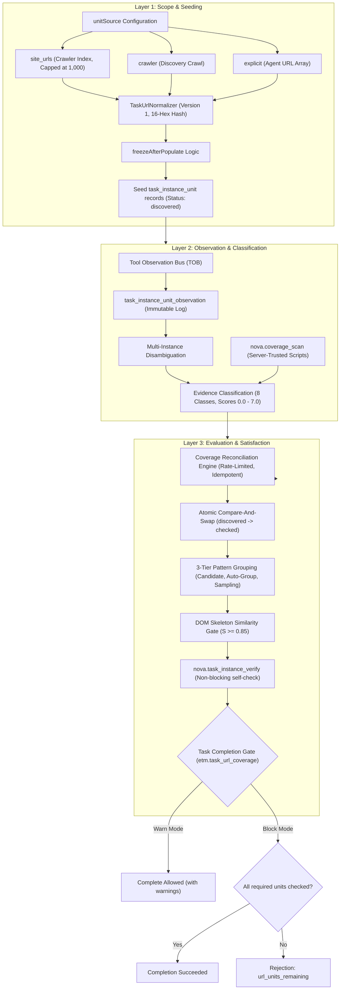
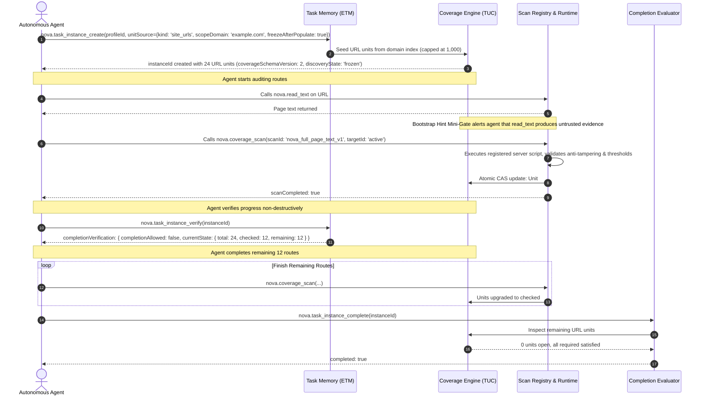
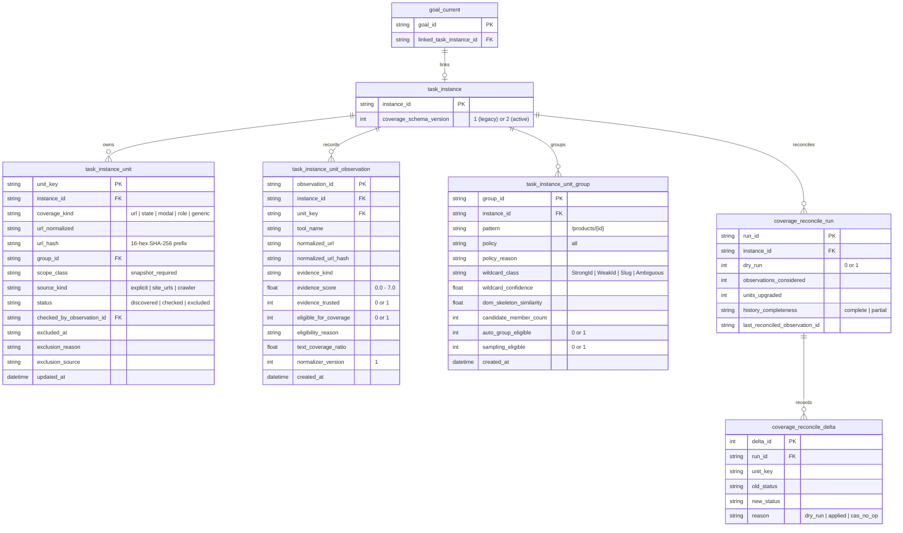

# Task URL Coverage (TUC)

> [!NOTE]
> **Task URL Coverage (TUC)** provides deterministic, server-verified tracking of visited, audited, and scanned URLs within an [Episodic Task Memory (ETM)](../episodic-task-memory-etm/README.md) task instance. It prevents autonomous agents from prematurely declaring complex web audits completed before all required routes have verified evidence.

---

## 1. Executive Summary: The Premature Completion Problem

When autonomous agents conduct large-scale web operations—such as internationalization (i18n) audits, accessibility compliance reviews, dead-link sweeps, or security surface mapping—they operate under context window constraints.

A documented empirical failure mode occurs during multi-page audits (for example, auditing 26 distinct language routes across a portal):
1. The agent audits 12 pages successfully.
2. Context window saturation causes earlier instructions and URL checklists to attenuate.
3. The agent hallucinates that it has inspected the entire site, produces a polished summary report, and invokes task completion.
4. **Result:** More than half of the web application remains uninspected, yet the run is reported as successful.

```
Without TUC:
Agent Plan (26 URLs) ──> Audits 12 URLs ──> Context Drift ──> Declares "100% Done" [FAIL: 14 URLs Missed]

With TUC:
Agent Plan (26 URLs) ──> Audits 12 URLs ──> Calls Complete ──> Nova Rejects: "url_units_remaining (14 left)"
                                                                   │
                                                                   ▼
Agent Continues ◄── Guided Remediation Target List ◄───────────────┘
```

**The Core TUC Invariant:**
> *"The agent's narrative is not evidence. Completion is evaluated by the server against registered, immutable observations."*

---

## 2. The 3-Layer Coverage Model

TUC organizes URL verification into three independent, decoupled architectural layers:



### Layer 1: Scope & Seeding
Defines the boundary of what must be verified. When a task instance is created:
* `site_urls` / `crawler`: Populated from Nova's durable crawler index for the target domain (capped at a maximum of 1,000 URLs to prevent pathological sub-domain dumps from flooding the database).
* `explicit`: An array of target URLs supplied in `unitSource.explicitUrls`.
* `freezeAfterPopulate`: If `true`, locks `discoveryState` to `"frozen"` immediately upon writing units. If zero URLs are discovered, leaves state as `"unknown"` without trapping the run.
* URLs are defensively normalized via `TaskUrlNormalizer`, stripping tracking tags and deriving a privacy-safe 16-hex SHA-256 prefix hash.

### Layer 2: Observation & Classification
Tracks every interaction with the browser engine. As tools run, events flow through the [Tool Observation Bus (TOB)](../../tool-observation-bus-tob/README.md) into `task_instance_unit_observation`. Multi-instance disambiguation prevents misattribution across parallel agent runs. Active runs via `nova.coverage_scan` execute immutable server-registered scripts and enforce anti-tampering rules (`claimedFitsMeasured`).

### Layer 3: Evaluation & Satisfaction
Resolves observations against open units. Only evidence meeting server-trusted criteria can advance a unit from `discovered` to `checked`. Pattern grouping collapses repetitive parameterized routes when structural similarity permits ($S_{\text{composite}} \ge 0.85$). Agents can self-diagnose readiness via `nova.task_instance_verify` before requesting completion. At task completion, the gate enforces that zero required units remain open.

---

## 3. End-to-End Workflow Lifecycle



---

## 4. Ephemeral Task Awareness Integration

Task URL Coverage continuously feeds progress awareness into agent observation turns without writing bloated progress snapshots to disk:
* When an agent calls `nova.task_match`, `nova.task_instance_get`, or `nova.get_instructions`, Nova computes **ephemeral task awareness**:

```json
{
  "source": "instance",
  "instanceId": "inst_88429",
  "status": "in_progress",
  "discoveryState": "frozen",
  "progress": {
    "totalUnits": 24,
    "checkedUnits": 18,
    "remainingUnits": 6,
    "percentComplete": 75.0
  },
  "completionAllowed": false,
  "guidanceSummary": "Auditing internationalized route catalog."
}
```

This ensures that any agent resuming a task immediately observes how many routes remain unverified, preventing repetitive restarts.

---

## 5. MCP Tool Catalog

TUC exposes specialized tools with strict parameter validation:

### 1. `nova.coverage_scan`
Executes an immutable, server-registered scan script inside the active browser tab to produce server-trusted coverage evidence.

```json
{
  "scanId": "nova_full_page_text_v1",
  "targetId": "active",
  "scopeOptions": {
    "waitForHydration": true,
    "hydrationTimeoutMs": 5000
  }
}
```

* **Parameters:**
  * `scanId` (*string, required*): Registered script ID (`nova_full_page_text_v1`, `nova_structured_dom_v1`, `nova_i18n_spellcheck_v1`).
  * `targetId` (*string, optional*): Browser tab identifier or `"active"`. Defaults to `"active"`.
  * `scopeOptions` (*object, optional*): Overrides for shadow DOM, iframes, and hydration timeouts.
  * `_meta` (*object, optional*): Standard MCP metadata.
* **Returns:** Structured extraction payload, measured DOM metrics, verified effective URL, and updated unit status.
* **Argument Safety:** Strictly rejects any unknown arguments with error code `-32602`.

### 2. `nova.task_instance_reconcile_coverage`
Replays historical observations from `task_instance_unit_observation` against open units to advance units without re-scanning.

```json
{
  "instanceId": "inst_88429",
  "dryRun": true,
  "observationCutoff": "2026-10-08T16:00:00Z"
}
```

* **Parameters:**
  * `instanceId` (*string, required*): Target task instance ID.
  * `dryRun` (*boolean, optional*): If `true` (default), previews proposed transitions. If `false`, applies upgrades (developer-gated via `TaskUrlCoverageAllowAgentReconcileApply`).
  * `observationCutoff` (*string, optional*): ISO-8601 timestamp cutoff.
  * `_meta` (*object, optional*): Standard MCP metadata.
* **Rate Limits:** `dryRun` max 3/hour/instance; `apply` max 1/hour/instance.
* **Idempotency:** Reconcile tracks `last_reconciled_observation_id` and returns `no_new_evidence` if no fresh observations exist.

---

## 6. Database Schema & Data Models (Schema v22)

TUC persists all units, observations, groups, and reconciliation runs in SQLite:



---

## 7. Application Settings & Developer UI Toggles

TUC behavior is configured in application settings and exposed in Nova's Settings View under the **Task URL Coverage** panel:

| Setting Key | Type | Default | UI Toggle Label | Description |
| :--- | :---: | :---: | :--- | :--- |
| `TaskUrlCoverageGateMode` | `enum` | `"Warn"` | *Gate Mode Dropdown* | Completion gate mode: `"Off"`, `"Warn"`, `"ShadowBlock"`, or `"Block"`. Under `"Block"`, incomplete URL units strictly reject `task_instance_complete`. |
| `TaskUrlCoverageScanRecommendedGateMode` | `enum` | `"Warn"` | *Hint Gate Dropdown* | Controls the Bootstrap Hint Mini-Gate advising agents to use `nova.coverage_scan`. |
| `TaskUrlCoverageTrackingEnabled` | `boolean` | `true` | `URL Coverage tracking` | Master switch for recording passive observations on every relevant tool call. |
| `TaskUrlCoverageAutoGrouping` | `boolean` | `true` | `Auto-group similar URLs` | Enables automatic route grouping of high-cardinality parameterized paths (`/channels/{id}`). |
| `TaskUrlCoverageAutoGroupingThreshold` | `integer` | `3` | *(Advanced JSON)* | Minimum matching URLs required to form a candidate pattern group. |
| `TaskUrlCoverageAutoSampling` | `boolean` | `false` | `Allow auto-sampling` | Allows representative sampling of URL groups in Block mode. |
| `TaskUrlCoverageAutoSamplingThreshold` | `integer` | `5` | *(Advanced JSON)* | Minimum matching URLs required to qualify for auto-group promotion. |
| `TaskUrlCoverageScreenshotCounts` | `boolean` | `false` | `Count screenshots as visit` | Count screenshots as proof that a page was visited (`VisitedOnly`, Score 1.0). |
| `TaskUrlCoverageDomSkeletonRequiredForBlockSampling` | `boolean` | `true` | `Require DOM-skeleton verification` | Enforces that DOM skeleton structural similarity ($S \ge 0.85$) is mandatory before sampling is allowed in Block mode. |
| `TaskUrlCoverageAllowAgentReconcileApply` | `boolean` | `false` | `Allow agents to call reconcile dryRun=false` | Developer gate for `nova.task_instance_reconcile_coverage(dryRun=false)`. When `false`, agents cannot trigger state mutations via reconcile. |
| `AuditKeepRawUrls` | `boolean` | `false` | `Persist raw URLs in audit log` | Persist raw unredacted URLs in the audit log (default: redacted to prevent query token leaks). |

---

## 8. Sub-Guides & Deep Dives

For exhaustive implementation mechanics, refer to the specialized sub-guides:

* **[Evidence Classification & Server-Trusted Scans](evidence-and-scans.md)**
  * The server-trust invariant vs agent claims.
  * The 8 evidence classes, scores, and server-side anti-tampering formulas (`claimedFitsMeasured`).
  * Tool extraction hooks: budget-aware `read_text` parsing and search hit counters.
  * Registered scripts: `nova_full_page_text_v1`, `nova_structured_dom_v1`, and `nova_i18n_spellcheck_v1`.
  * Proactive contract injection via `nova.get_instructions`.
  * The Bootstrap Hint Mini-Gate (`etm.coverage_scan_recommended`) and calling-agent scoping rules.

* **[URL Pattern Grouping & Sampling Policies](pattern-grouping-and-sampling.md)**
  * Defensive URL normalization, tracking parameter stripping, and the 16-hex privacy hash.
  * Path segment wildcard classification (`StrongId`, `WeakId`, `Ambiguous`, `Slug`) and rank lattice.
  * The 3-tier grouping architecture (Candidate, Auto-Group, Sampling Eligible) and the 11 protected content prefixes.
  * DOM skeleton fingerprinting and the 4-component composite similarity formula ($S_{\text{composite}} \ge 0.85$).
  * Task kind resolution, bilingual keyword lexicons, and the "Stricter Wins" lattice.

* **[Reconciliation Engine & Completion Gates](reconciliation-and-completion-gates.md)**
  * Multi-instance disambiguation and passive observation logging via TOB.
  * `nova.task_instance_reconcile_coverage` dryRun vs apply semantics, rate limits, and idempotency cursors.
  * Pre-completion self-diagnosis via `nova.task_instance_verify`.
  * The `etm.task_url_coverage` completion gate payload and explicit exclusion workflows.
  * Audit ledger redaction and linked goal-close enforcement (`goal_current.linked_task_instance_id`).

---

## Related Documentation

* **[Episodic Task Memory (ETM)](../episodic-task-memory-etm/README.md)** — Task profiles, work units, and task lifecycle management.
* **[Tool Observation Bus (TOB)](../../tool-observation-bus-tob/README.md)** — Event telemetry and visit window ledger.
* **[Surface Explorer](../../crawler-and-discovery/surface-explorer/README.md)** — Discovery crawling and site URL mapping.
* **[Agent Awareness Gates (AAG)](../../agent-awareness-gates-aag/README.md)** — Precondition gates and tab lease enforcement.

[Learning overview](../README.md) · [All core features](../../README.md)
