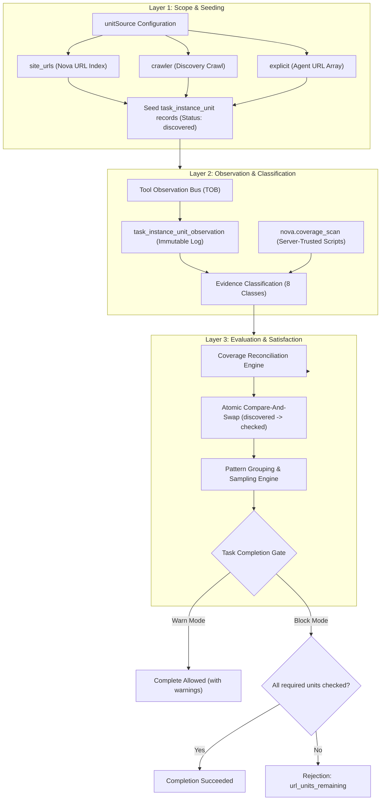
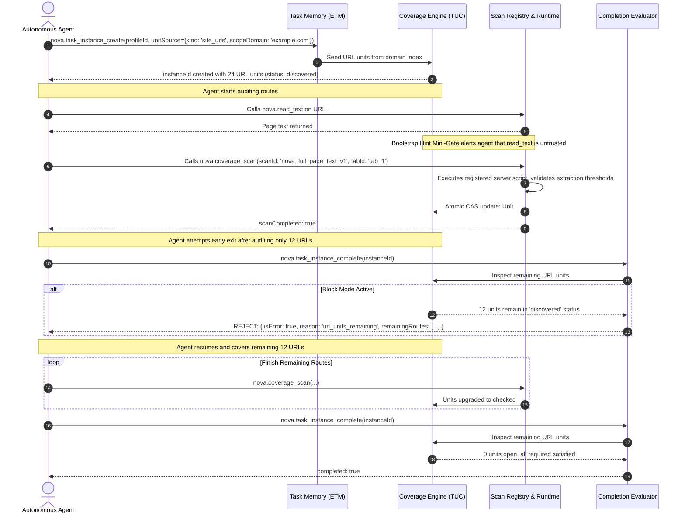
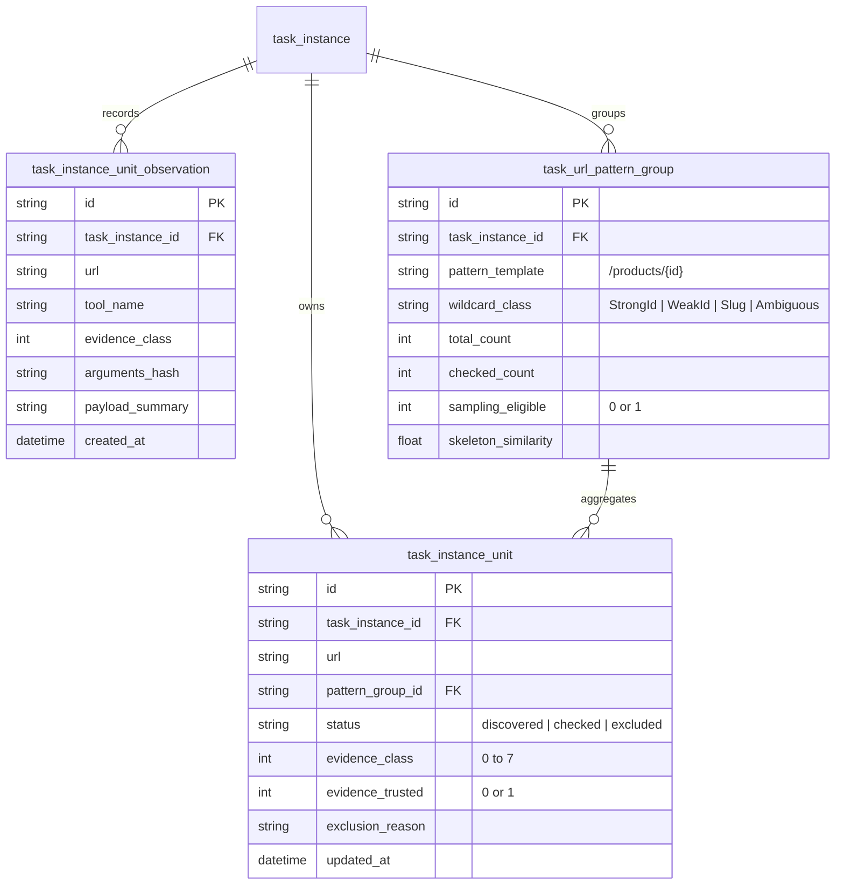

# Task URL Coverage (TUC)

> [!NOTE]
> **Task URL Coverage (TUC)** provides deterministic, server-verified tracking of visited, audited, and scanned URLs within an [Episodic Task Memory (ETM)](../episodic-task-memory-etm/README.md) task instance. It prevents autonomous agents from prematurely declaring complex web audits completed before all required routes have verified evidence.

---

## 1. Executive Summary: The Premature Completion Problem

When autonomous agents conduct large-scale web operations—such as internationalization (i18n) audits, accessibility compliance reviews, dead-link sweeps, or security surface mapping—they operate under context window constraints.

A documented empirical failure mode occurs during multi-page audits (for example, auditing 26 distinct language routes across a portal):
1. The agent audits 12 pages successfully.
2. Context window saturation causes earlier instructions and URL checklists to attenuate.
3. The agent hallucinates that it has inspected the entire site, produces a polished summary report, and invokes task completion.
4. **Result:** More than half of the web application remains uninspected, yet the run is reported as successful.

```
Without TUC:
Agent Plan (26 URLs) ──> Audits 12 URLs ──> Context Drift ──> Declares "100% Done" [FAIL: 14 URLs Missed]

With TUC:
Agent Plan (26 URLs) ──> Audits 12 URLs ──> Calls Complete ──> Nova Rejects: "url_units_remaining (14 left)"
                                                                   │
                                                                   ▼
Agent Continues ◄── Guided Remediation Target List ◄───────────────┘
```

**The Core TUC Invariant:**
> *"The agent's narrative is not evidence. Completion is evaluated by the server against registered, immutable observations."*

---

## 2. The 3-Layer Coverage Model

TUC organizes URL verification into three independent, decoupled architectural layers:



### Layer 1: Scope & Seeding
Defines the boundary of what must be verified. When a task instance is created, URL units are automatically seeded into SQLite from:
* `site_urls`: Nova's durable URL index for the target domain.
* `crawler`: Routes discovered during a preceding exploratory crawl.
* `explicit`: A list of target URLs provided directly in the task creation payload.

### Layer 2: Observation & Classification
Tracks every interaction with the browser engine. As tools run, events flow through the [Tool Observation Bus (TOB)](../../tool-observation-bus-tob/README.md) into the immutable observation ledger. Each observation is assigned an evidence class (0–7) based on whether it represents a mere visit, an untrusted agent assertion, or a server-verified script execution.

### Layer 3: Evaluation & Satisfaction
Resolves observations against open units. Only evidence meeting server-trusted criteria can advance a unit from `discovered` to `checked`. Pattern grouping collapses repetitive parameterized routes when structural similarity permits. At task completion, the gate enforces that zero required units remain open.

---

## 3. End-to-End Workflow Lifecycle

The following sequence illustrates a complete coverage lifecycle from seeding to completion verification:



---

## 4. MCP Tool Catalog

TUC exposes specialized tools for auditing pages and reconciling recorded observations:

### 1. `nova.coverage_scan`
Executes an immutable, server-registered scan script inside the active browser tab to produce server-trusted coverage evidence.

```json
{
  "scanId": "nova_full_page_text_v1",
  "tabId": "tab_102",
  "taskInstanceId": "inst_88429",
  "scopeDomain": "example.com",
  "timeoutMs": 15000
}
```

* **Parameters:**
  * `scanId` (*string, required*): Registered script ID (`nova_full_page_text_v1`, `nova_structured_dom_v1`, `nova_i18n_spellcheck_v1`).
  * `tabId` (*string, optional*): Browser tab identifier. Defaults to active tab.
  * `taskInstanceId` (*string, optional*): Associated task instance ID.
  * `scopeDomain` (*string, optional*): Restricts match to target domain.
  * `timeoutMs` (*integer, optional*): Maximum execution duration (default `15000`).
* **Returns:** Structured extraction payload, measured DOM metrics, verified effective URL, and updated unit status.

### 2. `nova.task_instance_reconcile_coverage`
Replays historical observations from the observation ledger against open units to advance units without re-scanning.

```json
{
  "instanceId": "inst_88429",
  "dryRun": false,
  "minConfidence": 0.85
}
```

* **Parameters:**
  * `instanceId` (*string, required*): Target task instance ID.
  * `dryRun` (*boolean, optional*): If `true` (default), previews proposed transitions without committing changes. If `false`, applies upgrades.
  * `minConfidence` (*number, optional*): Minimum confidence threshold for transition (default `0.80`).
  * `scanScriptId` (*string, optional*): Restricts reconciliation to observations from a specific script.
* **Returns:** Counts of evaluated, upgraded, and remaining open units, plus proposed transition diffs.

---

## 5. Database Schema & Data Models

TUC persists all units, observations, and pattern groups in SQLite:



### Table Details

1. **`task_instance_unit`**: Represents a single tracked URL route. Tracks current verification state, highest evidence class achieved, and CAS update timestamp.
2. **`task_instance_unit_observation`**: Immutable append-only event log capturing every relevant tool execution on a URL.
3. **`task_url_pattern_group`**: High-cardinality route groupings aggregating parameterized paths with structural similarity metrics.

---

## 6. Configuration Settings

TUC behavior is configured in application settings:

| Setting Key | Type | Default | Description |
| :--- | :--- | :--- | :--- |
| `CoverageTrackingEnabled` | `boolean` | `true` | Master switch for passive observation recording and URL unit tracking. |
| `CoverageCompletionGateMode` | `string` | `"Warn"` | Completion enforcement mode: `"Warn"` permits completion with uninspected units; `"Block"` strictly rejects completion with `url_units_remaining`. |
| `CoverageScanDefaultTimeoutMs` | `integer` | `15000` | Default execution timeout for `nova.coverage_scan` scripts. |
| `CoverageAutoGroupThreshold` | `integer` | `5` | Minimum count of matching parameterized URLs required to form an auto-pattern group. |
| `CoverageSamplingMinSimilarity`| `number` | `0.85` | Minimum DOM skeleton structural similarity required for sampling eligibility. |
| `CoverageBootstrapHintEnabled` | `boolean` | `true` | Enables the one-shot guidance mini-gate advising agents to use trusted scans. |

---

## 7. Sub-Guides & Deep Dives

For detailed implementation mechanics, refer to the specialized sub-guides:

* **[Evidence Classification & Server-Trusted Scans](evidence-and-scans.md)**
  * The server-trust invariant vs agent claims.
  * The 8 evidence classes and mathematical extraction thresholds.
  * Registered scripts: `nova_full_page_text_v1`, `nova_structured_dom_v1`, and `nova_i18n_spellcheck_v1`.
  * The Bootstrap Hint Mini-Gate.

* **[URL Pattern Grouping & Sampling Policies](pattern-grouping-and-sampling.md)**
  * Path segment wildcard classification (`StrongId`, `WeakId`, `Ambiguous`, `Slug`).
  * The 3-tier grouping architecture (Candidate, Auto-Group, Sampling Eligible).
  * DOM skeleton fingerprinting and structural similarity calculations.
  * Task kind resolution and the "Stricter Wins" lattice.

* **[Reconciliation Engine & Completion Gates](reconciliation-and-completion-gates.md)**
  * Passive observation logging via TOB.
  * `nova.task_instance_reconcile_coverage` dryRun vs apply semantics.
  * Monotonic upgrade-only state transitions.
  * Hard completion blocking and linked goal-close enforcement.

---

## Related Documentation

* **[Episodic Task Memory (ETM)](../episodic-task-memory-etm/README.md)** — Task profiles, work units, and task lifecycle management.
* **[Tool Observation Bus (TOB)](../../tool-observation-bus-tob/README.md)** — Event telemetry and visit window ledger.
* **[Surface Explorer](../../crawler-and-discovery/surface-explorer/README.md)** — Discovery crawling and site URL mapping.
* **[Agent Awareness Gates (AAG)](../../agent-awareness-gates-aag/README.md)** — Precondition gates and tab lease enforcement.

[Learning overview](../README.md) · [All core features](../../README.md)
