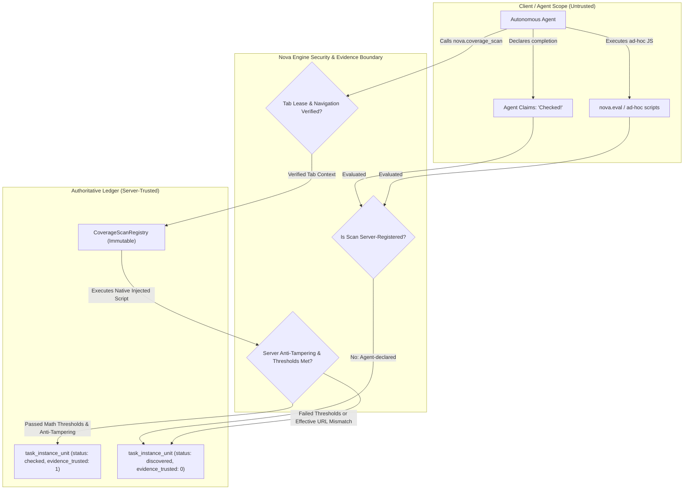
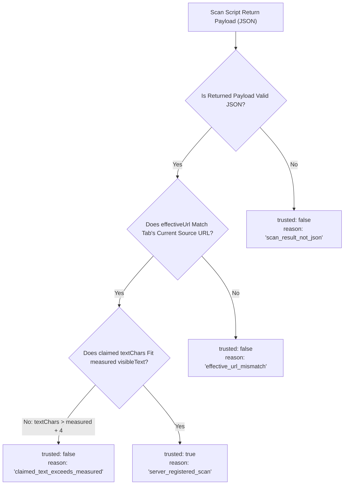

# Evidence Classification & Server-Trusted Scans

> [!NOTE]
> This guide details the evidence hierarchy, execution pipeline, mathematical extraction thresholds, pre-registered scan scripts, server-side anti-tampering checks, browser tool metric extraction, proactive contract injection, and the Bootstrap Hint Mini-Gate in Task URL Coverage (TUC).

---

## 1. The Server-Trust Invariant

In autonomous agent operations, an agent may suffer from confirmation bias or hallucinate that an operation succeeded. A common failure mode during web audits occurs when an agent navigates to a URL, runs arbitrary client-side JavaScript via generic execution tools, and asserts:

```json
{
  "status": "checked",
  "evidence": "I inspected the page and verified all headings and spelling."
}
```

If accepted blindly, audits can declare full coverage while critical routes remain unverified, failed to render, or encountered unhandled runtime exceptions.

To eliminate this vulnerability, Nova enforces a strict architectural invariant:

$$\text{Trust is server-constructed, never agent-declared.}$$

### The Trust Boundary



In `Block` mode, only evidence meeting the server-trusted criteria satisfies the coverage completion gate. Agent claims without server verification remain cataloged as unverified observations.

---

## 2. The 8 Evidence Classes & Scoring

Nova categorizes all coverage observations into an 8-level evidence classification hierarchy, ranging from passive navigation to cryptographic native probes. Each kind carries a numeric evidence score:

| Class | Level Identifier | Description | Score | Trusted in Block Mode? | Typical Trigger Tool |
| :---: | :--- | :--- | :---: | :---: | :--- |
| **0** | `none` | Untracked route or unobserved state. | `0.0` | No | Default initial state |
| **1** | `visited` | URL loaded in a tab viewport, but no DOM or content payload extracted. | `1.0` | No | `nova.navigate`, `nova.route` |
| **2** | `visual_snapshot` | Visual screenshot or perceive accessibility snapshot captured. | `2.0` | Conditional (Visual only) | `nova.capture_screenshot` |
| **3** | `text_extract_light` | Partial text extraction or search text hit. Incomplete page coverage. | `3.0` | No | `nova.read_text`, `nova.search_text` |
| **4** | `manual_or_agent_asserted` | Agent asserted satisfaction without server template validation. | `4.0` | No | `nova.eval` with custom payload |
| **5** | `text_extract_full` | Deep text extract meeting full-page mathematical thresholds, but unverified. | `5.0` | No | `nova.read_text` (unverified runner) |
| **6** | `structured_dom_extract` | Deep full-page structural DOM extraction with layout tree and skeleton. | `6.0` | No (if agent-invoked) | `nova.perceive` (form/CTA modes) |
| **7** | `registered_scan` | Pre-registered, immutable scan script executed with server-validated thresholds. | `7.0` | **Yes** | `nova.coverage_scan` |

### Classification Invariants

1. **Monotonic Evidence Quality:** An existing unit evidence record cannot be degraded by a lower-quality observation. If a URL unit has reached Score `7.0` (`registered_scan`), subsequent Class 1 (`visited`) observations update navigation timestamps without lowering evidence class.
2. **Effective URL Attribution:** Observations are credited to the *effective final URL* (`location.href`) resolved by the browser engine after HTTP redirects, canonical rewrites, or Single-Page Application (SPA) router pushes, rather than the requested URL.
3. **Lease Validation:** Evidence is only accepted if the executing agent holds a valid active tab lease for the target tab at the exact time of execution.

---

## 3. Tool Extraction Hooks Across the Engine

When an agent executes standard browser tools, Nova's tracking hook intercepts the structured results and extracts physical metrics:

### 1. `nova.read_text` & Output Budget Accounting
Standard text reading tools enforce character budgets to prevent prompt flooding. If an agent reads a 10,000-character article, the returned snippet might be truncated to 1,500 characters.

Nova's extraction hook inspects the low-level `outputBudget` container:
* `sourceChars`: Total characters measured in the rendered DOM.
* `returnedChars`: Characters actually returned in the payload.
* `truncated`: Boolean indicator.

When `outputBudget.sourceChars` exceeds the full-page threshold, Nova credits the observation with `TextExtractFull` (Score `5.0`), ensuring the agent is not penalized for engine-enforced budget truncation.

### 2. `nova.search_text` & Hit Verification
Search results are classified based on empirical match counts:
* **Hit (`count > 0`):** Classified as `TextExtractLight` (Score `3.0`) on the target URL.
* **Miss (`count == 0`):** Classified as `VisitedOnly` (Score `1.0`) with `reason = "search_miss_proves_nothing"`. A negative search result proves presence, but does not verify page content.

### 3. `nova.capture_screenshot` & The Visit Evidence Toggle
By default, capturing a screenshot produces `VisualSnapshot` (Score `2.0`). However, when `AppSettings.TaskUrlCoverageScreenshotCounts == true`, Nova treats screenshots as verified proof of presence, mapping them to `VisitedOnly` (Score `1.0`) with `reason = "screenshot_counts_as_visit_only"`.

### 4. `nova.perceive` & Specialized Modes
* **`form_analysis` / `cta_detection_v3`:** Produces `StructuredDomExtract` (Score `6.0`).
* **`full` mode:** If hydration is stable, produces `TextExtractFull` (Score `5.0`); if hydration is unstable or page state is an error, downgrades to `VisitedOnly` (Score `1.0`).
* **Standard summary mode:** Produces `TextExtractLight` (Score `3.0`).

### 5. `nova.eval` & Agent Telemetry
If an agent passes custom claims (e.g. `coverageEvidence: { checked: true }`) inside `nova.eval`, Nova logs the claim for telemetry, but strictly categorizes it as `TextExtractLight` (Score `3.0`) with `reason = "agent_eval_coverage_evidence_not_trusted"`.

---

## 4. Server-Side Anti-Tampering & Trust Verification

When `nova.coverage_scan` executes, the result payload returned from the browser runtime is subject to three strict server-side checks before `evidenceTrusted` is granted:



### The Anti-Tampering Formula

To prevent modified or spoofed scripts from reporting fabricated text content, Nova measures both $C_{\text{visible}}$ (`visibleTextCharsMeasured`) and $C_{\text{coverage}}$ (`coverageTextCharsMeasured`):

$$\text{claimedFitsMeasured} \iff C_{\text{claimed}} \le \max(C_{\text{coverage}}, 1) + 4$$

* A tolerance margin of $+4$ characters accommodates whitespace boundary normalization.
* If an agent manipulates the payload to report more extracted text than physically measured by the DOM walker, the server immediately marks `trusted = false` with `reason = "claimed_text_exceeds_measured"`.

---

## 5. `nova.coverage_scan` Tool Contract

The `nova.coverage_scan` tool executes an immutable, server-registered scan script inside the active browser tab.

### Parameter Reference

| Parameter | Type | Required | Default | Allowed Values / Constraints |
| :--- | :--- | :--- | :--- | :--- |
| `scanId` | `string` | **Yes** | - | Must match a registered ID in `CoverageScanRegistry` (e.g., `nova_full_page_text_v1`, `nova_structured_dom_v1`, `nova_i18n_spellcheck_v1`). Unknown IDs return error code `-32602` with `knownScanIds`. |
| `targetId` | `string` | No | `"active"` | Target tab identifier or `"active"` for the currently focused tab. |
| `scopeOptions` | `object` | No | Default options | Execution overrides: `includeShadowDom` (bool), `includeIframes` (bool), `waitForHydration` (bool), `hydrationTimeoutMs` (int). |
| `_meta` | `object` | No | - | Standard MCP metadata container. |

*Note: Any arguments outside `AllowedArgs` (`scanId`, `targetId`, `scopeOptions`, `_meta`) cause an immediate JSON-RPC `-32602` validation rejection.*

---

## 6. Mathematical Extraction Thresholds & Phase 3 Eligibility

A major vulnerability in automated web extraction is partial rendering: an agent reads text before lazy loading finishes, dynamic hydration completes, or shadow DOM trees render, capturing only a fraction of the actual page content.

### Hybrid Mathematical Thresholds

Let $C_{\text{measured}}$ be the total text character count measured in visible DOM text nodes, and $C_{\text{extracted}}$ be the clean text extracted in the return payload:

#### 1. Small Pages ($C_{\text{measured}} \le 300$ characters)
For compact utility pages, error states, or login gates:

$$C_{\text{extracted}} \ge 0.80 \times C_{\text{measured}}$$

#### 2. Standard and Large Pages ($C_{\text{measured}} > 300$ characters)
For typical content, articles, dashboards, and catalog pages:

$$C_{\text{extracted}} \ge \max\left(300,\; 0.85 \times C_{\text{measured}}\right)$$

### Phase 3 Eligibility Criteria

For a scan to qualify as eligible coverage in Block mode (`IsPhase3Eligible`), the following conditions must hold simultaneously:

1. **Server Trusted:** `ServerTrusted == true`.
2. **Hydration Stability:** `HydrationStable == true` (no pending DOM mutations, document ready state is complete, page state is not `"error"`).
3. **Iframe Accounting:** If `IframeCount > 0`, the scan must have explicitly included iframes (`IncludedIframes == true`), otherwise fails with `iframes_present_but_not_included`.
4. **Text Coverage Ratio:** $\text{TextCoverageRatio} = \frac{C_{\text{extracted}}}{C_{\text{measured}}} \ge 0.85$.
5. **Compliance Audits:** For tasks typed as `content_audit`, `compliance`, `legal`, `security_review`, or `accessibility`:
   * All four extraction flags must be present: `IncludedVisibleText`, `IncludedAriaLabels`, `IncludedInputs`, `IncludedAltText`.
   * DOM skeleton similarity must satisfy: $\text{DomSkeletonSimilarity} \ge 0.85$.

---

## 7. Pre-Registered Scan Scripts

Nova maintains immutable, embedded JavaScript scan scripts in `CoverageScanRegistry`. Scripts are hashed with SHA-256 (`ComputeScanHash`) at registration time.

### 1. `nova_full_page_text_v1`
* **Target Evidence Kind:** `TextExtractFull` (`registered_scan`, Score `7.0`)
* **Purpose:** Complete text content audits, documentation reviews, legal agreements, and general proofreading.
* **Mechanism:**
  * Extracts visible body text (`body.innerText`).
  * Aggregates interactive ARIA labels (`[aria-label]`).
  * Extracts input placeholders (`input[placeholder]`).
  * Gathers image alternative text (`img[alt]`).
  * Counts total DOM nodes, interactive controls, iframes, and shadow roots.
* **Extraction Payload:** Sets `includedVisibleText = true`, `includedAriaLabels = true`, `includedInputs = true`, `includedAltText = true`.

### 2. `nova_structured_dom_v1`
* **Target Evidence Kind:** `StructuredDomExtract` (`registered_scan`, Score `7.0`)
* **Purpose:** Deep layout audits, accessibility tree inspections, and template similarity verification.
* **Mechanism:**
  * Extracts the ordered structural tag sequence across landmark elements: `header`, `nav`, `main`, `aside`, `section`, `article`, `footer`.
  * Computes landmark sets and ARIA role sets (`[role]`).
  * Computes exact counts for: `buttonCount`, `inputCount`, `linkCount`, `formCount`, `headingCount` (h1–h6), `modalLikeCount` (`[role=dialog]`, `[aria-modal=true]`), and `iframeCount`.
  * Outputs the data consumed directly by the DOM Skeleton Comparer.

### 3. `nova_i18n_spellcheck_v1`
* **Target Evidence Kind:** `TextExtractFull` (`registered_scan`, Score `7.0`)
* **Purpose:** Multilingual verification, translation completeness audits, and orthography inspection.
* **Mechanism:**
  * Extracts visible-only text optimized for human-readable string scanning without injecting noise from technical attribute strings.
  * Measures visible body text against total body text content to detect hidden or collapsed language containers.

---

## 8. Proactive Contract Injection via `nova.get_instructions`

Rather than waiting for an agent to make a mistake, Nova educates the agent proactively. When an active exhaustive task instance exists for the calling agent, `nova.get_instructions` dynamically appends a **Coverage Scan Contract** block:

```markdown
## Coverage Scan Contract (active exhaustive instance detected)
Instance `inst_88429` (coverage_schema_version=2) is set up for URL Coverage. For Block-eligible evidence, prefer `nova.coverage_scan` over `nova.perceive` / `nova.read_text` — agent-claimed `coverageEvidence` is never trusted in Block-Mode.

### Registered Coverage Scans
- `nova_full_page_text_v1` — visible text + ARIA + input placeholders + img alt. Use for accessibility and broad text audits.
- `nova_structured_dom_v1` — tag sequence + landmarks + roles + control counts. Use for route inventory and structural diffs.
- `nova_i18n_spellcheck_v1` — visible text only, optimized for human-readable strings. Use for content audits and spellcheck.

### Calling Convention
nova.coverage_scan({
  scanId: 'nova_i18n_spellcheck_v1',
  targetId: 'active'
})
```

---

## 9. The Bootstrap Hint Mini-Gate (`etm.coverage_scan_recommended`)

If an agent still invokes generic reading tools (`nova.perceive`, `nova.read_text`, `nova.eval`, `nova.search_text`, `nova.capture_screenshot`), Nova intercepts the turn with the **Bootstrap Hint Mini-Gate**.

### Trigger & Scoping Conditions

```mermaid
flowchart TD
    ToolCall["Agent calls reading tool: perceive / read_text / eval / search_text"]
    ToolCheck{"Is tool in ReadingTools set?"}
    CallingAgent{"Resolve calling agent ID"}
    CandidateCheck{"Find most recently active unfinished instance for THIS agent"}
    ExhaustiveCheck{"Is candidate instance Exhaustive?"}
    SchemaCheck{"Is coverage_schema_version >= 2?"}
    AlreadyWarned{"Has hint already fired for this instance?"}
    RecentScanCheck{"Has coverage_scan run recently on this tab?"}

    ToolCall --> ToolCheck
    ToolCheck -->|No| AllowSilent["Execute normally (silent)"]
    ToolCheck -->|Yes| CallingAgent

    CallingAgent --> CandidateCheck
    CandidateCheck -->|No instance| AllowSilent
    CandidateCheck -->|Found instance| ExhaustiveCheck

    ExhaustiveCheck -->|No| AllowSilent
    ExhaustiveCheck -->|Yes| SchemaCheck

    SchemaCheck -->|No (< 2)| AllowSilent
    SchemaCheck -->|Yes| AlreadyWarned

    AlreadyWarned -->|Yes: Already warned| AllowSilent
    AlreadyWarned -->|No| RecentScanCheck

    RecentScanCheck -->|Yes: Recent scan active| AllowSilent
    RecentScanCheck -->|No| EmitGate["Inject _aagGates.coverageScanRecommended payload"]
```

### Critical Scoping Rules

1. **Strict Calling-Agent Isolation:** The gate evaluates only the calling agent's candidate instances (`ResolveCoverageGateAgentId`). It never borrows an unfinished instance from another agent, preventing cross-agent guidance pollution.
2. **One-Shot Guarantee:** Tracked per instance ID in memory (`_coverageScanWarnedInstances`). The hint fires at most once per task instance and is re-armed only when the instance completes.
3. **Recency Suppression:** If `nova.coverage_scan` was called recently on the tab, the hint is suppressed—the agent is already using the correct tool.
4. **Task-Specific Scan Recommendation:**
   * `content_audit`, `compliance`, `legal` $\rightarrow$ recommends `scanId: "nova_i18n_spellcheck_v1"`.
   * `accessibility`, `security_review` $\rightarrow$ recommends `scanId: "nova_full_page_text_v1"`.
   * `route_inventory` $\rightarrow$ recommends `scanId: "nova_structured_dom_v1"`.
   * fallback $\rightarrow$ recommends `scanId: "nova_full_page_text_v1"`.

---

## Related Documentation

* **[Task URL Coverage (TUC) Overview](README.md)** — Core architecture, 3-layer model, and MCP tool catalog.
* **[Pattern Grouping & Sampling](pattern-grouping-and-sampling.md)** — Wildcard route classification, 3-tier grouping, and DOM skeleton similarity.
* **[Reconciliation & Completion Gates](reconciliation-and-completion-gates.md)** — Passive observation ledger, reconcile engine, and completion enforcement.
* **[Tool Observation Bus (TOB)](../../tool-observation-bus-tob/README.md)** — Server-side observation logging and event telemetry.
