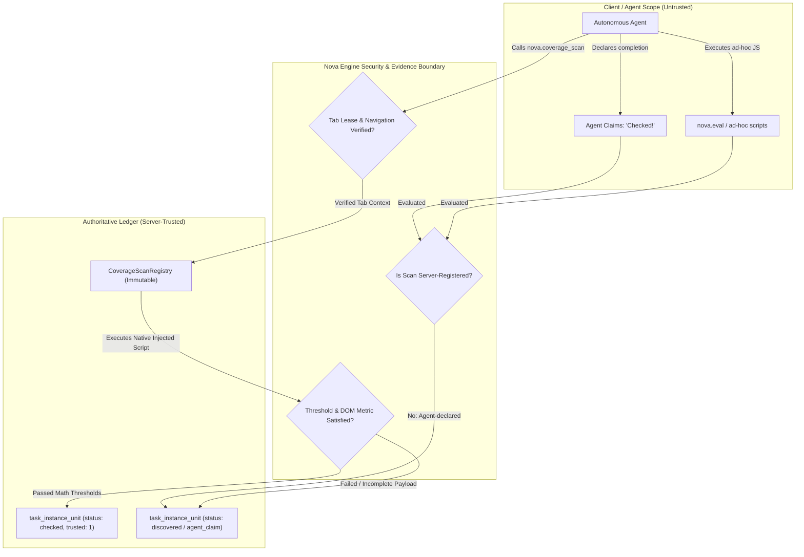
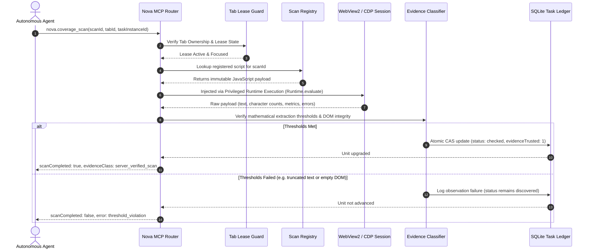
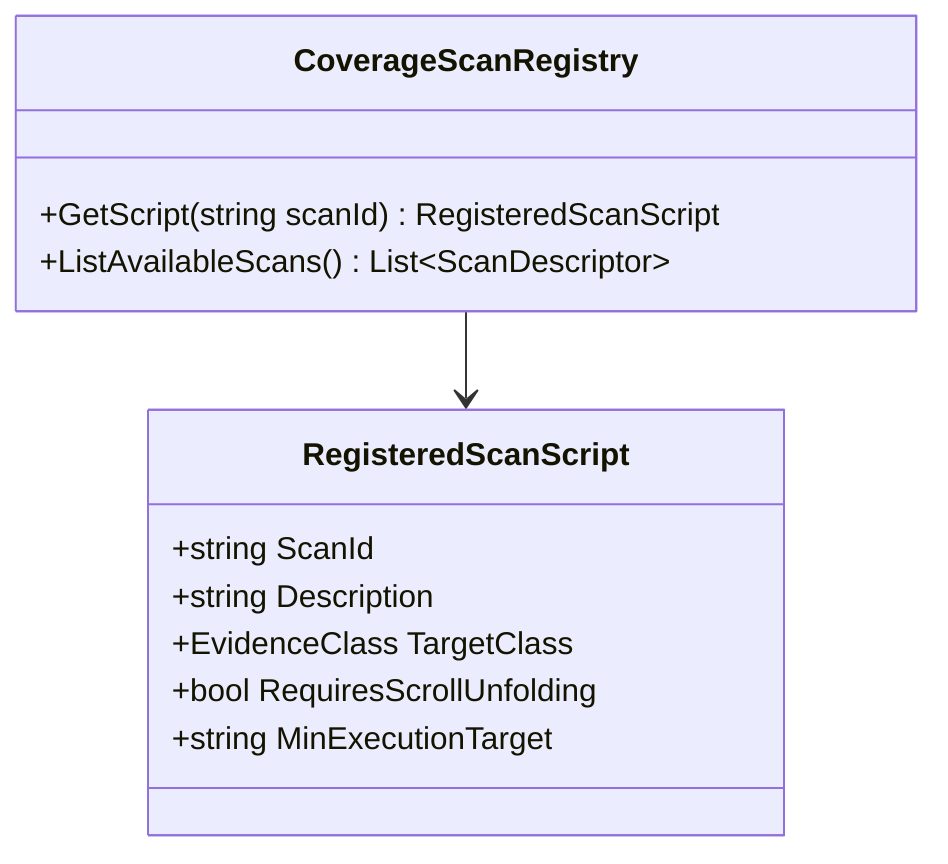
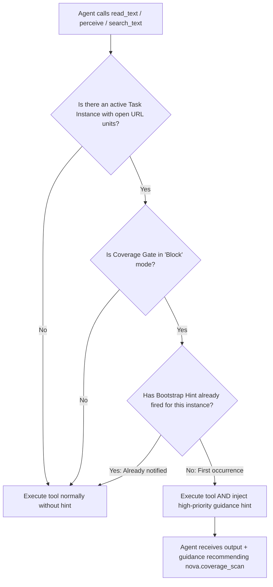

# Evidence Classification & Server-Trusted Scans

> [!NOTE]
> This guide details the evidence hierarchy, execution pipeline, mathematical extraction thresholds, pre-registered scan scripts, and the Bootstrap Hint Mini-Gate in Task URL Coverage (TUC).

---

## 1. The Server-Trust Invariant

In autonomous agent operations, an agent may suffer from confirmation bias or hallucinate that an operation succeeded. A common failure mode during web audits occurs when an agent navigates to a URL, runs arbitrary client-side JavaScript via generic execution tools, and asserts:

```json
{
  "status": "checked",
  "evidence": "I inspected the page and verified all headings and spelling."
}
```

If accepted blindly, audits can declare full coverage while critical routes remain unverified or failed to render.

To eliminate this vulnerability, Nova enforces a strict architectural invariant:

$$\text{Trust is server-constructed, never agent-declared.}$$

### The Trust Boundary



In `Block` mode, only evidence meeting the server-trusted criteria satisfies the coverage completion gate. Agent claims without server verification remain cataloged as unverified observations.

---

## 2. The 8 Evidence Classes

Nova categorizes all coverage observations into an 8-level evidence classification hierarchy, ranging from passive navigation to cryptographic native probes:

| Class | Level Identifier | Description | Trusted in Block Mode? | Typical Trigger Tool |
| :--- | :--- | :--- | :--- | :--- |
| **0** | `none` | Untracked route or unobserved state. | No | Default initial state |
| **1** | `visited` | URL loaded in a tab viewport, but no DOM or content payload extracted. | No | `nova.navigate`, `nova.route` |
| **2** | `agent_eval_claim` | Agent executed arbitrary script or asserted satisfaction without server template validation. | No | `nova.eval` with custom payload |
| **3** | `partial_read` | Partial or viewport-bounded text/DOM extraction. Incomplete page coverage. | No | `nova.read_text`, `nova.search_text` |
| **4** | `viewport_snapshot` | Visual screenshot or perceive accessibility snapshot captured. | Conditional (Visual only) | `nova.perceive`, `nova.capture_screenshot` |
| **5** | `server_verified_scan` | Pre-registered, immutable scan script executed with server-validated thresholds. | **Yes** | `nova.coverage_scan` |
| **6** | `full_dom_snapshot` | Deep full-page structural DOM extraction with layout tree and skeleton hash. | **Yes** | `nova.coverage_scan` (`nova_structured_dom_v1`) |
| **7** | `external_probe` | Out-of-process protocol probe verifying HTTP status, TLS handshake, headers, or DNS. | **Yes** | Native Outrider probes |

### Classification Rules

1. **Monotonic Evidence Quality:** An existing unit evidence record cannot be degraded by a lower-quality observation. If a URL unit has reached Class 5 (`server_verified_scan`), subsequent Class 1 (`visited`) observations update navigation timestamps without lowering evidence class.
2. **Effective URL Attribution:** Observations are credited to the *effective final URL* resolved by the browser engine after HTTP redirects, canonical rewrites, or Single-Page Application (SPA) router pushes, rather than the requested URL.
3. **Lease Validation:** Evidence is only accepted if the executing agent holds a valid active tab lease for the target tab at the exact time of execution.

---

## 3. `nova.coverage_scan` Execution Pipeline

The primary mechanism for generating server-trusted evidence is the `nova.coverage_scan` tool. When an agent invokes this tool, Nova executes a deterministic, multi-stage pipeline:



### Tool Parameters

| Parameter | Type | Required | Default | Description |
| :--- | :--- | :--- | :--- | :--- |
| `scanId` | `string` | **Yes** | - | Registered identifier of the scan script (e.g., `nova_full_page_text_v1`). |
| `tabId` | `string` | No | Active Tab | Identifier of the browser tab to audit. |
| `taskInstanceId` | `string` | No | Active Instance | Associated task instance ID. If omitted, infers from active session context. |
| `scopeDomain` | `string` | No | Domain of tab | Restricts URL match to the specified host scope. |
| `customScript` | `string` | No | `null` | Ad-hoc JavaScript payload. *Note: produces `agent_eval_claim` (untrusted).* |
| `timeoutMs` | `integer` | No | `15000` | Execution timeout in milliseconds (max `60000`). |

---

## 4. Hybrid Mathematical Threshold Formulas

A major vulnerability in automated web extraction is partial rendering: an agent reads text before lazy loading finishes, dynamic hydration completes, or shadow DOM trees render, capturing only a fraction of the actual page content.

Nova solves this by calculating **hybrid mathematical thresholds** comparing measured physical DOM character counts against extracted payload text.

### Threshold Rules

Let $C_{\text{measured}}$ be the total text character count measured in visible DOM text nodes by the internal engine walker, and $C_{\text{extracted}}$ be the clean text extracted in the return payload:

#### 1. Small Pages ($C_{\text{measured}} \le 300$ characters)
For compact utility pages, error states, or login gates:

$$C_{\text{extracted}} \ge 0.80 \times C_{\text{measured}}$$

#### 2. Standard and Large Pages ($C_{\text{measured}} > 300$ characters)
For typical content, articles, dashboards, and catalog pages:

$$C_{\text{extracted}} \ge \max\left(300,\; 0.85 \times C_{\text{measured}}\right)$$

If $C_{\text{extracted}}$ falls below this threshold, the scan fails with `threshold_violation: payload_underflow`, preventing incomplete reads from being recorded as verified coverage.

### Compliance and Accessibility Requirements

For accessibility (`nova_structured_dom_v1`) and internationalization (`nova_i18n_spellcheck_v1`) scans, additional validation criteria apply:

* **Text Element Coverage:** $\text{extractedTextNodes} \ge 0.90 \times \text{totalVisibleTextNodes}$
* **ARIA Label Inclusion:** All interactive elements (`<button>`, `<a>`, `<input>`, `[role="button"]`) must have their accessible names captured.
* **Input Placeholder & Label Capture:** Form inputs must include linked `<label>` text and placeholder values.
* **Alt Text Extraction:** Informational `` elements must have `alt` attributes recorded.

---

## 5. Pre-Registered Scan Scripts

Nova ships with immutable, server-registered scan scripts maintained in the scan registry. Custom or dynamic scripts cannot masquerade under these identifiers.



### 1. `nova_full_page_text_v1`
* **Target Evidence Class:** `server_verified_scan`
* **Purpose:** Exhaustive text content audits, documentation reviews, and general proofreading.
* **Mechanism:**
  * Traverses light DOM and open Shadow DOM boundaries.
  * Handles infinite-scroll and lazy-loaded containers via controlled virtual viewport scrolling.
  * Deduplicates repetitive sticky headers, navigation menus, and footers across page transitions.
  * Filters invisible styling elements (`<script>`, `<style>`, `<noscript>`, `<template>`).

### 2. `nova_structured_dom_v1`
* **Target Evidence Class:** `full_dom_snapshot`
* **Purpose:** Deep structure audits, accessibility tree inspections, and layout validation.
* **Mechanism:**
  * Extracts hierarchical tag trees with normalized element coordinates.
  * Captures ARIA attributes (`role`, `aria-label`, `aria-expanded`, `aria-hidden`, `aria-describedby`).
  * Computes the structural DOM skeleton fingerprint hash for pattern grouping and similarity detection.

### 3. `nova_i18n_spellcheck_v1`
* **Target Evidence Class:** `server_verified_scan`
* **Purpose:** Multilingual website verification, translation gap analysis, and localized copy auditing.
* **Mechanism:**
  * Extracts translatable text nodes along with their nearest `lang` attribute or inherited document language.
  * Preserves inline formatting tags (`<strong>`, `<em>`, `<span>`) within word boundaries to prevent false spelling errors on split terms.
  * Isolates button captions, validation error messages, and placeholder strings into structured translation dictionaries.

---

## 6. The Bootstrap Hint Mini-Gate

Agents often fall back on familiar generic tools (such as `nova.read_text`, `nova.search_text`, or `nova.perceive`) out of habit, unaware that the task instance requires server-trusted evidence for completion.

To prevent agents from wasting context and tokens on tools that will not satisfy the completion gate, Nova includes the **Bootstrap Hint Mini-Gate**.

### Interception Logic



### Hint Payload Example

When triggered, the tool output includes an actionable guidance block:

```json
{
  "content": "...",
  "_guidance_hint": {
    "type": "tuc_bootstrap_recommendation",
    "message": "Notice: Task instance 'inst_88429' has 24 open URL units under Block coverage policy. Calling 'read_text' produces Class 3 (partial_read) untrusted evidence. To satisfy the completion gate, execute 'nova.coverage_scan' with scanId='nova_full_page_text_v1'.",
    "suggestedTool": "nova.coverage_scan",
    "suggestedScanId": "nova_full_page_text_v1",
    "remainingUnits": 24
  }
}
```

* **One-Shot Guarantee:** The mini-gate triggers at most once per task instance per session to avoid token bloat.
* **Non-Blocking Execution:** The underlying tool execution (`read_text`, `perceive`) still succeeds; the guidance is appended alongside normal results.

---

## Related Documentation

* **[Task URL Coverage (TUC) Overview](README.md)** — Core architecture, 3-layer model, and MCP tool catalog.
* **[Pattern Grouping & Sampling](pattern-grouping-and-sampling.md)** — Wildcard route classification, 3-tier grouping, and DOM skeleton similarity.
* **[Reconciliation & Completion Gates](reconciliation-and-completion-gates.md)** — Passive observation ledger, reconcile engine, and completion enforcement.
* **[Tool Observation Bus (TOB)](../../tool-observation-bus-tob/README.md)** — Server-side observation logging and event telemetry.
