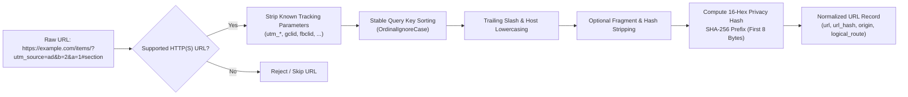
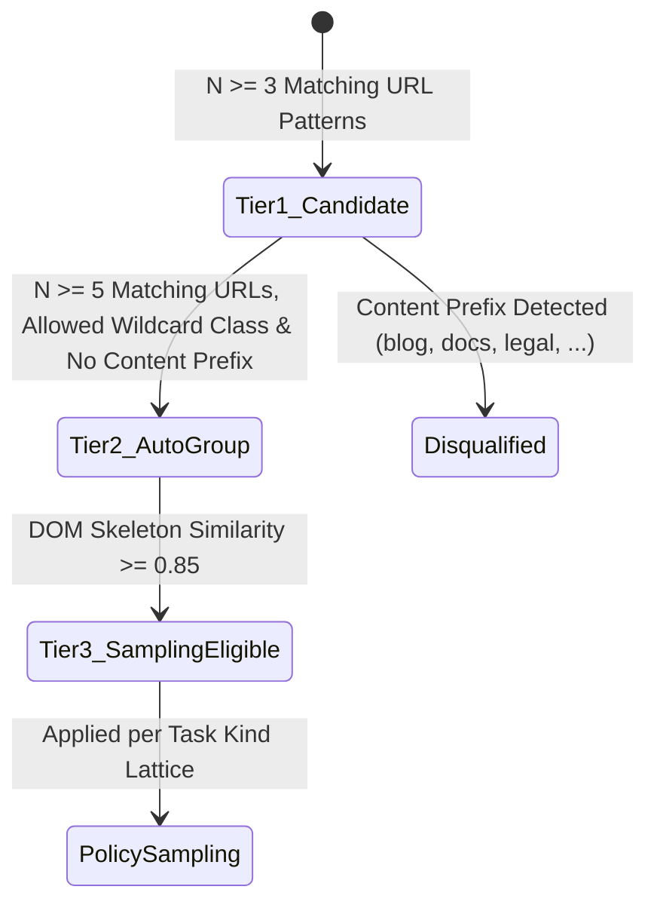
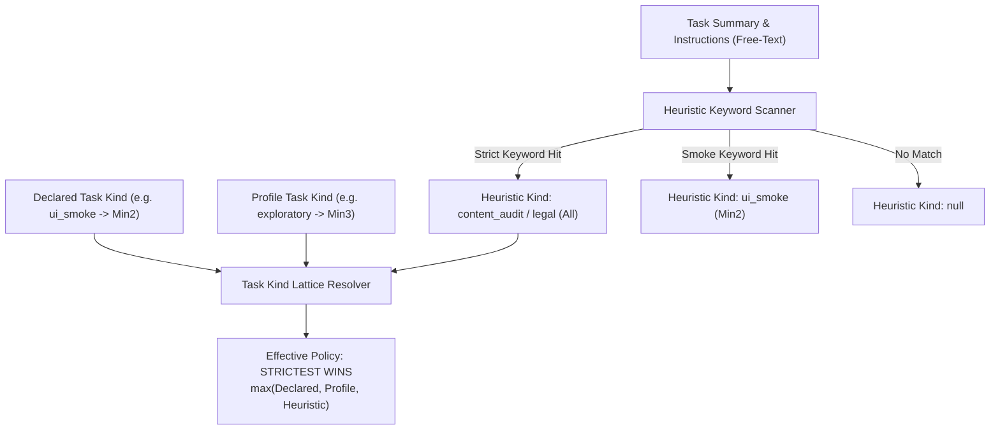

# URL Pattern Grouping & Sampling Policies

> [!NOTE]
> This guide details how Nova normalizes web addresses, calculates privacy-safe URL hashes, groups high-cardinality parameterized routes, classifies wildcards, measures DOM structural similarity using a 4-component composite score, and enforces the "Stricter Wins" task kind resolution lattice.

---

## 1. The High-Cardinality Route Challenge

Modern web applications frequently expose parameterized URL spaces:
* E-commerce catalogs: `/products/1001` through `/products/99999`
* User profiles: `/users/9f4a1230-8a19-4b6c-824a-0a7e0258d4a9`
* Content articles: `/news/2026/04/spring-release-notes`

If an agent is instructed to audit a web application with 50,000 product items, testing every single URL unit exhaustively is computationally inefficient when the underlying UI template is identical. Conversely, collapsing distinct editorial routes (such as privacy policies, legal notices, or landing pages) into a single generic wildcard causes critical pages to be skipped entirely.

Nova resolves this tension through a **multi-tiered classification and sampling framework**:
1. URLs are defensively canonicalized, stripped of tracking tags, and hashed for query-privacy.
2. Route wildcards are classified by entropy, length, and format.
3. Parameterized groups are validated through DOM skeleton fingerprinting.
4. Sampling eligibility is determined strictly by task type and keyword intent under a "Stricter Wins" lattice.

---

## 2. Defensive URL Normalization & Privacy Hashing

Before any URL is grouped, tracked, or stored, it is processed by the URL Normalizer (Version 1). This ensures that minor query variations, trailing slashes, or tracking tokens do not create duplicate units or leak sensitive credentials.

### Normalization Pipeline



### Normalization Rules

1. **Known Tracking Parameter Stripping:** Automatically removes marketing telemetry parameters:
   ```
   utm_source, utm_medium, utm_campaign, utm_term, utm_content,
   gclid, fbclid, msclkid, mc_eid, ref, source
   ```
2. **Stable Query Key Sorting:** Query parameters are sorted alphabetically by key using ordinal case-insensitivity (`OrdinalIgnoreCase`). Duplicate keys preserve their relative order to maintain server query semantics.
3. **Safe Percent-Encoding Decoding:** Unescapes standard alphanumeric characters that were needlessly percent-encoded, while preserving reserved delimiter sequences.
4. **Trailing Slash Canonicalization:** Normalizes directory routes (`/catalog/` $\rightarrow$ `/catalog`) to prevent path splitting duplicates.
5. **The 16-Hex Short Hash Privacy Defense:**
   Full URLs frequently carry session tokens, reset keys, or private IDs in query parameters. Storing raw URLs in plaintext unique constraints creates data exposure risks. Nova computes a **16-hex short hash** representing the first 8 bytes of the SHA-256 digest:

   $$\text{UrlHash} = \text{hex}\left(\text{SHA-256}(\text{NormalizedURL})[0 \dots 7]\right)$$

   This hash is used for SQLite `UNIQUE` constraints and fast indexed lookups (`url:{url_hash}`) without leaking parameter strings.

---

## 3. Wildcard Path Segment Classification

When URLs are indexed or discovered, path segments and query parameters are decomposed into structural tokens. Dynamic segments are evaluated against deterministic heuristics:


### Classification Classes & Rank Lattice

Slot aggregation ranks wildcard ambiguity using the lattice:

$$\text{Rank: } \text{StrongId (4)} > \text{WeakId (3)} > \text{Slug (2)} > \text{Ambiguous (1)} > \text{Other (0)}$$

| Class | Rank | Match Criteria | Example Values | Default Grouping Behavior |
| :--- | :---: | :--- | :--- | :--- |
| **`StrongId`** | 4 | Standard UUID (`8-4-4-4-12` hex), MongoDB ObjectIDs (24 hex characters), or mixed alphanumeric strings with length $> 16$ and high Shannon entropy. | `a0eebc99-9c0b...`, `507f1f77bcf86cd799439011`, `k9Z8xL20mQ4p1V7A` | Auto-grouping enabled. Safe to collapse into parameterized pattern route (e.g., `/items/{id}`). |
| **`WeakId`** | 3 | Purely numeric string with length $\le 3$ or length $\ge 5$. | `4`, `89`, `10482`, `999014` | Eligible for auto-grouping if threshold count met. |
| **`Slug`** | 2 | Alphanumeric tokens delimited by hyphens or underscores. | `spring-sale-2026`, `getting_started`, `terms-and-conditions` | Grouped only when belonging to a verified resource directory. Not auto-group eligible on its own. |
| **`Ambiguous`** | 1 | Purely numeric string of **exactly 4 digits**. | `1998`, `2024`, `2026`, `4001` | **Protected from auto-grouping by default.** (Represents years, archive periods, or release numbers, which often host distinct editorial content). |
| **`StaticLiteral`**| 0 | Known dictionary words, system endpoints, or single words without identifiers. | `dashboard`, `checkout`, `settings`, `about` | Never grouped; treated as distinct individual routes. |

---

## 4. The 3-Tier Grouping Architecture

URL grouping progresses through three distinct stages to prevent premature collapsing of routes:



### Tier 1: Candidate Group ($N \ge 3$)
When 3 or more discovered URLs share identical static prefixes and differ only by dynamic segments classified as wildcards, Nova constructs a **Candidate Pattern Group**:
* **Status:** Informational only.
* **Behavior:** Recorded in reporting queries (`CandidateThreshold = 3`). URL units remain individually tracked; no automatic completion deduction is applied.

### Tier 2: Auto-Group ($N \ge 5$)
When 5 or more matching URLs are confirmed, the candidate pattern is evaluated for **Auto-Group** promotion.

#### The Content Prefix Guard
If any path segment in the pattern matches one of the **11 protected content prefixes**, auto-grouping is **strictly prohibited**:

```
blog, docs, help, legal, changelog, article, articles, posts, news, press, kb
```

Even if slugs match a parameterized pattern (e.g., `/legal/{slug}`), editorial, informational, and regulatory content pages require individual tracking.

#### Auto-Group Qualification Formula
A group qualifies for Auto-Group (`autoGroupEligible = true`) if and only if:

$$\text{MemberCount} \ge 5 \;\land\; \text{Class} \in \{\text{StrongId}, \text{WeakId}\} \;\land\; \text{Confidence} \ge 0.70 \;\land\; \neg\text{HasContentPrefix}$$

* **Worst Slot Wins:** If a route contains multiple dynamic segments (e.g., `/items/{year}/{id}`), the most ambiguous slot dictates the overall pattern group class. A single `Ambiguous` or `Slug` slot prevents auto-group promotion.

### Tier 3: Sampling Eligible
A pattern group is not automatically allowed to substitute sampling for exhaustive testing until it passes structural template verification. To reach Tier 3, representative members must demonstrate that they render the same underlying layout template using **DOM Skeleton Fingerprinting**.

---

## 5. DOM Skeleton Fingerprinting & Structural Similarity

To prove that two URLs are instances of the same parameterized template (e.g., product item views) rather than completely different pages sharing a common URL pattern, Nova evaluates their structural layout tree.

### The 4-Component Mathematical Formula

Nova computes a composite structural similarity score $S_{\text{composite}} \in [0, 1]$ between two DOM skeletons using four weighted metrics:

$$S_{\text{composite}} = 0.40 \times J_{\text{tagBigrams}} + 0.20 \times J_{\text{landmarks}} + 0.15 \times J_{\text{roles}} + 0.25 \times \cos(\mathbf{v}_a, \mathbf{v}_b)$$

Where:

#### 1. Bigram Tag-Sequence Jaccard ($0.40 \times J_{\text{tagBigrams}}$)
The sequential order of structural elements (`header`, `nav`, `main`, `aside`, `section`, `article`, `footer`) is converted into bigram transition pairs ($e_i \rightarrow e_{i+1}$):

$$J_{\text{tagBigrams}} = \frac{|\text{Bigrams}_A \cap \text{Bigrams}_B|}{|\text{Bigrams}_A \cup \text{Bigrams}_B|}$$

Order is strictly preserved, while small local variations or minor omissions are tolerated.

#### 2. Landmark Set Jaccard ($0.20 \times J_{\text{landmarks}}$)
The unique set of structural landmark tags present on the page:

$$J_{\text{landmarks}} = \frac{|\text{Landmarks}_A \cap \text{Landmarks}_B|}{|\text{Landmarks}_A \cup \text{Landmarks}_B|}$$

#### 3. ARIA Role Set Jaccard ($0.15 \times J_{\text{roles}}$)
The unique set of semantic ARIA roles (`[role]`) declared on elements:

$$J_{\text{roles}} = \frac{|\text{Roles}_A \cap \text{Roles}_B|}{|\text{Roles}_A \cup \text{Roles}_B|}$$

#### 4. Control Counter Cosine Vector ($0.25 \times \cos(\mathbf{v}_a, \mathbf{v}_b)$)
A 6-dimensional quantitative vector representing interactive control distribution:

$$\mathbf{v} = \begin{bmatrix} \text{ButtonCount} \\ \text{InputCount} \\ \text{LinkCount} \\ \text{FormCount} \\ \text{HeadingCount} \\ \text{ModalLikeCount} \end{bmatrix}$$

$$\cos(\mathbf{v}_a, \mathbf{v}_b) = \frac{\mathbf{v}_a \cdot \mathbf{v}_b}{\|\mathbf{v}_a\| \|\mathbf{v}_b\|}$$

### Sampling Qualification Gate

$$\text{Template Similarity Gate: } S_{\text{composite}} \ge 0.85$$

* At least two distinct URLs from the pattern group must be scanned with `nova_structured_dom_v1` or `nova_full_page_text_v1`.
* If $S_{\text{composite}} \ge 0.85$, the pattern group is marked `samplingEligible = true`.
* If $S_{\text{composite}} < 0.85$, the template varies significantly (e.g., custom landing pages under a generic route), and sampling is denied; all URL units must be checked individually.

---

## 6. Task Kind Resolution: The "Stricter Wins" Lattice

Even when a pattern group qualifies for sampling, whether sampling is permitted—and how many items must be checked—depends on the **Task Kind**.

Nova models sampling requirements as a formal lattice ordered by strictness:

$$\text{Strictness Hierarchy: } \text{All} > \text{Min5} > \text{Min3} > \text{Min2}$$

```
                All (100% Exhaustive - Zero Sampling)
                                  ▲
                                  │
                                Min5
                                  ▲
                                  │
                                Min3
                                  ▲
                                  │
                             Min2 (Smoke)
```

### Task Kind Matrix

| Task Kind | Sampling Policy | Description |
| :--- | :---: | :--- |
| `content_audit` | **`All`** | Every single URL must be scanned. Text and copy vary on every page; sampling is forbidden. |
| `compliance` | **`All`** | Regulatory, GDPR, and legal audits require complete verification. |
| `legal` | **`All`** | Terms of service, privacy, and statutory notices require 100% route coverage. |
| `security_review` | **`All`** | Attack surface and input testing must inspect every route. |
| `accessibility` | **`All`** | Full accessibility compliance requires exhaustive route verification. |
| `route_inventory` | **`Min3`** | Structural inventory checks a representative sample of 3 routes per group. |
| `exploratory` | **`Min3`** | Exploratory sweeps verify at least 3 URLs per group. |
| `ui_smoke` | **`Min2`** | Rapid layout smoke testing requires at least 2 distinct URLs per group. |
| *Unrecognized / Default* | **`All`** | Any unknown or empty task kind defaults to exhaustive coverage for safety. |

### The "Stricter Wins" Resolution Engine

When an instance is created, its effective sampling policy is derived from three competing sources:
1. **Declared Task Kind:** Explicitly provided in `nova.task_instance_create(declaredTaskKind=...)`.
2. **Profile Task Kind:** Defined in the linked task profile (`task_profile`).
3. **Heuristic Keyword Intent:** Analyzed from the task summary and instructions.



### Source Ordering Priority

If multiple sources produce the same strictness level, tie-breaking follows a strict ordering priority:

$$\text{Priority: } \text{heuristic\_match (0)} > \text{agent\_declared (1)} > \text{profile\_inherit (2)} > \text{default\_unknown\_kind (3)}$$

### The Heuristic Keyword Lexicon

Nova inspects free-text task summaries using bilingual keyword matching to automatically detect exhaustive-intent tasks:

#### 1. German Strict-Class Keywords $\rightarrow$ `content_audit` / `legal` / `compliance` (`All`)
* **Spelling & Translation:** `rechtschreib`, `schreibfehler`, `tippfehler`, `übersetzung`, `übersetzen`, `i18n`, `lokalisierung`
* **Legal & Privacy:** `datenschutz`, `dsgvo`, `impressum`, `agb`
* **Compliance:** `recht`, `legal`, `compliance`
* **Accessibility:** `barrierefreiheit`, `wcag`
* **Exhaustive Scope:** `alle seiten`, `jede seite`

#### 2. English Strict-Class Keywords $\rightarrow$ `content_audit` / `legal` / `compliance` (`All`)
* **Spelling & Copy:** `spell`, `spelling`, `typo`, `translation`, `localization`, `content`, `text`, `copy`
* **Legal & Compliance:** `gdpr`, `compliance`
* **Accessibility:** `accessibility`, `wcag`
* **Exhaustive Scope:** `every page`, `all pages`, `exhaustive`

#### 3. UI Smoke Keywords $\rightarrow$ `ui_smoke` (`Min2`)
* `smoke`, `navigation`, `flow`, `click-pfad`, `click-path`, `ui-test`, `ui test`, `regression`

### Conflict Resolution Example

* **Agent Declares:** `taskKind: "ui_smoke"` (Policy: `Min2`).
* **Task Summary:** *"Überprüfe die Website auf Rechtschreibfehler und nicht übersetzte Texte."*
* **Heuristic Engine:** Detects keywords `rechtschreib`, `übersetzt`. Maps to `content_audit` (Policy: `All`).
* **Resolved Outcome:** The resolver elevates the sampling policy to **`All`**. The agent cannot bypass exhaustive scanning of documentation by labeling the task as a smoke test.

---

## Related Documentation

* **[Task URL Coverage (TUC) Overview](README.md)** — Architectural hub, 3-layer coverage model, and tool catalog.
* **[Evidence Classification & Scans](evidence-and-scans.md)** — Server-trusted scans, 8 evidence classes, and extraction thresholds.
* **[Reconciliation & Completion Gates](reconciliation-and-completion-gates.md)** — Passive observation ledger, reconcile engine, and completion enforcement.
* **[Episodic Task Memory (ETM)](../episodic-task-memory-etm/README.md)** — Task profiles, work units, and lifecycle management.
