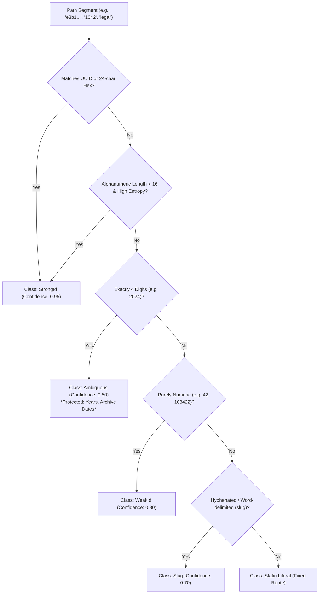
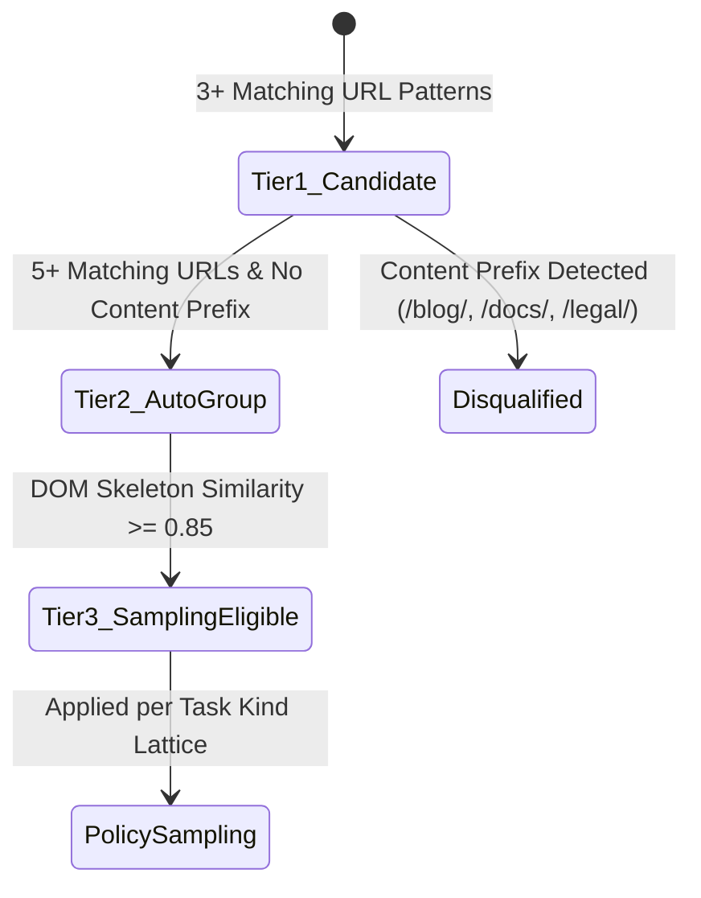
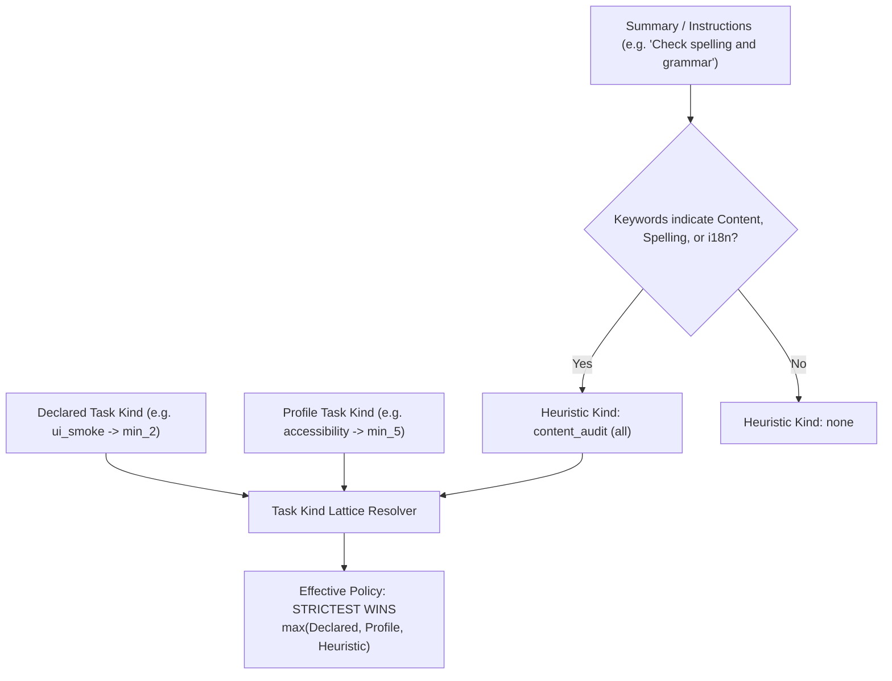

# URL Pattern Grouping & Sampling Policies

> [!NOTE]
> This guide details how Nova groups high-cardinality parameterized routes, classifies wildcards, measures DOM structural similarity, and applies the "Stricter Wins" task kind resolution lattice.

---

## 1. The High-Cardinality Route Challenge

Modern web applications frequently expose parameterized URL spaces:
* E-commerce catalogs: `/products/1001` through `/products/99999`
* User profiles: `/users/9f4a1230-8a19-4b6c-824a-0a7e0258d4a9`
* CMS articles: `/news/2026/04/spring-release-notes`

If an agent is instructed to audit a web application with 50,000 product items, testing every single URL unit exhaustively is often cost-prohibitive and computationally inefficient when the underlying UI template is identical. Conversely, collapsing distinct editorial routes (such as privacy policies, legal notices, or landing pages) into a single generic wildcard causes critical pages to be skipped entirely.

Nova resolves this tension through a **multi-tiered classification and sampling framework**:
1. Route wildcards are classified by entropy, length, and format.
2. Parameterized groups are validated through DOM skeleton fingerprinting.
3. Sampling eligibility is determined strictly by task type and keyword intent under a "Stricter Wins" lattice.

---

## 2. Wildcard Path Segment Classification

When URLs are indexed or discovered, the URL pattern classifier decomposes path segments and query strings into structural tokens. Each dynamic segment is evaluated against deterministic heuristics:



### Classification Classes

| Class | Match Criteria | Example Values | Default Grouping Behavior |
| :--- | :--- | :--- | :--- |
| **`StrongId`** | Standard UUID format (`8-4-4-4-12` hex), MongoDB ObjectIDs (24 hex characters), or mixed alphanumeric strings with length $> 16$ and high Shannon entropy. | `a0eebc99-9c0b...`, `507f1f77bcf86cd799439011`, `k9Z8xL20mQ4p1V7A` | Auto-grouping enabled. Safe to collapse into parameterized pattern route (e.g., `/items/{id}`). |
| **`WeakId`** | Purely numeric string with length $\le 3$ or length $\ge 5$. | `4`, `89`, `10482`, `999014` | Eligible for grouping if threshold count met. |
| **`Ambiguous`** | Purely numeric string of **exactly 4 digits**. | `1998`, `2024`, `2026`, `4001` | **Protected from auto-grouping by default.** (Represents years, archive periods, or release numbers, which often host distinct editorial content). |
| **`Slug`** | Alphanumeric tokens delimited by hyphens or underscores. | `spring-sale-2026`, `getting_started`, `terms-and-conditions` | Grouped only when belonging to a verified resource directory. |
| **`StaticLiteral`** | Known dictionary words, system endpoints, or single words without identifiers. | `dashboard`, `checkout`, `settings`, `about` | Never grouped; treated as distinct individual routes. |

---

## 3. The 3-Tier Grouping Architecture

URL grouping progresses through three distinct stages to prevent premature collapsing of routes:



### Tier 1: Candidate Group ($N \ge 3$)
When 3 or more discovered URLs share identical static prefixes and differ only by dynamic segments classified as `StrongId` or `WeakId`, Nova constructs a **Candidate Pattern Group**:
* **Status:** Informational only.
* **Behavior:** Displayed in coverage reports and inspection tools as a prospective pattern (e.g., `/catalog/{id}`). URL units remain individually tracked; no automatic completion deduction is applied.

### Tier 2: Auto-Group ($N \ge 5$)
When 5 or more matching URLs are confirmed, the candidate pattern is evaluated for **Auto-Group** promotion:
* **The Content Prefix Guard:** If the path begins with editorial content prefixes (including `/blog/`, `/articles/`, `/docs/`, `/news/`, `/legal/`, `/wiki/`), auto-grouping is **prohibited**. Even if slugs match a pattern, editorial and legal content pages require individual tracking.
* **Auto-Group Formation:** For non-protected directories (such as `/products/`, `/users/`, `/orders/`, `/assets/`), the URLs are collapsed into a canonical pattern group entity in the database (`task_url_pattern_group`).

### Tier 3: Sampling Eligible
A pattern group is not automatically allowed to substitute sampling for exhaustive testing until it passes structural template verification. To reach Tier 3, representative members must demonstrate that they render the same underlying layout template using **DOM Skeleton Fingerprinting**.

---

## 4. DOM Skeleton Fingerprinting & Structural Similarity

To prove that two URLs are instances of the same parameterized template (e.g., product item views) rather than completely different pages sharing a common URL pattern, Nova evaluates their structural layout tree.

### Skeleton Extraction Algorithm

1. **Tag Hierarchy Extraction:** The engine walks the DOM, collecting structural layout tags (`html`, `body`, `header`, `nav`, `main`, `section`, `article`, `aside`, `footer`, `form`, `table`, `div`) while discarding:
   * Dynamic text content and inner text strings.
   * Dynamic IDs, random classes, and inline styles.
   * Transient attributes (e.g., timestamps, nonces).
2. **Structural Path N-Grams:** Generates hierarchical element tuples representing the nesting depth and parent-child tree.
3. **Similarity Calculation:** Computes a composite similarity score between two representative pages:

$$S_{\text{composite}} = 0.5 \times J(\text{PathNGrams}_A, \text{PathNGrams}_B) + 0.5 \times \cos(\mathbf{v}_A, \mathbf{v}_B)$$

Where:
* $J(A, B)$ is the Jaccard similarity of structural path n-grams: $\frac{|A \cap B|}{|A \cup B|}$.
* $\cos(\mathbf{v}_A, \mathbf{v}_B)$ is the Cosine similarity of the normalized tag frequency vectors: $\frac{\mathbf{v}_A \cdot \mathbf{v}_B}{\|\mathbf{v}_A\| \|\mathbf{v}_B\|}$.

```
Page A: /products/101                    Page B: /products/102
---------------------                    ---------------------
[header > nav]                           [header > nav]
[main > article > section.gallery]       [main > article > section.gallery]
[main > article > div.details]           [main > article > div.details]
[footer > div.copyright]                 [footer > div.copyright]

Structural Similarity: S = 0.96 (Passes Template Threshold >= 0.85)
```

### Sampling Qualification Gate

$$\text{Eligibility Threshold: } S_{\text{composite}} \ge 0.85$$

* At least two distinct URLs from the pattern group must be scanned with `nova_structured_dom_v1` or `nova_full_page_text_v1`.
* If $S_{\text{composite}} \ge 0.85$, the pattern group is marked `samplingEligible = true`.
* If $S_{\text{composite}} < 0.85$, the template varies significantly (e.g., custom landing pages under a generic route), and sampling is denied; all URL units must be checked individually.

---

## 5. Task Kind Resolution: The "Stricter Wins" Lattice

Even when a pattern group qualifies for sampling, whether sampling is permitted—and how many items must be checked—depends on the **Task Kind**.

Nova models sampling requirements as a formal lattice ordered by strictness:

```
            all (100% Exhaustive - Zero Sampling)
                             ▲
                             │
                           min_5
                             ▲
                             │
                           min_3
                             ▲
                             │
                           min_2 (Smoke Test Baseline)
```

$$\text{Strictness Order: } \text{all} > \text{min\_5} > \text{min\_3} > \text{min\_2}$$

### Task Kind Matrix

| Task Kind | Sampling Policy | Description |
| :--- | :--- | :--- |
| `content_audit` | **`all`** | Every single URL must be scanned. Text and copy vary on every page; sampling is forbidden. |
| `i18n_audit` | **`all`** | Translation and localization checks require 100% route coverage. |
| `spelling_check` | **`all`** | Typo and orthography audits must inspect all individual copy texts. |
| `compliance_audit` | **`all`** | Regulatory, GDPR, and legal audits require complete verification. |
| `accessibility_deep`| **`min_5`** | At least 5 distinct URLs per pattern group must pass accessibility scans. |
| `seo_audit` | **`min_3`** | At least 3 URLs per pattern group must be verified for meta tags and canonical headers. |
| `broken_link_check`| **`min_3`** | Link validation checks a representative sample of 3 routes per group. |
| `ui_smoke` | **`min_2`** | Rapid layout smoke testing requires at least 2 distinct URLs per pattern group. |

### The "Stricter Wins" Resolution Engine

When a task instance is created, its effective sampling policy is derived from three competing sources:

1. **Declared Task Kind:** Explicitly provided in `nova.task_instance_create(taskKind=...)`.
2. **Profile Task Kind:** Defined in the linked task profile (`task_profile`).
3. **Keyword Heuristic Intent:** Analyzed from the task description and instructions.



### Conflict Resolution Example

* **Agent Declares:** `taskKind: "ui_smoke"` (Policy: `min_2`).
* **Task Summary:** *"Audit documentation and products for spelling errors and missing translations."*
* **Heuristic Engine:** Detects keywords `spelling`, `translation`. Infers `content_audit` (Policy: `all`).
* **Resolved Outcome:** The resolver elevates the sampling policy to **`all`**. The agent cannot bypass exhaustive scanning of documentation by labeling the task as a smoke test.

---

## Related Documentation

* **[Task URL Coverage (TUC) Overview](README.md)** — Architectural hub, 3-layer coverage model, and tool catalog.
* **[Evidence Classification & Scans](evidence-and-scans.md)** — Server-trusted scans, 8 evidence classes, and extraction thresholds.
* **[Reconciliation & Completion Gates](reconciliation-and-completion-gates.md)** — Passive observation ledger, reconcile engine, and completion enforcement.
* **[Episodic Task Memory (ETM)](../episodic-task-memory-etm/README.md)** — Task profiles, work units, and lifecycle management.
