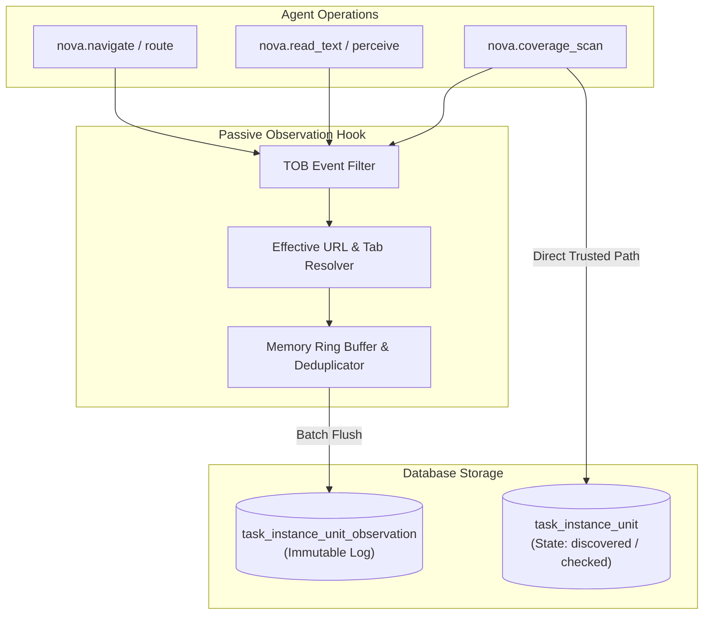
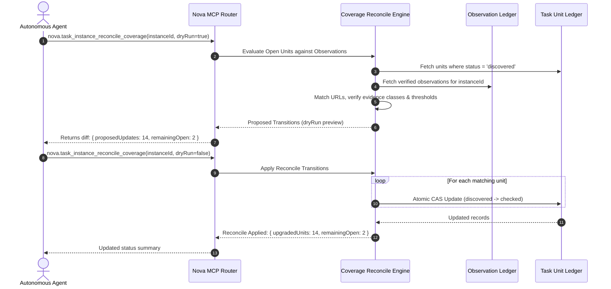
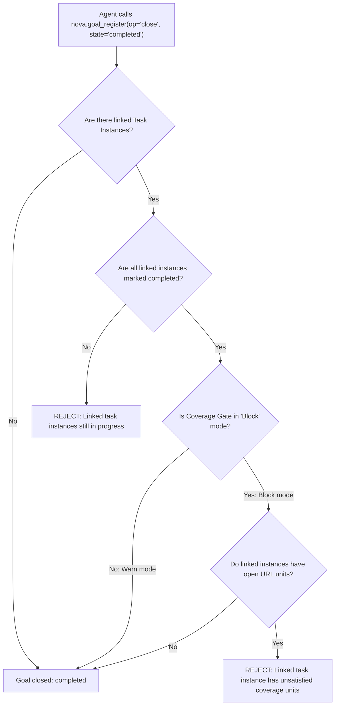

# Reconciliation Engine & Completion Gates

> [!NOTE]
> This guide details how Nova tracks passive observations, executes coverage reconciliation with upgrade-only CAS semantics, enforces the `url_units_remaining` completion gate, and evaluates linked goal closures.

---

## 1. The Passive Observation Subsystem

Throughout an audit session, an agent interacts with pages through various tools: navigating, reading DOM trees, executing registered scans, and perceiving visual layout. Every interaction emits structured telemetry through the [Tool Observation Bus (TOB)](../../tool-observation-bus-tob/README.md).

Rather than forcing the agent to manually link every individual tool invocation to a specific task unit ID, Nova captures these events passively in the observation ledger:



### Observation Record Structure

Each passive observation records:
* `task_instance_id`: Bound task instance.
* `url`: Exact effective URL resolved at execution time.
* `tool_name`: Invoked tool (`nova.coverage_scan`, `nova.read_text`, etc.).
* `evidence_class`: Classified evidence level (0–7).
* `arguments_hash`: SHA-256 of tool parameters.
* `payload_summary`: Metadata regarding character counts, DOM skeleton hash, or scan metrics.
* `timestamp`: Monotonic UTC ISO-8601 recording.

---

## 2. The Reconciliation Engine

Autonomous agents often explore multiple pages in rapid succession, or resume work from a previous session where observations were recorded but units were not explicitly marked as checked.

The **Coverage Reconciliation Engine** bridges the gap between historical observations and current unit states.

### Core Reconciliation Invariants

1. **Reconciliation Never Invents Evidence:** The engine only queries existing, immutable records in `task_instance_unit_observation`. It never triggers synthetic scans or assumes unobserved behavior.
2. **Upgrade-Only Semantics (Monotonic Progress):** Units can only transition from `discovered` $\rightarrow$ `checked`. A reconciliation run will **never** downgrade a previously verified unit back to `discovered`.
3. **Compare-And-Swap (CAS) Concurrency:** Unit transitions utilize atomic CAS checks on `updated_at` timestamps to prevent race conditions during parallel agent workflows.



### Tool Parameters: `nova.task_instance_reconcile_coverage`

| Parameter | Type | Required | Default | Description |
| :--- | :--- | :--- | :--- | :--- |
| `instanceId` | `string` | **Yes** | - | Target task instance identifier. |
| `dryRun` | `boolean` | No | `true` | When `true`, returns proposed transitions without mutating unit states. When `false`, commits upgrades. |
| `minConfidence` | `number` | No | `0.80` | Minimum confidence score required to promote an observation to verified status. |
| `scanScriptId` | `string` | No | `null` | Filters reconciliation to observations generated by a specific scan script. |

---

## 3. The Completion Gate (`TaskCompletionEvaluator`)

When an agent signals that its audit or exploration is finished by calling `nova.task_instance_complete`, Nova's completion evaluation engine inspects the state of all associated URL units.

### Gate Modes

The completion gate behavior is controlled by `AppSettings.CoverageCompletionGateMode`:

| Mode | Completion Allowed When Open Units Exist? | Behavior |
| :--- | :--- | :--- |
| **`Warn`** (Default) | **Yes** | Completion succeeds (`completed: true`). The return payload contains a non-blocking `coverage_warning` listing all unchecked URL units and open pattern groups. |
| **`Block`** | **No** | Completion is **strictly rejected** (`isError: true`). Returns error code `url_units_remaining` with a detailed list of unsatisfied routes. |

### The `url_units_remaining` Rejection Payload

In `Block` mode, premature completion requests return a structured rejection payload providing the agent with exact remediation targets:

```json
{
  "isError": true,
  "errorCode": "url_units_remaining",
  "message": "Cannot complete task instance 'inst_88429'. 12 required URL units remain unverified under Block policy.",
  "coverageSummary": {
    "totalUnits": 36,
    "checkedUnits": 24,
    "openUnits": 12,
    "excludedUnits": 0,
    "samplingPolicy": "all"
  },
  "remainingRoutes": [
    {
      "unitId": "unit_0019",
      "url": "https://example.com/legal/privacy-policy",
      "status": "discovered",
      "highestEvidenceClass": "visited"
    },
    {
      "unitId": "unit_0023",
      "url": "https://example.com/checkout/terms",
      "status": "discovered",
      "highestEvidenceClass": "none"
    }
  ],
  "suggestedActions": [
    "Navigate to remaining URLs and execute 'nova.coverage_scan' with scanId='nova_full_page_text_v1'.",
    "If a route is out of scope or permanently broken, explicitly exclude it via 'nova.task_instance_progress' with reason='excluded'."
  ]
}
```

---

## 4. Explicit Exclusion Workflow

In real-world web audits, certain discovered URLs cannot or should not be checked:
* Routes returning HTTP 404/410 permanently.
* Third-party off-site redirects.
* Administrative or destructive logout links (`/auth/logout`).

To complete a task under `Block` mode when such routes exist, the agent must **explicitly exclude** them with a logged justification. Unchecked units cannot simply be ignored.

### Excluding a Unit via `nova.task_instance_progress`

```json
{
  "instanceId": "inst_88429",
  "unitUpdates": [
    {
      "unitId": "unit_0025",
      "status": "excluded",
      "reason": "HTTP 404 permanent: deprecated route confirmed via server response headers",
      "evidenceClass": "external_probe"
    }
  ]
}
```

* **Audit Ledger Recording:** Exclusions are written to the durable audit trail alongside the justification.
* **Gate Recognition:** Excluded units count toward closure criteria and will not trigger `url_units_remaining`.

---

## 5. Linked Goal-Close Enforcement

When tasks are orchestrated under Nova's Goal Architecture via `nova.goal_register`, goals often link directly to underlying task instances.

If an agent attempts to declare a high-level goal complete:

```json
{
  "op": "close",
  "goalId": "goal_77102",
  "state": "completed"
}
```

Nova's Goal Manager cross-references all linked task instances:



* **Fail-Closed Guarantee:** An agent cannot circumvent a blocked task instance by closing its parent goal. The parent goal will refuse closure until all underlying URL units are satisfied or explicitly excluded.

---

## 6. Advanced Coverage Horizons

Task URL Coverage lays the groundwork for multi-dimensional testing criteria beyond basic URL paths:

### 1. State and Modal Coverage
Tracking coverage of interactive UI states within a single URL:
* Opening and verifying accessible modals and dialogs.
* Multi-step wizard validation (Step 1 $\rightarrow$ Step 2 $\rightarrow$ Step 3).
* Form error validation states triggered by invalid inputs.

### 2. Multi-Role and Persona Coverage
Tracking route verification across different authorization contexts:
* **Anonymous Guest:** Verifying public views and paywall gates.
* **Standard User:** Verifying member dashboards and profile management.
* **Administrator:** Verifying tenant settings and management consoles.

---

## Related Documentation

* **[Task URL Coverage (TUC) Overview](README.md)** — Architectural hub, 3-layer model, and tool catalog.
* **[Evidence Classification & Scans](evidence-and-scans.md)** — Server-trusted scans, 8 evidence classes, and extraction thresholds.
* **[Pattern Grouping & Sampling](pattern-grouping-and-sampling.md)** — Wildcard route classification, 3-tier grouping, and DOM skeleton similarity.
* **[Episodic Task Memory (ETM)](../episodic-task-memory-etm/README.md)** — Task profiles, work units, and completion conditions.
