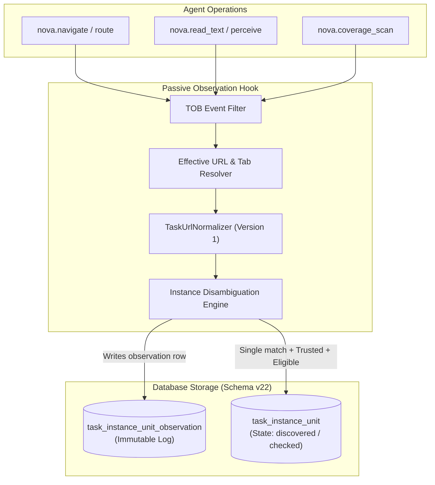
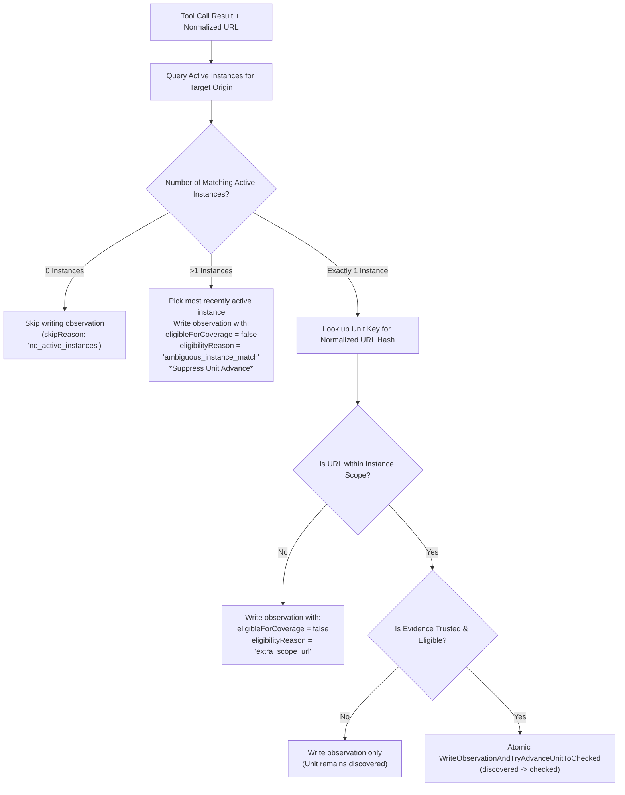
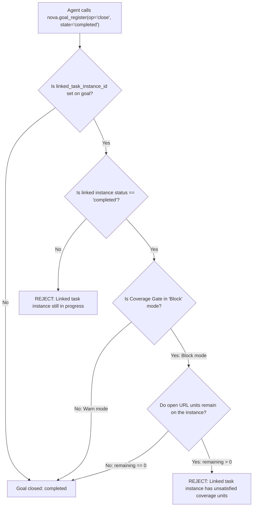

# Reconciliation Engine & Completion Gates

> [!NOTE]
> This guide details how Nova tracks passive observations, handles multi-instance disambiguation, executes coverage reconciliation with rate-limited CAS semantics, supports pre-completion self-diagnosis via `nova.task_instance_verify`, enforces the `etm.task_url_coverage` completion gate, and evaluates linked goal closures.

---

## 1. The Passive Observation Subsystem

Throughout an audit session, an agent interacts with pages through various tools: navigating, reading DOM trees, executing registered scans, and perceiving visual layout. Every interaction emits structured telemetry through the [Tool Observation Bus (TOB)](../../tool-observation-bus-tob/README.md).

Rather than forcing the agent to manually link every individual tool invocation to a specific task unit ID, Nova captures these events passively in the observation ledger:



### Observation Record Schema

Each passive observation row in `task_instance_unit_observation` records:
* `observation_id`: Globally unique identifier (`Guid.NewGuid().ToString("N")`).
* `instance_id`: Bound task instance foreign key.
* `unit_key`: Linked unit key if inside scope (`null` for extra-scope URLs).
* `normalized_url`: Canonicalized route URL.
* `normalized_url_hash`: 16-hex prefix of SHA-256 (privacy-safe index key).
* `top_level_origin`: Extracted scheme + host + port.
* `evidence_kind`: Classified kind (`RegisteredScan`, `TextExtractLight`, etc.).
* `evidence_score`: Numerical score (`0.0` to `7.0`).
* `evidence_trusted`: Boolean integer (`1` or `0`).
* `eligible_for_coverage`: Boolean integer (`1` or `0`).
* `eligibility_reason`: Diagnostic reason (`"ok"`, `"text_coverage_ratio_below_0_85"`, etc.).
* `normalizer_version`: Integer rule version (`1`).

---

## 2. Multi-Instance Disambiguation Rules

When a tool call occurs, Nova must determine which active task instance should receive credit for the observation. The tracker applies strict disambiguation:



1. **Zero Instances:** If no active instance is scoped to the target origin, writing is bypassed entirely (`skipReason: "no_active_instances"`).
2. **Multiple Instances ($> 1$):** If more than one active instance shares the same origin, Nova attributes the observation row to the most recently active instance, but **strictly suppresses unit advance** (`eligibilityReason: "ambiguous_instance_match"`). Ambiguous attribution cannot satisfy a completion gate.
3. **Extra-Scope URLs:** If a tool accesses an external link or unindexed URL outside the instance's seeded units, the observation is logged for auditability, but flagged as `extra_scope_url` and cannot advance any unit.
4. **Single In-Scope Match:** When exactly one instance matches and the evidence is verified and eligible, Nova invokes `WriteObservationAndTryAdvanceUnitToChecked` to record the observation and advance the unit atomically.

---

## 3. The Coverage Reconciliation Engine

Autonomous agents frequently explore pages in rapid succession, or resume work from a previous session where observations were logged but unit updates were deferred.

The **Coverage Reconciliation Engine** evaluates recorded observations against open units to propose or commit status upgrades.

### Core Reconciliation Invariants

1. **Reconciliation Never Invents Evidence:** Evaluates existing records in `task_instance_unit_observation`. It never initiates synthetic scans.
2. **Upgrade-Only Semantics (Monotonic Progress):** Units can only transition forward: $\text{discovered} \rightarrow \text{checked}$. Reconcile will **never** downgrade a checked unit.
3. **Idempotency Cursor:** Compares the instance's `LastReconciledObservationId` with the newest observation ID. If identical, execution short-circuits with `result = "no_new_evidence"`.

### Rate Limiting & Developer Gating

To prevent infinite polling loops and accidental bulk mutations:

| Mode | Rate Limit | Developer Gating Requirement | Behavior |
| :--- | :---: | :--- | :--- |
| **`dryRun = true`** | **Max 3 runs / hour** | Open to all agents | Computes diff and returns proposed upgrades without altering database unit records. |
| **`dryRun = false`** | **Max 1 run / hour** | **Gated:** Requires `AppSettings.TaskUrlCoverageAllowAgentReconcileApply == true` | Executes atomic CAS updates to promote units from `discovered` $\rightarrow$ `checked`. If disabled, returns JSON-RPC `-32002`. |

---

## 4. `nova.task_instance_reconcile_coverage` Tool Contract

### Parameter Reference

| Parameter | Type | Required | Default | Allowed Values / Constraints |
| :--- | :--- | :--- | :--- | :--- |
| `instanceId` | `string` | **Yes** | - | Target task instance identifier. |
| `dryRun` | `boolean` | No | `true` | When `true`, previews proposed upgrades. When `false`, commits upgrades (developer-gated). |
| `observationCutoff` | `string` | No | `null` | Optional ISO-8601 timestamp cutoff (e.g., `2026-04-29T12:00:00Z`). Only observations prior to this timestamp are considered. |
| `_meta` | `object` | No | - | Standard MCP metadata container. |

*Note: Any arguments outside `AllowedArgs` (`instanceId`, `dryRun`, `observationCutoff`, `_meta`) cause an immediate JSON-RPC `-32602` validation rejection.*

### Reconciliation Audit Tables

Every reconciliation execution is durably audited in two dedicated SQLite tables:

#### 1. `coverage_reconcile_run`
Records the overarching run metadata:
* `run_id`: Format `reconcile:{instanceId}:{Guid:N}`.
* `dry_run`: `1` for dryRun preview, `0` for applied.
* `rule_version` / `normalizer_version`: Schema versions used.
* `observations_considered`: Total count of scanned observation rows.
* `units_upgraded`: Actual count of units transitioned.
* `history_completeness`: `"complete"` or `"partial"` (if missing references detected).
* `last_reconciled_observation_id`: Observation cursor.

#### 2. `coverage_reconcile_delta`
Records per-unit state transition proposals and results:
* `unit_key`: Target unit identifier.
* `old_status`: Prior status (e.g., `discovered`).
* `new_status`: Resulting status (`checked_proposed` in dryRun, `checked` in apply, or prior status on `cas_no_op`).
* `observation_id`: Observation providing the satisfying evidence.
* `evidence_kind`: Evidence class utilized.
* `reason`: `"dry_run"`, `"applied"`, or `"cas_no_op"`.

---

## 5. Pre-Completion Self-Diagnosis (`nova.task_instance_verify`)

Rather than attempting completion blindly and risking a rejection error under `Block` mode, agents can inspect completion readiness at any time using `nova.task_instance_verify`:

```json
{
  "instanceId": "inst_88429"
}
```

### Return Payload Structure

```json
{
  "completionVerification": {
    "status": "in_progress",
    "completionAllowed": false,
    "reasonCode": "units_remaining",
    "currentState": {
      "totalUnits": 24,
      "checkedUnits": 18,
      "remainingUnits": 6,
      "pendingMandatoryChecks": null
    }
  },
  "taskAwareness": {
    "completionAllowed": false,
    "progress": {
      "totalUnits": 24,
      "checkedUnits": 18,
      "remainingUnits": 6,
      "percentComplete": 75.0
    }
  }
}
```

* Calling `verify` is completely non-mutating and carries no rate limits.
* Allows agents to self-diagnose remaining coverage gaps and execute `nova.coverage_scan` on remaining routes before calling `nova.task_instance_complete`.

---

## 6. The Completion Gate (`etm.task_url_coverage`)

When an agent invokes `nova.task_instance_complete`, Nova evaluates URL coverage across the instance.

### Gate Modes

Controlled by `AppSettings.TaskUrlCoverageGateMode`:

| Gate Mode | Behavior on Open Units |
| :--- | :--- |
| **`Off`** | No gate evaluation or payload injection. |
| **`Warn`** (Default) | Completion succeeds. Injects `_aagGates.taskUrlCoverage` with `status: "warned"` detailing open units. |
| **`ShadowBlock`** | Completion succeeds for the agent, but logs a shadow-blocking audit record for telemetry evaluation. |
| **`Block`** | Completion is **strictly rejected** with `isError: true` if `CoverageSchemaVersion >= 2` and open units remain. |

### The Injected Gate Payload

When open units exist, the gate response provides full audit metrics:

```json
{
  "gateId": "etm.task_url_coverage",
  "instanceId": "inst_88429",
  "status": "blocked",
  "coverageSchemaVersion": 2,
  "urlUnits": {
    "total": 36,
    "checked": 24,
    "excluded": 0,
    "remaining": 12,
    "percentChecked": 66.7
  },
  "reportingGroupsTotal": 3,
  "evidence": {
    "observationsTotal": 42,
    "trustedObservationsTotal": 24,
    "lastObservationAt": "2026-10-08T16:45:10.124Z",
    "lastReconcileAt": "2026-10-08T16:50:00.000Z"
  },
  "resolution": {
    "options": [
      "inspect_remaining_urls_via_coverage_scan",
      "accept_exclusion_via_progress_unit_update",
      "reconcile_dry_run"
    ],
    "recommendedTool": "nova.coverage_scan"
  }
}
```

---

## 7. Explicit Exclusion Workflow & Audit Redaction

In real-world web audits, certain discovered URLs cannot or should not be checked:
* Routes returning HTTP 404/410 permanently.
* Third-party off-site redirects.
* Administrative or destructive logout links (`/auth/logout`).

To complete a task under `Block` mode when such routes exist, the agent must **explicitly exclude** them with a logged justification via `nova.task_instance_progress`:

```json
{
  "instanceId": "inst_88429",
  "unitUpdates": [
    {
      "unitId": "unit_0025",
      "status": "excluded",
      "reason": "HTTP 404 permanent: deprecated route confirmed via server response headers",
      "evidenceClass": "external_probe"
    }
  ]
}
```

### Audit Redaction Security
* By default, raw URLs containing query strings or hash tokens are redacted in persistent audit events to prevent token leakage.
* Developers can enable `AppSettings.AuditKeepRawUrls == true` in test environments to retain raw unredacted URLs for diagnostic inspection.
* Excluded units satisfy the closure equation:

$$\text{Remaining} = \text{Total} - \text{Checked} - \text{Excluded} = 0$$

---

## 8. Linked Goal-Close Enforcement

When tasks are orchestrated under Nova's Goal Architecture via `nova.goal_register`, goals maintain a direct foreign key linkage to running task instances:

$$\text{goal\_current.linked\_task\_instance\_id} \rightarrow \text{task\_instance.instance\_id}$$

If an agent attempts to close a goal with `state = "completed"`:



* **Fail-Closed Guarantee:** An agent cannot circumvent a blocked task instance by closing its parent goal. The goal manager verifies the underlying instance status and rejects goal completion if coverage requirements are unfulfilled.

---

## Related Documentation

* **[Task URL Coverage (TUC) Overview](README.md)** — Architectural hub, 3-layer model, and tool catalog.
* **[Evidence Classification & Scans](evidence-and-scans.md)** — Server-trusted scans, 8 evidence classes, and extraction thresholds.
* **[Pattern Grouping & Sampling](pattern-grouping-and-sampling.md)** — Wildcard route classification, 3-tier grouping, and DOM skeleton similarity.
* **[Episodic Task Memory (ETM)](../episodic-task-memory-etm/README.md)** — Task profiles, work units, and completion conditions.
