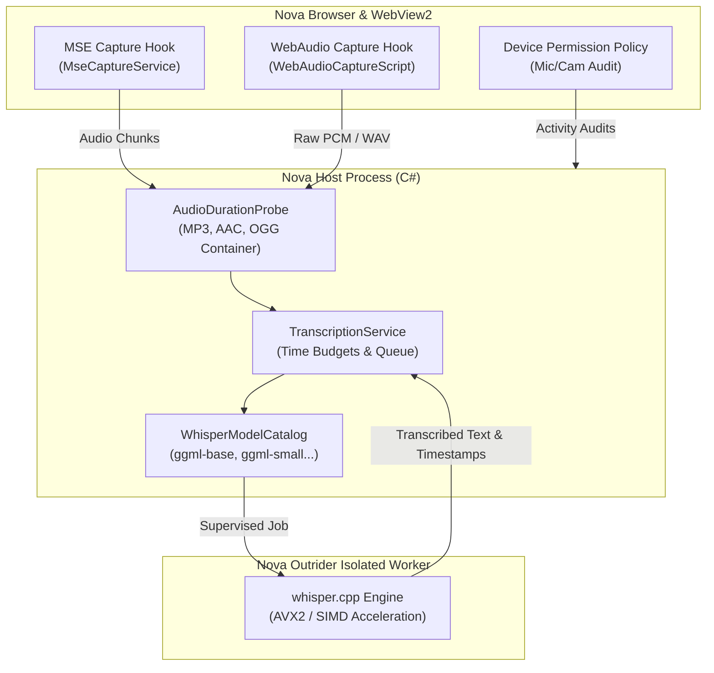

# Media Intelligence & Speech Transcription

> [!NOTE]
> Nova AI Workspace provides an integrated media processing pipeline: from local, privacy-compliant speech transcription via **Whisper.cpp** in the supervised Outrider process to WebAudio/MSE stream capture and rigorously audited hardware permissions (microphone/camera).

---

## 1. Problem Statement & Motivation

AI agents operating in modern web environments increasingly encounter rich audiovisual media:
1. **Cloud Transcription Latency & Costs:** Sending voice memos, Slack audio snippets, or media streams to third-party cloud APIs incurs heavy recurring costs, introduces multi-second network latency, and risks violating enterprise data confidentiality.
2. **Browser Media Streaming Architecture:** Modern web applications stream audio through encrypted Media Source Extensions (MSE) and WebAudio audio nodes. Standard URL downloading fails when encountering DRM, chunked media buffers, or transient memory blobs.
3. **Hardware Surveillance Concerns:** Autonomous agents must never activate microphones or cameras unnoticed, nor record audio in runaway background loops.

**Nova AI Workspace** overcomes these challenges through an in-engine local audio processing pipeline with embedded Whisper models, explicit hardware permission audits, and Outrider process isolation.

---

## 2. Architecture & Processing Pipeline



---

## 3. Local Speech Recognition (Whisper.cpp)

Speech recognition runs **100% offline and locally** using the optimized `whisper.cpp` library:
* **Outrider Process Isolation:** Native C++ neural inference on malformed audio headers or unexpected memory spikes must never compromise browser stability. Whisper runs exclusively inside `NovaBrowser.Outrider.exe` ([Outrider Process Boundary](outrider-boundary.md)).
* **GGML Model Catalog:** Supports industry-standard GGML models (`tiny`, `base`, `small`, `medium`) with automated SHA-256 integrity validation.
* **Dual Time Budget Calculation:**
  ```
  Total Budget = ModelLoadAllowance(ModelSize) + RecognitionAllowance(AudioDuration * Factor)
  ```
  This adaptive timeout prevents premature aborts while ensuring brief voice clips are processed without unbounded latency.

---

## 4. Core Codebase Components

| Component | Source File | Responsibility |
| :--- | :--- | :--- |
| **`TranscriptionService`** | `NovaBrowser/Core/Media/TranscriptionService.cs` | Manages the global transcription queue, monitors inference timeouts, and aggregates text segment outputs. |
| **`WhisperModelCatalog`** | `NovaBrowser/Core/Media/WhisperModelCatalog.cs` | Registry, version control, and disk storage management for GGML model weights. |
| **`AudioDurationProbe`** | `NovaBrowser/Core/Media/AudioDurationProbe.cs` | Fast container header parser for MP3, AAC, FLAC, OGG, and WAV files to calculate duration prior to model execution. |
| **`MseCaptureService`** | `NovaBrowser/Core/Media/MseCaptureService.cs` | Intercepts Media Source Extension buffers directly in the DOM to capture streamed web media. |
| **`MediaDeviceInventoryService`** | `NovaBrowser/Core/Browser/MediaDeviceInventoryService.cs` | Discovers microphones, cameras, and audio output devices with persistent device-ID masking. |

---

## 5. MCP Tool Reference

Agents interact with the media subsystem through dedicated MCP tools:

* **Speech Transcription & Models:**
  * `nova.media_transcribe_start`: Dispatches an asynchronous transcription job for a local file or captured audio buffer.
  * `nova.media_transcribe_status`: Queries job progress, elapsed duration, confidence metrics, and generated segments.
  * `nova.media_transcribe_stop`: Gracefully cancels an ongoing transcription and releases worker resources.
  * `nova.media_transcribe_models`: Lists installed and downloadable GGML Whisper models.
  * `nova.media_transcribe_model_install` / `remove`: Downloads and manages local model weights.
  * `nova.media_file_info`: Inspects audio containers (codecs, bitrates, channels, duration).
* **Media & Stream Capture:**
  * `nova.media_capture_start`: Captures live audio/video from the active tab (MSE or WebAudio hooks).
  * `nova.media_capture_status`: Monitors buffer size, byte count, and capture health.
  * `nova.media_capture_stop`: Finalizes capture streams and flushes the recorded audio to disk.
* **Hardware Permissions & Auditing:**
  * `nova.media_permissions_list`: Lists all granted and remembered microphone/camera authorizations.
  * `nova.media_activity_status`: Identifies in real time which tabs are currently playing audio or requesting capture devices.
  * `nova.media_activity_audit`: Provides an immutable forensic trail of all hardware sensor access.
  * `nova.media_stop_all`: Emergency kill switch that cuts off all active media streams and capture sessions immediately.

---

## 6. Privacy & Safety Guarantees

1. **Zero Cloud Exfiltration:** Voice memos, meeting recordings, and dictation audio never leave the user's local workstation.
2. **Prominent UI Indicators:** When a tab captures audio or video, visual recording badges immediately appear on the tab header and omnibox.
3. **Session-Scoped Grants:** Hardware access grants can be scoped strictly to individual browser sessions (`media_permissions_clear_session_grants`), expiring upon tab closure.
