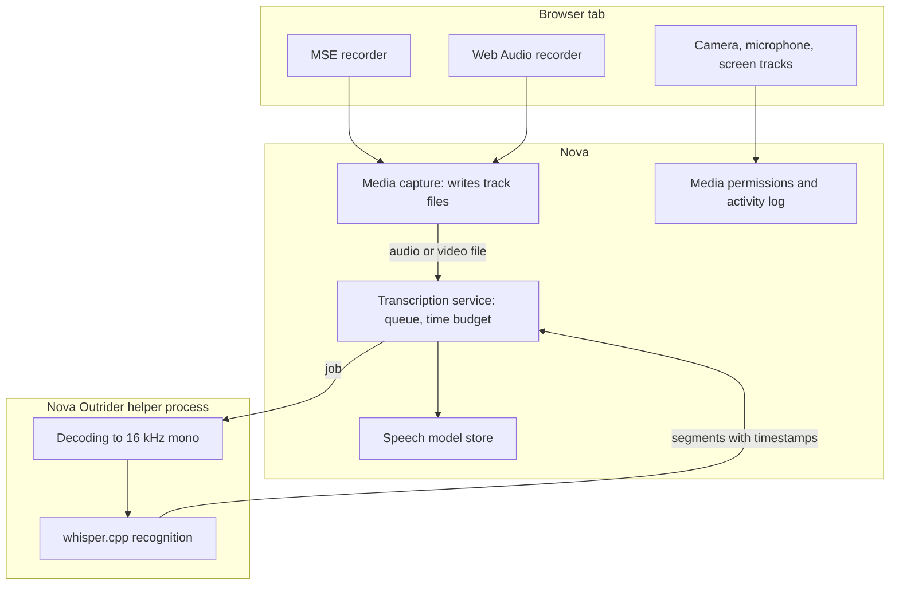

# Media Intelligence & Speech Transcription

> [!NOTE]
> Nova AI Workspace transcribes audio and video files on the local machine with **whisper.cpp**, running in the separate Nova Outrider helper process. It can also capture media that a page plays (Media Source Extensions and Web Audio) to files, and it keeps camera, microphone and screen-sharing access visible and controllable.

---

## 1. Problem Statement & Motivation

AI agents operating in modern web environments increasingly encounter audio and video:
1. **Cloud Transcription Costs & Confidentiality:** Sending voice messages or meeting recordings to a cloud API costs money per minute and hands the audio to a third party.
2. **Streamed Media Has No File:** Players that use Media Source Extensions (HLS/DASH streaming) or Web Audio (`decodeAudioData`, typical for messenger voice messages) never expose a plain URL that could simply be downloaded.
3. **Hardware Access Must Stay Visible:** An agent must not switch on a microphone or camera unnoticed.

Nova transcribes locally, records the page's own playback path, and shows and logs every active capture device.

---

## 2. Architecture & Processing Pipeline

---

## 3. Local Speech Recognition (whisper.cpp)

Speech recognition runs on this computer; the audio is never uploaded. Only downloading a model needs the network.

* **Outrider process isolation:** whisper.cpp is native code, and a crash there must not take the browser down. Decoding and recognition run inside `NovaBrowser.Outrider.exe` ([Outrider Process Boundary](outrider-boundary.md)); Nova kills the helper on cancel, or when it stops reporting progress.
* **Processor requirement:** Recognition needs a CPU with AVX, AVX2 and FMA. Nova checks this before loading the native library; `nova.media_transcribe_models` reports the result. Recognition runs on the processor.
* **Input formats:** WAV, Ogg/Opus and WebM/MKV with Opus audio (what browsers record) are decoded directly. Everything else Windows itself can play — MP3, AAC/M4A, MP4/MOV video, WMA, FLAC and, with the Web Media Extensions installed, other WebM/MKV — is decoded through Windows Media Foundation. No ffmpeg is involved.
* **Completeness:** a transcript counts as complete when the whole file was decoded and the text reaches the last moment where something can be heard — silence at the end or in the middle is not missing text. Stretches with sound but no recognized text are listed in `uncoveredAudible` as a hint (music and noise produce them too).
* **Speech models:** Nova knows three models, each pinned to a size and SHA-256 checksum that is checked after download:

  | Model | File | Size | In the app |
  | :--- | :--- | :--- | :--- |
  | `base` | `ggml-base-q5_1.bin` | about 57 MB | Basic — included with Nova |
  | `small` | `ggml-small-q5_1.bin` | about 181 MB | Recommended |
  | `large-v3-turbo` | `ggml-large-v3-turbo-q5_0.bin` | about 547 MB | Most accurate, slower than real time |

  Models are downloaded from the upstream whisper.cpp repository on Hugging Face. A model file you already have can be added with "Use a file I already have…"; Nova cannot verify such a file. Without a `model` argument, `nova.media_transcribe_start` uses the most accurate installed model.
* **Time budget:** A job's ceiling is a model-load allowance (from the model's file size, 10 seconds to 3 minutes) plus a recognition allowance scaled by the audio length (at least 30 seconds), capped at 12 hours. What actually stops a hung job is the stall window: a job that shows no progress for 5 minutes after the model has loaded is ended. A job that keeps making progress is not killed for being slow.
* **Language:** Pass an ISO code such as `de` or `en`; without it the language is detected, which takes roughly 18% longer and is less reliable on short clips.

### Transcription window

The toolbar button "Transcribe audio or video" opens a window where a file can be dropped in. The result can be saved as plain text (`.txt`) or as subtitles (`.srt`, `.vtt`). The button is shown with "Show transcription button in the toolbar" (Settings → Tools, Transcription card). Models are managed under Settings → AI & agents → "Speech to text".

---

## 4. Media Capture from a Tab

`nova.media_capture_start` installs a recorder in the tab and writes what the page plays to files:

* **Sources:** `mse` (Media Source Extensions — HLS/DASH streaming), `webaudio` (`decodeAudioData`, e.g. messenger voice messages) or `both` (default).
* **Output:** One file per track, with the extension taken from the media type (for example `.mp4`, `.m4a`, `.webm`, `.wav`). Without `saveDir`, files go to a `MediaCaptures` folder inside Nova's Exports folder; a custom `saveDir` requires "Allow local files".
* **Size limit:** 2 GB by default, up to 16 GB with `maxBytes`. Reaching the limit stops the capture from growing; playback continues.
* **Players that already started:** The recorder hooks in at page load. `reload=true` reloads the tab so a running player is captured from the beginning.

---

## 5. MCP Tool Reference

Agents interact with the media subsystem through these tools (most of them are in the `page_read_debug` bundle; the permission tools also in `system_tools`):

* **Speech Transcription & Models:**
  * `nova.media_transcribe_start`: Starts a transcription job for a local audio or video file; `waitMs` (up to 30 seconds) returns the result directly for short recordings.
  * `nova.media_transcribe_status`: Reports progress and the recognized segments of a job.
  * `nova.media_transcribe_stop`: Cancels a job and returns the segments recognized so far.
  * `nova.media_transcribe_models`: Lists the known models, their install state and the CPU check.
  * `nova.media_transcribe_model_install` / `nova.media_transcribe_model_remove`: Downloads or adopts a model file, or removes one.
  * `nova.media_file_info`: Reads container, duration, channels and codecs of a local media file.
* **Media & Stream Capture:**
  * `nova.media_capture_start`, `nova.media_capture_status`, `nova.media_capture_stop`: Capture what a tab plays, report progress, and finish the files.
  * `nova.media_status`: Playback state, position, duration and volume of the page's audio and video elements.
* **Hardware Permissions & Auditing:**
  * `nova.media_permissions_list`, `nova.media_permission_get`, `nova.media_permission_set`: Read and change per-site camera, microphone, speaker and location permissions.
  * `nova.media_activity_status`: Which camera, microphone and screen-sharing streams are active right now.
  * `nova.media_activity_audit`, `nova.media_permission_activity_list`, `nova.media_activity_delta`: Stored permissions joined with recent permission decisions, read from an in-memory log.
  * `nova.media_permissions_clear_session_grants`: Drops all "Allow once" grants and stops the live tracks that depend on them.
  * `nova.media_stop_all`: Stops all active camera, microphone and screen-sharing tracks, browser-wide or for one origin.
  * `nova.hardware_diagnostics_start` / `_state` / `_stop`: In-page test of camera, microphone or speaker output.

---

## 6. Privacy & Safety

1. **Local recognition:** Audio and video files are transcribed on this device and are not uploaded.
2. **Visible capture:** While a page uses the camera, microphone or screen sharing, the tab and the site-info icon in the address bar show it.
3. **Allow once:** An "Allow once" grant is kept in memory only, not saved with the site permissions, and can be dropped at any time with `nova.media_permissions_clear_session_grants`.
